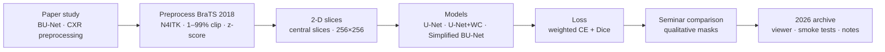

<sub>[🏠 Portfolio](https://github.com/heoneyzi) › [🩺 Medical](../README.md) › **Bu-net**</sub>

<div align="center">

# 🧠 Lightweight BU-Net — brain-tumor segmentation on a student GPU budget

**Can the context-widening blocks of BU-Net be kept while slimming the model enough to train on limited hardware?**


[💻 Team code (fork)](https://github.com/heoneyzi/BU-Net_Pytorch_Implementation) · [🗄️ Research archive + viewer](https://github.com/heoneyzi/reinforcing_material) · [📝 Paper review](notes/01_bu-net_paper_review/README.md) · [📄 3D-track report](docs/project_report.md)

</div>

> [!TIP]
> **TL;DR** — Brain-tumor segmentation means coloring every MRI pixel as healthy tissue or one of three tumor sub-regions. Team 보강재 (deep daiv. 2024 Medical AI) studied **BU-Net** — a U-Net with *wide-context* (WC) and *residual-extended-skip* (RES) blocks — and built PyTorch U-Net, U-Net + WC and a **Simplified BU-Net** on 2-D BraTS 2018 slices, presenting a qualitative comparison at the 8th deep daiv. Open Seminar. A synthetic re-check for this portfolio shows the Simplified BU-Net is the only BU-Net variant in the code that runs end-to-end (97.4 M parameters, vs 31.0 M for the plain U-Net); no Dice score was ever recorded. Jiheon led the team (CV).

| | |
|---|---|
| **Period** | Spring 2024 (paper reviews May 2024; team repository commits 17 May – 5 Jul 2024) · archive restored Sep 2026 |
| **Team** | 3 people, team 보강재 — **Jiheon Kang (Team Lead)**, Boyoung Kwon, Jaeryeong Hwang |
| **My role** | **Team Lead** (CV) — reviewed the BU-Net paper and a CXR-preprocessing paper, wrote a name-attributed full BU-Net draft (`Jiheon_BU_net.ipynb`), and in 2026 restored the research archive with a comparison viewer, tests and reproduction notes |
| **Stack** | PyTorch · SimpleITK (N4ITK) · nibabel · NumPy · Streamlit · matplotlib |
| **Status** | ✅ Completed — presented at the 8th deep daiv. Open Seminar (qualitative results) |

<p align="center"></p>
<p align="center"><sub>Figure: the team's Simplified BU-Net as implemented in <code>code/bu-net_pytorch/model/SimpleBUnet.py</code> — drawn for this portfolio by <code>assets/make_hero.py</code>.</sub></p>

## 🧭 Why it matters

**Gliomas** are the most common primary brain tumors in adults, and radiologists outline them on four MRI *modalities* — T1, contrast-enhanced T1 (T1ce), T2 and FLAIR — that highlight different tissue. The public **BraTS** benchmark labels three nested regions: the *whole tumor* (including edema), the *tumor core*, and the *enhancing tumor*. Automating this outline saves expert time, but tumors are tiny relative to the brain: in the 3-D study archived here the class imbalance reached **160–5,230×**, so a model that predicts "no tumor" everywhere can look accurate.

**U-Net** — an encoder that compresses the image plus a decoder that rebuilds a pixel-wise mask, joined by skip connections — is the standard answer. **BU-Net** (Rehman, Cho, Kim & Chong) adds two blocks: **WC** (wide context), parallel large factorized convolutions (N×1 then 1×N; 15-wide in the team code) at the bottleneck that see far across the image cheaply, and **RES** (residual extended skip), four multi-scale factorized paths plus an identity path on every skip connection. The team asked whether those ideas survive when the model is simplified for student hardware.

## 🛠️ Approach



- **Pre-processing** ([`preprocess.py`](code/bu-net_pytorch/preprocess/preprocess.py)): N4ITK bias-field correction, clipping to the 1st–99th intensity percentiles, zero-mean/unit-variance normalization — the recipe from the BU-Net paper.
- **Data** ([`data_loader.py`](code/bu-net_pytorch/data_loader/data_loader.py)): one modality per 2-D slice taken around the volume midpoint, resized to 256×256; BraTS label 4 is remapped to 3 so classes are contiguous.
- **Models** ([`model/`](code/bu-net_pytorch/model/)): a U-Net baseline, U-Net + WC, the **Simplified BU-Net** (WC bottleneck + one 2-branch RES block on the 64×64 skip) and full BU-Net drafts with RES on every skip.
- **Loss** ([`loss.py`](code/bu-net_pytorch/model/loss.py)): weighted cross-entropy + Dice, with per-pixel weights inversely proportional to class frequency — the paper's answer to class imbalance.

## 🔬 Experiments & results

| # | Question | Setup | Key result | Folder |
|---|---|---|---|---|
| E1 | Do WC / simplified RES blocks help a 2-D U-Net under a small compute budget? | BraTS 2018, 2-D slices, U-Net vs U-Net + WC vs Simplified BU-Net, WCE + Dice | Qualitative only: the seminar showed finer boundary detail in some Simplified BU-Net examples, and noted that limited training and architectural differences prevented reproducing the paper's results; **no Dice score was recorded** | [E1](experiments/01_2d_bunet_brats2018/README.md) |
| E2 | Can a cascade of three 3-D U-Nets (whole tumor → core → enhancing) be trained on one 8 GB GPU? | BraTS 2019 (335 patients), flip/rotation/elastic/resize/crop augmentation, BCE vs Dice, SGD vs Adam, no/Lambda/Step LR | BCE collapsed to all-background (loss ≈ 0.14); best = Dice + Adam + StepLR, still **≈ 12 % accuracy** with many false positives/negatives; 60 epochs ≈ 24 h at batch 2 | [E2](experiments/02_3d_cascade_brats2019/README.md) |
| E3 | Which of the archived models actually run, and how big are they? *(added 2026)* | Every U-Net/BU-Net class in the code, meta-device shape check + CPU forward on a 256×256 dummy slice | Runs: U-Net **31.0 M** params, Simplified BU-Net **97.4 M**; U-Net + WC (92.4 M) and all full BU-Net drafts (103.8 M – 176.6 M; one at 1.95 B) fail on shape/channel mismatches as written | [E3](experiments/03_model_check/README.md) |

Sources: E1 — [`code/reinforcing_material/ORIGINAL_README.md`](code/reinforcing_material/ORIGINAL_README.md) and [`code/reinforcing_material/docs/reproduction-notes.md`](code/reinforcing_material/docs/reproduction-notes.md) (summarizing the seminar deck and posters, which are not redistributed); E2 — [`docs/project_report.md`](docs/project_report.md) §3–4; E3 — [`experiments/03_model_check/results/model_check.json`](experiments/03_model_check/results/model_check.json).

<table><tr>
<td align="center" width="50%"><br><sub>E2 augmentation: flip + rotation and elastic deformation each double the data (report §3.1).</sub></td>
<td align="center" width="50%"><br><sub>E2 best model: false positives outside the true tumor (report §4.1.2).</sub></td>
</tr></table>

## 🙋 My contribution

- **Team Lead** of team 보강재 (CV). The seminar materials credit the three members collectively and do not break down individual shares.
- **Paper study** — reviewed the BU-Net paper ([notes/01](notes/01_bu-net_paper_review/README.md)) and a chest-X-ray paper on preprocessing for CNNs ([notes/02](notes/02_covid19_cxr_cnn_review/README.md)), May 2024.
- **Full BU-Net draft** — [`Jiheon_BU_net.ipynb`](code/reinforcing_material/notebooks/BU_net/Jiheon_BU_net.ipynb): RES blocks on all four skip paths plus a WC bottleneck, following the paper's layout (unfinished; see E3).
- **2026 archive restoration** — seven commits on [heoneyzi/reinforcing_material](https://github.com/heoneyzi/reinforcing_material): recovered the 13 original notebooks (paths sanitized, outputs cleared), extracted `models.py`, built a Streamlit viewer for ground truth vs three models with regression tests, added a synthetic smoke check and wrote the reproduction notes; plus a documentation commit on the team fork.
- **Team credit** — the packaged PyTorch code (`model/`, `data_loader/`, `preprocess/`, `train.py`, `SimpleBUnet.py`) was committed by **Boyoung Kwon**; the first BU-Net model, the RES/WC block refactor and the loss draft by **Jaeryeong Hwang**.

## 🗂️ Repository map

```text
Bu-net/
├── README.md                     ← you are here
├── assets/                       ← hero schematic + its drawing script
├── experiments/                  ← E1 2-D BU-Net · E2 3-D cascade · E3 model check (script + JSON)
├── code/
│   ├── bu-net_pytorch/           ← team PyTorch package (fork of the team repository)
│   └── reinforcing_material/     ← restored notebooks, models.py, Streamlit viewer, tests, docs
├── docs/                         ← 3-D-track Notion report (Korean, 33 figures) + English summary
└── notes/                        ← Jiheon's paper reviews (Korean)
```

## ♻️ Reproduce

```bash
# synthetic checks (no MRI data needed)
pip install torch pillow streamlit
python experiments/03_model_check/model_check.py          # shapes + parameter counts → results/model_check.json
cd code/reinforcing_material && python scripts/smoke_check.py && python -m unittest discover -s tests -v
streamlit run app.py                                     # compare your own exported masks
# real data: BraTS 2018 (see code/bu-net_pytorch/README.md for preprocessing and the known training-script issues)
```

BraTS images, labels, checkpoints and prediction images are **not included** — obtain BraTS through its organizers under their data-use terms.

> [!IMPORTANT]
> **Scope notes**
> - **No quantitative 2-D result exists.** The seminar comparison was qualitative, `test.py` is empty and `train.py` does not run as written (import and argument mismatches documented in [code/bu-net_pytorch](code/bu-net_pytorch/README.md)). Nothing here is a validated segmentation model, let alone a clinical one.
> - "Lightweight" means *simplified relative to the full BU-Net* (one 2-branch RES block instead of 4-branch blocks on every skip); at 97.4 M parameters the Simplified BU-Net is still ~3× larger than the plain U-Net (31.0 M) because the WC bottleneck is wide.
> - **Two datasets, two tracks:** the code uses **BraTS 2018**; the Notion report (E2) uses **BraTS 2019** and a 3-D cascade built on a separate public code base, and its page does not name its authors — treat E2 as Medical AI group context, not as Jiheon's individual work.
> - The E2 "≈ 12 % accuracy" is quoted verbatim from the report; its exact metric is not specified there.

## 🔗 Links

- Team code: [heoneyzi/BU-Net_Pytorch_Implementation](https://github.com/heoneyzi/BU-Net_Pytorch_Implementation) (fork of [iamnotwhale/BU-Net_Pytorch_Implementation](https://github.com/iamnotwhale/BU-Net_Pytorch_Implementation)) · archive: [heoneyzi/reinforcing_material](https://github.com/heoneyzi/reinforcing_material)
- E2 code base cited in the report: [Yuyeon-Kim/brain-tumor-segmentation](https://github.com/Yuyeon-Kim/brain-tumor-segmentation) · data: [BraTS 2018](https://www.med.upenn.edu/sbia/brats2018/registration.html)
- Related in this portfolio: [DeepDaiv.](https://github.com/heoneyzi/Deep_Daiv/blob/main/README.md) (the club's other projects and contents) · [Medical](../README.md)

---
<sub>[← Prev: VCC 2026](../VCC_2026/README.md) · [🏠 Portfolio](https://github.com/heoneyzi) · [Next: Hallucination →](https://github.com/heoneyzi/Study/blob/main/Hallucination/README.md)</sub>
