# BU-Net 프로젝트 보고서 — 3D U-Net 기반 뇌종양 분할 (Notion)

<sub>[🏠 Portfolio](https://github.com/heoneyzi) › [🩺 Medical](../../README.md) › [Bu-net](../README.md) › [Docs](README.md) › <b>Project report</b></sub>

> [!NOTE]
> Team report converted from Notion, kept in the original Korean. It documents the <b>3D track</b> of the project: a 3-cascaded 3D U-Net ("Triple U-Net") on <b>BraTS 2019</b>, with preprocessing / loss / optimizer / scheduler studies and an honest analysis of the low final score.
> The 2D BU-Net code in [`code/`](../code/README.md) uses <b>BraTS 2018</b> — the two tracks are different experiments. English summary: [docs/README.md](README.md). Bookmarked links in the original page could not be exported.

---

## 1. Introduction

### 1.1 Objective

저희 팀은 <b>MRI Image의 정상 뇌조직에서 뇌종양의 위치와 범위를 분리해내는 Brain Tumor Segmentation</b> 프로젝트를 진행하였습니다.

이를 위해서는 <b>1.2 Brain Tumor</b>와 <b>1.3 MRI (Magnetic Resonance Imaging)</b>에 대한 배경지식이 필요합니다.

### 1.2 Brain Tumor란?

Brain tumor, 뇌종양은 말그대로 <b>두개강 내에서 발생하는 모든 종양</b>을 말합니다. 다른 장기에 생기는 종양과는 다르게, 양성이어도 심각한 신경학적 장애를 유발하며 생명에도 영향을 줄 수 있기 때문에, <b>대부분 적극적인 치료가 필요</b>합니다.

Brain tumor 중에서도 성인에게 가장 흔하게 발생하는 <b>gliomas (신경 아교증)</b>이 있습니다.이는 척수 내부에 있는 glial cell에 발생하는 종양이며, 크게 두 단계로 나눌 수 있습니다.

1. <b>HGG</b><b> </b>(High-Grade Gliomas) : HGG는 빠르게 성장하며, 보다 악성에 속하며, 치명적인 경향이 있습니다.
2. <b>LGG</b> (Low-Grade Gliomas) : LGG는 비교적 느리게 자라는 경향이 있어서, 진단과 치료에 더 유리합니다.

또한, Brain Tumor는 <b>Whole Tumor, Tumor core, Enhancing Tumor Core</b>로 나눌 수 있습니다. 이는 <b>종양의 생물학적 특성을 잘 이해하고 진단 및 치료를 개선하는 데 도움</b>이 될 수 있습니다.

<p align="center">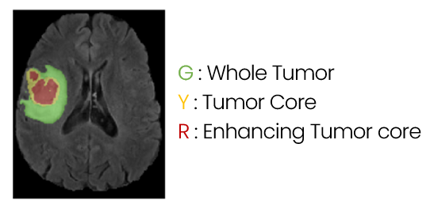</p>

1. <b>Whole Tumor</b> : 종양의 전체 영역을 나타내며, 종양의 전반적인 특성을 이해하고 치료 전략을 계획하는 데 중요한 역할을 합니다.
2. <b>Tumor Core</b><b> </b>: 종양 내에서 가장 활동적이고 치료에 저항성이 강한 영역으로, 종양 성장 및 전이 과정에서 핵심적인 역할을 합니다.
3.  <b>Enhancing Tumor Core</b><b>  </b>: Tumor core 중 혈류가 더 많은 영역으로, 이 영역을 분할함으로 종양의 침윤 및 전이 가능성을 더 정확하게 평가 할 수 있습니다.

> 🏁 이러한 <b>Brain Tumor의 세가지 영역을 구분해내는 것이 목표</b>입니다.

### 1.3 MRI(Magnetic Resonance Imaging)란?

뇌 종양 진단 및 치료에는 비침습적인 방법으로 구조를 볼 수 있는 MRI 영상을 많이 사용합니다.<br><b>MRI(자기공명영상)</b>에서는 강한 자기장을 가해 인체 내부의 수소 원자들이 일정한 방향을 가리키도록 유도되고, 이후 또다른 자기장을 통해 이들을 반응시켜 방출되는 신호를 측정하여 조직과 구조를 상세하게 시각화합니다.

MRI에는 여러 모달리티가 있습니다.  <b>모달리티에 따라 종양과 뇌척수액(CSF)사이의 contrast가 다르게 나타나, 밝기가 다르게 강조</b>됩니다.

- <b>T1-weighted</b>
- <b>T1ce </b>(Contrast enhanced T1-weighted)
- <b>T2-weighted</b>
- <b>FLAIR </b>(Fluid Attenuation Inversion Recovery)
    <p align="center">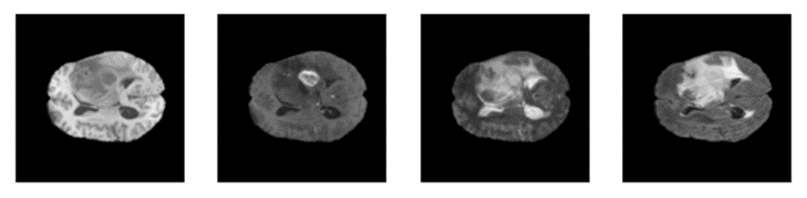</p>

예를 들어, 세번째와 네번째 이미지의 T2-weighted와 FLAIR 이미지는 전체 종양 영역을 더 잘 나타내고, 첫번째와 두번째 이미지의 T1-weighted과 T1ce는 tumor core 부분의 contrast를 더 잘 나타냅니다

저희는 이 네가지의 모달리티를 이용해서 뇌종양을 분석합니다.

---

## 2. Methodology

### 2.1 Dataset

저희 프로젝트는 kaggle의 2019 Brats 데이터셋을 이용했습니다.  (<b>MICCAI's Dataset on Brain Tumor Segmentation(Year 2019)</b>)

<br>데이터셋은 HGG(259명), LGG(76명)를 합친 총 335명의 3D MRI 영상으로 구성됩니다. 환자 한 명 당 T1/T1ce/T2/FLAIR 이미지, 그리고 Label로 총 5개의 3D MRI 영상으로 구성되어 있습니다.

<p align="center">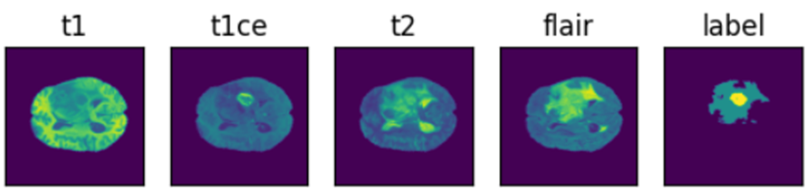</p>

위 이미지는 환자 한 명의 데이터인데, 3D 이미지 중 일부 슬라이스만 가져온 2D 이미지입니다. 가장 오른쪽의 label 이미지를 보면, 종양의 영역이 나눠져 있는 것을 확인할 수 있습니다. 즉, 데이터의 label은 whole tumor, tumor core, enhancing tumor core label에 대한 annotation이 되어있습니다.

저희는, <b>T1/T1ce/T2/FLAIR에 해당하는 3d 이미지와 하나의 라벨을 각각 대응시켜 학습</b>했습니다. 따라서 환자 한 명 당 총 4개의 데이터셋(MRI 영상과 label의 대응)을 사용했습니다.<br>

데이터셋과 관련하여 고려해야 하는 사항들이 있습니다.

먼저, <b>라벨링된 데이터셋이 부족</b>합니다. <b>뇌 종양은 다양한 형태, 크기, 위치를 가질 수 있으므로 다양한 종양의 특성을 고려하기에는 라벨링된 데이터 수가 적다고 판단</b>하였습니다. 또한 <b>전체 뇌의 부피 중 종양은 매우 작기 때문에,  class 값들 사이의 불균형이 존재</b>합니다.

### 2.2 Transform

먼저, 저희가 사용할 구조인 3 Cascaded Architecture에 따르면 영역이 가장 큰 <b>Whole Tumor부터 영역의 크기가 작아지면서 Tumor Core, Enhancing Tumor Core 순으로 분류</b>를 합니다. 하지만, <b>기존의 label은 3 Cascaded Architecture의 구조에 맞지 않게 정렬</b>되어 있었습니다. 이 부분을 <b>영역의 크기가 큰 클래스부터 순서에 맞춰 정렬</b>을 해주었습니다. 다음은 뇌종양의 해부학적 구조에서 크기 순으로 정렬된 모습입니다.

<p align="center"></p>

그 이후로는 본격적으로 데이터 전처리 작업에 돌입했습니다.  <br>이 과정은 크게 3가지 과정으로 나눌 수 있는데, <b>데이터 부족</b> 문제를 해결하기 위한 작업, <b>GPU 메모리 부족</b> 문제를 해결하기 위한 작업, 그리고 <b>3 Cascaded Segmentation</b>을 적용하기 위한 작업입니다.

#### 2.2.1 데이터 부족 문제 해결을 위한 전처리

의료 이미지를 분석하다보면 어려운 점이 대용량으로 라벨링된 데이터를 찾기 힘들다는 점입니다. 아무래도 전문가가 뇌종양 MRI 이미지를 보고 세부구조를 라벨링하기에는 오랜시간이 소요되기에 현실적으로 많은 데이터를 라벨링하기에는 힘들 것입니다. 이때 쓸 수 있는 기법이<b> </b><b>Data Augmentation</b>입니다.

Data Augmentation은 기존의 이미지를 학습하는데 해를 끼치지 않는 선에서, 즉, 분할하는데 어려움을 겪지 않을 선에서 기존의 데이터를 변형시켜  <b>훈련 데이터 늘리는 기법</b>입니다. Data Augmentation을 시행하게 되면 데이터 부족 문제를 해결할 뿐만 아니라 모델이 새로운 데이터에 일반화가 더 잘 이루어질 수 있도록 합니다. 다양한 변환을 통해 왜곡된 데이터를 얻게 되므로 다양성에 대해 더 강건하고 새로운 데이터에 대해서도 더 잘 처리할 수 있게 됩니다. 또, 데이터가 부족할 경우 모델이 훈련 데이터에 너무 과하게 적합되는 과적합 문제도 해결할 수 있습니다. 하지만 적은 수의 기존 이미지에서 생성된 것이기 때문에 여전히 입력 데이터들 간 상호연관성이 크다는 단점이 있습니다. 하지만 모델의 학습 데이터를 충분히 확보하기 위해 Data Augmentation을 실행하였습니다.

저희는 밝기 및 대비를 조정하는 Gamma Correction, 정규화 등을 포함한 여러 Data Augmentation 기법들을 적용해보았습니다. 그 중에서 Data Augmentation 기법 적용 후에도 데이터의 분포가 알맞고 4개의 label이 최대한 균형있게 나오는 <b>Flip</b>과<b>Rotation</b>, 그리고 <b>Elastic Deformation</b>의 조합을 선택하였습니다. Flip과 Rotation을 적용하여 이미지를 뒤집거나 회전시켰고, Elastic Deformation을 적용하여 기존의 이미지에 탄성 변형을 가했습니다.

#### 1. Flip&Rotation

먼저 데이터를 증강하기 위해 3D 이미지를 축에 따라 <b>뒤집고</b>, 30° <b>회전</b>을 시켰습니다.

<p align="center">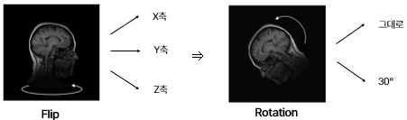</p>

<br>먼저 뒤집기를 0부터 2까지의 균일분포에서 하나의 숫자를 랜덤으로 뽑은뒤 숫자에 따라서 x, y, z축 중 하나의 축으로 기존의 3D 이미지를 뒤집었습니다. 이미지가 뒤집힌 후에는 ½의 확률로 30° 회전을 하거나 회전 없이 그대로 유지되도록 하였습니다.

<details>
<summary><b>\[Flip과 Rotation을 실행하는 코드\]</b></summary>

```python
class FlipRot3D(object):
    def __call__(self, data):
        label, input = data['label'], data['input']

        flip_choice = np.random.randint(3)

        if flip_choice == 0: # x축 flip
          label, input = label[::-1, :, :], input[::-1, :, :, :]
        if flip_choice == 1: # y축 flip
          label, input = label[:, ::-1, :], input[:, ::-1, :, :]
        if flip_choice == 2: # z축 flip
          label, input = label[:, :, ::-1], input[:, :, ::-1, :]

        rotate_choice = np.random.randint(2)
        if rotate_choice == 0:
          angle = 30
          label, input = rotate(label, angle), rotate(input, angle)

        data['label'] = label
        data['input'] = input

        return data
```

</details>

Flip과 Rotation의 시행이 독립적으로 이루어졌기에 위의 코드를 시행한 후에는 기존의 데이터에서 x축으로 뒤집은 상태, y축으로 뒤집은 상태, z축으로 뒤집은 상태, x축으로 뒤집고 30° 회전한 상태, y축으로 뒤집고 30° 회전한 상태, z축으로 뒤집고 30° 회전한 상태가 더해져 6가지 상태의 데이터가 추가되었습니다.

#### 2. Elastic Deformation

데이터를 증강하기 위해서 Elastic Deformation도 실행하였습니다. Elastic Deformation은 <b>이미지의 탄성을 변형</b>시키는 기법입니다. 정사각형 격자를 사용하여 이미지의 픽셀을 조금씩 옮기거나 돌려 데이터를 늘리거나 줄이는 기법입니다.

<p align="center">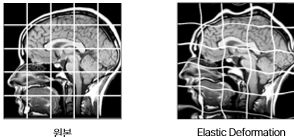</p>

변위, 즉 변형 정도는 표준편차 σ가 2인 정규분포에서 추출되어 샘플링되었습니다. 변위가 변동이 큰 분포에서 발생하는 것보다는 작은 분포에서 발생하는 것이 데이터 학습에 더 이상적이라고 판단하여 표준편차 값을 2로 설정하였습니다.

탄성변형을 적용하게 되면 데이터 간 불연속성이 발생할 수 있습니다. 이 문제를 해결하기 위해 데이터를 부드럽게 연결시키는 평활화를 사용했습니다. 이를 위해 각 차원에 3차 spline 필터를 사용했는데, 이는 변형이 자연스럽고 부드럽게 이루어지도록 도와줍니다.

<details>
<summary><b>\[Elastic Deformation을 실행하는 코드\]</b></summary>

```python
class ElasticDeformation(object):
    def __call__(self, data):
        label, input = data['label'], data['input']

        input, label = elasticdeform.deform_random_grid([input, label], sigma=2, axis=[(0, 1, 2), (0, 1, 2)], order=[1, 0], mode='constant')

        # data = {'label': label, 'input': input}
        data['label'] = label
        data['input'] = input

        return data
```

</details>

#### 2.2.2 GPU 메모리 부족 문제 해결을 위한 전처리

#### Resize

<b>한정된 하드웨어에 데이터를 불러오기 위하여 크기를 줄이는 것</b><b>이 필요</b>하였습니다.

<table><tr>
<td align="center" width="50%">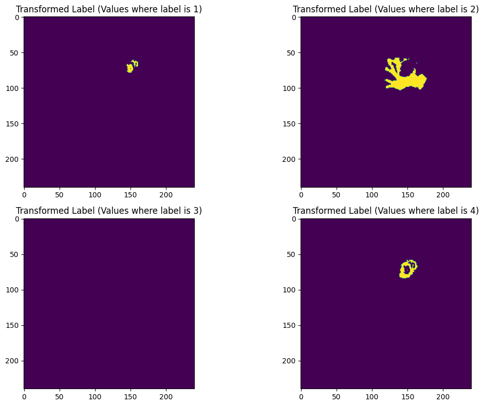<br><sub>레이블 위치 변경 전(원본) 각 레이블의 시각화</sub></td>
<td align="center" width="50%">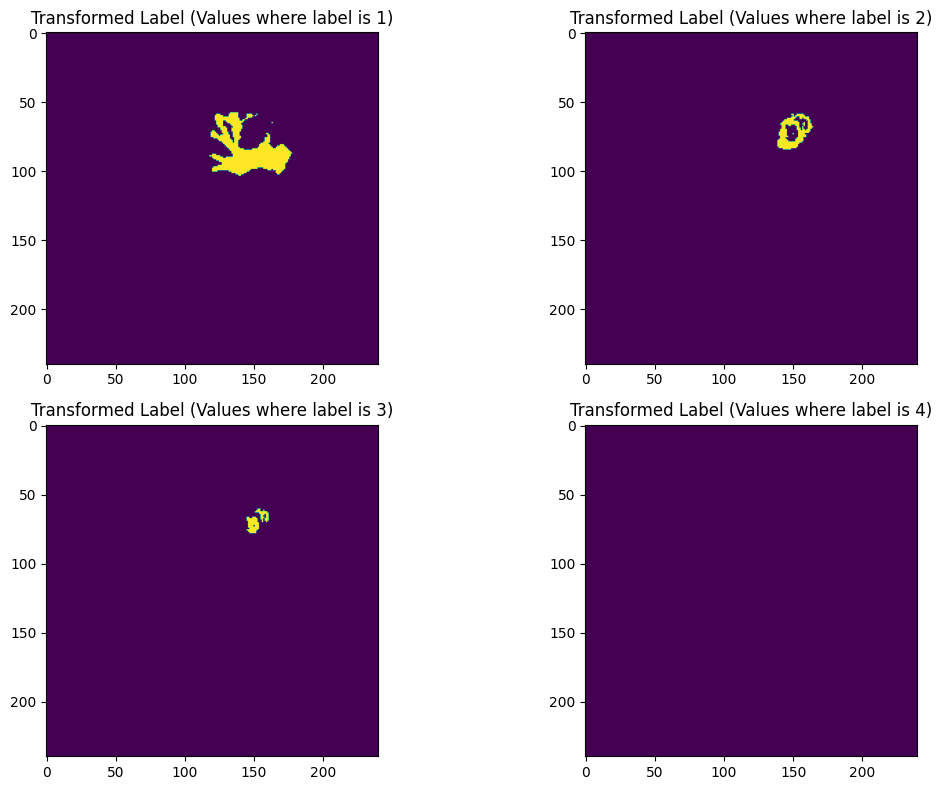<br><sub>레이블 위치 변경 후 각 레이블의 시각화</sub></td>
</tr></table>

그러나 원본 상태 그대로의 1, 2, 4 를 해당 함수에 적용하면, <b>1, 4 클래스의 대부분이 소실되는 문제</b>가 있었습니다. 이는 1, 2, 4클래스에서 <b>연속적인 의미론적인 위치관계를 가지지 않고</b>, <b>label의 숫자에서 3이 비어있어 연속적이지 않은 이유</b>로 발생한 것입니다. 따라서 <b>의미론적인 형태에 따라 연속적이도록 레이블의 위치를 변경</b>하였습니다.

<table><tr>
<td align="center" width="50%">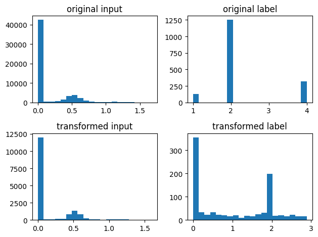<br><sub>label 위치 변경 전: 1, 4 label 소실</sub></td>
<td align="center" width="50%">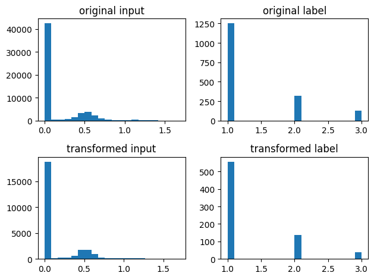<br><sub>label 위치 변경 후: label 소실 해결, 기존 데이터와 유사한 데이터 분포</sub></td>
</tr></table>

이후 실수 형태로 계산된<b> label 값을 반올림</b>하여 <b>기존과 유사하지만 크기가 작아졌으며, 원본 데이터와 분포가 유사</b>한 데이터를 얻을 수 있었습니다.

<p align="center">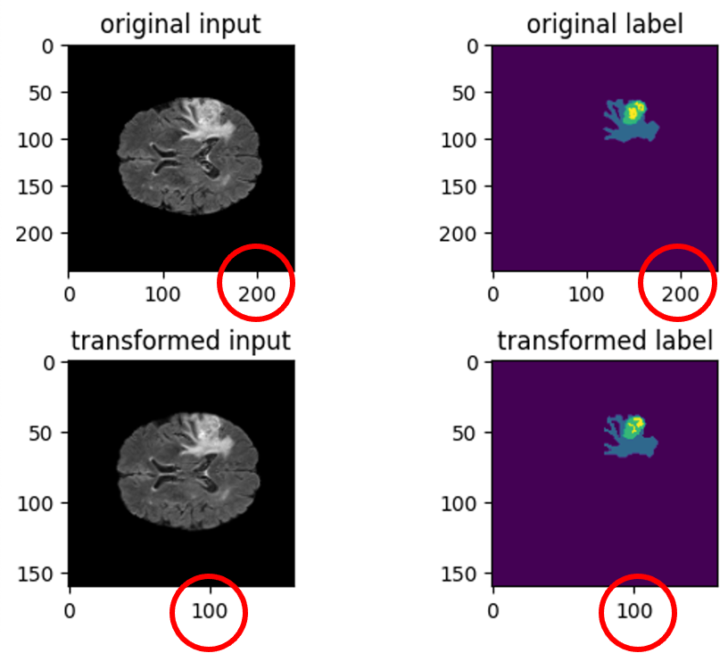</p>

<br>그림을 보시면 가로 세로가 240, 240이었던 데이터를 160, 160으로 줄어든 것을 확인하실 수 있습니다.

<details>
<summary><b>\[Resize를 실행하는 코드\]</b></summary>

```python
from skimage.transform import resize

class Resize3D(object):
    def __call__(self, data):
        label, input = data['label'], data['input']

        resized_label = resize(label, self.output_size, mode = 'symmetric')
        resized_label = np.round(resized_label)

        resized_input = resize(input, self.output_size)

        data['label'] = resized_label
        data['input'] = resized_input

        return data
```

</details>

#### 2.2.3 3 Cascaded Segmentation 적용을 위한 전처리

#### Crop

전체에서 랜덤한 부분을 자르는 일반적인 crop방법과는 다르게, <b>앞의 모델에서 나온 라벨을 포함해서 이 범위를 크게 벗어나지 않게 랜덤하게 잘라내는 방법</b>입니다. 즉 가장 왼쪽의 원본 이미지에서 가운데의 하얀색 종양 라벨을 포함하여 가장 오른쪽 그림처럼 자르게 됩니다. 이는 3-cascaded를 사용하기 위해 이루어집니다.

<p align="center">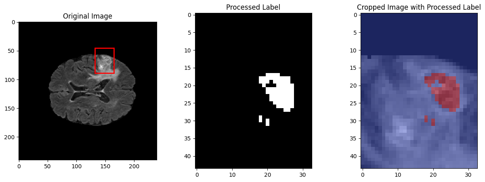</p>

<details>
<summary><b>\[Crop을 실행하는 코드\]</b></summary>

```python
indices = np.where(label_array == cropping_class)
padding = [random.randint(mid_padding - random_padding, mid_padding + random_padding) for _ in range(6)] # mid_padding보다 random_padding씩 작거나 큰 값으로 랜덤하게 각각 선택

# 범위 계산
min_x = np.clip(np.min(indices[0]) - padding[0], 0, None)
max_x = np.clip(np.max(indices[0]) + padding[1], None, image_array.shape[0])
min_y = np.clip(np.min(indices[1]) - padding[2], 0, None)
max_y = np.clip(np.max(indices[1]) + padding[3], None, image_array.shape[1])
min_z = np.clip(np.min(indices[2]) - padding[4], 0, None)
max_z = np.clip(np.max(indices[2]) + padding[5], None, image_array.shape[2])

# crop
cropped_image = image_array[min_x:max_x, min_y:max_y, min_z:max_z]
cropped_label = label_array[min_x:max_x, min_y:max_y, min_z:max_z]

resized_image = cropped_image
resized_label = cropped_label
```

</details>

### 2.3 3D U-net

<p align="center">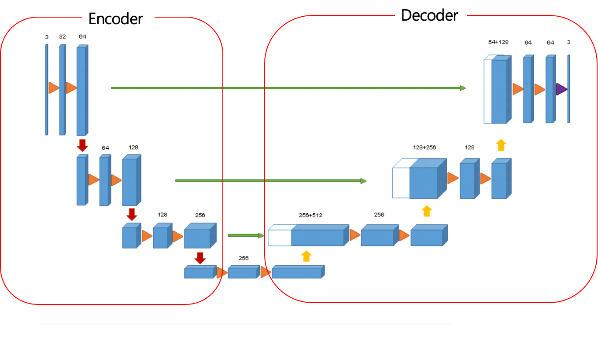</p>

저희가 사용하고자 하는 <b>3D 데이터를 적용</b>할 수 있으면서, <b>의료 데이터 처리에 많이 사용</b>되는 <b>3D Unet</b> 아키텍쳐를 선정하였습니다. 이 3D U-Net은 2d U-Net의 구조를 3D로 확장시킨 모델로, 3D 볼륨을 입력으로 받습니다.

우선 이 3D U Net의 구조에 대해 설명드리겠습니다. 그림을 보시면, 이 구조가 U자의 형태로 생긴 것을 보실 수 있는데요, 이를 따와서 U-Net이라는 이름이 붙었습니다.

U-Net은 입력 차원과 출력 차원이 일치하는데, CNN기반의 U-Net은 이를 통과하면서 feature map의 크기가 줄어들기 때문에 다시 high-resolution으로 만들어줘야 합니다. 따라서 모델은 입력 데이터를 압축하는 인코더와 다시 이를 복원하여 출력을 생성하는 디코더로 이루어집니다.

<p align="center">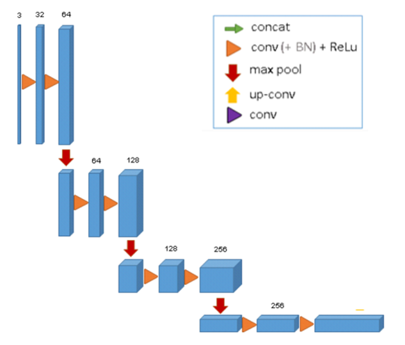</p>

<b>인코더의 구조</b>부터 조금 더 자세히 보면, 가장 먼저 보이는 주황색 화살표는 Input data를 convolution 연산과 batch Normalization, 그리고 ReLU를 적용한 모습입니다. 그리고 빨간색 화살표는 Max pooling을 적용해서 feature map의 사이즈를 줄이는 모습입니다. 이러한 layer를 반복해서<b> <b><i>*이미지의 특징을 추출</b>하게 돼지만, 이미지 사이즈가 작아지면서,<b> </i></b>*공간 해상도가 감소</b>합니다.

<p align="center">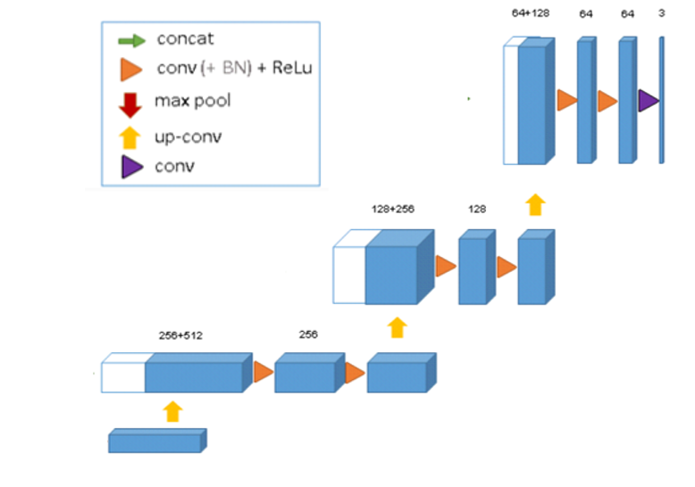</p>

그 다음은 <b>디코더 구조</b>입니다. <b>인코더를 통해 나온 수축된 데이터를 다시 복원</b>하는 과정입니다. 인코더와 비슷하지만, 풀링 대신 upconvolution이 사용된 차이점이 있습니다. 인코더와 마찬가지로 이를 반복 적용해서 사이즈를 복원합니다.

<p align="center">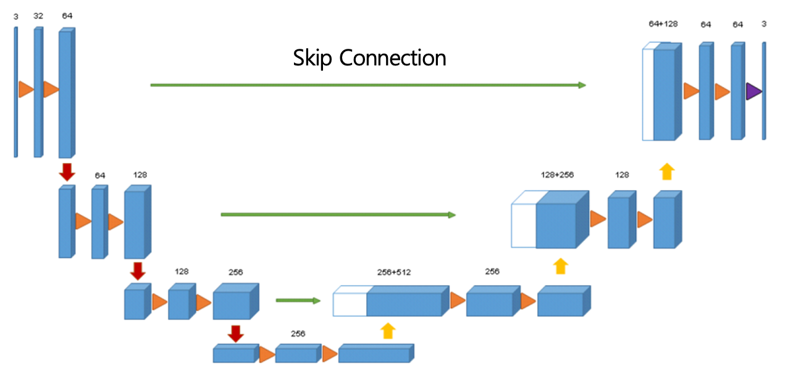</p>

그런데 앞서 인코딩 과정에서 공간 <b>해상도가 감소</b>한다고 말하였는데, 이를 <b>해결하기 위해 <b><i>*skip-connection</i></b>*을 사용</b>합니다. 연두색 화살표로 표시된 스킵 커넥션은, 인코더 레이어와 디코더 레이어를 직접 연결해 <b>공간 정보의 손실을 방지하고 입력 이미지의 세부사항을 보존</b>합니다.

### 2.4 3 Cascaded Framework

Input으로 받은 3D 이미지를 정상부분과 Whole Tumor, Tumor Core, Enhancing Tumor Core로 4가지 label로 식별하고 분할해야 합니다.

<p align="center">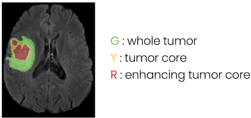</p>

하지만 한번에 3가지를 탐지하는 Multi-Class Segmentation 문제로 정의하기보다는 뇌종양의 해부학적 계층구조에 따른 일련의 3단계에 걸친<b> Binary-Class Segmentation</b>으로 문제를 정의하는 <b>3 Cascaded Network </b>아키텍처를 이용하였습니다.

저희는 3번의 Binary-Class Segmentation 과정에서 모두 3D U-Net을 사용하였기에 <b>Triple U-Net</b>으로 명명하였습니다.

<p align="center">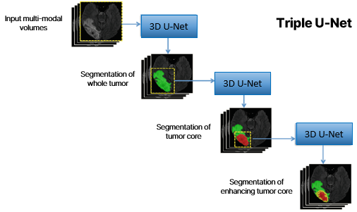</p>

Triple U-Net의 구조에 대해서 더 자세하게 설명하자면 뇌의 3D 이미지가 입력으로 들어왔을 때 다음과 같은 과정을 거칩니다.

<b>두번째 3D U-net</b>에서는 Whole Tumor가 Crop된 이미지를 입력으로 받아 <b>Tumor Core</b>를 분할합니다.

<b>마지막 3D U-net</b>에서는 앞서 같은 과정으로 Tumor Core만 Crop된 이미지를 입력으로 받아 <b>Enhancing Tumor Core</b>를 분할합니다.

3 Cascaded Architecture를 이용하여 뇌종양의 해부학적 구조를 이용하여 순차적으로 뇌종양의 세부구조를 분할해냈을 때, <b>한번의 네트워크로 4개의 label로 Multi-Class Segmenation하는 것보다 더 간단하고 훈련이 쉽다</b>는 장점이 있습니다. 또, <b>과적합을 줄일 수 있고 연속적인 네트워크가 위양성을 줄이는데 도움</b>을 줍니다.

---

## 3. Experiments

### 3.1. 데이터 증강

<p align="center">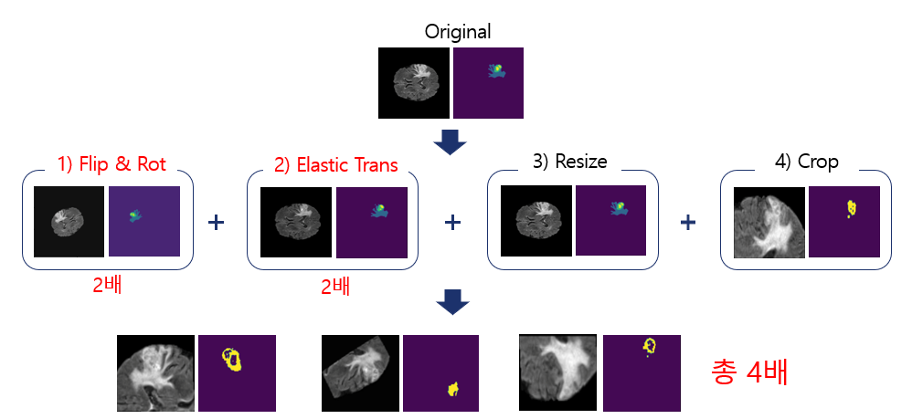</p>

앞에서 살펴본 데이터 <b>Flip, Rotation, Elastic Deformation, Resize, Crop 증강 방법</b>들을 <b>확률적으로 적용</b>해서 많은 데이터들을 생성하는 방법을 선택하였습니다. 회전은 ½ 확률로 30<b>°</b> 이내에서 진행되고, 나머지, 뒤집기, elastic transform resize, crop은 항상 진행하도록 하였습니다.

따라서 학습에 사용한 <b>데이터가 40개에서 40 \* 2 \* 2= 160개로 늘어나는 효과</b>를 가집니다.

### 3.2. 손실 계산 함수(Loss Function)

- Ground Truth(GT): 실제로 참인 값
- Prediction(P): 인공지능이 예측한 값

손실 계산 함수는 인공지능 모델의 학습 과정에서 <b>인공지능이 예측한 값(Prediction)과 참인 값(Ground Truth)가 얼마나 다른지를 수치로 표시하는 함수</b>입니다.

모델이 실<b>제와 비슷하게 추측한 경우 더 작은 값</b>을, <b>틀리게 추측한 경우 더 큰 값</b>을 가지게 됩니다.

해결하고자 하는 문제가 종양에 해당하는 부분을 1, 그렇지 않은 부분을 0으로 판단하는 이진 문제로 생각하였습니다.

따라서 <b>이진 데이터 특화된 이진 크로스 엔트로피 로스인 binary cross entropy loss를 적용</b>하고자 하였습니다.

#### 1. Binary Cross Entropy(BCE) Loss

<p align="center"></p>

loss 계산 방법에 대해 살펴보겠습니다. 우선 BCE의 계산 식을 살펴보면, 실제로 참인 값인 GT가 0인 경우, 1에서 인공지능이 예측한 값인 P를 뺀 뒤에 로그를 씌운 값의 마이너스 값으로 계산됩니다. 반면, GT가 1인 경우, 마이너스 로그 P로 계산됩니다.

이렇게만 보셔서는 이 손실 함수가 어떻게 GT와 P가 다른지 알아차리기 힘드실텐데요, 간단한 2개의 예를 소개드리겠습니다.

<br>첫번째 사례에서는 GT가 0이고, P가 0.9999로 <b>아주 잘못 예측한 사례</b>입니다. 이때는 BCE의 계산 식에 이를 대입하면, <b>4라는 큰 값</b>을 얻습니다.<br>반면, 두번째 사례에서는 GT가 1이고, P가 0.9999로 <b>보다 정확하게 예측한 사례</b>입니다. 이때는 BCE 계산식에 대입하면, 0.00004와 비슷한 <b>아주 작은 값</b>을 얻습니다.

이때, P가 왜 0또는 1이 아니라 실수 값을 갖는지 궁금하시다고 질문하실 수 있는데요, 인공지능 모델의 마지막 부분에서 (softmax, 우리가 사용한건 relu와 같은) 특정한 함수를 통해 0\~1 사이의 값을 출력하도록 하기 때문입니다.

<br>따라서 이 loss함수는 제대로 동작한다고 할 수 있습니다.

<p align="center">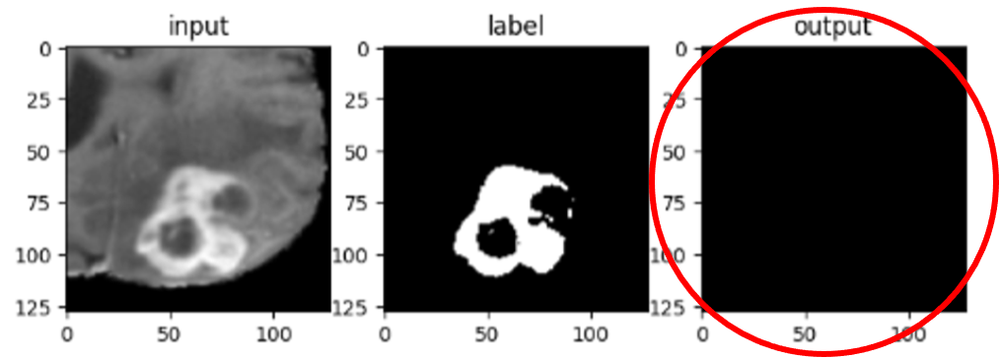</p>

그러나 이 loss를 저희의 뇌 종양 데이터에 적용하였을 때 문제가 있었습니다. <b>loss는 0.14정도의 작은 값으로 감소</b>하였으나, <b>모든 픽셀을 0으로 예측</b>하는 것이었습니다.

<p align="center">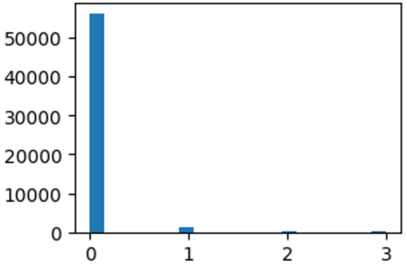</p>

<p align="center"><sub>데이터의 불균형: 최대 5237배</sub></p>

이는 0의값을 가지는 배경 <b>class에 편향되게 학습</b>된 것으로 해석할 수 있습니다. 이러한 현상은 <b>데이터 편향성</b>에 의해 나타납니다. 저희 데이터는 클래스에 따라 <b>160\~5230배 불균형</b>이 존재합니다. 즉, <b>종양에 해당하는 1의 데이터가 0 데이터에 비해 월등히 적어 모델은 항상 0으로  예측하더라도 loss가 작은 값을 가질 수 있습니다.</b>

따라서 모델은 당연하게도 <b>모든 픽셀을 0으로 예측할 때 loss가 줄어드는 방향으로 학습하여 모든 픽셀을 0으로 예측</b>하게 됩니다.

#### 2. Dice Loss

이를 해결하기 위해 BCE 대신 <b>Dice loss를 적용</b>하였습니다. Dice loss는 이전과 같은 <b>클래스 불균형 문제를 잘 처리할 수 있습니다. </b>왜냐하면, <b>배경 클래스를 고려하지 않고, 종양 클래스만을 고려</b>하여 손실(Loss)을 계산하기 때문입니다.

<p align="center">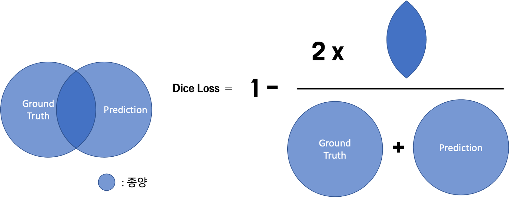</p>

이전과 같이 실제로 참인 부분인 Ground Truth, 모델이 예측한 부분인 Prediction에 해당하는 종양이 있습니다.<br>모델은 왼쪽 그림과 같이 실제 종양 중 일부 부분만을 맞고, 나머지 부분은 틀린 상황을 가정해봅시다.

이 때, 손실 함수는 <b>1에서 겹친 부분의 넓이의 두배에서 전체 종양의 넓이를 나눈 것을 뺍니다.</b><br>이는 겹친 부분이 많아서 전체가 겹친 경우 1-1이 되므로 0이 되고, 하나도 겹치지 않은 경우는 1-0이므로 1이 됩니다.

이와 같은 방법으로 모델이 실제와 비슷하게 추측한 경우 더 작은 값을, 틀리게 추측한 경우 더 큰 값을 가지도록 올바른 손실 계산 함수 역할을 합니다.

### 3.3. 최적화(Optimizer)

<p align="center">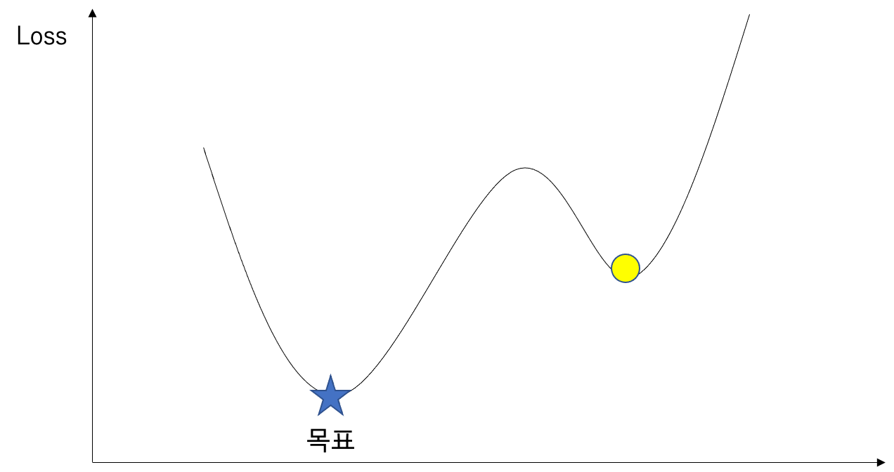</p>

Optimizer는 <b>인공지능이 어느 방향으로 얼마나 학습할 지 정하는 역할</b>을 합니다.

인공지능의 학습 과정을 시각화하면, 보이시는 바와 같은 구불구불한 길이 있고, 동그라미의 위치에서 학습이 시작될 때, 전체 곡선에서 global minima로 불리는 최소 Loss값을 갖는 목표 지점을 찾는 것입니다.

즉, <b>현 위치에서 최솟값을 향해 일정 거리만큼 이동</b>하고<b>, </b>이동한 곳에서 다시 기울기를 구하고 또 최솟값을 향해 나아가기를 <b>반복</b>합니다.

이때, <b>너무 조금씩 이동</b>한다면, 부분에서 최소 loss값을 갖는 지점에 멈춥니다. 이를 <b>local minima에 빠진다</b>고 합니다.

그러나 <b>적절하게 이동</b>한다면, 전체에서 최소 loss 값을 갖는 지점을 찾을 수 있습니다. 이를<b> </b><b>global minima에 수렴한다</b>고 합니다.

그러나 한번에 <b>너무 많이 이동</b>한다면, 최소값을 갖는 지점을 찾을 수 없을 것입니다. 이를 <b>발산</b>한다고 합니다.

따라서 학습량을 조절하는 optimizer의 선택이 중요합니다.

#### 1. Stochastic Gradient Descent (SGD)

저희는 첫번째로 확률적 경사 하강법인 SGD 를 실험하였습니다.

이 방법은 전체 데이터가 아니라 데이터 중 일부를 <b>미니배치(mini-batch)로 랜덤하게 선정</b><b>합니다.</b>

<b>이는 확률적(stochastic)으로</b> <b>무작위하게 골라낸 데이터'에 대해 수행하기 때문에 학습 데이터 전체에 편향되지 않고, </b><b>일반화에 유리</b>합니다.

그러나, 일부의 데이터만으로 학습하기 때문에 <b>global minima를 찾는데에 오래 걸립니다.</b>

그러나 저희가 실험하고자 하는 데이터는<b> </b><b>3D 데이터로, 아주 많은 저장공간과 계산 시간이 필요</b>합니다.

따라서 해당 방법을 사용하였을 때에 <b>loss가 global minima를 찾지 못해 제대로 학습되지 않았습니다</b>.

#### <b>2. Adaptive moment estimation (Adam)</b>

loss가 감소하는 <b>진행 방향(momentum)을 고려하고 이동 거리를 적응적(adaptive)으로 조절</b>하는 Adam optimizer를 사용하였습니다.

이 방법은 <b>학습 시간을 단축</b>할 수 있습니다. 또 <b>많은 데이터들에서 좋은 성능</b>을 보이는 것이 실험적으로 밝혀졌기 때문에 해당 최적화 기법을 선정하였습니다.

### 3.4. Scheduler

최적화와 비슷한 맥락에서 <b>학습의 정도를 조절</b>하는 스케쥴러를 사용하였습니다. 이전의 <b>최적화와 다르게 이동 거리를 조절하는 Learning rate를 바꿔가며 학습을 조절</b>하는데에 쓰입니다.

<p align="center">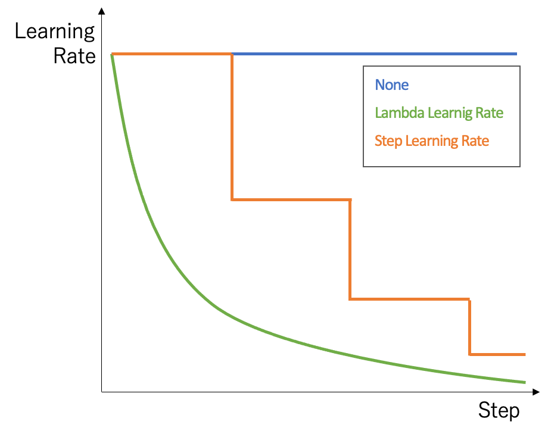</p>

#### 1. 스케쥴러를 사용하지 않은 경우

첫번째로 스케쥴러를 사용하지 않은 경우, <b>구현이 간단</b>하였으나, <b>Loss의 최소점을 찾지 못하여 발산</b>하였습니다.

#### 2. Lambda Learning Rate

두번째로 Lambda Learning Rate을 사용하였습니다. <b>Lambda 함수에 따라 learningrate를 감소</b>합니다.<br>스케줄러를 사용하지 않은 경우에 비해 <b>최소점을 찾는데 유리</b>합니다. 그러나 <b>모든 문제의 해법이 되기는 힘들고, 알맞은 lambda 함수의 파라미터를 찾는 것이 어려웠습니다.</b>

#### 3. Step Learning Rate

마지막으로 step learning rate를 실험하였습니다. 이는 <b>step에 따라 learningrate를 일정한 비율로 감소</b>합니다. 마찬가지로 <b>최소점을 찾는데 유리</b>하나, <b>알맞은 비율의 값을 찾는데 어려움</b>이 있었습니다.

따라서 <b> Lambda Learning Rate와 Step Learning Rate를 모두 실험</b>하였습니다.

### 3.5. Hardware / Software / Code

- Hardware: 2070 Ti
    - Video Memory: 8GB
    - 128, 128, 32 크기의 이미지를 사용할 때, <b>batch size 2가 최대</b>
- Software: Linux Ubuntu 18.04.6 LTS
- Code: [https://github.com/Yuyeon-Kim/brain-tumor-segmentation](https://github.com/Yuyeon-Kim/brain-tumor-segmentation)
    - Python version: 3.7\~3.9

---

## 4. Results

### 4.1. 학습 결과

#### 4.1.1. 정량적 평가

최종적으로 <b>Dice loss, Adam, Step Learning Rate를 사용하였을 때 최고 성능을 보였습니다. </b>그러나 <b>위양성과 위음성이 모두 많고, 12% 가량의 정확도</b>로 거의 예측을 하지 못하였습니다.

<table><tr>
<td align="center" width="33%"><br><sub>Train Loss</sub></td>
<td align="center" width="33%"><br><sub>Validation Loss</sub></td>
<td align="center" width="33%">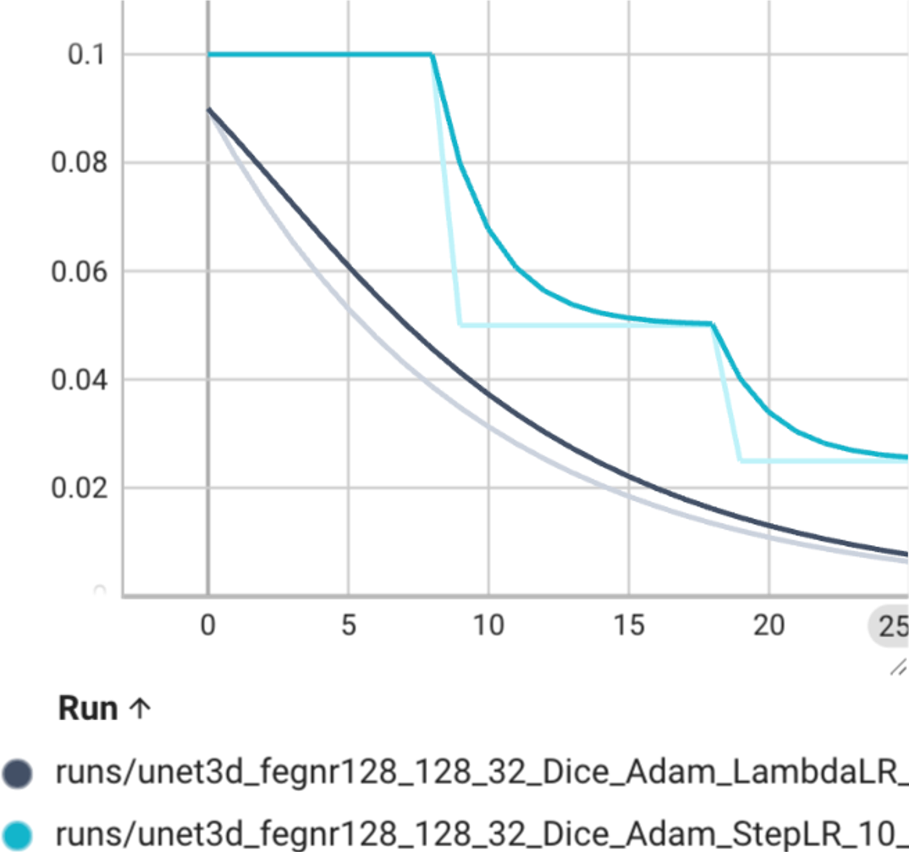<br><sub>Learning Rate</sub></td>
</tr></table>

제일 성능이 좋았던 2개의 학습 결과를 분석하겠습니다. 모두 <b>Dice Loss, Adam, 128 128 32 이미지 사이즈</b>를 가집니다.

학습 과정에서의 <b>Train Loss가 큰 틀로 보면, 점진적으로 감소</b>하는 추세입니다. <b>Validation에서의 Loss는 특히 30 에포크 가량에서 매우 감소하는 추세</b>를 보였습니다. 이로 미루어보아 <b>학습은 정상적으로 진행되었던 것</b>으로 판단됩니다.

그러나 3D 데이터와 복잡한 전처리를 거치기 때문에 <b>한번의 </b><b>60 epoch 학습에 24시간 가량의 시간이 소요</b>되었습니다. 따라서 시간 관계상 더 많은 에포크를 실험하지 못하였으나, <b>더 많은 학습을 했을 때 성능이 좋아질 여지가 있습니다.</b>

#### 4.1.2. 정성적 평가

<b>최고 성능을 보이는 모델</b>을 시각화하였습니다. <b>위양성, 위음성이 모두 많아 성능 개선이 필요할 것으로 보입니다.</b>

<table><tr>
<td align="center" width="33%">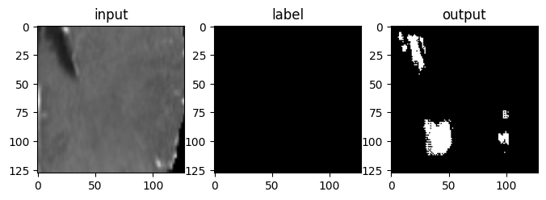</td>
<td align="center" width="33%"></td>
<td align="center" width="33%">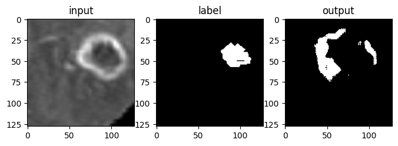</td>
</tr></table>

시간상의 이유로 <b>다른 방법들은 앞으로 시도해볼 예정</b>입니다.

### 4.2. 결과 분석

현재 시점에서 이러한 결과가 나온 이유를 분석하였습니다.

#### <b>1. Resize</b> (크기 조정) 단계에서의 데이터 손실

제한된 하드웨어에서 데이터를 학습하기 위해 진행한 <b>크기 조정 과정에서의 데이터 손실</b>이 있었습니다.

<p align="center">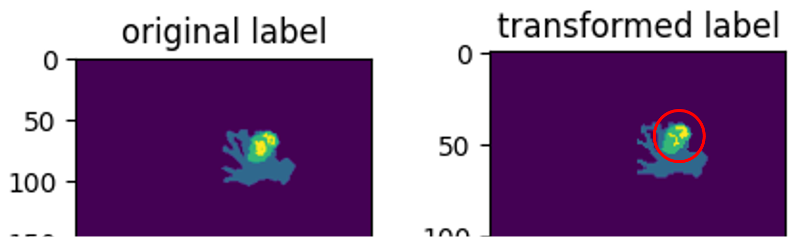</p>

<p align="center"><sub>왼쪽의 원본 레이블에 비해 오른쪽의 크기가 조정된 레이블에서 일부 손실이 있음을 보실 수 있습니다.</sub></p>

뿐만 아니라, <b>이미지의 해상도도 떨어져 학습에 부정적으로 작용</b>했을 것입니다.

이러한 이미지와 레이블의 손실이 모델 학습에 악영향을 끼쳤을 것입니다.

#### 2. <b>작은 Batch size</b>

하드웨어의 한계로 인하여 batch size를 2밖에 사용할 수 없었습니다. 저희가 사용한 <b>뇌종양 데이터셋은 총 4가지 모달리티의 이미지 데이터를 포함</b>합니다. 따라서 한번에 이 <b>4가지 종류의 데이터를 학습하지 못하였습니다.</b>

<p align="center">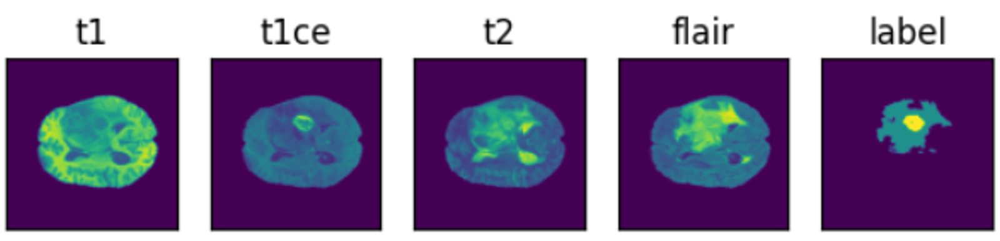</p>

#### 3. <b>모달리티</b> <b>정보</b> <b>입력</b> <b>없음</b>

각 <b>모달리티별 이미지 입력의 차이가 큰데 반해 어떤 모달리티를 사용하였는지는 입력하지 않아 모달리티에 따른 특성을 파악하기 힘들었을 것</b>으로 생각됩니다.

#### 4. <b>데이터 수의 부족</b>

학습에 사용한 <b>데이터 자체가 모델을 일반화하기에 부족</b>하였을 가능성도 있습니다.

#### 5. 학습 <b>파라미터 관련 문제</b>

- <b>파라미터 실험 경우의 수 부족</b>: 전처리, 최적화, 스케쥴러 등의 학습 <b>파라미터에 대한 실험이 부족해 최적의 파라미터를 얻지 못하</b>였을 수도 있습니다.
- <b>부적절한 학습 파라미터 사용</b>: <b>일반적으로는 잘 동작하나, 뇌종양 데이터에 적절하지 못한 학습 파라미터들을 사용</b>하였을 수도 있습니다.
- <b>부적절한 손실 계산 함수 사용</b>: <b>데이터</b>가 최대 5000배 가량 차이가 나는 <b>편향</b>을 보이기 때문에 이에 <b>맞지 않는 손실 계산 함수를 사용</b>하였을 가능성도 있습니니다.

### 4.3. 앞으로의 진행 계획

#### <b>1. 서버용</b> <b>GPU를</b> <b>사용한</b> <b>학습</b>

근본적으로는 <b>많은 그래픽 메모리</b>를 사용할 수 있는 <b>서버용 GPU를 사</b>용하면, r<b>isize로 인한 정보 손실, 작은 batch size로 인한 일반화 어려움, 데이터 수 부족 문제를 해결</b> 가능합니다.

그러나 이는 <b>많은 금액</b>을 필요로 하고, <b>세팅이 어렵다</b>는 점, <b>연구실의 경력에 따른 서버 배당</b>의 문제가 있습니다. 따라서 <b>현실적으로 지금 당장 사용하기는 힘든 방법</b>이나, 추후에는 가능할 수도 있습니다.

#### <b>2. 모달리티를</b> <b>고려한</b> <b>학습</b>

두번째로, <b>모달리티를 고려한 학습</b>을 진행할 수 있습니다.

이는 모달리티를 고려하지 않아 생기는 <b>다양한 모달리티, 모달리티 정보 입력 없음 문제들을 해결</b>할 수 있습니다.

이를 위해서는 <b>멀티모달에 쓰이는 여러 방법론들을 적용</b>해야 할 것입니다.

#### <b>3. 많은</b> <b>학습</b> <b>파라미터</b> <b>실험</b>

마지막으로, <b>많은 학습 파라미터들을 실험</b>할 것입니다. 이를 통해 학습 파라미터에 의해 생기는 <b>파라미터 실험 경우의 수 부족, 부적절한 학습 파라미터 사용, 부적절한 손실 계산 함수 사용 문제들을 해결</b>할 수 있습니다. 그러나 많은 실험을 필요로 하기 때문에 <b>많은 시간이 소요</b>될 것입니다. 따라서 보다 <b>효율적인 학습 방법을 고안할 필요가 있습니다.</b>

---


