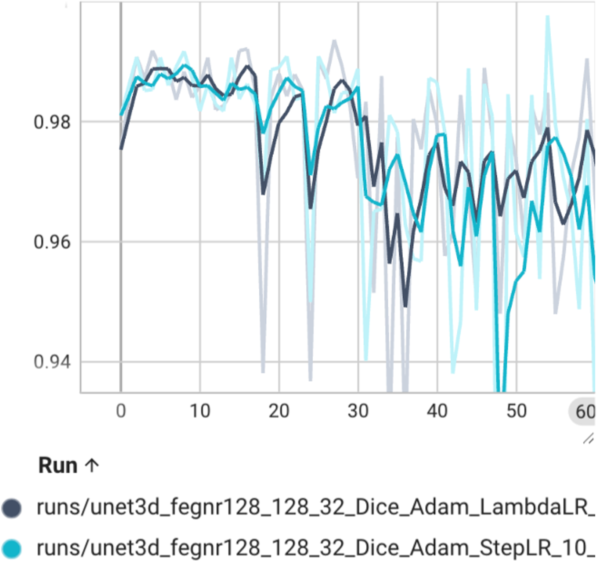
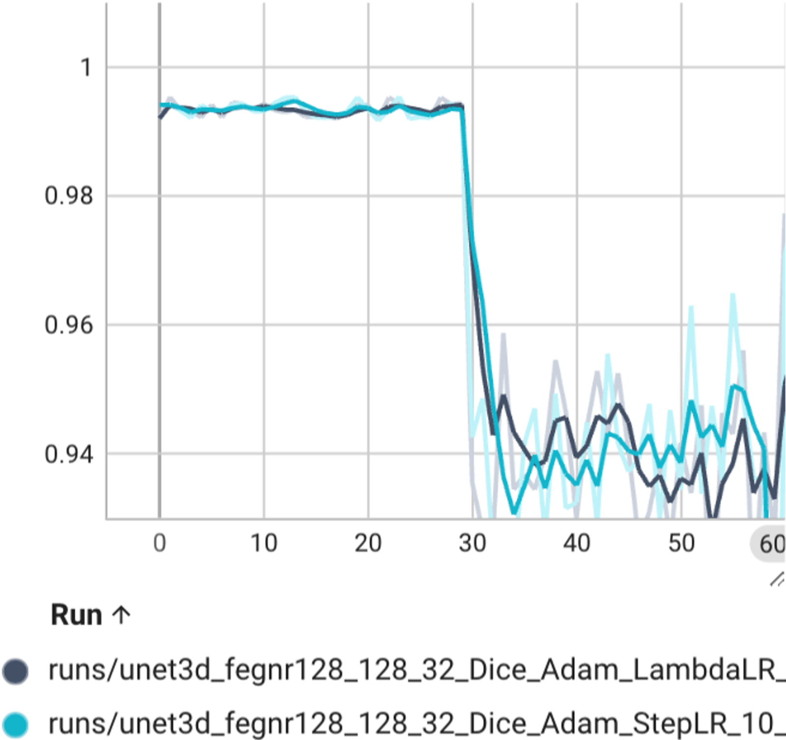
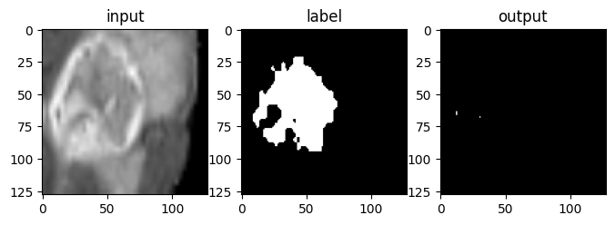

[🏠 Portfolio](https://github.com/heoneyzi) › [🩺 Medical](../../../README.md) › [Bu-net](../../README.md) › [Experiments](../README.md) › **E2 · 3-D cascaded U-Net on BraTS 2019**

# 🔬 E2 · “Triple U-Net”: three cascaded 3-D U-Nets on BraTS 2019

> **Question —** Can brain-tumor sub-regions be segmented as three nested binary problems — whole tumor → tumor core → enhancing tumor — with 3-D U-Nets trained on a single 8 GB GPU?

| | |
|---|---|
| **Status** | ✅ done (2024) — archived Notion report; code not in this portfolio |
| **Model / data** | three cascaded 3-D U-Nets; BraTS 2019 via Kaggle — 335 patients (259 HGG + 76 LGG), T1 / T1ce / T2 / FLAIR + label |
| **Compute** | one RTX 2070-class GPU with 8 GB (the report writes "2070 Ti"); batch size 2 at 128×128×32; 60 epochs ≈ 24 h |
| **Headline** | best setting Dice + Adam + StepLR, yet **≈ 12 % accuracy** with many false positives and negatives |

> [!NOTE]
> **Provenance.** This is the Notion page titled "BU-Net" in Jiheon's portfolio workspace, converted in full to [docs/project_report.md](../../docs/project_report.md). It is written as a team report ("저희 팀") but does not name its authors, and it cites [Yuyeon-Kim/brain-tumor-segmentation](https://github.com/Yuyeon-Kim/brain-tumor-segmentation) (a "2024 MediAI team" repository, Mar 2024) as its code. Read it as deep daiv. Medical AI context for the BU-Net project; Jiheon's individual part in this track is not documented.

## Setup

| Stage | What was done (report section) |
|---|---|
| Label order | labels re-sorted from the largest to the smallest region (WT → TC → ET) to fit the cascade (§2.2) |
| Augmentation | random-axis **flip** + **30° rotation** with p = ½; **elastic deformation** (σ = 2, cubic-spline smoothing); chosen over gamma correction and normalization because it kept the four labels balanced (§2.2.1) — 40 training volumes → 40 × 2 × 2 = 160 (§3.1) |
| Resize | 240 × 240 → 160 × 160 in-plane to fit memory; naive resizing erased classes 1 and 4, so labels were remapped to be contiguous and rounded after resizing (§2.2.2) |
| Cascade crop | random crop that keeps the previous stage's label inside the box (§2.2.3) |
| Model | 3-D U-Net for each binary stage — WT, then TC inside the WT crop, then ET inside the TC crop ("Triple U-Net") (§2.3–2.4) |
| Loss | BCE → **Dice** (§3.2) |
| Optimizer | SGD → **Adam** (§3.3) |
| Scheduler | none vs **LambdaLR** vs **StepLR** (§3.4) |

## Results

| Study | Observation (report §3–4) |
|---|---|
| Loss | BCE fell to ≈ 0.14 while predicting **every voxel as background** — the classes are 160–5,230× imbalanced; Dice loss, which ignores the background class, was adopted |
| Optimizer | SGD did not find a good minimum on 3-D data within the budget; Adam trained |
| Scheduler | no scheduler diverged; LambdaLR and StepLR both helped but were hard to tune — both kept |
| Final | best = Dice + Adam + StepLR at 128×128×32; train loss drifted down and validation loss dropped sharply around epoch 30, but predictions reached only **≈ 12 % accuracy** with many false positives and negatives |

<table><tr>
<td align="center" width="33%"> Train loss</td>
<td align="center" width="33%"> Validation loss</td>
<td align="center" width="33%"> A false-negative case</td>
</tr></table>

The report's own diagnosis (§4.2): information lost when resizing, batch size 2 (the four modalities could not be learned together), no modality information in the input, too little data, and too few hyper-parameter trials. Its plan (§4.3): a server GPU, modality-aware (multimodal) training, and a wider hyper-parameter search.

## Takeaway

- A clear, well-documented **negative result**: the pipeline ran, but a 3-D cascade on an 8 GB GPU forced so much down-sizing and so small a batch that the model barely learned the tumor.
- The loss study is the most transferable lesson — on heavily imbalanced masks BCE can look converged while predicting nothing.
- The "≈ 12 % accuracy" is quoted as written; the report does not define the metric further (the curves are Dice-loss values near 0.94–0.99).

## Files

| File | What it is |
|---|---|
| [`docs/project_report.md`](../../docs/project_report.md) | full report (Korean), 33 figures in [`docs/assets/`](../../docs/assets/) |
| [`docs/README.md`](../../docs/README.md) | English section-by-section summary of the report |
