# 01 · BU-Net 논문 리뷰 — Brain Tumor Segmentation Using Modified U-Net Architecture

[🏠 Portfolio](https://github.com/heoneyzi) › [🩺 Medical](../../../README.md) › [Bu-net](../../README.md) › [Notes](../README.md) › <b>BU-Net paper review</b>

> [!NOTE]
> Jiheon's review of the BU-Net paper (Mobeen Ur Rehman, SeungBin Cho, Jee Hong Kim, Kil To Chong), written in May 2024 during the deep daiv. project and kept in the original Korean. All numbers below are the <b>paper's</b> reported results, not the team's.

### 1. Introduction

뇌종양 (brain tumor)은 비정상적 세포가 커지면서 발생한다. 악성 뇌종양의 발생률이 높아지면서 사회에 미치는 영향은 커지고 있다.이를 막기 위해서 고품질의 영상을 brain tumor segmantation이 중요하다. 뇌종양은 MRI (Magnetic Resonance Imaging)을 통해서도 확인이 가능하다. MRI는 뇌를 시각화하기 위해서 T1-weighted, T2-weighted, post-contrast T1-weighted, Flair 4가지의 가중치의 양식을 사용한다. 이들은 segmentation과정에서 보완적이다.

머신러닝을 이용해서 자동으로 이미지 분할을 하고자 노력하였다. 당시까지는 의료 영상 분할 분야에서 가장 널리 사용되던 딥러닝 방법은 U-net과 FCN(Fully Convolutional Network)를 사용하는 것이다.  U-net은 왼쪽이 incoder 작업을 수행하고, 오른쪽이 decoder 작업을 수행하는 U-대칭 구조를 갖는다. U-net의 또다른 특징은 incoder가 decoder의 해당 계층에 연결이 되게 되는데, 이는 low-level과 high-level의 특징을 모두 가질 수 있다는 장점이 생기게 된다. 더 나아가 위치 정보는 보존하면서, 서로 다른 level의 특징을 통합하여 더욱 향상된 성능을 보여줄 수 있게 된다.

brain tumor segmentation은 크게 MRI를 이용하는 3D분할과 슬라이스를 사용하는 2D분할이 있다. 그러나 3D분할은 데이터의 개수도 적고, 분할이 어려워서 학습이 어렵다. U-Net은 이진 클래스에 대한 분할 작업을 위해 개발되었으며 패딩이 있는 컨볼루션을 사용하지 않기 때문에 출력 해상도가 입력 해상도보다 작다. 따라서 입력과 유사한 출력 해상도가 필요한 경우 U-Net을 직접 적용할 수 없다. W-Net은 2단계 U-Net을 사용하는 U-Net 아키텍처와 유사한 또 다른 아키텍처이다. 그러나 W-Net의 문제는 학습 가능한 매개 변수의 수가 많아 모델을 학습하는 것이 어렵다는 단점이 있다.

이런 점을 보완하고자 BU-net을 논문에서는 제안하였다.

새롭게 2개의 모듈을 내장하였는데 이는 residual extended skip (RES)과 wide context (WC)이다.

- BU-Net의 두 새로운 모듈은 글로벌 특징의 집계와 함께 문맥 정보를 얻는 데 도움이 된다.
- RES는 low-level의 특징을 middle-level의 특징으로 변환한다.
- 뇌종양 분할의 경우에는 스케일 불변 특징을 사용할 때 유용하다.
- RES 모듈은 이전 기술에서 문제로 남아 있던 valid receptive field를 증가시켰다.
- 두 개의 결합된 손실 함수는 각 클래스가 차지하는 크게 차이나는 픽셀 비율에 대한 문제를 해결하기 위해 사용된다.

BU-Net은 기존의 최첨단 뇌종양 분할 기술과 비교했을 때 유망한 결과를 보여주었다.

### 2. datasets

공개적으로 사용할 수 있는 벤치마크 데이터셋을 구하였다.

BraTS 2017 과 BraTS 2018이다. 데이터 세트에는 4가지 주요 클래스로 label 이 지정되어 있는데 다음과 같다.

•	Enhancing tumor. •	Necrosis and non-enhancing tumor. •	Edema. •	Healthy tissue.

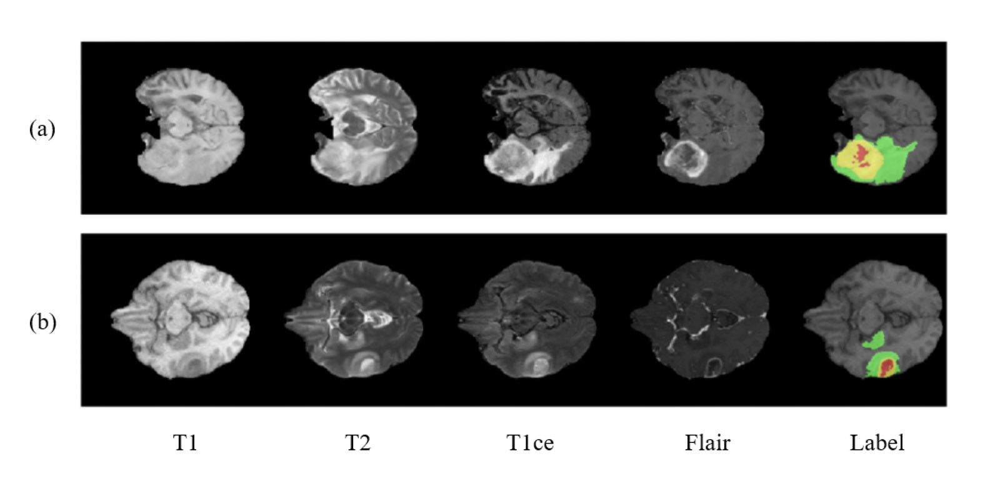

빨간색은 괴사 및 비강화를 나타낸다. 녹색은 부종을 나타낸다. 노란색은 강화 종양을 나타낸다.

### 3. methodology

전체적인 과정은 이미지 전처리 과정을 거치고 2개의 모듈이 포함된 BU-net을 이용하게 된다.

#### 3.1 Image processing

딥러닝 모델은 노이즈에 약하다는 약점이 존재한다. 그래서 이미지를 넣기 전에 전처리 과정을 거치는 것이 굉장히 중요하다. N4ITK을 이용하여 모든 이미지를 균일하게 만들어 준다. 그리고 bias field를 보정할 수도 있다. 그리고 상위 1% 및 하위 1%의 강도는 폐기되며, 마지막으로 평균이 0으로 모든 이미지가 정규화된다.

#### 3.2 <b>Proposed BU-net</b>

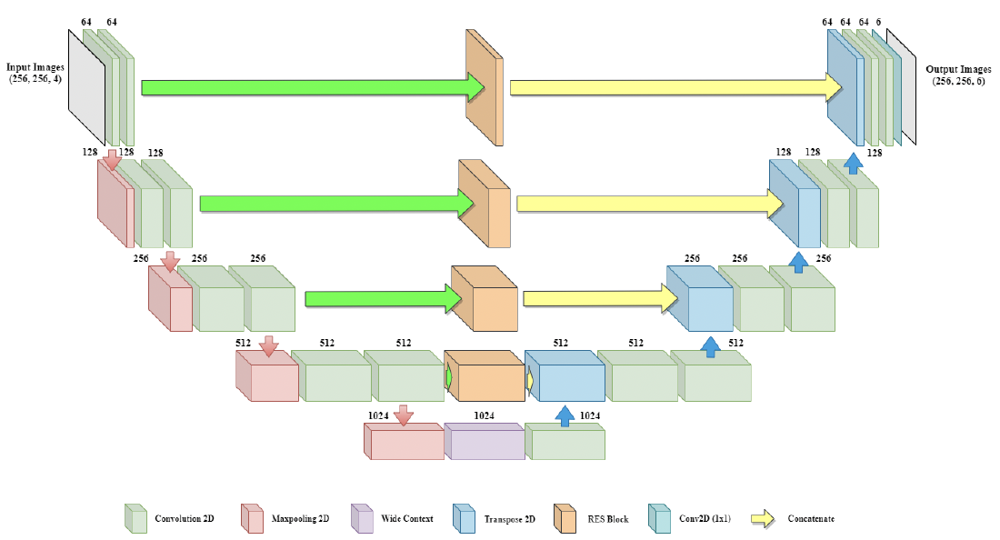

위 그림은 전체적인 BU-net의 구조를 보여준다.   256 × 256의 입력 영상을 촬영하고 동일한 차원의 영상을 출력하게 된다. 모델의 왼쪽 부분은 encoder 역할을 하고 모델의 오른쪽 부분은 decoder 역할을 한다. padding을 이용하여 합성곱의 과정에서도 동일한 차원을 출력할 수 있게 된다.

encoder 측에서 모든 블록은 single max-pooling 계층 및 dropout 계층과 함께 2개의 합성곱 계층들로 구성된다. decoder의 블록은 이전 블록에 적용된 Conv2D 트랜스포스 계층으로 시작한다. Conv2D 트랜스포스 계층의 출력은 연관된 RES에서 나온 출력과 연결된다. dropout은 연결된 출력에 적용되고 2개의 컨볼루션 계층들이 뒤따른다.

encoder는 이미지의 수축 과정을 진행하고, decoder은 확장 과정을 진행한다. 그리고 encoder에서 decoder로의 변화를 위해서 더 넓은 context block을 사용한다.

BU-Net의 마지막 합성곱 계층을 제외하고는 배치 정규화 및 ReLU 활성화 함수가 뒤따른다. 마지막 계층은 sigmoid 활성화 함수를 사용한다.

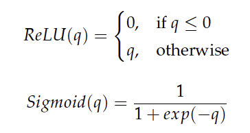

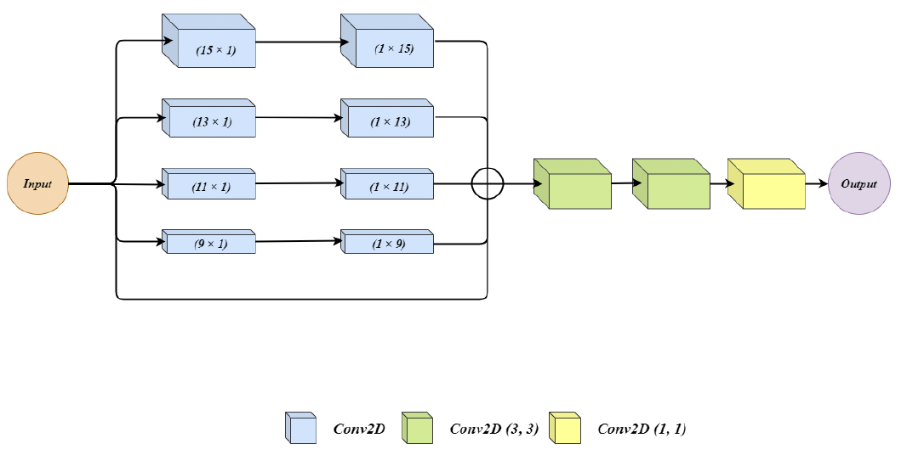

위는 RES의 구조를 보여주는 그림이다. input은 5개의 병렬구조로 받게 된다. 그 중에 위 4개는 2개의 합성곱 계층을 지나게 되는데, 각각  N × 1과  1 × N의 사이즈의 필터를 사용한다. 하나의 N × N을 사용하는 것보다는 더 적은 파라미터가 생성되기 때문이다. 마지막 연결은 input이 그대로 전달이 되는 skip connection이다.

이렇게 5개의 입력을 합산하여 하나의 출력으로 내보내게 되는데, 이에는 마지막 2개의 합성곱 3×3, 3×3, 1×1 사이즈를 지나서 output이 나오게 된다.

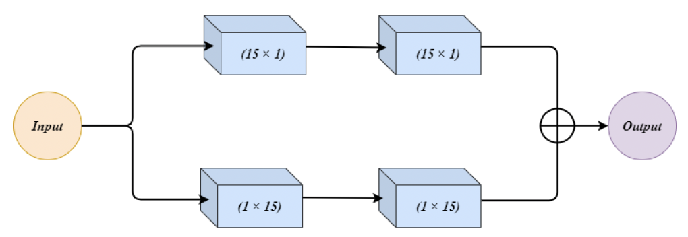

위 그림은 Wide context (WC)의 모습을 보여준다.

input을 2개로 병렬적으로 받는데, 모두 2개의 합성곱 계층을 지난다. 각각 N × 1 과 1 × N만 2번 사이즈 필터를 지나게 되는데, 그러고 2개의 출력이 합산되어서 output으로 나오게 된다. 2개의 각각 필터를 사용하는 것은 성능에 영향을 줄 수 있는 좋은 특징을 모은 세트가 만들어지게 된다. 이런 필터 조합의 변화가 특징을 다양화 시키게 된다.

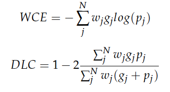

위 수식은 불균형한 클래스 데이터를 완화하기 위한 수단으로 사용되었다. BraTS 데이터 셋의 비율이 다르기에, weight cross-entropy (WCE)와 Dice loss coefficient (DLC) 2개를 사용하여 두개의 합을 loss function으로 사용하게 된다.

N은 라벨들의 총 개수, $`w_j`$는 "j"에 할당된 가중치이다. $`p_j`$는 분할된 이미지의 예측된 이진 픽셀 값,$`g_i`$는 분할된 이미지의 ground truth 이진 픽셀 값을 의미한다.

DLC는 클래스에 관계 없이 분할된 영역과 ground truth 사이의 최대 중첩을 찾는 용도이며,  WCE는 수행되는 클래스와 관련된 조직 세포를 분류하는 용도이다.

### 4. Results and Discussion

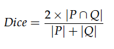

Dice score을 이용하였다. 다른 논문들의 모델과 BU-net의 모델을 정량적으로 평가할 수 있게 된다. 이는 집합 P와 Q의 유사성을 파악할 수 있는 점수이다.

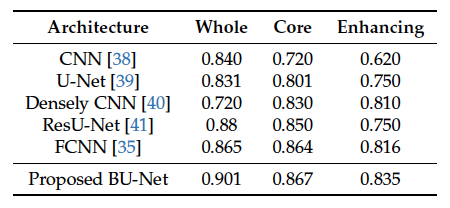

BraTS 2017 HGG data를 이용한 결과이다. BU-net이 제일 좋은 성능을 보여줌을 알 수 있다. 기존의 U-Net과 비교했을 때 각각 7%, 6.6%, 8.5%의 성능 향상을 보여주었다.

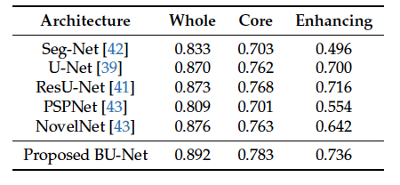

BraTS 2017 dataset (57 MRI scans)을 사용하였다. 2017년의 전체 데이터를 다 사용한 결과, 기존 모델과의 비교에서 BU-net은 종양 및 코어 종양을 향상시키는 데 대해 각각 0.3% 및 0.5%의 성능 증가를 보였다. 최첨단 기술과 BU-Net의 성능 차이는 제안된 모델이 작은 종양 영역을 효과적으로 식별할 수 있다는 사실을 보여준다.

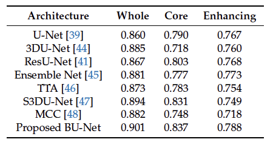

BraTS 2018 validation dataset. (66 MRI scans)을 사용한 결과, BU-net은 다른 모델들에 비해 더 나은 성능을 보여주였다. 이는 모델이 모든 종양의 유형에 대해 거의 대부분 식별할 수 있다는 것을 시사한다.

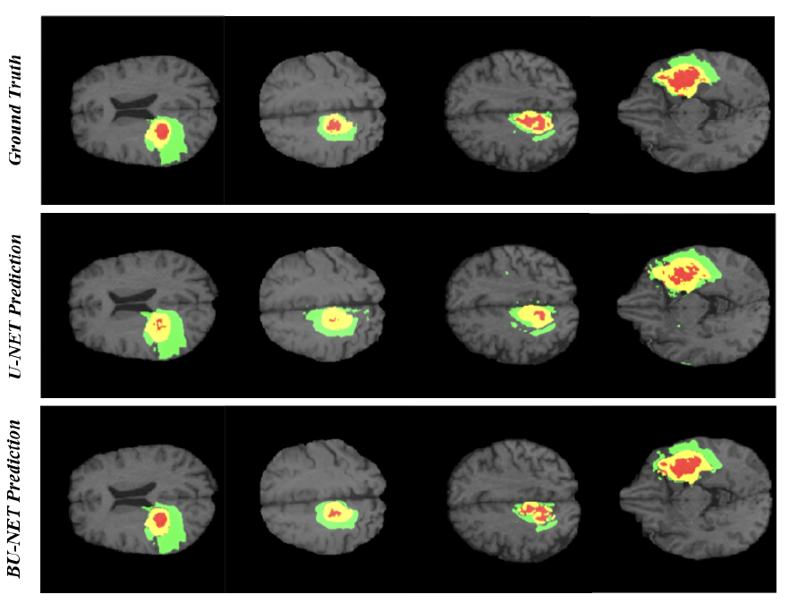

위 그림은 ground truth와 기존의 U-net, BU-net의 각 유형별 이미지를 비교한 것이다.

BU-Net에 의한 예측 영역은 ground truth와 높은 유사도를 보임을 알 수 있다.

U-Net 아키텍처는 괴사 영역의 전체를 식별할 수는 없는 것으로 보인다. BU-Net은 괴사 영역의 대부분을 포함한다는 것을 눈으로 확인할 수 있다.

### 5. Conclusions

Brain tumor segmentation은 MRI의 뇌 이미지가 복잡하기 때문에 굉장히 어려운 작업임에도 불구하고 BU-net이라는 새로운 아키텍쳐를 연구에서는 선보였다. 이는 기존의 U-net에서 새로운 2개의 모듈인 RES와 WC를 추가하여 만들어졌고, 특히나 종양 분할에 좋은 성과를 보였다.

BraTS 2017, 2018의 데이터를 통해 학습과 성능 평가를 진행하였는데, 기존의 모델들에 비해 좋은 성능 향상을 보여주었다.

그럼에도 2D U-Net은 3D U-Net과 비교하면 정보 손실의 한계가 명확하기 때문에, BU-Net은 서로 다른 슬라이스 사이에 세보적인 정보를 잃을 수 밖에 없는 구조이다. 그래서 논문은 분할의 성능을 향상시키기 위해 3D 기반 네트워크를 앞으로 연구의 방향성으로 잡아야한다고 한다.
