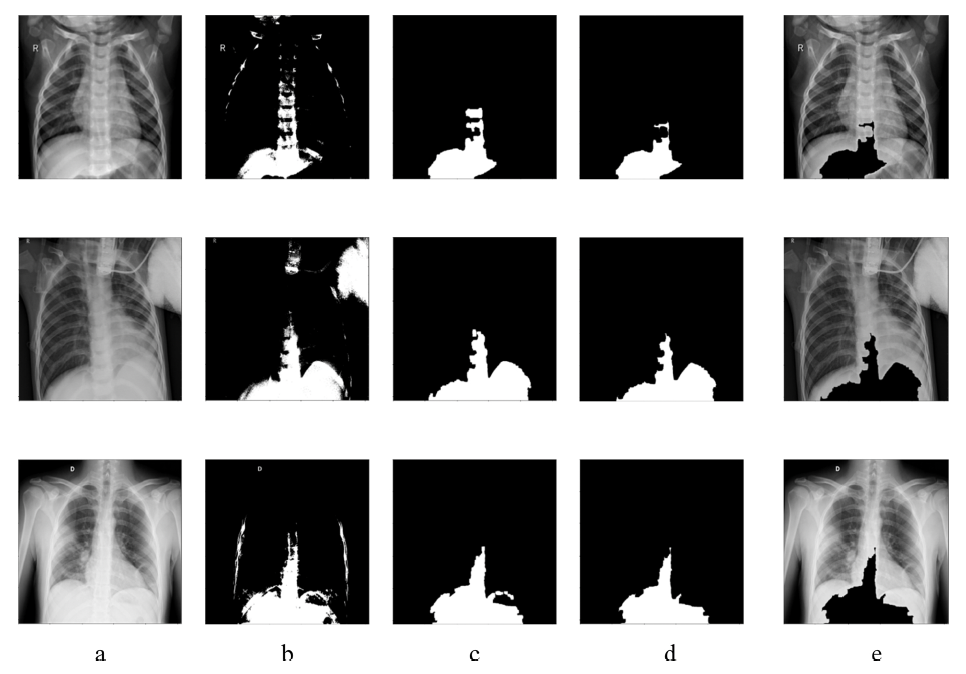
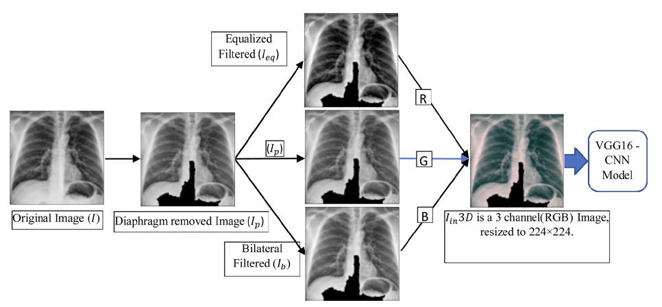
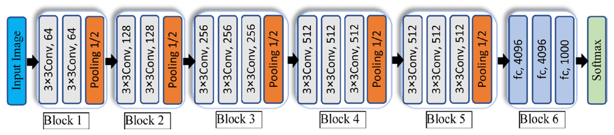
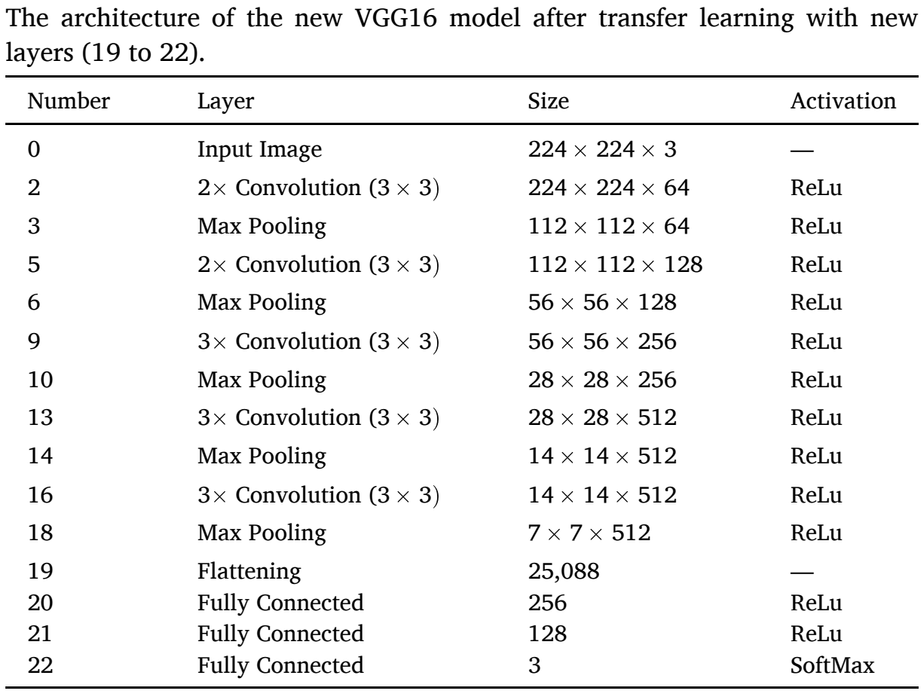
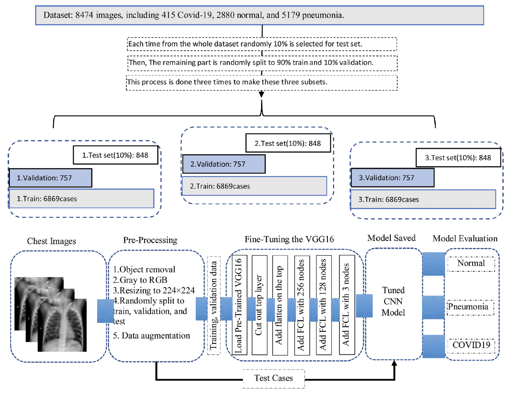
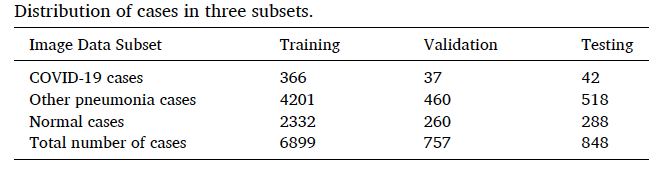
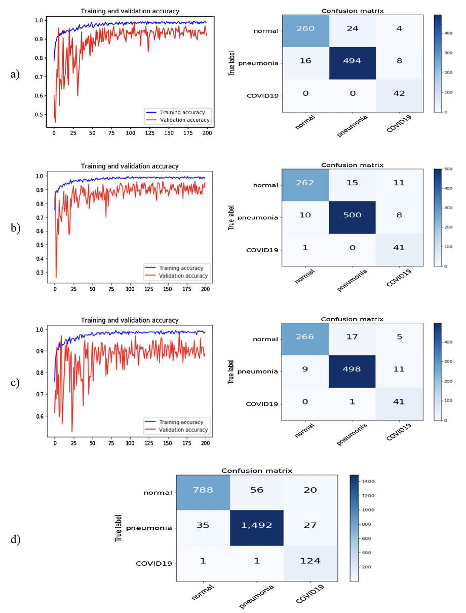
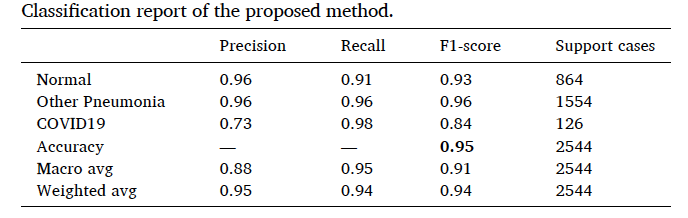
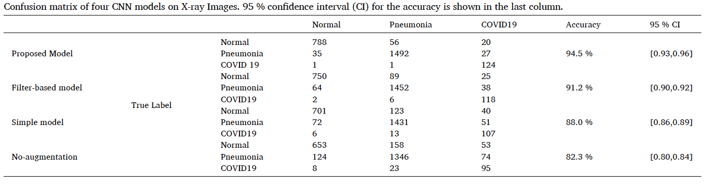
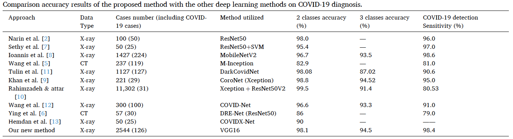

# 02 · 논문 리뷰 — 흉부 X선 COVID-19 분류 CNN과 전처리 알고리즘

[🏠 Portfolio](https://github.com/heoneyzi) › [🩺 Medical](../../../README.md) › [Bu-net](../../README.md) › [Notes](../README.md) › <b>COVID-19 CXR CNN review</b>

> [!NOTE]
> Jiheon's review (Korean, May 2024) of *Improving the performance of CNN to predict the likelihood of COVID-19 using chest X-ray images with preprocessing algorithms*. A medical-imaging preprocessing study read alongside the BU-Net project; all numbers are the <b>paper's</b> reported results.

### 1. Introduction

COVID-19가 발생하면서 인체에서 새로운 호흡기나 심장 등 다양한 위험한 질병들이 새롭게 확인이 되었다. 바이러스에 대한 효과적인 대응방안으로 이와 관련된 Medical image를 다루는 것이 중요하게 여겨졌고, X-ray나 CT 중 더욱 일반적으로 많이 사용되는 X-ray에 대한 이미지를 판독하여 COVID-19에 감염된 폐렴인지 확인할 수 있게 하고자 하였다.

그러나 COVID-19에 감염된 폐렴과 일반적인 폐렴과의 차이점을 찾아 구별하는 것이 어려울 수 있다. 그래서 CAD (computer-aided detection or diagnosis) 체계를 개발하여 질병의 특성을 자동으로 분석하는 도구를 이용하였다. 이는 이미지 전처리, ROIs (segmenting regions of interest), 이미지 식별 등의 단계가 포함될 수 있는 것이다.

그러나 다른 연구에 의하면 ROI 나 미묘한 폐렴의 차이를 식별하는 것이 어렵기 때문에 딥러닝 알고리즘을 이용한 CAD 체계를 개발하는 것이 더욱 효율적임을 보여주었다. 그래서 다양한 논문에서 CNN (convolution neural network)을 CT에 적용시켰고, 더 많은 논문에서는 흉부 X선에 적용시켜 연구를 진행하였다. 기존의 다양한 모델들이 사용되었다.

위의 연구들은 50 \~ 11302건의 총 사례의 개수 중에 COVID-19 사례(25\~224건)를 가진 서로 다른 이미지 세트를 이용하였다. 보고된 COVID-19 사례 감지 민감도는 79.0%–98.6%였다. 선전한 결과에도 불구하고 딥러닝 모델을 최적화하는 과정에 대해 많은 조사가 이루어지지 않았음에 집중하였다. 예를 들어 이미지 전처리 과정은 성능 향상에 도움을 줄 수 있다.

그래서 이 논문에서는 COVID-19에 감염된 폐렴과 일반적인 폐렴과 정상(폐렴 X)의 3가지 케이스를 분류하는 새로운 CAD 체계를 개발하여 테스트하였다. 바로 X-ray를 이용하지 않고 이미지 처리 알고리즘을 적용하였다.

그로 인해서

- 횡격막 영역 내의 대부분을 제거한다.
- 이미지 대비를 정규화한다.
- 이미지 노이즈를 줄인다.
- 미리 학습된 프로세스에서 RGB 영상을 사용하여 사전학습된 기존 딥러닝 모델의 3개 입력 채널에 새로운 색의 이미지를 공급할 수 있다.

이미지 전처리 과정을 이용하는 것이 성능 향상에 도움이 될 것이라는 가정을 입증하기 위해서 위 3개의 class의 사례를 모았다. 그 이후에 잘 학습된 VGG 16을 바탕으로 한 CNN을 CAD 체계의 모델로 잡아서 사용하였다.

### 2. Materials and method

#### 2.1 Dataset

공공의 의료 저장소의 CXR (chest X-ray radiography)의 데이터를 이용하였다.

이 데이터는 8474개의 posteroanterior(PA) 흉부 2D X-ray 이미지로 이루어져 있는데…

- 415개의 COVID-19에 감염된 폐렴
- 5197개의 일반적인 폐렴
- 2880개의 정상(폐렴 X)

의 구성이다.

#### 2.2 Image preprocessing

위의 그림에서 각각의 세로줄은 정상(폐렴 X) / 일반적인 폐렴 / COVID-19에 감염된 폐렴 을 의미한다.

1. (a)의 사진은 횡격막 부분의 사진을 보여준다. 고밀도의 부분은 밝은 색으로 표현이 된다. 그러나 이 사진으로는 학습 모델에 넣어 규칙을 찾고 정량화하기는 어렵다. 그래서 전처리 알고리즘을 사용한다.
2.  가장 밝고 어두운 밝기를 $`Vmax, Vmin`$이라고 한다면 $`T = V_{min} + 0.9 × (V_{max} - V_{min})`$이라는 값을 임계값으로 잡아 영상을 흑백(바이너리 이미지)으로 분류한다. 사진 (b)이다.
3. 바이너리 이미지에서 모든 연결된 영역을 라벨링하여 CAD를 이용해 가장 큰 부분을 찾아서 안에 빈공간이 있으면 채우고, 나머지 부분은 제거한다. 사진 (c)이다.
4. 그렇게 나온 사진 (c)의 영역에서 필터를 이용하여 경계의 부분을 부드럽게 만들어준다. 사진 (d)이다.
5. 그렇게 만들어진 사진 (d)의 이미지를 원래의 사진 (a)에 매핑하고, 사진 (a)의 중첩된 부분을 제거하여 사진 (e)와 같은 형식으로 만든다. 이 사진 (e)의 형태를 논문에서는 앞으로 $`I_p`$라고 부른다.

위의 과정에서 $`I_p`$를 만들게 되었다. 이제 검은색, 흰색에서 벗어나 RGB색을 이용해서 CNN에 finetunig하기 적합한 3개의 채널 이미지로 전환을 한다.

이를 위해 <ins><b><i>noise filtering method</i></b></ins> 와 <ins><b><i>contrast normalization method</i></b></ins> 을 이미지를 전처리하고 제거한다.

1. X-ray 이미지에는 추가적인 노이즈가 있기 때문에 이를 <ins><b><i>bilateral low-pass filter (BF)</i></b></ins>를  $`I_p`$에 적용한다. 이는 필터가 근처의 밀도값을 분석하고, 밀도 변화를 고려해 주변의 픽셀의 밀도값의 평균으로 로컬 영역의 밀도값을 대체하는 과정을 이야기한다. 가중치는 <ins><b><i>Gaussian low-pass filter</i></b></ins>를 이용하였다. <ins>실험 결과를 기반으로 bilateral filtering에서 다음과 같은 파파라미터를 선택한다(= 9 및 σ = 75). </ins>(bilateral low-pass filter는 비선형 필터이며, 다른 low-pass 필터에 비해서 텍스트이 정보를 보존하면서 노이즈 제거에 효과적이다.)
2. 환자의 신체 크기나 X-ray 양에 따라 흉부 X-ray 이미지가 밝기가 다르거나 대비가 생길 수 있다. 이런 부정적 영향을 줄이기 위해서 <ins><b><i>histogram equalization (HE) method</i></b></ins> 를 이용해서  $`I_p`$의 이미지를 정규화하였다. 이 필터는 COVID- 19 감염에 관련된 특성 파악에 도움을 줄 수 있다.

위의 그림을 보면 3개의 전처리가 이루어진 이미지($`I_p, I_b = BF(I_p), I_{eq}= HE(I_p)`$)가 3개의 채널(RGB)에 들어가면서 새로운 가상의 색을 형성한다.

#### 2.3 Transfer learning

논문에서는 transfer learning approach를 이용한다. 이는 이전의 연구에서 이미 대규모 데이터로 학습된 CNN을 활용함으로써 적은 dataset으로 overfitting이나 underfitting의 상황을 피할 수 있음을 보여줬기 때문이다.

여기서는 1400만 개 이상의 이미지로 ImageNet Large Scale Visual Recognition Challenge(ILSVRC)에서 사전 학습된 VGG 16을 사용하였다. 높은 성능을 보여준다.

그림과 같이 VGG 16은 총 6개의 block으로써 13개의 convolutions, 5개의 max pooling, 3개의 fully connection layer로 이루어져 있다. 1억3800개 이상의 파라미터로 이루어져있다고 한다.

- 전면 혹은 낮은 layer의 all connected nodes의 가중치는 변하지 않도록 고정하였다. (Block 1\~5)
- Block 6에서는 256개 노드를 포함하는 1개의 flatten layer과 128개 노드를 포함하는 2개의 fully connected layer로 수정해 사용하였다. <ins><b><i>ReLU</i></b></ins>(rectified linear unit)을 활성화 함수로 사용한다.
- 수정된 모델에서 학습 가능한 가중치의 모든 연결된 노드를 흉부 X-ray 이미지를 이용해 finetuning을 진행한다. 이때 학습률은 10\^(-5)로 작게 잡아 사전학습 된 파라미터에 약간의 변화만 준다. 이로써 극적인 변화를 방지해 overfitting을 방지하고 흉부 X-ray 이미지의 특수성을 입히게 된다.
- 마지막으로 분류 layer에서는 Softmax를 활성화 함수로 이용한다.
    이 모델은 위의 과정을 거쳐 3가지 케이스로 분류를 하게 된다. 이 CNN은 배치 크기는 4, 최대 에포크는 200인 Adam optimizer로 컴파일된다. 그리고 5 에포크마다 0.8의 계수로 학습률을 줄이기 위한 <ins><b><i>validation loss</i></b></ins>를 검사한다.

    

#### 2.4 Model training and testing

- VGG 16은 224×224 픽셀의 이미지로 사전학습이 되어있는데, 1024×1024 픽셀인 X-ray 이미지를 맞추기 위해서 <ins><b><i>down-sampling</i></b></ins>을 진행하여 224×224로 맞추었다.

- 데이터를 training, validation, testing으로 3가지로 무작위로 나눈다. 비율은 약 81%, 9%, 10%이다.

-  데이터의 분균형을 완화하기 위해서 다양한 방법을 사용하였다.
    - $`ω_i=(Totalnumberof cases)/(numberof classes)×(numberof casesinclass(i))`$ 를 사용해서 loss function에서 더 적은 개수를 가진class를 더 큰 값을 할당해 weighted average가 되도록 한다.
    - <ins><b><i>common augmentation technique</i></b></ins>을 이용해서 학습 샘플 사이즈를 늘렸다.
        - shearing factors (≤0.2) - 반시계 방향으로 shearing angle을 잡아 image intensity를 전단
        - zooming factors (≤0.2) - 영상을 무작위로 확대
        - rotation factors (±20◦ 이내) - 영상을 무작위로 회전
        - shift factor (≤0.2) - 영상을 상하좌우로 이동
        - 수평으로 뒤집기

        위의 방법으로 가능한 많은 샘플을 만들었다.
- 학습하는 동안 <ins><b><i>optimizer</i></b></ins>는 훈련과 검증 사이의 성능 격차를 줄이기 위해 아키텍처가 점점 더 많은 정보를 학습하도록 강제하려고 한다.

overfitting과 학습 효율을 위해서 에포크 수를 200으로 제한하고, 훈련이 끝난 모델을 저장해 테스트가 진행이 된다.

평향을 줄이기 위해서 데이터를 training, validation, testing으로 무작위로 나누는 과정을 3번 반복하면서 진행한다.

#### 2.5 Performance assessment

2가지의 정확도로 측정하였다.

- 3가지 클래스(COVID-19에 감염된 폐렴, 일반적인 폐렴, 정상(폐렴 X))의 분류 정확도
    - macro averaging
        $`A_{mac} = A_1 + A_2 + A_3`$

        클래스의 개수나 비율을 고려하지 않은 가중치가 들어가지 않은 평균이다.
    - weighting averaging
        $`A_{w} = w_1A_1 + w_2A_2 + w_3A_3`$

        클래스의 개수나 비율을 고려해 가중치가 들어간 평균이다.
    - <ins><b><i>confusion matrix</i></b></ins>
        CAD 성능을 평가하기 위해서 matrix가 만들어지는데 이는 정확도, recall, F1 점수, Cohen’s Kappa 등이 들어간다.

        Cohen’s Kappa는 0\~1의 값을 가지는데 1에 가까우면 유사성이 높고, 0에 가까우면 무작위성이 높다.
- COVID-19와 non-COVID-19의 분류 정확도
    TP: COVID-19로 알맞게 분류

    FN: COVID-19로 잘못 분류

    TN:  non-COVID-19로 알맞게 분류

    FP: non-COVID-19로 잘못 분류

    로 계산하여 정확도, 민감도, 특이도, 리콜, F1 점수가 계산되고 표로 작성된다.

### 3.  Results

위 3개의 각 행은 그래프는 3번의 다른 학습과 검증 데이터를 이용해 실험한 자료이다. 왼쪽 열의 그래프는 학습 정확도와 검증 정확도를 보여준 것이다. 이는 처음에는 검증 정확도가 크게 흔들리다가 75 에포크가 지나면 더 높은 정확도로 수렴하는 것을 보여준다. 이를 통해 에포크 수가 커지면 검증 정확도가 학습 정확도를 따라간다고 볼 수 있다. 그리고 그래프를 보면 논문의 방법이 overfitting과 underfitting을 겪지 않음을 보여주기도 한다.

오른쪽 열은 독립적인 3개의 테스트 집합의 행렬을 합쳐놓은 3개 class의 confusion matrix를 보여준다. 각각의 3번의 정확도는 (a), (b), (c) 차례로 93.9 % (796/848), 94.7 % (803/848), 94.9 % (805/848)를 보여준다.

제일 마지막 (d)는 3개를 모두 합친 결과로써 94.5 % (2404/2544)의 정확도이며, 95% 신뢰구간은 \[0.93, 0.96\]이다. 추가로 Cohen’s kappa 계수는 0.89로 높은 모델에 적용한 새로운 방안이 높은 신뢰도를 보여줌을 알 수 있다. 위 표의 결과도 함께 수치를 알 수 있었다.

그리고 COVID-19와 non-COVID-19를 분류하는 정확도는 (d)를 확인하면 CAD 체계에서 COVID-19 탐지도는 98.4% (124/126)를 보여주며, non-COVID-19 탐지도는 98.0% (2371/2418)를 보여준다. 그럼으로 총 정확도는 98.1% (2495/2544)이다.

- 제안된 모델의 정확도는 위에 언급한 것과 동일하다. 정확도 82.3%, kappa 계수 0.89이다.
- data augmentation이 없는 경우 정확도는 82.3%이며, kappa 계수는 0.71이다.
- 이미지 전처리를 하지 않고 바로 이미지 데이터를 넣은 경우 (Simple model)의 정확도는 88.0%, kappa계수는 0.75이다.
- 이미지 필터링과 가상 색 이미지를 사용하되, 횡격막 부분의 불필요한 대부분을 제거하는 과정을 제외한 (Filter-based model)의 경우에 정확도는 91.2%, kappa 계수는 0.83이다.

이를 통해 data augmentation과 2단계의 이미지 전처리 과정이 성능 향상에 유효함을 알 수 있었다.

위의 표는 논문의 모델과 당시 최근 문헌에 들어간 다른 10개의 모델을 비교하였다.

데이터 양식과 개수를 포함하고 있는데, 물론 다양한 다른 데이터 종류를 이용해 직접적인 비교는 어렵워도 본 논문이 큰 데이터 셋을 이용하였음을 알 수 있다. 또한 다른 모델과 비교해도 좋은 성능을 보여줌을 알 수 있다.

### 4. Discussion

본 논문에서는 COVID-19 감염 페렴을 흉부 X-ray 이미지를 통해 분류하고자 새로운 deep transfer learning CNN 모델을 개발하고 테스트하였다.

이 논문은 다른 연구와의 차별점을 가지고 있다고 말한다.

- CNN 모델을 학습하기 위해서 8474개라는 비교적 많은 이미지를 사용했으나, 그럼에도 데이터의 개수가 불균형했다. (COVID-19 감염 폐렴 이미지가 415개로 적었다.) 따라서 class에 따라 가중치를 둬 완화를 하였고, 이를 잘 학습된 VGG16 모델에 transfer learning로 적용하였다. 결과를 통해 transfer learning 높은 성능을 산출함을 보여주었다.
- 일반적인 X-ray는 gray-level 이미지이다. 논문에서는 2개의 새로운 gray-level 이미지(bilateral low-pass filter 과 histogram equalization)를 만들었고, 이를 본래 이미지와 함께 서로 다른 3개를 CNN의 RGB 색 채널에 넣었다. 결과를 보면 사용하지 않은 것에 비해 정확도가 91.2%에서 94.5%로 올랐고, kappa 계수도 0.83에서 0.89로 올랐다. 이는 3개의 입력 채널을 이용하는 것이 추가한 2개의 이미지에서 새로운 정보를 얻어 성능이 향상되었음을 알려준다.
- 이미지 전처리 알고리즘을 사용하여 횡격막 영역의 대부분의 불필요한 부분을 제거하는 과정을 거쳤다. 결과를 보면 횡격막 영역의 제거 단계를 거치지 않은 모델보다 88.0%에서 94.5%로 정확도가 상승하고, kappa 계수도 0.75에서 0.89로 올랐다. 이는 이미지 전처리 과정이나 이미지 분할 과정이 모델의 성능과 견고함을 높이는데 중요한 역할을 한다는 것을 알 수 있다.
- 논문에서는 data augmentation을 사용해 데이터의 개수를 늘렸다. 결과를 보면 data augmentation을 사용하지 않은 모델은 정확도가 82.3%로 크게 감소함을 볼 수 있었다. 이를 통해 개수가 적거나 불균형한 데이터 셋을 어떻게 이미지 전처리를 할 수 있는지 본 논문이 소개하고 있다고 볼 수 있다.

그럼에도 한계를 가지고 있다.

- COVID-19 감염 폐렴 이미지가 415개를 포함한 8474개의 데이터로 학습하고 테스트를 진행했지만, 확실한 CAD의 성능 검증을 위해서는 더 많고 일반적인 데이터 셋이 필요하다.
- 2개의 추가적인 X-ray 이미지를 생성해 채널에 넣었는데, 이것이 최적의 방법인지는 새로운 조사와 연구가 필요한 부분이다.
- 모델의 성능 향상을 위해서 횡격막과 폐 부분의 영역을 더욱 정확하게 제거하는 이미지 처리, 이미지 분할 알고리즘의 개발과 연구가 필요하다.

향후의 이러한 연구의 방향성으로 작업을 통해 극복해야 한다고 말하고 있다.

### 5. Conclusion

연구에서 흉부 X-ray 이미지를 통해 COVID-19를 탐지, 분류하는 transfer deep learning CNN 모델을 새롭게 개발하였다.

논문에서 더 질 좋은 이미지 데이터를 만들기 위해서 영역을 제거, image contrast-to-noise 비율 정규화, 가상의 색을 생성해 3개의 채널에 입력 등의 방법을 통해 더 높은 성능을 유도하고 최적화할 수 있는 기반을 제공하였다.
