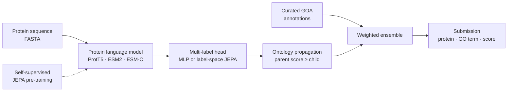
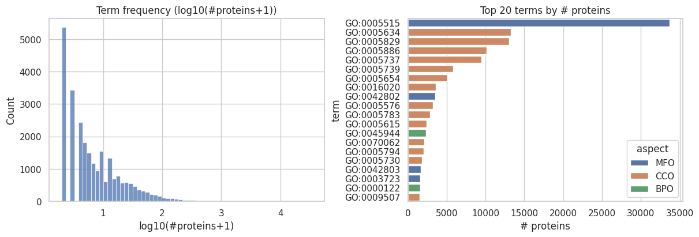
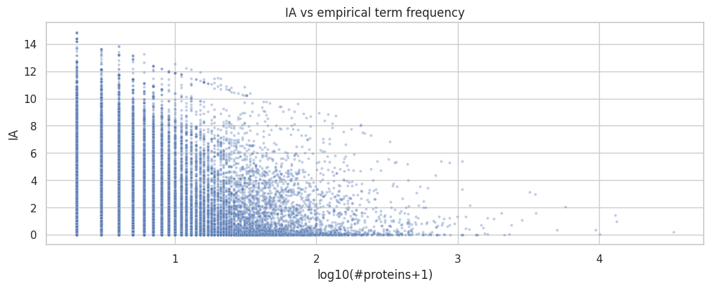

<sub>[🏠 Portfolio](https://github.com/heoneyzi) › [🩺 Medical](../README.md) › **CAFA6**</sub>

<div align="center">

# 🧬 CAFA 6 — protein function prediction with the Gene Ontology

**Given only a protein's amino-acid sequence, which of ~26,000 Gene Ontology functions does it carry?**

[](#-experiments--results)
[](https://www.kaggle.com/competitions/cafa-6-protein-function-prediction)


[💻 Code (Jiheon's fork)](https://github.com/heoneyzi/CAFA6) · [🔗 Team repository](https://github.com/SOL1archive/CAFA6) · [🏁 Competition](https://www.kaggle.com/competitions/cafa-6-protein-function-prediction) · [📓 Team notes](https://github.com/heoneyzi/Study/blob/main/Genomics/season1_functional_genomics/cafa6/README.md)

</div>

> [!TIP]
> **TL;DR** — CAFA 6 asks for a protein's functions, written as Gene Ontology (GO) terms, from its sequence alone: a hierarchical, extreme multi-label problem scored by information-accretion-weighted F-max. The five-person team trained on **82,404** labelled proteins and predicted for a **224,309-protein** test superset, exploring protein-language-model pipelines (ProtT5 fine-tuning, ESM-C embeddings, JEPA pre-training, a label-space JEPA) plus ontology-aware GOA ensembling — and finished with a **bronze medal**. Jiheon was a team member; his documented line was the **ProtT5 (T5) branch**.

<details>
<summary><b>🇰🇷 한국어 요약</b></summary>

CAFA 6는 단백질의 아미노산 서열만 보고 그 단백질이 하는 일을 Gene Ontology(GO)라는 표준 용어로 맞히는 국제 단백질 기능 예측 챌린지(Kaggle)입니다. 단백질을 "20가지 글자로 쓴 긴 문장"이라고 하면, GO는 그 문장이 무슨 뜻인지 적는 사전이고, 한 문장에 뜻(라벨)이 여러 개 붙습니다. 도서관 분류에 비유하면 "프로그래밍 › 파이썬" 태그를 붙인 책에는 "프로그래밍" 태그도 자동으로 붙어야 하듯, GO도 하위 기능을 가지면 상위 기능을 모두 가져야 하는 계층 구조(DAG)입니다. 평가는 희귀하고 구체적인 기능을 맞힐수록 점수를 더 주는 IA 가중 F-max로, 분자 기능(MF)·생물학적 과정(BP)·세포 내 위치(CC) 세 영역을 따로 채점해 평균합니다. 5인 팀(팀장 조윤진)은 82,404개 학습 단백질로 ProtT5·ESM-C·JEPA 기반 파이프라인과 GOA 앙상블을 시도했고, 224,309개 테스트 상위집합에 대한 예측으로 **동메달**을 받았습니다. 지헌은 팀원으로서 역할 분담에서 **ProtT5(T5) 라인과 T5 임베딩 비교 실험**을 맡았고, 데이터셋 정리·아이디어 노트를 작성했으며, 이후 공개 포크의 재현 문서를 코드 기준으로 정리했습니다. 어떤 제출이 메달 점수를 냈는지와 T5 비교 실험의 수치는 보관된 자료에 남아 있지 않습니다.

</details>

| | |
|---|---|
| **Period** | Jan – Feb 2026 (team kick-off 17 Jan; final submission deadline 2 Feb 2026) |
| **Team** | 5 people — Yoonjin Cho (**Team Lead**), Jiheon Kang, Minseon Koo, Subin Park, Yumin Jung |
| **My role** | **Team Member** — took the ProtT5 (“T5”) branch in the team's role split and a T5-embedding comparison experiment (meeting notes, 21 & 29 Jan 2026); wrote the dataset walkthrough and idea notes; later re-documented the public fork against the code (3 commits, Sep 2026) |
| **Stack** | PyTorch · Hugging Face Transformers (ProtT5-XL, ESM2) · ESM SDK (ESM-C) · pandas · NetworkX · SLURM · uv |
| **Status** | ✅ Completed — Bronze Medal (CV) |

<p align="center"></p>
<p align="center"><sub>Figure: the label space at a glance — numbers from the team EDA notebook (<code>code/eda.ipynb</code>), redrawn by <code>assets/make_hero.py</code>.</sub></p>

## 🧭 Why it matters

Sequencing has made protein *sequences* cheap, but experimentally confirming what each protein *does* is slow, so most known protein sequences have no experimentally confirmed function. **Gene Ontology (GO)** is the shared vocabulary for function, split into three sub-ontologies: **MF** (molecular function — e.g. binding, catalysis), **BP** (biological process — e.g. DNA repair) and **CC** (cellular component — where it acts, e.g. the nucleus). GO is a directed acyclic graph: a protein with a specific term implicitly has all its ancestors (the *true-path rule*), so predictions must be hierarchy-consistent. One protein can carry many terms (up to 233 in the training set) while most terms are rare — an **extreme multi-label** problem.

CAFA is *prospective*: the hidden test set is the subset of the 224,309 superset proteins that gain new experimental annotations after the deadline. Scoring uses **IA-weighted F-max** — for every score threshold $t$, compute precision and recall over predicted vs. true terms, weighting each term by its **information accretion (IA)** (rare, specific terms count more; roots count 0), take the best $F_1$ over $t$, do this separately for MF, BP and CC, and average:

$$F_{\max}=\max_{t}\ \frac{2\,\mathrm{pr}_{IA}(t)\,\mathrm{rc}_{IA}(t)}{\mathrm{pr}_{IA}(t)+\mathrm{rc}_{IA}(t)}$$

## 🛠️ Approach



- **Represent** each sequence with a pretrained protein language model (pLM): ProtT5-XL (last two blocks fine-tuned), ESM2-650M (frozen backbone) or ESM-C 300M (frozen embeddings, three pooling modes).
- **Predict** thousands of GO terms at once with a sigmoid multi-label head; the label-space JEPA adds a self-supervised loss that predicts *masked GO labels* in an embedding space, and the JEPA encoder line pre-trains the pLM itself with span masking.
- **Respect the hierarchy** by raising every parent term to at least its children's best score (the true-path rule); the GOA ensemble additionally pulls over-confident children toward their ancestors (“negative propagation”).
- **Ensemble** with curated GOA annotations (the public GOA + ProtT5 notebook the team studied) and cap each protein at ≤ 1,500 terms, as the rules require.

## 🔬 Experiments & results

| # | Question | Setup | Key result | Folder |
|---|---|---|---|---|
| P0 | What does the data look like? | Team EDA notebook over the 8 competition files | **82,404** train / **224,309** test-superset proteins; **26,125** labelled GO terms; **537,027** annotations (BP 250,805 · CC 157,770 · MF 128,452); all 82,404 training IDs reappear in the superset; 1,381 train taxa vs 8,453 test taxa | [00_eda](pipelines/00_eda/README.md) |
| P1 | Can a partly fine-tuned ProtT5 score GO terms per sub-ontology? *(Jiheon's T5 line)* | ProtT5-XL, last 2 encoder blocks unfrozen, masked mean-pooling + MLP; top 4,096 terms with ≥ 5 proteins; separate MF/BP/CC models; parent propagation at inference | Pipeline archived; **no validation or leaderboard score was saved** | [01_prott5_classifier](pipelines/01_prott5_classifier/README.md) |
| P2 | How far does GOA + model ensembling go? | Public Kaggle notebook: 0.55 × GOA + 0.45 × ProtT5/InterPro, positive + negative propagation, power scaling, top-200 terms | The notebook's author reports **0.370** (public LB) — a community result the team studied, **not re-run here** | [02_goa_prott5_ensemble](pipelines/02_goa_prott5_ensemble/README.md) |
| P3 | Do frozen ESM-C embeddings + MLP heads suffice? Which pooling? | ESM-C 300M; mean / mean⊕max / CLS pooling; 5-fold CV; BCE with negative sampling | Early runs: fold-level micro-F1 ≈ **0.02** (unweighted, best grid threshold t = 0.4) — judged too weak; team moved toward late fusion | [03_esm_c](pipelines/03_esm_c/README.md) |
| P4 | Does JEPA pre-training on the task's own sequences help? | Span masking (8–128 residues) with an EMA target encoder on train + test FASTA; frozen encoder + MLP head | Pipeline archived; no score saved | [04_jepa_encoder](pipelines/04_jepa_encoder/README.md) |
| P5 | Can predicting masked GO labels regularize the classifier? | ESM2-650M, 60 % context / 40 % target labels, EMA label embeddings, cosine JEPA loss + BCE; optional propagation & consistency | First JEPA submission: **0.139** public LB | [05_label_space_jepa](pipelines/05_label_space_jepa/README.md) |

Numbers come from `code/eda.ipynb` (P0), the notebook header in `code/notebooks/cafa-6-goa-prott5-ensemble-0-370.ipynb` (P2) and screenshots in the teammates' Notion pages — [Yoonjin Cho's ESM-C attempt](https://github.com/heoneyzi/Study/blob/main/Genomics/season1_functional_genomics/cafa6/05_yoonjin_code_attempt1.md) (P3) and [Subin Park's JEPA trial](https://github.com/heoneyzi/Study/blob/main/Genomics/season1_functional_genomics/cafa6/07_subin_cafa6_jepa.md) (P5). Public-leaderboard scores cover only a small part of the test superset and are not the final prospective evaluation.

<table><tr>
<td align="center" width="50%"><br><sub>Most GO terms label only a few proteins (<code>code/eda.ipynb</code>).</sub></td>
<td align="center" width="50%"><br><sub>Rarer terms carry higher IA weight, so they dominate the metric.</sub></td>
</tr></table>

## 🙋 My contribution

- **ProtT5 (T5) branch.** In the role split of the [3rd team meeting](https://github.com/heoneyzi/Study/blob/main/Genomics/season1_functional_genomics/meetings/03_meeting03_2026-01-21.md) (21 Jan 2026: "유민 GO retriever · 윤진 ESM-C · 지헌 T5") Jiheon took the T5 line, and the [4th meeting](https://github.com/heoneyzi/Study/blob/main/Genomics/season1_functional_genomics/meetings/04_meeting04_2026-01-29.md) (29 Jan) assigned him a **T5-embedding comparison experiment**. The team repository's ProtT5 classifier ([P1](pipelines/01_prott5_classifier/README.md)) implements this line. All upstream commits were pushed from the team maintainer's account, so file-level authorship is not recorded in git, and no T5 comparison numbers were archived.
- **Data walkthrough and ideas.** Wrote notes on the eight competition files, the GO hierarchy and the IA metric, and an idea log that develops a teammate's GOA/tokenization proposal and adds his own (matching against GO term text, a $y_{parent} \ge y_{child}$ loss constraint) — [notes/](notes/README.md).
- **Public fork documentation (Sep 2026).** Three commits on [heoneyzi/CAFA6](https://github.com/heoneyzi/CAFA6) that checked the docs against the code: real entry points and module paths, CLI-vs-SLURM defaults, metric signatures, data layout and an EN/KO GOA-ensemble reproduction guide, with an explicit [release scope](code/docs/en/release_scope.md).
- **Team credit.** Yoonjin Cho led the team and the ESM-C/GCN line, Subin Park the JEPA and label-space JEPA lines, Yumin Jung the GO-retriever and public-solution survey; Minseon Koo was a team member (per the archived meeting notes).

## 🗂️ Repository map

```text
CAFA6/
├── README.md                  ← you are here
├── assets/                    ← hero figure + the script that draws it
├── pipelines/                 ← one README per pipeline (P0–P5): question, setup, files, status
├── code/                      ← team source snapshot from the fork (import layout preserved)
│   ├── src/                   ← common/, train/ + test/ (ProtT5), esm-c_model/, jepa_go/, pretrain/, jepa_pipeline/
│   ├── notebooks/ · eda.ipynb ← ProtT5 notebook, GOA ensemble notebook, EDA with outputs
│   ├── scripts/ · job-scripts/ · configs/
│   ├── docs/                  ← task spec, dataset guide, pipeline guide (EN/KO)
│   └── pyproject.toml · uv.lock
└── notes/                     ← Jiheon's Notion notes (Korean): dataset walkthrough, ideas
```

## ♻️ Reproduce

```bash
cd code
uv sync --frozen && source .venv/bin/activate      # Python ≥ 3.12, PyTorch ≥ 2.9.1
# put the Kaggle CAFA 6 files under data/ (see code/docs/en/dataset_description.md)
python -m src.train.prott5_go_train --namespace MF --out models/prott5-go-mf \
       --min_label_count 5 --max_labels 4096 --freeze_encoder false --unfreeze_last_n_layers 2
python -m src.test.prott5_go_predict --model-dir models/prott5-go-mf \
       --test-fasta data/Test/testsuperset.fasta --out submissions/prott5.tsv \
       --obo data/Train/go-basic.obo --propagate
```

Data, pretrained weights and checkpoints are **not included** — download the competition files from [Kaggle](https://www.kaggle.com/competitions/cafa-6-protein-function-prediction/data). Each pipeline README lists its own entry points; the SLURM scripts keep the original cluster settings with the server path replaced by `/path/to/cafa6`.

> [!IMPORTANT]
> **Scope notes**
> - The **bronze medal** is recorded on Jiheon's CV; the final score, rank, and which team submission earned it are not in the archived sources.
> - No pipeline was re-trained or re-scored for this portfolio. The only saved metrics are the early ESM-C fold scores and one public-LB score for the JEPA submission — both exploratory.
> - The **0.370** attached to the GOA + ProtT5 notebook is the public notebook author's reported score, using externally shared prediction files; it is not a team result.
> - Jiheon's documented part is the ProtT5 line and the notes/docs listed above; the JEPA, ESM-C and GO-retriever lines are teammates' work.

## 🔗 Links

- Jiheon's fork: [heoneyzi/CAFA6](https://github.com/heoneyzi/CAFA6) · team repository: [SOL1archive/CAFA6](https://github.com/SOL1archive/CAFA6) (upstream README states MIT; no LICENSE file in the checkout)
- Competition: [CAFA 6 Protein Function Prediction](https://www.kaggle.com/competitions/cafa-6-protein-function-prediction) · task summary: [code/docs/en/task_specification.md](code/docs/en/task_specification.md)
- Team meeting notes and teammates' trial pages: [CAFA 6 notes](https://github.com/heoneyzi/Study/blob/main/Genomics/season1_functional_genomics/cafa6/README.md) · [meeting notes](https://github.com/heoneyzi/Study/blob/main/Genomics/season1_functional_genomics/meetings/README.md) in [03_Study/Genomics](https://github.com/heoneyzi/Study/blob/main/Genomics/README.md)
- Related in this portfolio: [01_Medical/VCC_2026](../VCC_2026/README.md) (the Functional Genomics project's follow-up challenge) · [01_Medical/GDTR](../GDTR/README.md)

---
<sub>[← Prev: PhenoFocus](../PhenoFocus/README.md) · [🏠 Portfolio](https://github.com/heoneyzi) · [Next: VCC 2026 →](../VCC_2026/README.md)</sub>
