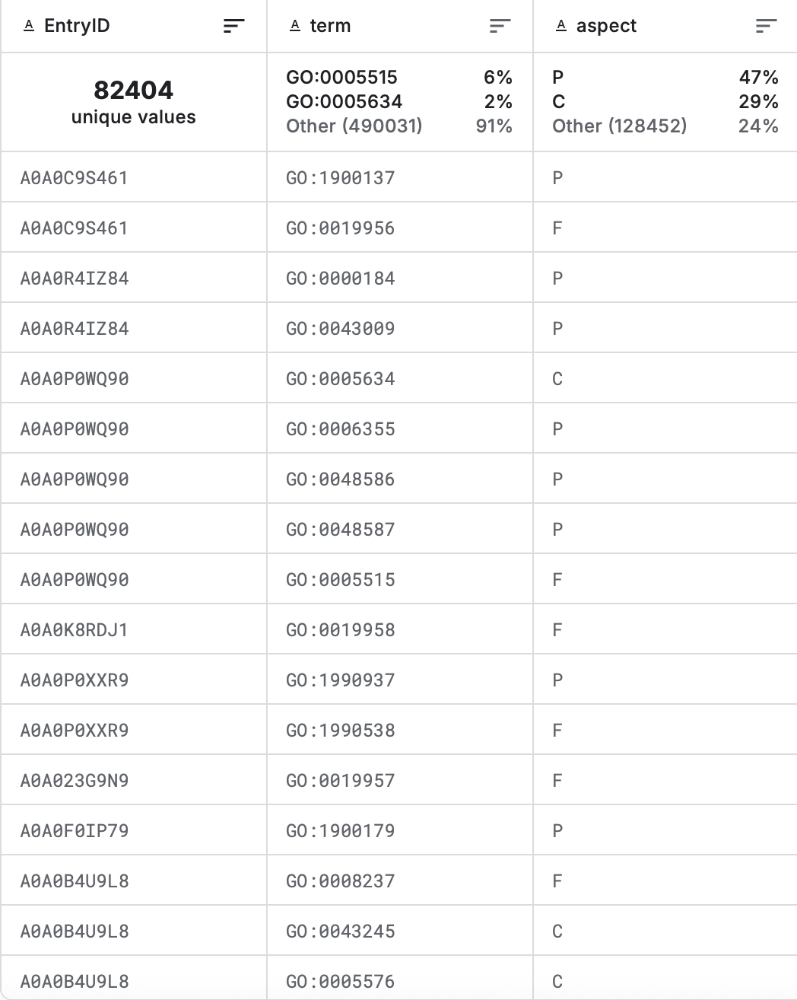
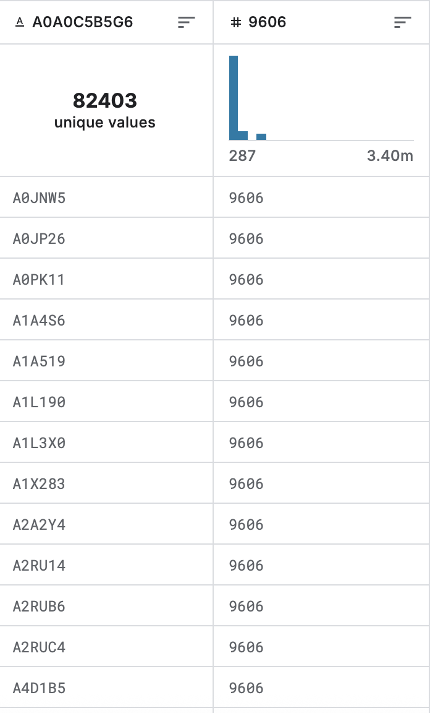
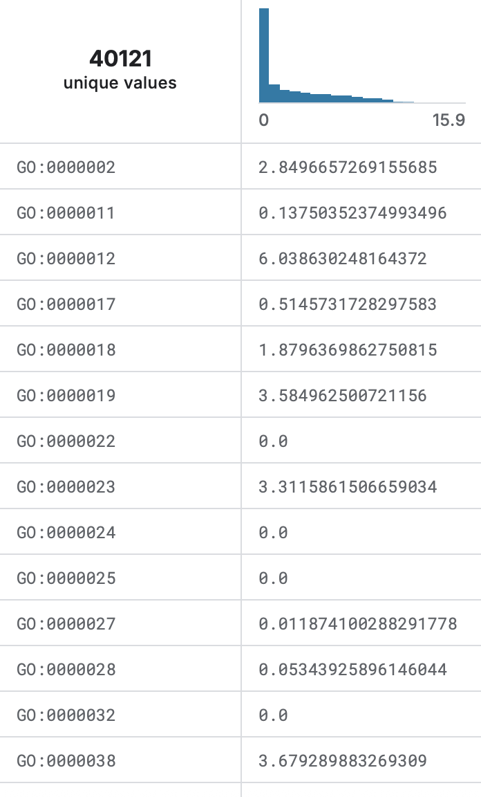
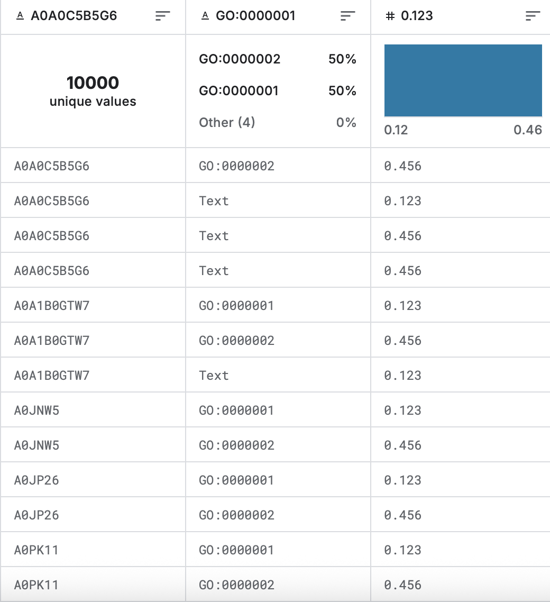

# 01 · 데이터셋 정리 (CAFA 6 대회 파일 구조)

<sub>[🏠 Portfolio](https://github.com/heoneyzi) › [🩺 Medical](../../README.md) › [CAFA6](../README.md) › [Notes](README.md) › **데이터셋 정리**</sub>

> [!NOTE]
> Converted from Jiheon's Notion page (Korean). Verified dataset counts from the team's EDA notebook are summarised in the [CAFA6 README](../README.md#-experiments--results).

- `train_sequences.fasta` – amino acid sequences for proteins in the training set
- `train_terms.tsv` – the training set of proteins and corresponding annotated GO terms
- `train_taxonomy.tsv` – taxon IDs for proteins in the training set
- `go-basic.obo` – ontology graph structure
- `testsuperset.fasta` – amino acid sequences for proteins on which predictions should be made
- `testsuperset-taxon-list.tsv` – taxon IDs for proteins in the test superset
- `IA.tsv` – information accretion for each term (used to weight precision and recall)
- `sample_submission.tsv` – sample submission file in the correct format

---

`train_sequences.fasta`

```json
>sp|A0A0C5B5G6|MOTSC_HUMAN Mitochondrial-derived peptide MOTS-c OS=Homo sapiens OX=9606 GN=MT-RNR1 PE=1 SV=1
MRWQEMGYIFYPRKLR
>sp|A0JNW5|BLT3B_HUMAN Bridge-like lipid transfer protein family member 3B OS=Homo sapiens OX=9606 GN=BLTP3B PE=1 SV=2
MAGIIKKQILKHLSRFTKNLSPDKINLSTLKGEGELKNLELDEEVLQNMLDLPTWLAINK
VFCNKASIRIPWTKLKTHPICLSL
...
```

데이터베이스\|고유ID\|식별명 단백질이름 OS=종이름 OX=종ID GN=유전자명 PE=등급 SV=버전<br>아미노산_서열(알파벳)

---

`train_terms.tsv`

<p align="center"></p>

- **EntryID:** 단백질의 고유 식별 번호
- **term:** 해당 단백질에 할당된 **Gene Ontology (GO) Term ID**
- **aspect:** 해당 GO Term이 속한 카테고리를 나타내는 약어
    - **F (Molecular Function, MF):** 분자 수준에서의 기능 (예: 결합, 촉매 활동)
    - **P (Biological Process, BP):** 더 큰 생물학적 목표나 과정 (예: 대사, 세포 분열)
    - **C (Cellular Component, CC):** 단백질이 위치한 세포 내 장소 (예: 핵, 세포질)

GO는 실험에 따라서 꼭 1개나 3개가 아닐 수도 있음. 예를 들어 BP에 대한 내용만 해당 단백질이 연구가 되었을 수도 있는 것. 또한 GO는 그래프 구조이기 때문에, 하나의 구체적인 기능을 수행하면 그에 연결된 상위 부모 기능들도 모두 해당 단백질의 기능도 가지게 된다. <br>예를 들어”단백질 결합”의 기능을 가지면 “결합”의 기능도 가짐

---

`train_taxonomy.tsv`

<p align="center"></p>

단백질이 어떤 종에서 유래되었는지 알 수 있는 파일 (9606:인간)

---

`go-basic.obo`

```json
[Term]
id: GO:0000003
name: obsolete reproduction
namespace: biological_process
alt_id: GO:0019952
alt_id: GO:0050876
def: "OBSOLETE. The production of new individuals that contain some portion of genetic material inherited from one or more parent organisms." [GOC:go_curators, GOC:isa_complete, GOC:jl, ISBN:0198506732]
comment: The reason for obsoletion is that this term is equivalent to reproductive process.
synonym: "reproductive physiological process" EXACT []
is_obsolete: true
replaced_by: GO:0022414
```

GO의 전체적인 계층 구조와 정의를 담고 있는 파일

단백질이 구체적인 기능을 가진다면, 모델은 그 부모 기능도 모두 정답으로 예측해야 함. `go-basic.obo`를 통해 이 연결 고리를 추적할 수 있음.

---

`IA.tsv`

<p align="center"></p>

각 GO term의 희귀성을 가중치로 수치화한 데이터

`IA.tsv` 에서는 해당 GO의 기능을 맞췄을 때 얼마나 많은 점수를 줄지 결정하는 데이터. 평가지표로 사용.

---

`sample_submission.tsv`

<p align="center"></p>

모델이 내야하는 output의 형태.

고유ID\|단백질 기능(GO term / text 형태)\|신뢰도

- Text 형태는 선택사항
