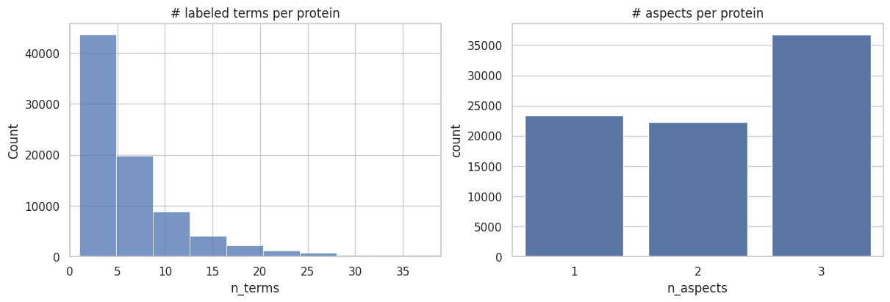
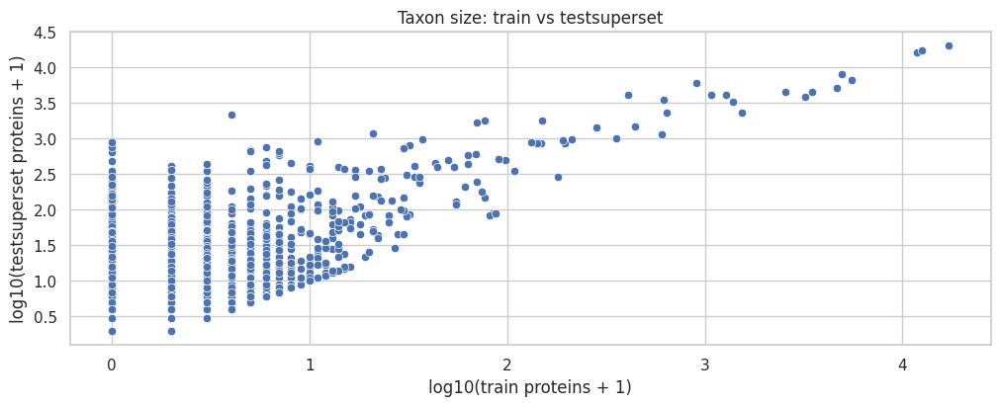
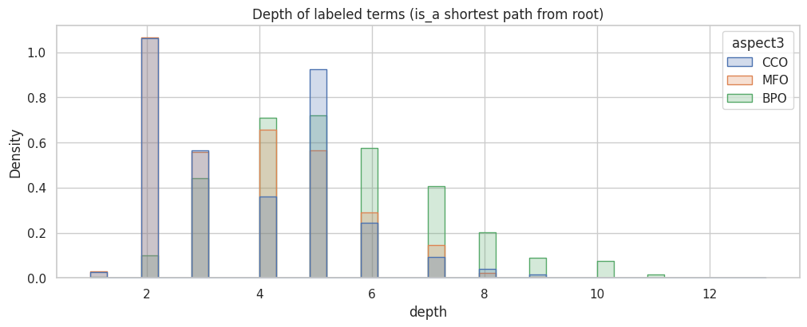
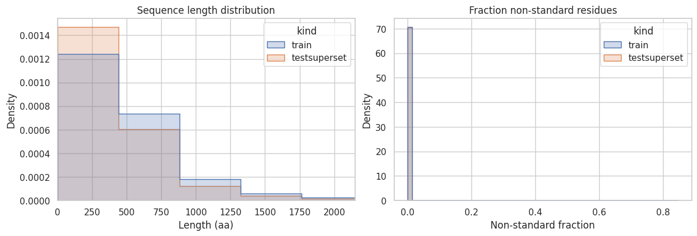

[🏠 Portfolio](https://github.com/heoneyzi) › [🩺 Medical](../../../README.md) › [CAFA6](../../README.md) › [Pipelines](../README.md) › **P0 · Dataset EDA**

# 🔬 P0 · Dataset EDA — what the model has to learn from

> **Question —** How large, how imbalanced and how shifted is the CAFA 6 data a function predictor must learn from?

| | |
|---|---|
| **Status** | ✅ done (Jan 2026) — team notebook, outputs saved |
| **Model / data** | Kaggle CAFA 6 files: `train_sequences.fasta`, `train_terms.tsv`, `train_taxonomy.tsv`, `go-basic.obo`, `testsuperset.fasta`, `testsuperset-taxon-list.tsv`, `IA.tsv`, `sample_submission.tsv` |
| **Compute** | CPU notebook (pandas, NetworkX, seaborn) |
| **Headline** | **82,404** training proteins · **224,309** test-superset proteins · **26,125** GO terms · **537,027** annotations |

## Setup

[`code/eda.ipynb`](../../code/eda.ipynb) (committed to the team repository on 20 Jan 2026) streams both FASTA files, joins sequences ↔ labels ↔ taxonomy ↔ IA weights, parses the GO graph, and sanity-checks the submission format. Jiheon's own walkthrough of the same eight files (Korean) is in [notes/01_dataset.md](../../notes/01_dataset.md).

## Results

All values are printed outputs of `code/eda.ipynb` (cell numbers in brackets).

| Quantity | Training set | Test superset |
|---|---|---|
| Proteins [4] | **82,404** | **224,309** |
| Total residues [4] | 43,327,058 | 96,280,239 |
| Length: mean / median / 95th pct / max [4] | 525.8 / 409 / 1,318 / 35,213 | 429.2 / 342 / 1,095 / 35,213 |
| Taxa (species) [14] | 1,381 | 8,453 (all 1,381 training taxa included) |
| Largest taxon, human (9606) [14] | 17,162 | 20,420 |

| Labels | Value |
|---|---|
| Annotation rows (protein, GO term) [8] | **537,027** — BP 250,805 · CC 157,770 · MF 128,452 |
| Distinct GO terms used [8] | **26,125** (all present and non-obsolete in `go-basic.obo` [21]) |
| Terms per protein: mean / median / max [11] | 6.52 / 4 / 233 |
| Sub-ontologies per protein: mean [11] | 2.16 (of 3) |
| Proteins per term: median / 75th pct / max [17] | 4 / 12 / 33,713 (GO:0005515, protein binding [12]) |
| IA weight of labelled terms: mean / median / max [17] | 2.31 / 1.03 / 14.86 |
| GO graph [19] | 48,101 terms (7,979 obsolete) · 62,410 `is_a` + 6,597 `part_of` edges |
| Quality checks [25] | 0 duplicate annotations · 0 invalid residues · 200 proteins with non-standard residues |
| Train ∩ test-superset IDs [25] | **82,404** — every training protein is also a prediction target |

<table><tr>
<td align="center" width="50%"> [12] Long-tailed labels; protein binding (GO:0005515) dominates.</td>
<td align="center" width="50%"> [11] Most proteins carry few terms; many lack one or two sub-ontologies.</td>
</tr><tr>
<td align="center" width="50%"> [17] Rare terms carry large IA weights — they drive the metric.</td>
<td align="center" width="50%"> [14] Many test-superset species have no training proteins at all.</td>
</tr><tr>
<td align="center" width="50%"> [21] Depth of labelled terms: BP terms sit deepest in the hierarchy.</td>
<td align="center" width="50%"> [5] Test-superset sequences are slightly shorter than training ones.</td>
</tr></table>

## Takeaway

- **Extreme multi-label, long tail.** Half of the 26,125 terms label ≤ 4 proteins, while a handful (protein binding, nucleus, cytosol) cover tens of thousands — frequency-only predictors look good on common terms but score little under IA weighting.
- **Hierarchy matters for scoring.** Every labelled term sits in the GO DAG, so predictions have to be propagated to ancestors (see [P1](../01_prott5_classifier/README.md), [P5](../05_label_space_jepa/README.md)).
- **Shift is built in.** The superset spans 8,453 species versus 1,381 in training, and every training protein reappears as a target (it can gain *new* annotations) — validation on a random split is optimistic.
- This notebook describes the data only; it does not score any model.

## Files

| File | What it is |
|---|---|
| [`code/eda.ipynb`](../../code/eda.ipynb) | Team EDA notebook with saved outputs (686 KB) |
| [`assets/`](assets/) | Six figures exported unchanged from the notebook outputs |
| [`code/docs/en/dataset_description.md`](../../code/docs/en/dataset_description.md) | File-by-file dataset guide (Swiss-Prot 2025_03, GO release 2025-06-01) |
| [`notes/01_dataset.md`](../../notes/01_dataset.md) | Jiheon's Korean walkthrough of the same files |
