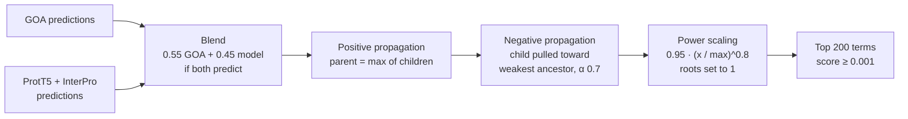

[🏠 Portfolio](https://github.com/heoneyzi) › [🩺 Medical](../../../README.md) › [CAFA6](../../README.md) › [Pipelines](../README.md) › **P2 · GOA + ProtT5 ensemble**

# 🔬 P2 · GOA + ProtT5 ensemble with ontology-aware post-processing

> **Question —** How far does blending curated GOA annotations with model predictions — then forcing the result to respect the GO hierarchy — get on the leaderboard?

| | |
|---|---|
| **Status** | 📚 studied and ported (Jan 2026); local script added to the team repo — not re-run here |
| **Model / data** | Two **precomputed** prediction files shared publicly on Kaggle (`goa_submission.tsv`, `prott5_interpro_predictions.tsv`) + `go-basic.obo`; no model is trained |
| **Compute** | CPU only |
| **Headline** | The public notebook's author reports **0.370** (public leaderboard) — a community result, not a team score |

## Setup

This line starts from a **public Kaggle notebook** ("CAFA-6: GOA + ProtT5 Ensemble (0.370)", dataset `ymuroya47/cafa6-goa-predictions`) that the team collected in its first week as the cleanest public solution ([Yumin Jung's week-1 survey](https://github.com/heoneyzi/Study/blob/main/Genomics/season1_functional_genomics/cafa6/04_yumin_cafa6_week1.md)). The team repository keeps the notebook ([`code/notebooks/cafa-6-goa-prott5-ensemble-0-370.ipynb`](../../code/notebooks/cafa-6-goa-prott5-ensemble-0-370.ipynb)) and a local re-implementation ([`code/scripts/make_ensemble_submission.py`](../../code/scripts/make_ensemble_submission.py)) with the same defaults:

- **Blend** — a term predicted by both sources gets `0.55·GOA + 0.45·ProtT5`; a term from one source keeps that source's score.
- **Positive propagation** — every ancestor inherits the maximum score of its descendants (`is_a` and `part_of` edges).
- **Negative propagation** — if a child's score exceeds its weakest ancestor's, it is replaced by `0.7·min(ancestors) + 0.3·child`.
- **Power scaling** — if a protein's best non-root score is below 0.95, its non-root scores become `0.95·(x/max)^0.8` (the top term lands at 0.95); the three roots are set to 1.0.
- The local script also **filters output IDs to the test-superset FASTA** (the notebook does not) and exposes every constant as a CLI flag (`--weight-goa`, `--neg-prop-alpha`, `--scaling-power`, …).

## Results

- The **0.370** in the notebook's title and summary cell is the public-leaderboard score reported by its original author. The team's notes link the same notebook and a derivative reporting 0.375 after re-weighting. Neither number was produced or re-run by the team, and both use externally shared prediction files.
- Jiheon's fork revised the EN/KO reproduction guides to spell out how the script differs from the notebook and what ID filtering does *not* guarantee — [code/docs/en/reproducing_kaggle_ensemble.md](../../code/docs/en/reproducing_kaggle_ensemble.md) · [한국어](../../code/docs/ko/reproducing_kaggle_ensemble.md).

## Takeaway

- The strongest public baselines leaned on **curated annotations (GOA) plus hierarchy-aware post-processing**, not on a single deep model — consistent with the 4th team meeting's plan to late-fuse retrieved GO terms with embedding models.
- Filtering to superset IDs limits *which* proteins are written, but says nothing about **temporal leakage**: GOA annotations dated after the training cut-off could overlap the prospective test labels. The fork's docs state this explicitly.
- **Not claimed:** that this ensemble, or any specific file, produced the team's medal.

## Files

| File | What it is |
|---|---|
| [`notebooks/cafa-6-goa-prott5-ensemble-0-370.ipynb`](../../code/notebooks/cafa-6-goa-prott5-ensemble-0-370.ipynb) | the public Kaggle notebook as kept by the team (Kaggle paths, no outputs) |
| [`scripts/make_ensemble_submission.py`](../../code/scripts/make_ensemble_submission.py) | local CLI re-implementation with superset-ID filtering |
| [`docs/en/reproducing_kaggle_ensemble.md`](../../code/docs/en/reproducing_kaggle_ensemble.md) | what is and is not reproducible; default flags |
| [`docs/ko/reproducing_kaggle_ensemble.md`](../../code/docs/ko/reproducing_kaggle_ensemble.md) | Korean version (last edited by Jiheon, Sep 2026) |
