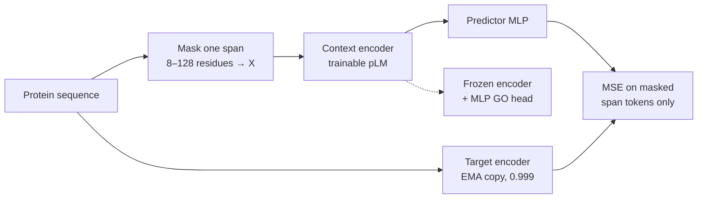

[🏠 Portfolio](https://github.com/heoneyzi) › [🩺 Medical](../../../README.md) › [CAFA6](../../README.md) › [Pipelines](../README.md) › **P4 · JEPA encoder**

# 🔬 P4 · JEPA pre-training of the protein encoder + classifier head

> **Question —** Does a short JEPA-style self-supervised pre-training on the competition's own sequences give a better frozen encoder for GO prediction?

| | |
|---|---|
| **Status** | 📦 implemented and archived (Jan – Feb 2026) — Subin Park's JEPA line |
| **Model / data** | ProtT5-XL (pre-training default) or ESM2-650M (default in the head's SLURM script); unlabelled sequences from `train_sequences.fasta` + `testsuperset.fasta` for pre-training, CAFA 6 labels for the head |
| **Compute** | SLURM, 1 GPU (A6000 partition for pre-training, RTX 4090 partition for the head), 64–96 GB RAM |
| **Headline** | — (no score archived for this line) |

## Setup

A **Joint-Embedding Predictive Architecture (JEPA)** learns by predicting the *representation* of a hidden part of the input rather than the raw input itself (I-JEPA idea, cited in Subin's trial notes).

1. **Pre-train** — [`code/src/pretrain/jepa_protein_train.py`](../../code/src/pretrain/jepa_protein_train.py): per sequence (≥ 32 residues), one random span of 8–128 residues is replaced by `X`; the context encoder sees the masked sequence, an EMA target encoder (decay 0.999) sees the original, and a predictor MLP (2× hidden) regresses the target's token embeddings on the masked span (MSE; optional variance regularizer against collapse). Defaults: 4,000 steps (2,000 in [`job-scripts/jepa-pretrain.sh`](../../code/job-scripts/jepa-pretrain.sh)), lr 1e-4, max length 1,024. The encoder is saved as `encoder.pt`.
2. **Fine-tune a head** — [`code/src/jepa_go/train_jepa_encoder.py`](../../code/src/jepa_go/train_jepa_encoder.py): the JEPA encoder is frozen, mean-pooled, and an MLP head (1024 → 512 → labels, dropout 0.2) is trained with BCE on GO terms with ≥ 5 proteins (≤ 8,192 labels); bf16, batch 8 × 4 accumulation, 5 epochs, 3 % validation with IA-weighted F-max ([`metrics.py`](../../code/src/jepa_go/metrics.py)).
3. **Predict** — [`predict_jepa_encoder.py`](../../code/src/jepa_go/predict_jepa_encoder.py) writes `(protein, GO term, score)` rows above a minimum score.

The same `encoder.pt` can also initialise the ProtT5 classifier of [P1](../01_prott5_classifier/README.md) (`--init-encoder-from`), and [`src/jepa_pipeline/jepa_embed.py`](../../code/src/jepa_pipeline/jepa_embed.py) exports JEPA embeddings for other heads.

## Results

No validation metric or leaderboard score for this line survives in the repository or the team notes. (The one archived JEPA score belongs to the label-space variant, [P5](../05_label_space_jepa/README.md).)

## Takeaway

- Pre-training uses test-superset **sequences** but never their labels — a transductive but rule-compatible use of unlabelled data.
- 2,000–4,000 steps at batch size 1 is a very small budget compared with how the pLMs were originally trained, so any effect would be a light domain adaptation rather than new representation learning.
- **Not claimed:** that JEPA pre-training improved GO prediction.

## Files

| File | What it is |
|---|---|
| [`src/pretrain/jepa_protein_train.py`](../../code/src/pretrain/jepa_protein_train.py) · [`jepa_protein_config.py`](../../code/src/pretrain/jepa_protein_config.py) | span-masking JEPA pre-training (ProtT5 or ESM) |
| [`src/jepa_go/train_jepa_encoder.py`](../../code/src/jepa_go/train_jepa_encoder.py) · [`predict_jepa_encoder.py`](../../code/src/jepa_go/predict_jepa_encoder.py) | frozen encoder + MLP GO head |
| [`src/jepa_go/models.py`](../../code/src/jepa_go/models.py) · [`dataset.py`](../../code/src/jepa_go/dataset.py) · [`config.py`](../../code/src/jepa_go/config.py) | `JepaGoModel`, datasets, `JepaGoConfig` |
| [`src/jepa_pipeline/jepa_embed.py`](../../code/src/jepa_pipeline/jepa_embed.py) | embedding export from a JEPA encoder |
| [`job-scripts/jepa-pretrain.sh`](../../code/job-scripts/jepa-pretrain.sh) · [`jepa-go-train-predict.sh`](../../code/job-scripts/jepa-go-train-predict.sh) · [`jepa-go-predict.sh`](../../code/job-scripts/jepa-go-predict.sh) | SLURM launchers |
