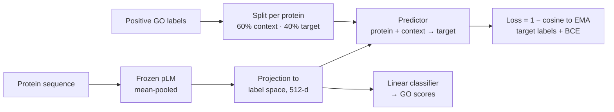

[🏠 Portfolio](https://github.com/heoneyzi) › [🩺 Medical](../../../README.md) › [CAFA6](../../README.md) › [Pipelines](../README.md) › **P5 · Label-space JEPA**

# 🔬 P5 · Label-space JEPA with ontology-aware post-processing

> **Question —** If the model must predict the *embedding* of a protein's hidden GO labels from its visible ones, does the label space become structured enough to regularize an extreme multi-label classifier?

| | |
|---|---|
| **Status** | 🧪 one archived submission (date not recorded) — Subin Park's JEPA line; the hierarchy and taxonomy options were committed on 3 Feb 2026, after the 2 Feb submission deadline |
| **Model / data** | ESM2-650M backbone (`facebook/esm2_t33_650M_UR50D`, SLURM default; ProtT5-XL selectable), frozen; GO terms with ≥ 5 proteins, ≤ 8,192 labels |
| **Compute** | SLURM, 1 GPU (RTX 4090 partition), 96 GB RAM, 36 h limit |
| **Headline** | first JEPA submission: **0.139** on the public leaderboard |

## Setup

- **Two label embeddings.** Each GO term has a trainable *online* embedding and an *EMA target* embedding (decay 0.999) — the same stabilizing trick as BYOL/I-JEPA, applied to labels instead of image patches.
- **JEPA objective.** For every protein, positive labels are split 60/40 into context and target sets; the predictor sees the protein embedding plus the mean context-label embedding and must match the mean target-label embedding (loss `1 − cos`). A **BCE classification loss** over all labels is trained jointly (weights 1 : 1); at inference only the classifier path is used, so the JEPA branch costs nothing at prediction time.
- **Hierarchy (opt-in).** `--use_ontology_propagation` propagates training labels to all GO ancestors (true-path rule); at prediction, `--enforce_consistency --obo_path …` raises every parent to at least its children's maximum score ([`ontology.py`](../../code/src/jepa_go/ontology.py)).
- **Species (opt-in).** `--use_taxonomy` fuses a learned taxon embedding (64-d, gated) into the protein representation ([`taxonomy.py`](../../code/src/jepa_go/taxonomy.py)).
- Defaults from the CLI: lr 1e-4, batch 8 × 4 accumulation, 10 epochs, max length 1,024, bf16; the full SLURM script ([`label-jepa-full.sh`](../../code/job-scripts/label-jepa-full.sh)) overrides to ESM2, batch 16, max length 1,536. Prediction keeps every score ≥ 0.001.

## Results

| Submission | Score | Source |
|---|---|---|
| First label-space JEPA submission (date not recorded) | **0.139** public LB | Kaggle submission screenshot in [Subin Park's trial page](https://github.com/heoneyzi/Study/blob/main/Genomics/season1_functional_genomics/cafa6/07_subin_cafa6_jepa.md) |

Subin's note beside the score: it was effectively the first submission, so it was hard to judge the approach's potential, and much of the upper-middle leaderboard was occupied by teams re-submitting already-public, high-scoring predictions.

## Takeaway

- The label-space JEPA is the repository's most distinctive modeling idea: it turns label co-occurrence into a self-supervised signal, complementary to the explicit GO graph.
- A single public-LB score of 0.139, far below the 0.370 reported for the public GOA-based ensemble ([P2](../02_goa_prott5_ensemble/README.md)), suggests that — on the time budget available before the 2 Feb deadline — the learned model alone did not approach curated-annotation baselines.
- The public leaderboard covers a small protein subset and is not the prospective final evaluation; **not claimed:** the final score of this model or that it contributed to the medal.

## Files

| File | What it is |
|---|---|
| [`src/jepa_go/train_label_jepa.py`](../../code/src/jepa_go/train_label_jepa.py) | training loop, JEPA + BCE losses, validation with IA-weighted F-max |
| [`src/jepa_go/predict_label_jepa.py`](../../code/src/jepa_go/predict_label_jepa.py) | batched inference, optional consistency enforcement |
| [`src/jepa_go/models.py`](../../code/src/jepa_go/models.py) | `LabelJepaModel`: projection, online/EMA label embeddings, predictor, classifier |
| [`src/jepa_go/ontology.py`](../../code/src/jepa_go/ontology.py) · [`taxonomy.py`](../../code/src/jepa_go/taxonomy.py) | GO DAG utilities; taxon embedding and fusion |
| [`src/jepa_go/metrics.py`](../../code/src/jepa_go/metrics.py) | `compute_fmax` (optionally IA-weighted), `compute_auprc` |
| [`job-scripts/label-jepa-full.sh`](../../code/job-scripts/label-jepa-full.sh) · [`label-jepa-train.sh`](../../code/job-scripts/label-jepa-train.sh) · [`label-jepa-predict.sh`](../../code/job-scripts/label-jepa-predict.sh) | SLURM launchers |
| [`docs/en/pipelines.md`](../../code/docs/en/pipelines.md) | CLI vs SLURM defaults, verified against the parsers (Jiheon's fork, Sep 2026) |
