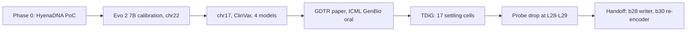

<sub>[🏠 Portfolio](https://github.com/heoneyzi) › [🩺 Medical](../README.md) › **GDTR**</sub>

<div align="center">

# 🧬 GDTR research program — how deep does a DNA language model think?

**Build a depth ruler for Evo 2, validate it, stress-test it — then explain what the ruler was actually seeing.**

   [](https://github.com/heoneyzi/Paper/blob/main/GDTR/README.md) 

[📄 Paper page](https://github.com/heoneyzi/Paper/blob/main/GDTR/README.md) · [💻 TDiG team repo](https://github.com/YAICON-8th-Think-Deep-in-Genome/TDiG) · [📚 Genomics study notes](https://github.com/heoneyzi/Study/blob/main/Genomics/README.md)

</div>

> [!TIP]
> **TL;DR** — Three lines of work on Evo 2 7B. **A · gDTR-PoC** built and validated the settling-depth lens behind the [GDTR paper](https://github.com/heoneyzi/Paper/blob/main/GDTR/README.md) (ICML 2026 GenBio Workshop, oral): splice sites settle ~2 layers early and a chr22 calibration keeps 94.6 % of the effect on held-out chr17. **B · TDiG** widened one metric into 17 geometric "settling cells" and saw linear probes lose genomic context at layers 28–29. **C · Handoff** *(ongoing, unpublished)* traces that late-stack event causally — so far, an MLP "writer" at block 28 and a mixer "re-encoder" at block 30 hand the residual stream over from representing sequence to predicting the next base.

| | |
|---|---|
| **Period** | Apr 2026 – ongoing (paper line Apr–Jun 2026; TDiG May–Jul 2026; handoff follow-ups Sep 2026 –) |
| **Team** | GDTR paper: Yoonjin Cho (first author), **Jiheon Kang**, Subin Park, Prof. Sangwoo Kim · TDiG (YAICON 8th team 띵디지놈): Yoonjin Cho (lead), Minseok Kim, Minseon Koo, **Jiheon Kang**, Jaeyun Sim · Handoff: Jiheon's ongoing paper project |
| **My role** | Author (GDTR); team member (TDiG) and the `cos_lens` extension in Jiheon's fork; drives the handoff follow-up program EXP1–EXP3 ([details](#-my-contribution)) |
| **Stack** | PyTorch · Evo 2 / Vortex · HyenaDNA · NT-v2 · DNABERT-2 · NumPy/SciPy · scikit-learn · Slurm · H200 / H100 / A100 GPUs |
| **Status** | ✅ A done (paper accepted) · ✅ B done (team project) · 🔄 C follow-up research ongoing |

<p align="center"></p>
<p align="center"><sub>Evo 2 7B, chr22, one depth axis. (a) GDTR mean settling depth per context — <code>gdtr-poc/results/phase1.6/gate_b.json</code>; (b) linear-probe AUROC — <code>tdig/results/analysis_BD/per_layer_auroc.csv</code>; (c) ‖hℓ‖/‖hℓ₋₁‖ — <code>handoff/arch_compare/results/chr22_evo2_7b_utr/profile.json</code>. Drawn by <a href="assets/make_hero.py"><code>assets/make_hero.py</code></a>.</sub></p>

## 🧭 Why it matters

DNA language models such as Evo 2 are trained only to predict the next nucleotide, yet their hidden states are reused to score disease variants and annotate genomes. Which layer should one read, and what does depth mean in such a model? Interpretability tools from NLP (logit lens, tuned lens) assume large vocabularies and smooth, monotone layer trajectories — assumptions that break on a 4-letter alphabet and on Evo 2's hybrid Hyena/attention stack.

This program first built a ruler for depth (settling depth), then checked the ruler itself — calibration transfer, entropy and motif controls, other architectures, other geometric metrics — and finally asked what happens at the layers where every metric changes at once.

## 🛠️ Approach



- **Line A — [`gdtr-poc/`](gdtr-poc/README.md):** pre-registered gates, frozen thresholds and verifier scripts after every stage; E0–E10 below.
- **Line B — [`tdig/`](tdig/README.md):** one forward pass → 17 settling cells (direction, magnitude, trajectory, whitened distance, tortuosity × 3 reference variants); plus the [`cos_lens`](tdig/cos_lens/README.md) study of *why* a cosine lens.
- **Line C — [`handoff/`](handoff/README.md):** norm-ratio onset detection across scales, then causal branch ablations, weight spectra and capacity-matched decoders; windows (not positions) are the resampling unit throughout.

## 🔬 Experiments & results

**Line A · the GDTR lens** (Evo 2 7B unless noted; full table in [`gdtr-poc/`](gdtr-poc/README.md))

| # | Question | Key result | Folder |
|---|---|---|---|
| E0 | Does a DTR-style lens work on a DNA LM at all? | HyenaDNA: TP53 exon vs intron *d* = −1.018 (*p* = 4.88 × 10⁻²²⁴); tuned lens lifts L7 monotonicity 0.120 → 0.917 | [E0](gdtr-poc/experiments/E0_phase0_hyenadna/README.md) |
| E1 | Calibrate on Evo 2 | block 31 is an exact passthrough; chr22 (77.9 M positions): splice donor c̄ 25.57 vs intron 27.82 | [E1](gdtr-poc/experiments/E1_phase1_evo2_calibration/README.md) |
| E2 | Does chr22 replicate on chr17? | ranking replicates (only intron ↔ 3′UTR swap, < 0.1 layer); donor-profile minimum c̄ 24.06 vs intron 27.69 | [E2](gdtr-poc/experiments/E2_phase2_chr17_replication/README.md) |
| E3 | Does depth carry variant information? | 32-d ΔD_cos AUROC 0.844 [0.831, 0.857]; + Evo 2 ΔLL 0.861 (DeLong *p* = 3.6 × 10⁻¹⁵) | [E3](gdtr-poc/experiments/E3_phase3_clinvar/README.md) |
| E4 | Other architectures? | per-window ρ Evo 2↔HyenaDNA +0.516, NT-v2↔DNABERT-2 +0.663, cross-family < 0 | [E4](gdtr-poc/experiments/E4_phase4_cross_architecture/README.md) |
| E5 | Depth vs conservation | "deep but not conserved" regions = 3.71 % of chr22 (5,090 regions); low-complexity repeats 2.02× | [E5](gdtr-poc/experiments/E5_phase5_conservation/README.md) |
| E6 | Head-to-head with baselines | ‖Δh‖₂ 0.926 > ΔD_cos 0.844 > attention rollout 0.672 > integrated gradients 0.527 | [E6](gdtr-poc/experiments/E6_tier1_variant_diagnostics/README.md) |
| E7 | Robustness | classifier grid AUROC range 0.0017; region overlaps eQTL 1.62×, GWAS 1.50×, cCRE-ELS 1.90× | [E7](gdtr-poc/experiments/E7_tier2_robustness/README.md) |
| E8 | Is it just entropy? | ρ(c, H) = −0.079; donor *d* −0.452 → −0.583 after removing entropy | [E8](gdtr-poc/experiments/E8_entropy_control/README.md) |
| E9 | Motif or context? | flank shuffle *d* = +0.515 vs GT→AA *d* = −0.086 | [E9](gdtr-poc/experiments/E9_motif_flank_control/README.md) |
| E10 | Paper revision checks | **94.6 %** held-out transfer; consequence-depth Kruskal–Wallis *p* = 3.0 × 10⁻¹⁰; cCRE-ELS *d* = −0.190 | [E10](gdtr-poc/experiments/E10_v8_revision/README.md) |

**Line B · beyond one metric**

| # | Question | Key result | Folder |
|---|---|---|---|
| B1 | Do 17 settling cells generalise? | chr22 → chr17 Spearman ρ = 0.989 over 13 cells, median retention 97.2 %; probe AUROC (donor vs intron) 0.978 → 0.794 from L27 to L29 | [TDiG](tdig/README.md) |
| B2 | Why a cosine lens? | freezing direction changes the output 133× more than freezing magnitude; shuffling layer order drops cosine-feature AUROC 0.938 → 0.830 | [cos_lens](tdig/cos_lens/README.md) |

**Line C · the representation-to-output handoff** *(ongoing, unpublished)*

| # | Question | Key result | Folder |
|---|---|---|---|
| C0 | Where is the event, across scales? | onset b28 in 7B (norm ratio 214–252× vs ≤ 3.51 before), b21 in 40B (256–272×), on chr22/17/19 | [arch_compare](handoff/arch_compare/README.md) |
| C1 | Discard or summary? | state after the onset is linearly recoverable (R² 0.808); after block 30 only 0.270 (≈ 0.35 on re-analysis) | [EXP1](handoff/exp1/README.md) |
| C2 | What does each block do, causally? | removing b28's MLP raises next-token loss by 2.153 nats — 377× its phase twin b21; weights alone name writer/re-encoder in 4/4 checkpoints | [EXP2](handoff/exp2/README.md) |
| C3 | Can the summary be traced back to sequence? | designed and dry-run only (38 tests pass); no scientific results yet | [EXP3](handoff/exp3/README.md) |

## 🙋 My contribution

- **GDTR paper — Author:** analyzed layer-wise residual-stream settling in Evo 2 7B without retraining, linking depth to splice grammar, regulatory contexts, coding structure and ClinVar variants; reviewed the April draft. The team's headline robustness result: held-out chr22 → chr17 transfer keeps 94.6 % of the effect magnitude.
- **TDiG — team member** (team README). The [`cos_lens`](tdig/cos_lens/README.md) extension (`scripts/wcl/`, `results/wcl/`, report) exists only in his fork/local copy of the team repository; its report credits him with the update-projection freeze used in experiment 10.
- **Handoff — his ongoing paper project.** He drives the follow-up program EXP1 → EXP2 → EXP3 that tests whether the handoff *summarises* earlier computation rather than discarding it; its plans and reports live in his research folder. The manuscript itself is not included.

## 🗂️ Repository map

```text
GDTR/
├── README.md                ← you are here
├── assets/                  ← hero figure + make_hero.py (reads result files below)
├── gdtr-poc/                ← Line A: code (src, scripts, tests), docs, results, experiments/E0…E10
├── tdig/                    ← Line B: TDiG framework code + curated results; cos_lens/ study
└── handoff/                 ← Line C: arch_compare/, exp1/, exp2/, exp3/, figures/ (ongoing)
```

## ♻️ Reproduce

- **No GPU:** rebuild the paper figures (`gdtr-poc/paper_figures/scripts/*.py`), the handoff figures (`python handoff/figures/figs.py`) and the hero (`python assets/make_hero.py`) from the archived JSON/CSV. Unit tests: `gdtr-poc` 21 passed / 6 skipped, TDiG 7 passed, EXP1 self-test 35/35, EXP3 38 passed (re-run on CPU for this portfolio).
- **GPU:** every forward pass needs Evo 2 7B (and 40B/1B for scale checks) on 80–141 GB GPUs plus GRCh38, GENCODE v44, ClinVar, phyloP and ENCODE downloads. Hidden-state caches (hundreds of GB) and model weights are **not** included; each line's README lists its entry points.

> [!IMPORTANT]
> **Scope notes**
> - Line A is published as a **workshop** paper; Lines B–C are follow-ups. Line C is **ongoing and unpublished** — numbers here are internal results from its reports and result files, not peer-reviewed claims.
> - The handoff work re-examines the settling-depth readout itself: on its 400-window panel, folding a per-layer profile into one depth kept only a small part of the splice-donor contrast (*d* = −0.023 vs 1.261 per layer). Treat Line A's effect sizes as specific to its thresholded readout.
> - Every statement is about the models, not about biology: no wet-lab or functional validation was done, and variant AUROCs are sanity checks, not clinical scorers.
> - Results are on a few human chromosomes (chr22, chr17, chr19) and 15 cancer genes; resampling units and controls differ between lines — compare each line on its own terms.

## 🔗 Links

- Paper page: [02_Paper/GDTR](https://github.com/heoneyzi/Paper/blob/main/GDTR/README.md) · [OpenReview](https://openreview.net/forum?id=Z9h1jiPbus) · [bioRxiv](https://www.biorxiv.org/content/10.64898/2026.07.14.738370v1)
- Team repositories: [TDiG (YAICON 8th)](https://github.com/YAICON-8th-Think-Deep-in-Genome/TDiG) · gDTR proof-of-concept repository `darejinn/gDTR-PoC` (curated copy in [`gdtr-poc/`](gdtr-poc/README.md))
- Background reading notes (Korean): [03_Study/Genomics](https://github.com/heoneyzi/Study/blob/main/Genomics/README.md)

---
<sub>[← Prev: GeoFlowAgent](../GeoFlowAgent/README.md) · [🏠 Portfolio](https://github.com/heoneyzi) · [Next: PhenoFocus →](../PhenoFocus/README.md)</sub>
