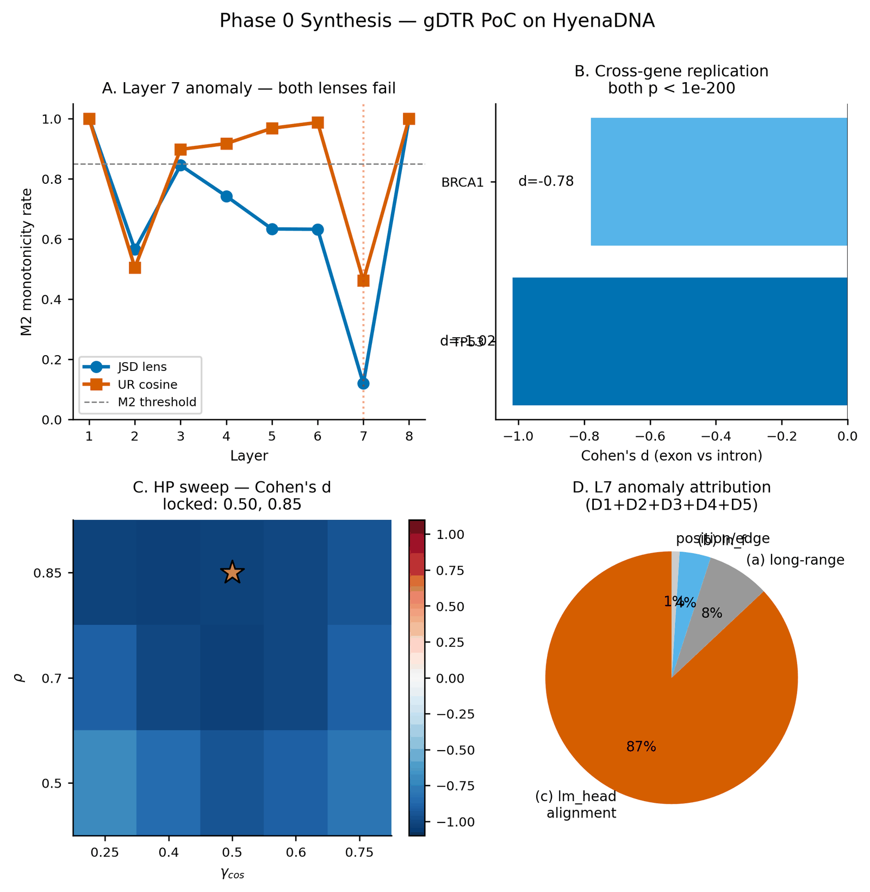

[🏠 Portfolio](https://github.com/heoneyzi) › [🩺 Medical](../../../../README.md) › [GDTR](../../../README.md) › [Line A](../../README.md) › **E0 · Phase 0 HyenaDNA PoC**

# 🔬 E0 · Phase 0 — HyenaDNA proof of concept

> **Question —** Can an NLP "deep-thinking" lens be ported to a small genomic causal language model at all, and what has to change?

<b>🇰🇷 한국어 요약</b>

큰 모델(Evo 2)에 쓰기 전에 작은 DNA 모델(HyenaDNA)로 방법이 통하는지 먼저 확인한 사전 실험입니다.
NLP에서 쓰던 로짓 렌즈(JSD)는 DNA처럼 글자 수가 적은 모델에서는 거의 쓸모가 없어서, 코사인 렌즈를 주 지표로 바꾸고 임계값을 분위수(q70)로 정하게 되었습니다.
마지막 층 직전에서 표현이 출력 방향으로 "회전"하는 현상도 발견했는데, 이는 새 저울을 쓰기 전에 영점부터 맞추는 과정과 비슷합니다.
TP53·BRCA1 유전자에서는 엑손과 인트론의 정착 깊이가 뚜렷하게 달랐지만, 이 방향은 나중에 염색체 전체(E1)에서는 뒤집혔습니다.

| | |
|---|---|
| **Status** | ✅ done (2026-04-26) — pre-registered three-gate design |
| **Model / data** | HyenaDNA-medium-160k (8 blocks, 12-token vocabulary); TP53 (39 windows) and BRCA1 (252 windows) on chr17; 6 kb windows, 500 bp stride |
| **Compute** | single RTX 3090, ~38 min ([`phase0_calibration.md`](../../docs/findings/phase0_calibration.md)) |
| **Headline** | TP53 coding exon vs intron Cohen's *d* = −1.018 (Mann–Whitney *p* = 4.88 × 10⁻²²⁴); BRCA1 *d* = −0.78 |

## Setup

- Design fixed before any run in [`docs/phase0_design.md`](../../docs/phase0_design.md): Gate A (logit-lens monotonicity), Gate B (TP53 exon vs intron), a variant pilot, and a γ × ρ sweep.
- Two lenses on every layer: the NLP-style JSD logit lens and the cosine "UR" lens on the residual stream; settling depth from the running minimum.
- Mechanistic follow-ups on an unexpected layer-7 spike: five decompositions (D1–D5), a tied-head ablation (E1), codon-position stratification (E2) and a tuned-lens prototype (E5).

## Results

| Test | Result | File |
|---|---|---|
| Gate A — lens monotonicity | fails for both lenses at L7 (JSD M2 = 0.120) | [`runs/E5_tuned_lens.json`](../../results/runs/E5_tuned_lens.json) |
| L7 anomaly attribution | ~87 % lm-head alignment, 8 % long-range, 4 % final norm (D1–D5) | [`figures/F0_phase0_synthesis.png`](../../results/figures/F0_phase0_synthesis.png) |
| Tuned lens (affine map at L7) | M2 0.120 → **0.917**; top singular value 9.45 | [`runs/E5_tuned_lens.json`](../../results/runs/E5_tuned_lens.json) |
| Gate B — TP53 | *d* = −1.018, *p* = 4.88 × 10⁻²²⁴ (cosine lens) | [`runs/02_gene_structure.json`](../../results/runs/02_gene_structure.json) |
| Cross-gene — BRCA1 | *d* = −0.78, *p* ≈ 0 | [`runs/05_brca1.json`](../../results/runs/05_brca1.json) |
| γ × ρ sweep | best γ_cos = 0.50, ρ = 0.85 (*d* = −1.026), flat plateau | [`runs/04_hp_sweep.json`](../../results/runs/04_hp_sweep.json) |

Phase 0 synthesis — <code>results/figures/F0_phase0_synthesis.png</code>.

## Takeaway

- The cosine lens became the primary readout: with a 12-token vocabulary the JSD lens has a tiny dynamic range (median ≈ 0.019), so thresholds must be quantile-calibrated (q70) instead of copied from NLP defaults.
- The last Hyena block rotates the state into the readout subspace, so "read the last block" rules have to be checked per model — Evo 2 turned out to behave differently (E1).
- The TP53/BRCA1 direction (intron settles later than exon) did **not** hold for the whole of chr22 (E1, *d* = −0.068) — the pilot genes were atypical cancer drivers (E2).

## Files

| File | What it is |
|---|---|
| [`scripts/00_smoke_test.py`](../../scripts/00_smoke_test.py) → [`05_brca1.py`](../../scripts/05_brca1.py) | gates and cross-gene run |
| [`scripts/L7_d1d2.py`](../../scripts/L7_d1d2.py), [`L7_d3d4d5.py`](../../scripts/L7_d3d4d5.py) | layer-7 mechanistic diagnostics |
| [`scripts/E1_tied_head_ablation.py`](../../scripts/E1_tied_head_ablation.py), [`E2_codon_gdtr.py`](../../scripts/E2_codon_gdtr.py), [`E5_tuned_lens.py`](../../scripts/E5_tuned_lens.py) | extensions |
| [`results/runs/`](../../results/runs/), [`results/tables/`](../../results/tables/), [`results/figures/`](../../results/figures/) | per-stage JSON, summary CSVs, figures |
| [`docs/PHASE0_FINDINGS.md`](../../docs/PHASE0_FINDINGS.md), [`PHASE0_DECISION.md`](../../docs/PHASE0_DECISION.md) | full write-up and gate verdicts (Korean) |

---
[← Line A](../../README.md) · [🏠 Portfolio](https://github.com/heoneyzi) · [E1 →](../E1_phase1_evo2_calibration/README.md)
