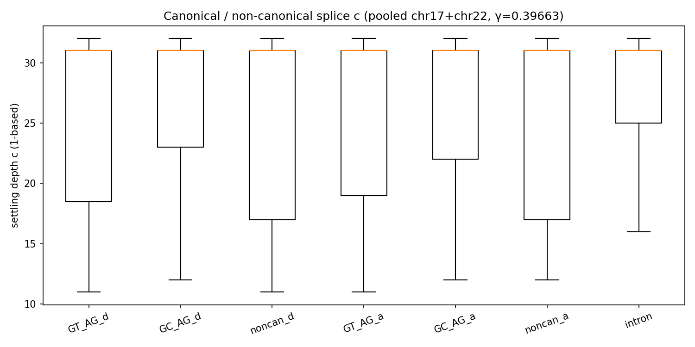
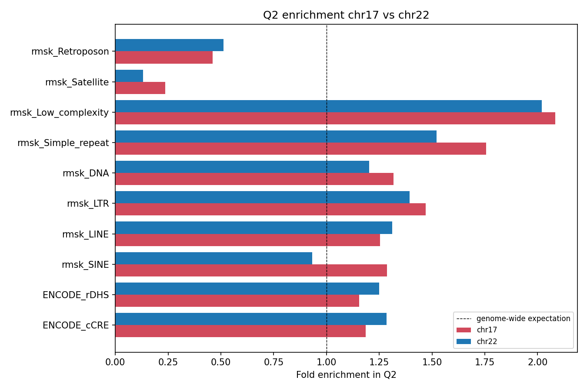

[🏠 Portfolio](https://github.com/heoneyzi) › [🩺 Medical](../../../../README.md) › [GDTR](../../../README.md) › [Line A](../../README.md) › **E10 · Revision checks**

# 🔬 E10 · Revision v8 — Held-out transfer, splice motif classes, consequence depth, functional elements

> **Question —** Do the paper's claims survive the checks a reviewer would ask for: a held-out chromosome, motif-class breakdowns, population-level variant statistics, and a functional positive control?

<b>🇰🇷 한국어 요약</b>

논문 수정 단계에서 심사자가 물을 만한 네 가지를 미리 검증했습니다.
첫째, 22번 염색체에서 정한 기준값을 고정한 채 17번 염색체에 적용했더니 스플라이스 효과 크기의 94.6%가 유지되었습니다 — 연습 문제로 채점 기준을 정하고 처음 보는 시험지로 확인한 셈입니다.
둘째, 변이 종류별로 표현이 가장 크게 흔들리는 층이 달랐고(인트론 10층 → 동의 변이 18층), 셋째, 알려진 조절 영역(cCRE-ELS)은 예상과 달리 더 **얕게** 정착했습니다.
넷째, 스플라이스 부위를 모티프 종류별로 나누면 "강한 모티프일수록 빨리 정착"한다는 직관과 반대 순서가 나와, 논문에서 그대로 보고했습니다.

| | |
|---|---|
| **Status** | ✅ done (2026-05-04) — pre-registered branches, outcomes reported whichever way they fell |
| **Model / data** | Evo 2 7B, γ_cos = 0.39663 frozen; chr22 (calibration) + chr17 (held-out, 27,586 windows); 4,023 ClinVar P/LP variants in 15 genes incl. 518 true frameshift indels; ENCODE cCRE-ELS, GTEx eQTL, GWAS Catalog |
| **Compute** | one H200 (indel forward pass) + CPU on cached depths |
| **Headline** | chr17 splice-donor effect = **94.6 %** of chr22 (*d* −0.349 vs −0.369); consequence classes differ in peak layer (Kruskal–Wallis *p* = 3.0 × 10⁻¹⁰) |

## Results

| Check (script) | Result | Source |
|---|---|---|
| **P1a** held-out chromosome ([`p1a_calib_val_split.py`](../../scripts/p1a_calib_val_split.py)) | chr17 q70 = 0.39429 vs chr22 0.39663 (\|Δ\| = 0.0023); chr17 donor-vs-intron *d* = −0.349 vs chr22 −0.369 → **94.6 %** retained | [`docs/REVISION_v8_RESULTS_SUMMARY.md`](../../docs/REVISION_v8_RESULTS_SUMMARY.md) (the `results/p1a/` files were not archived) |
| **P1b** motif classes ([`p1b_canonical_splice_label.py`](../../scripts/p1b_canonical_splice_label.py)) | chr17: non-canonical donor 25.24 < GT-AG 25.57 < GC-AG 27.37 < intron 27.69 — every class below intron, but the "stronger motif ⇒ shallower" prior is reversed | same; figure below |
| **P2** consequence depth ([`p2_*`](../../scripts/)) | median peak layer of \|ΔD_cos\|: intron 10 (*n* = 116) · frameshift 11 (518) · nonsense 12 (1,740) · missense 16 (935) · canonical splice 17 (682) · synonymous 18 (32); KW *p* = 2.98 × 10⁻¹⁰; only nonsense → missense resolved pairwise (*p*_adj = 1.7 × 10⁻⁴) | [`figures_v3/fig_v9_meta.json`](../../results/figures_v3/fig_v9_meta.json) |
| **P3B-1** functional positive control ([`p3b1_functional_positive_control.py`](../../scripts/p3b1_functional_positive_control.py)) | Cohen's *d* vs chr22 background: splice donor −0.433 · cCRE-ELS **−0.190** · GWAS −0.040 · GTEx eQTL −0.022 — functional sites settle *earlier* | [`figures_v3/fig_v9_meta.json`](../../results/figures_v3/fig_v9_meta.json) |
| **P3B-2/3** repeats, Q2 on chr17 ([`p3b2_*`](../../scripts/p3b2_repeat_breakdown.py), [`p3b3_q2_chr17.py`](../../scripts/p3b3_q2_chr17.py)) | chr17 Q2 = 5.49 % (chr22 3.71 %); LTR/LINE/DNA enrichments replicate, SINE flips (0.93 → 1.29) | [`REVISION_v8_RESULTS_SUMMARY.md`](../../docs/REVISION_v8_RESULTS_SUMMARY.md) |

<table><tr>
<td></td>
<td></td>
</tr><tr>
<td>Settling depth by splice motif class (pooled) — <code>figures_v3/F_splice_canonical.png</code>.</td>
<td>Q2 enrichment replicates for LTR/LINE/DNA but not SINE — <code>figures_v3/F_q2_chr17_vs_chr22.png</code>.</td>
</tr></table>

## Takeaway

- The held-out split turned a single-chromosome calibration into a calibration/validation design — the paper's headline 94.6 % transfer.
- Two pre-registered hypotheses failed and were reported, not hidden: canonical motifs do *not* settle earliest, and functional elements are *shallower*, which retired the "deep & unconserved = functional" narrative (E5).
- Variant consequences show a population-level depth shift (truncating → missense/splice → synonymous), not class separation; the synonymous class is small (*n* = 32).

## Files

| File | What it is |
|---|---|
| [`scripts/p1a_*`, `p1b_*`, `p2_*`, `p3b*_*`](../../scripts/) | the revision analyses (run via [`run_revision_v8.sh`](../../scripts/run_revision_v8.sh)) |
| [`scripts/make_fig_v9.py`](../../scripts/make_fig_v9.py) → [`results/figures_v3/fig_v9_meta.json`](../../results/figures_v3/fig_v9_meta.json) | numbers behind paper Fig. 2(b) and Fig. 3 |
| [`results/figures_v3/`](../../results/figures_v3/) | revision figures (shallowness, splice, variants, functional control) |
| [`paper_figures/`](../../paper_figures/) | camera-ready figures and their no-GPU rebuild scripts |

---
[← E9](../E9_motif_flank_control/README.md) · [🏠 Portfolio](https://github.com/heoneyzi) · [Line A index →](../../README.md)
