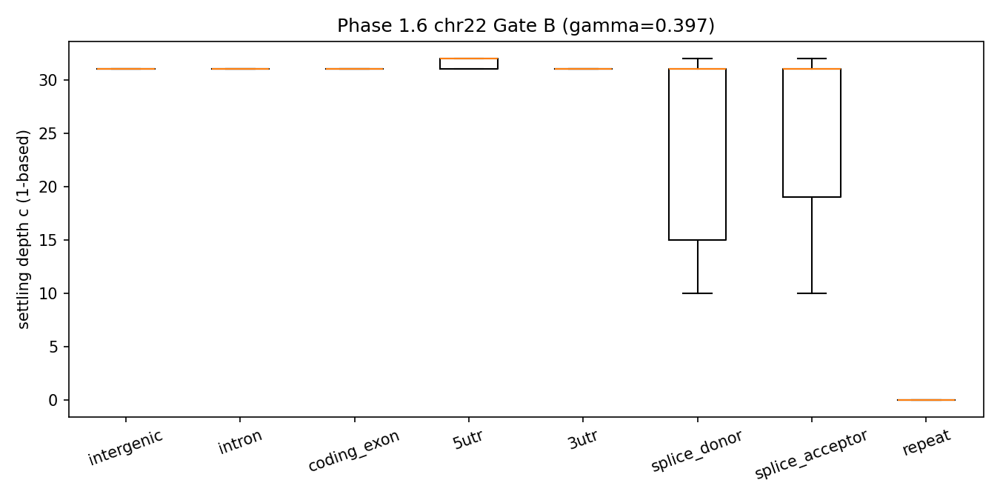
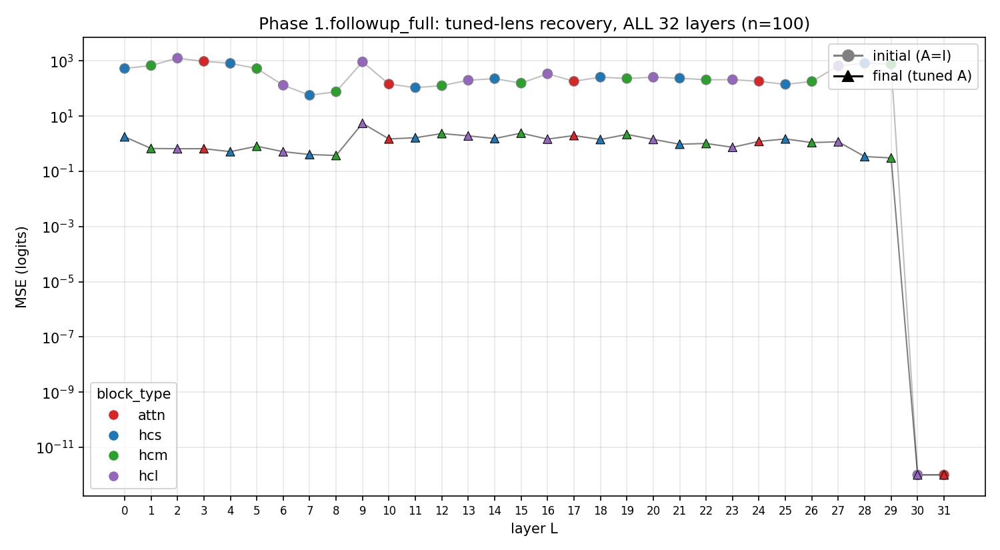

[🏠 Portfolio](https://github.com/heoneyzi) › [🩺 Medical](../../../../README.md) › [GDTR](../../../README.md) › [Line A](../../README.md) › **E1 · Evo 2 calibration**

# 🔬 E1 · Phase 1 — Evo 2 7B calibration on chr22

> **Question —** What does the lens need to work on Evo 2 7B, and is there a genome-scale signal on a whole chromosome?

<b>🇰🇷 한국어 요약</b>

Evo 2 7B(32개 블록)에 정착 깊이 지표를 옮기면서 기준값(γ = 0.397)을 22번 염색체에서 한 번 정하고 고정했습니다.
뜻밖에 마지막 블록(31번)은 입력을 그대로 통과시키는 "빈 블록"이어서, 비교 기준을 최종 정규화 이후의 상태로 바꿔야 했습니다.
염색체 전체(약 7,800만 위치)에서 스플라이스 부위가 인트론보다 약 2층 먼저 정착했지만, 엑손과 인트론의 차이는 작고 방향도 E0와 반대였습니다.
자로 비유하면 눈금의 0점과 끝점을 먼저 확인한 뒤 실제 길이를 잰 단계입니다.

| | |
|---|---|
| **Status** | ✅ done (2026-04-27) — 8/8 sub-stages pass their verifier (`scripts/verify_phase.py`) |
| **Model / data** | Evo 2 7B (`evo2_7b_base`, 8K context; attention blocks 3/10/17/24/31); 100 sanity sequences; chr22 12,978 × 6 kb windows (3 kb stride) = 77.9 M positions |
| **Compute** | one NVIDIA H200 141 GB, ~90 min for the chain (chr22 forward ~70 min) |
| **Headline** | splice donor c̄ = 25.57, acceptor 25.69 vs intron 27.82 at γ_cos = 0.397 |

## Setup

Pre-registered plan in [`docs/PHASE1_DECISIONS.md`](../../docs/PHASE1_DECISIONS.md). Stages 1.1–1.7 run as one chain ([`scripts/run_phase1_all.sh`](../../scripts/run_phase1_all.sh)) with an invariant check after each: untuned Gate A → γ calibration (q70 of the running minimum at the penultimate layer) → tuned lens → HP sweep → chr22 forward pass → Gate B on seven GENCODE contexts. A later follow-up fits a tuned lens at all 32 layers.

## Results

| Stage | Result | File |
|---|---|---|
| 1.1 untuned Gate A | monotonicity fails for every block type (M2_jsd 0.18–0.33 vs 0.85 threshold) | [`phase1.1/gate_a_evo_untuned.json`](../../results/phase1.1/gate_a_evo_untuned.json) |
| 1.2 tuned lens, last 2 blocks | MSE = 0 from epoch 1: h₃₀ = h₃₁ exactly — block 31 is an idle passthrough | [`phase1.2/training_curve.json`](../../results/phase1.2/training_curve.json) |
| 1.4 calibration | γ_cos (q70) = 0.3966; GC-matched 0.3962 vs shuffled 0.3968 | [`phase1.4/calibration.json`](../../results/phase1.4/calibration.json) |
| 1.5 HP sweep | best (γ, ρ) = (0.40, 0.80), *d* = 5.28 (GC-matched vs dinucleotide-shuffled) | [`phase1.5/best_hp.json`](../../results/phase1.5/best_hp.json) |
| 1.6 Gate B, chr22 | c̄: donor 25.57 · acceptor 25.69 · 3′UTR 27.72 · intron 27.82 · coding 28.26 · intergenic 28.75 · 5′UTR 29.00; exon vs intron *d* = −0.068 | [`phase1.6/gate_b.json`](../../results/phase1.6/gate_b.json) |
| 1.6 pairwise | strongest pair intergenic vs splice donor *d* = +0.540 (21 pairs, Bonferroni) | [`phase1.6_sub/pairwise_summary.json`](../../results/phase1.6_sub/pairwise_summary.json) |
| Follow-up, 32 layers | tuned-lens recovery ≥ 0.98 on 30/32 layers (worst L12 0.982; L29 0.9996); L30–31 degenerate | [`phase1.followup_full/verdict.json`](../../results/phase1.followup_full/verdict.json) |

<table><tr>
<td></td>
<td></td>
</tr><tr>
<td>Settling depth per context (1-based). Medians sit at 31–32; splice sites carry the early-settling tail — <code>phase1.6/F6_context_boxplot.png</code>.</td>
<td>Tuned-lens MSE before/after fitting at every layer; L30–31 are identical to the reference — <code>figures_v2/S2_tuned_lens_landscape.png</code>.</td>
</tr></table>

## Takeaway

- Evo 2's last block does nothing (max |h₃₀ − h₃₁| = 0) and block 30 performs the rotation into the output frame, so the lens uses the post-norm state as reference and L\* = 29 as the deepest interpretable tap.
- Splice sites are the clearest genome-scale signal (~2 layers earlier than intron); the exon/intron contrast is tiny (*d* = −0.068) and reversed relative to TP53/BRCA1 in E0.
- Most positions only cross γ at the last taps (medians 31–32), so context differences are driven by the early-settling tail — keep this in mind when reading mean differences.

## Files

| File | What it is |
|---|---|
| [`scripts/10_phase1_1_gate_a_evo.py`](../../scripts/10_phase1_1_gate_a_evo.py) … [`17_phase1_7_writeup.py`](../../scripts/17_phase1_7_writeup.py) | stage scripts 1.1–1.7 (`16_*` = chr22 forward and Gate B) |
| [`scripts/12b_phase1_followup_tuned_lens.py`](../../scripts/12b_phase1_followup_tuned_lens.py), [`12c_phase1_followup_full.py`](../../scripts/12c_phase1_followup_full.py) | 32-layer tuned-lens follow-up |
| [`src/ur_gdtr_evo2.py`](../../src/ur_gdtr_evo2.py), [`src/calibration.py`](../../src/calibration.py) | cosine lens with post-norm reference; q70 calibration |
| [`results/phase1.*`](../../results/), [`results/status/`](../../results/status/) | stage outputs and verifier sidecars |
| [`docs/findings/phase1_evo2_calibration.md`](../../docs/findings/phase1_evo2_calibration.md), [`docs/decisions/phase1_appendix_c.md`](../../docs/decisions/phase1_appendix_c.md) | full write-up; Evo 2 architecture facts from the smoke test |

---
[← E0](../E0_phase0_hyenadna/README.md) · [🏠 Portfolio](https://github.com/heoneyzi) · [E2 →](../E2_phase2_chr17_replication/README.md)
