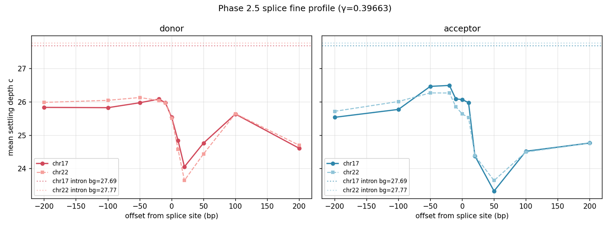

[🏠 Portfolio](https://github.com/heoneyzi) › [🩺 Medical](../../../../README.md) › [GDTR](../../../README.md) › [Line A](../../README.md) › **E2 · chr17 replication**

# 🔬 E2 · Phase 2 — chr17 multi-chromosome replication

> **Question —** Is the chr22 picture a single-chromosome artefact, or does it replicate on a second, gene-dense chromosome with the threshold frozen?

| | |
|---|---|
| **Status** | ✅ done (2026-04-28) — six sub-stages, verdicts auto-generated |
| **Model / data** | Evo 2 7B, γ_cos = 0.39663 frozen from chr22; chr17 (83.3 Mb) in 27,586 × 6 kb windows (165.5 M positions) |
| **Compute** | one H200, ~3 h forward pass |
| **Headline** | context ranking replicates (only intron ↔ 3′UTR swap, < 0.1 layer apart); chr17 donor profile minimum c̄ = 24.06 at +20 bp vs intron 27.69 |

## Setup

Same pipeline as E1 with no re-tuning: chr17 forward pass, Gate B (exon vs intron), per-context chr17-vs-chr22 comparison (KS tests on 200 k-position subsamples), gene-class stratification (cancer drivers vs other protein-coding genes) and a ±200 bp splice-site profile.

## Results

| Test | Result | File |
|---|---|---|
| Context means, chr17 | donor 25.55 · acceptor 26.08 · intron 27.69 · 3′UTR 27.77 · coding 28.50 · intergenic 28.63 · 5′UTR 29.34 — chr22 ranking except intron ↔ 3′UTR (chr22: 27.82 vs 27.72) | [`phase2.2/gate_b_chr17.json`](../../results/phase2.2/gate_b_chr17.json) |
| chr17 vs chr22 per context | \|Δ mean\| ≤ 0.38 layers for every context (KS *p* significant at this *n*) | [`phase2.3/cross_chr_comparison.json`](../../results/phase2.3/cross_chr_comparison.json) |
| Exon vs intron, chr17 | *d* = −0.124 — the chr22 direction (exon deeper) repeats | [`phase2.2/gate_b_chr17.json`](../../results/phase2.2/gate_b_chr17.json) |
| Splice profile | donor minimum 24.06 at +20 bp; acceptor minimum 23.33 at +50 bp; intron 27.69 | [`phase2.5/splice_chr17_profile.json`](../../results/phase2.5/splice_chr17_profile.json) |
| Cancer drivers vs other genes | TP53 + BRCA1 mean c 29.00 vs 27.72 (*d* = +0.87) but *n* = 2 genes, *p* = 0.14 | [`phase2.4/gene_class_stratification.json`](../../results/phase2.4/gene_class_stratification.json) |

Settling-depth profile around splice sites, chr17 vs chr22 — <code>results/phase2.5/F_splice_chr17_vs_chr22.png</code>.

## Takeaway

- The context ordering and the splice-site dip replicate on an independent chromosome without re-tuning — the basis for the paper's calibration/validation split (E10).
- The asymmetric splice profile (donor minimum on the exonic side, acceptor minimum on the intronic side) matches where splice-grammar features sit.
- The cancer-driver explanation for E0's direction is suggestive only (two genes); a larger driver set was left as future work.

## Files

| File | What it is |
|---|---|
| [`scripts/20_phase2_0_prep_chr17.py`](../../scripts/20_phase2_0_prep_chr17.py) … [`26_phase2_6_writeup.py`](../../scripts/26_phase2_6_writeup.py) | prep, forward, Gate B, cross-chromosome, gene class, splice profile, write-up |
| [`results/phase2.2`](../../results/phase2.2/) … [`phase2.5`](../../results/phase2.5/) | outputs and figures |
| [`docs/findings/phase2_chr17_replication.md`](../../docs/findings/phase2_chr17_replication.md), [`docs/decisions/phase2_decisions.md`](../../docs/decisions/phase2_decisions.md) | write-up and auto-generated verdicts |

---
[← E1](../E1_phase1_evo2_calibration/README.md) · [🏠 Portfolio](https://github.com/heoneyzi) · [E3 →](../E3_phase3_clinvar/README.md)
