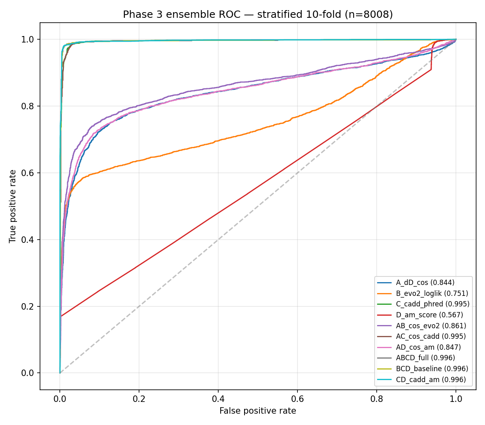

[🏠 Portfolio](https://github.com/heoneyzi) › [🩺 Medical](../../../../README.md) › [GDTR](../../../README.md) › [Line A](../../README.md) › **E3 · ClinVar variants**

# 🔬 E3 · Phase 3 — ClinVar variant pathogenicity

> **Question —** Does the change a variant causes in the layer-wise trajectory carry information about pathogenicity — beyond what Evo 2's own likelihood already says?

| | |
|---|---|
| **Status** | ✅ done (2026-04-28) — pilot → main → ensemble |
| **Model / data** | Evo 2 7B (`evo2_7b_base`), ±3 kb context; ClinVar (2026-04-18) SNVs in 15 cancer genes (BRCA1/2, TP53, EGFR, KRAS, BRAF, PIK3CA, APC, MLH1, MSH2, PTEN, RB1, VHL, ATM, PALB2): 3,514 P/LP + 4,494 B/LB + 2,902 VUS |
| **Compute** | one H200; main run ~5 h, 0 errors, 0 NaN |
| **Headline** | 32-d ΔD_cos AUROC **0.844** [0.831, 0.857]; with Evo 2 ΔLL **0.861** [0.851, 0.871], DeLong *p* = 3.6 × 10⁻¹⁵ |

## Setup

For each variant: forward the reference and alternate windows, compute the per-layer cosine-lens distance, and use the 32-dim difference vector ΔD_cos (and the JSD analogue) as features. Logistic regression with stratified 10-fold CV (seed 42), plus leave-one-gene-out (LOGO) CV; DeLong tests for paired AUROC differences; CADD and AlphaMissense as external references.

## Results

| Feature | Stratified AUROC [95 % CI] | LOGO mean AUROC | File |
|---|---|---|---|
| ΔD_cos vector (32-d) | **0.844** [0.831, 0.857] | 0.843 | [`phase3_main/main_results.json`](../../results/phase3_main/main_results.json) |
| ΔD_jsd vector (32-d) | 0.823 [0.813, 0.832] | 0.821 | same |
| Evo 2 Δ log-likelihood | 0.751 [0.738, 0.764] | 0.793 | same |
| ΔD_cos + Evo 2 ΔLL (33-d) | **0.861** [0.851, 0.871] | 0.866 | same |
| Pilot, TP53 + BRCA1 only (1,000 variants) | ΔD_cos 0.831 [0.799, 0.862] | — | [`phase3_pilot/pilot_results.json`](../../results/phase3_pilot/pilot_results.json) |

DeLong (stratified): ensemble vs ΔD_cos alone *p* = 3.6 × 10⁻¹⁵; ΔD_cos vs Evo 2 ΔLL *p* < 10⁻¹⁵ ([`phase3_ensemble/ensemble_results.json`](../../results/phase3_ensemble/ensemble_results.json)).

ROC comparison — <code>results/phase3_ensemble/F_phase3_ensemble_auroc.png</code>.

## Takeaway

- The layer-resolved trajectory carries pathogenicity information that Evo 2's likelihood alone does not (+0.017 AUROC, highly significant) and generalises across genes (LOGO ≈ stratified).
- In the paper this is a **sanity check** on information content, not a competing scorer: a plain hidden-state perturbation norm ‖Δh‖₂ does better (0.926, E6).
- CADD reaches 0.995 because it is trained on ClinVar-derived labels (circular), and AlphaMissense (0.568) only covers the missense subset (26 % of P/LP, 6 % of B/LB variants) — neither is a fair comparator here.

## Files

| File | What it is |
|---|---|
| [`scripts/prep_clinvar_15gene.py`](../../scripts/prep_clinvar_15gene.py), [`prep_phase3_stratify.py`](../../scripts/prep_phase3_stratify.py) | cohort construction (cap 350 per gene × class) |
| [`scripts/30_phase3_pilot.py`](../../scripts/30_phase3_pilot.py) … [`33_phase3_ensemble.py`](../../scripts/33_phase3_ensemble.py) | pilot, main forward pass, analysis, ensemble + DeLong |
| [`src/variant_delta.py`](../../src/variant_delta.py) | ΔD feature extraction |
| [`results/phase3_pilot/`](../../results/phase3_pilot/), [`phase3_main/`](../../results/phase3_main/), [`phase3_ensemble/`](../../results/phase3_ensemble/) | metrics, per-gene AUROC, VUS ranking, figures |
| [`docs/findings/phase3_variant_pathogenicity.md`](../../docs/findings/phase3_variant_pathogenicity.md) | write-up |

---
[← E2](../E2_phase2_chr17_replication/README.md) · [🏠 Portfolio](https://github.com/heoneyzi) · [E4 →](../E4_phase4_cross_architecture/README.md)
