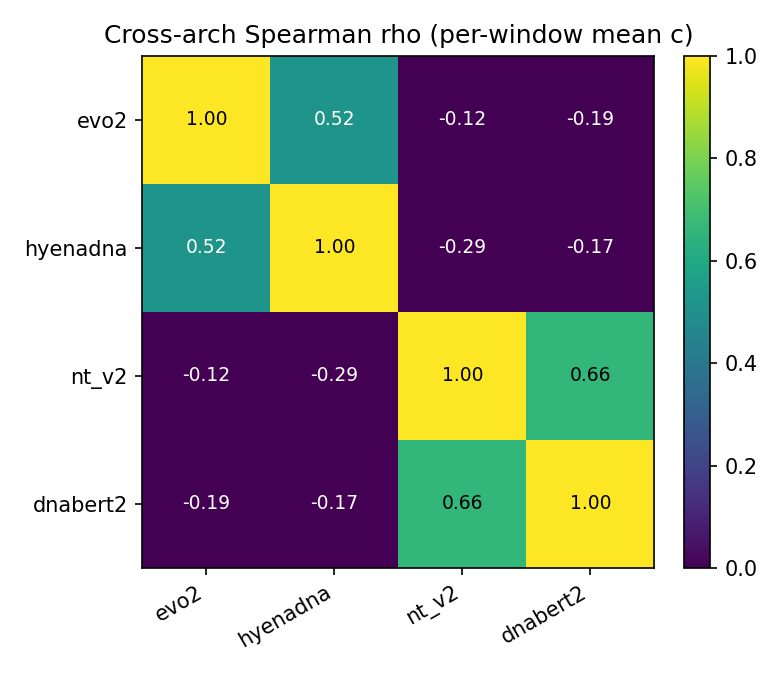

[🏠 Portfolio](https://github.com/heoneyzi) › [🩺 Medical](../../../../README.md) › [GDTR](../../../README.md) › [Line A](../../README.md) › **E4 · Cross-architecture**

# 🔬 E4 · Phase 4 — Four genomic foundation models

> **Question —** Is "splice sites settle early" a property of Evo 2 only, or of genomic language models in general?

| | |
|---|---|
| **Status** | ✅ done (2026-04-28) |
| **Model / data** | Evo 2 7B (32 blocks), HyenaDNA-large-1m (8), NT-v2 500M (29, 6-mer tokens), DNABERT-2 117M (12, BPE); identical chr22 12,978 × 6 kb windows; per-model γ = q70 |
| **Compute** | one H200, ~17 min for the three extra models (Evo 2 re-used) |
| **Headline** | donor < intron in both per-bp causal LMs; per-window ρ = +0.516 (Evo 2 ↔ HyenaDNA) and +0.663 (NT-v2 ↔ DNABERT-2), negative across families |

## Setup

The model-agnostic cosine lens (`src/ur_gdtr_xarch.py`) runs on each model's residual stream with its own q70 threshold (Evo 2 0.396, HyenaDNA 0.358, NT-v2 0.533, DNABERT-2 0.677). Per-position settling depth for the causal LMs; per-window means for the MLMs, whose tokens span several bases. Engineering notes: NT-v2 had to run in fp32 and DNABERT-2's bundled Triton kernel was replaced by the PyTorch fallback.

## Results

| Model | Readout | Donor / acceptor c̄ | Intron c̄ | File |
|---|---|---|---|---|
| Evo 2 7B | per position | 25.59 / 25.71 | 27.84 | [`phase4/per_model_summary.json`](../../results/phase4/per_model_summary.json) |
| HyenaDNA-large | per position | 6.55 / 6.62 | 6.89 | same |
| NT-v2 500M | per window | splice-containing 27.85 vs exon-dominant 27.80 | n/a | same |
| DNABERT-2 | per window | splice-containing 11.27 vs exon-dominant 11.28 | n/a | same |

Pairwise Spearman ρ of per-window mean depth ([`phase4/concordance_matrix.json`](../../results/phase4/concordance_matrix.json)): Evo 2–HyenaDNA **+0.516**, NT-v2–DNABERT-2 **+0.663**; cross-family pairs −0.119 to −0.287.

Two-tier structure of the four models — <code>results/phase4/F12_cross_arch_heatmap.png</code>.

## Takeaway

- The splice signal replicates in the per-bp causal LMs at very different scales (32 vs 8 blocks).
- For k-mer/BPE masked LMs the per-window readout blurs single-base junctions, so their "no difference" is a **resolution limit**, not a counter-example.
- Positive concordance only within families means the two architecture families find *different* positions shallow even when the splice ordering agrees.

## Files

| File | What it is |
|---|---|
| [`scripts/40_phase4_hyenadna_large.py`](../../scripts/40_phase4_hyenadna_large.py), [`41_phase4_nt_v2.py`](../../scripts/41_phase4_nt_v2.py), [`42_phase4_dnabert2.py`](../../scripts/42_phase4_dnabert2.py), [`43_phase4_concordance.py`](../../scripts/43_phase4_concordance.py) | per-model runs and concordance |
| [`src/ur_gdtr_xarch.py`](../../src/ur_gdtr_xarch.py) | model-agnostic lens |
| [`results/phase4/`](../../results/phase4/), [`figures_v2/F7_cross_architecture.png`](../../results/figures_v2/F7_cross_architecture.png) | summaries and figures |
| [`paper_figures/scripts/regen_fig_cross_arch_context_local.py`](../../paper_figures/scripts/regen_fig_cross_arch_context_local.py) | rebuilds paper Fig. A1/A2 from these JSONs |
| [`docs/findings/phase4_cross_architecture.md`](../../docs/findings/phase4_cross_architecture.md) | write-up |

---
[← E3](../E3_phase3_clinvar/README.md) · [🏠 Portfolio](https://github.com/heoneyzi) · [E5 →](../E5_phase5_conservation/README.md)
