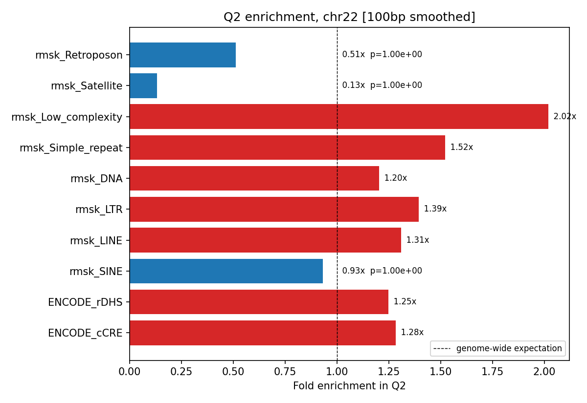

[🏠 Portfolio](https://github.com/heoneyzi) › [🩺 Medical](../../../../README.md) › [GDTR](../../../README.md) › [Line A](../../README.md) › **E5 · Conservation discordance**

# 🔬 E5 · Phase 5 — Settling depth vs evolutionary conservation

> **Question —** Where does the model "think deeply" about DNA that evolution does not conserve — and what is in those regions?

<b>🇰🇷 한국어 요약</b>

22번 염색체의 위치별 정착 깊이를 진화적 보존도(phyloP)와 겹쳐, "모델은 깊게 처리하지만 보존되지 않은" 영역(Q2)을 찾았습니다.
Q2는 염색체의 3.71%(5,090개 영역)였고 저복잡도 반복서열·LTR 같은 반복서열이 많았습니다.
처음에는 "보존되지 않은 새로운 기능 영역"일 수 있다고 봤지만, 이후 검증(E10)에서 알려진 기능 영역은 오히려 **얕게** 정착한다는 반대 결과가 나와 이 해석을 스스로 철회했습니다.
가설이 틀렸을 때 숨기지 않고 기록한 사례입니다.

| | |
|---|---|
| **Status** | ✅ done (2026-04-28); interpretation revised in E10 |
| **Model / data** | Evo 2 7B settling depth (E1) × phyloP 100-way on chr22 (50.8 Mb); 100 bp smoothing; ENCODE cCRE/rDHS, RepeatMasker |
| **Compute** | CPU on cached depths |
| **Headline** | Q2 (top-25 % depth × bottom-25 % phyloP) = 3.71 % of chr22 (1.9 Mb, 5,090 regions ≥ 100 bp); low-complexity repeats 2.02× enriched |

## Setup

Both tracks are smoothed over 100 bp, split at their quartiles into four quadrants, and Q2 = deep settling + low conservation. Enrichment of Q2 for repeat classes and ENCODE annotations is tested at base-pair level (one-sided hypergeometric). 71.2 % of chr22 has both signals.

## Results

| Annotation | Fold enrichment in Q2 | File |
|---|---|---|
| RepeatMasker low complexity | **2.02×** | [`phase5/q2_enrichment.json`](../../results/phase5/q2_enrichment.json) |
| simple repeat · LTR · LINE · DNA | 1.52× · 1.39× · 1.31× · 1.20× | same |
| ENCODE cCRE (all) · rDHS | 1.28× · 1.25× | same |
| SINE · satellite | 0.93× · 0.13× (depleted) | same |

Quadrant sizes (% of chr22): Q1 14.09 · **Q2 3.71** · Q3 39.30 · Q4 14.09; the Q2 regions are in [`phase5/q2_regions.bed`](../../results/phase5/q2_regions.bed).

Q2 enrichment by annotation class — <code>results/phase5/F_q2_enrichment.png</code>.

## Takeaway

- Deep-but-unconserved sequence is dominated by repeats (low complexity, LTR), i.e. by what is hard to predict locally, not obviously by function.
- The original "lineage-specific regulatory DNA" reading was **dropped** after the functional positive control in E10 showed known regulatory elements settle *earlier* (cCRE-ELS *d* = −0.190); on chr17 the SINE direction also flips (chr-specific repeat bias).
- The overlaps with eQTL/GWAS/cCRE-ELS reported in E7 are about Q2 regions, not a claim that Q2 is functional.

## Files

| File | What it is |
|---|---|
| [`scripts/50_phase5_conservation.py`](../../scripts/50_phase5_conservation.py), [`50b_phase5_smoothed.py`](../../scripts/50b_phase5_smoothed.py) | quadrant analysis and enrichment |
| [`scripts/p3b2_repeat_breakdown.py`](../../scripts/p3b2_repeat_breakdown.py), [`p3b3_q2_chr17.py`](../../scripts/p3b3_q2_chr17.py) | repeat-class breakdown; chr17 replication (revision) |
| [`results/phase5/`](../../results/phase5/) | enrichment JSON, Q2 BED, figures |
| [`docs/findings/phase5_conservation_discordance.md`](../../docs/findings/phase5_conservation_discordance.md) | write-up (pre-revision framing) |

---
[← E4](../E4_phase4_cross_architecture/README.md) · [🏠 Portfolio](https://github.com/heoneyzi) · [E6 →](../E6_tier1_variant_diagnostics/README.md)
