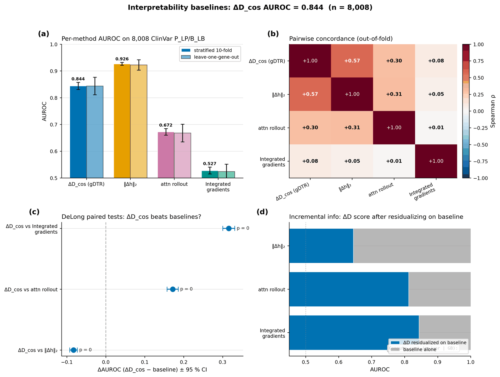

[🏠 Portfolio](https://github.com/heoneyzi) › [🩺 Medical](../../../../README.md) › [GDTR](../../../README.md) › [Line A](../../README.md) › **E6 · Variant diagnostics & baselines**

# 🔬 E6 · Tier 1 — Per-layer ablation, bootstrap stability, baselines, case studies

> **Question —** Where along depth does the variant signal live, how stable is it, and how does it compare with standard attribution baselines?

| | |
|---|---|
| **Status** | ✅ done (2026-04-28); CPU outputs independently re-derived (\|Δ\| < 0.001) |
| **Model / data** | same 8,008 ClinVar SNVs as E3 (3,514 P/LP, 4,494 B/LB, 15 genes) |
| **Compute** | CPU on cached features; baselines on one H200 |
| **Headline** | ‖Δh‖₂ **0.926** > ΔD_cos **0.844** > attention rollout 0.672 > integrated gradients 0.527 (stratified 10-fold AUROC) |

## Setup

- **T1.1 per-layer ablation:** single-layer logistic regression for every tap and both lenses; stratified 10-fold and leave-one-gene-out.
- **T1.2 baselines:** four single-family features on the identical split — ΔD_cos (32-d), hidden-state perturbation norm ‖Δh‖₂ (32-d), attention rollout (5 attention blocks), integrated gradients (1-d); DeLong tests.
- **T1.3 case studies:** three pathogenic variants, each paired with a nearby benign control.
- **T1.4 bootstrap:** 1,000 resamples of the pooled out-of-fold scores.

## Results

| Analysis | Result | File |
|---|---|---|
| Best single layer | JSD lens L29 **0.794**; cosine lens L30 **0.729**; 32-d vectors 0.823 / 0.844 | [`tier1_per_layer/summary.json`](../../results/tier1_per_layer/summary.json), [`per_layer_auroc.csv`](../../results/tier1_per_layer/per_layer_auroc.csv) |
| Head-to-head (95 % CI) | ‖Δh‖₂ 0.926 [0.921, 0.932] · ΔD_cos 0.844 [0.831, 0.857] · rollout 0.672 [0.660, 0.684] · IG 0.527 [0.515, 0.540] | [`tier1_baselines/baseline_auroc.json`](../../results/tier1_baselines/baseline_auroc.json) |
| Bootstrap | ΔD_cos 0.8436 [0.833, 0.853], std 0.0050; ensemble with Evo 2 ΔLL 0.8607 [0.851, 0.870] | [`tier1_bootstrap/summary.json`](../../results/tier1_bootstrap/summary.json) |
| Case studies | pathogenic max \|ΔD\| exceeds its paired benign control 11×, 8× and 1.5×; peak layers 7 (BRCA1 splice region), 28 (TP53 R175H), 24 (BRCA1 c.5266) | [`tier1_case_studies/case_studies.json`](../../results/tier1_case_studies/case_studies.json) |

Baseline comparison — <code>results/figures_v2/F4_baselines.png</code>.

## Takeaway

- The discriminative information is spread across layers (32-d ≫ best single layer by ≥ 0.05), which is why the lens keeps the whole trajectory.
- A raw perturbation norm beats the cosine trajectory as a *scorer*; the team split that result into a separate benchmark and kept ΔD_cos in the paper only as an information-content check.
- Three case studies are illustrative only; the paper later replaced them with population statistics over 4,023 variants (E10).

## Files

| File | What it is |
|---|---|
| [`scripts/40_t11_per_layer_ablation.py`](../../scripts/40_t11_per_layer_ablation.py), [`41_t14_bootstrap.py`](../../scripts/41_t14_bootstrap.py) | T1.1, T1.4 |
| [`scripts/44_t12_smoke.py`](../../scripts/44_t12_smoke.py) … [`48_t12_compare_pipeline.py`](../../scripts/48_t12_compare_pipeline.py) | T1.2 baselines (ΔH, rollout, IG, comparison) |
| [`scripts/44_t13_case_studies.py`](../../scripts/44_t13_case_studies.py) | T1.3 |
| [`results/tier1_*`](../../results/), [`results/_verification/`](../../results/_verification/) | outputs; independent re-derivation report |
| [`docs/findings/tier1_extensions.md`](../../docs/findings/tier1_extensions.md) | write-up |

---
[← E5](../E5_phase5_conservation/README.md) · [🏠 Portfolio](https://github.com/heoneyzi) · [E7 →](../E7_tier2_robustness/README.md)
