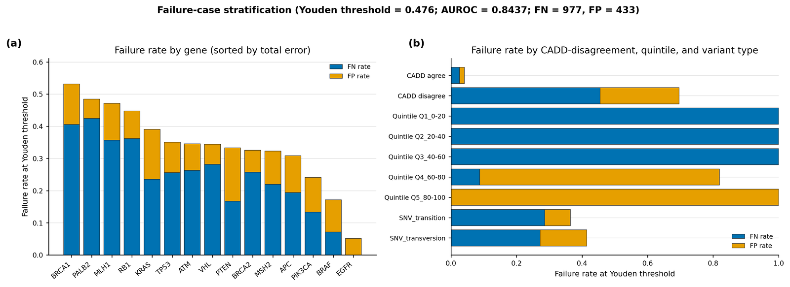

[🏠 Portfolio](https://github.com/heoneyzi) › [🩺 Medical](../../../../README.md) › [GDTR](../../../README.md) › [Line A](../../README.md) › **E7 · Robustness**

# 🔬 E7 · Tier 2 — Sensitivity, failure modes, compute cost, Q2 overlaps

> **Question —** Do the variant results depend on arbitrary modelling choices, where does the classifier fail, what does the lens cost to run, and do E5's Q2 regions overlap known functional annotations?

<b>🇰🇷 한국어 요약</b>

E3·E5 결과가 설정 선택에 흔들리지 않는지, 어디서 틀리는지, 비용은 얼마인지 점검했습니다.
분류기 설정 9가지를 바꿔도 AUROC 차이는 0.0017에 불과했고, 오류는 특정 유전자(PALB2, BRCA1)와 CADD 점수와 의견이 갈리는 변이에 몰려 있었습니다.
계산 비용은 변이당 약 0.5초로 다른 해석 기법과 비슷했고, 적분 그래디언트는 약 3배 느렸습니다.
자동차로 치면 연비·고장 기록·정비 비용을 함께 점검한 단계입니다.

| | |
|---|---|
| **Status** | ✅ done (2026-04-28) |
| **Model / data** | E3's 8,008 ClinVar SNVs; E5's 5,090 Q2 regions on chr22; GTEx v8 eQTL, GWAS Catalog, ENCODE cCRE-ELS (chr22) |
| **Compute** | CPU, plus a 100-variant GPU cost benchmark on one H200 |
| **Headline** | 9 classifier settings → AUROC 0.8421–0.8438 (range 0.0017) |

## Results

| Analysis | Result | File |
|---|---|---|
| Hyper-parameter grid (L1 / L2 / elastic-net × C) | AUROC 0.8421–0.8438 | [`tier2_sensitivity/hp_grid.csv`](../../results/tier2_sensitivity/hp_grid.csv) |
| Operating point | Youden threshold 0.476: sensitivity 0.722, specificity 0.904 | [`tier2_failure/youden_threshold.json`](../../results/tier2_failure/youden_threshold.json) |
| Where it fails | false-negative rate highest for PALB2 (0.42) and BRCA1 (0.41); 0.46 when CADD disagrees vs 0.026 when it agrees | [`tier2_failure/failure_breakdown.csv`](../../results/tier2_failure/failure_breakdown.csv) |
| Cost per variant | ΔD_cos 0.54 s · ‖Δh‖₂ 0.52 s · rollout 0.52 s · integrated gradients (8 steps) 1.75 s; peak VRAM 16–20 GB | [`tier2_compute/cost_benchmark.csv`](../../results/tier2_compute/cost_benchmark.csv) |
| Q2 ∩ annotations (bp fold enrichment) | cCRE-ELS **1.90×** · eQTL 1.62× (*p* = 5.4 × 10⁻⁵⁶) · GWAS 1.50× (*p* = 1.6 × 10⁻⁷); each above all 100 shuffles | [`tier2_q2_functional/summary.json`](../../results/tier2_q2_functional/summary.json) |

Failure analysis — <code>results/figures_v2/S6_failure_analysis.png</code>.

## Takeaway

- The variant AUROC is not an artefact of classifier tuning, and the lens is as cheap as other single-pass attribution methods.
- Errors concentrate where an orthogonal predictor (CADD) also disagrees with ClinVar — hard cases, not random noise.
- The Q2 overlap enrichments are real at base-pair level, but E10's functional positive control reverses the direction expected for "functional" DNA, so they are not read as functional discovery.

## Files

| File | What it is |
|---|---|
| [`scripts/42_t22_hp_sensitivity.py`](../../scripts/42_t22_hp_sensitivity.py), [`43_t23_failure_analysis.py`](../../scripts/43_t23_failure_analysis.py), [`49_t24_cost.py`](../../scripts/49_t24_cost.py), [`tier2_q2_functional.py`](../../scripts/tier2_q2_functional.py) | the four Tier 2 analyses |
| [`results/tier2_*`](../../results/) | outputs (large BED intersections omitted) |
| [`results/figures_v2/S1_hp_sensitivity.png`](../../results/figures_v2/S1_hp_sensitivity.png) | sensitivity figure |
| [`docs/findings/tier2_extensions.md`](../../docs/findings/tier2_extensions.md) | write-up |

---
[← E6](../E6_tier1_variant_diagnostics/README.md) · [🏠 Portfolio](https://github.com/heoneyzi) · [E8 →](../E8_entropy_control/README.md)
