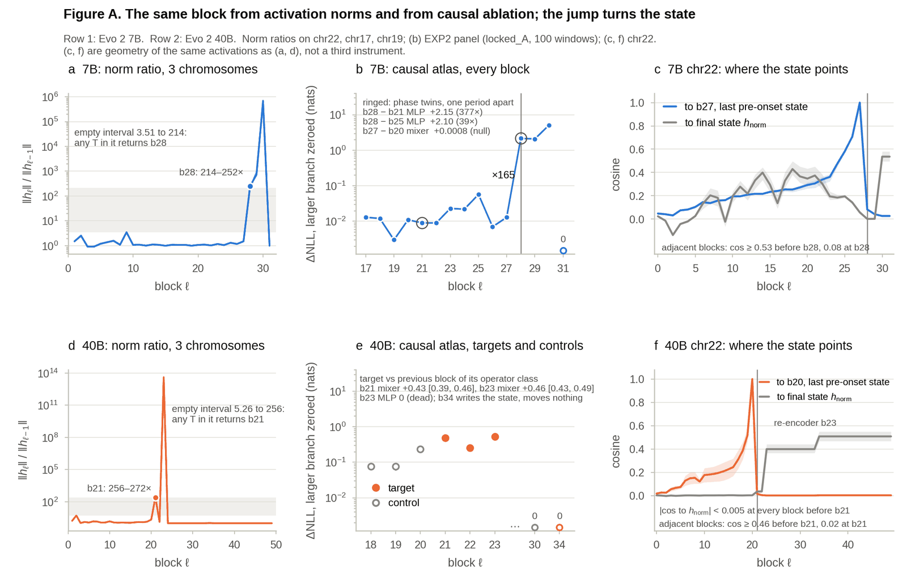
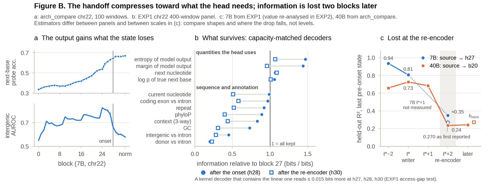
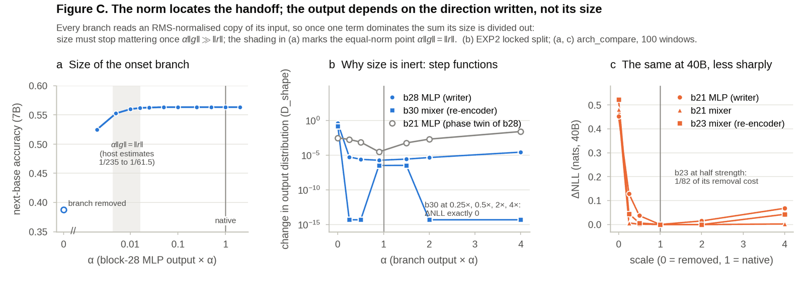
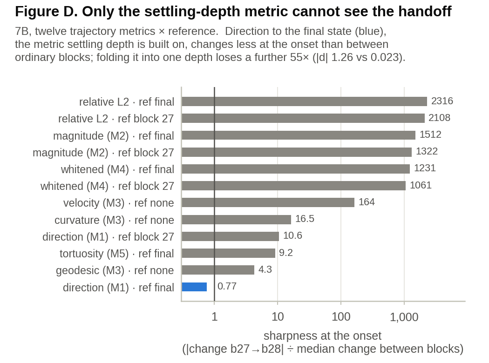

<sub>[🏠 Portfolio](https://github.com/heoneyzi) › [🩺 Medical](../../README.md) › [GDTR](../README.md) › **Line C · Handoff**</sub>

# 🧪 Line C · The representation-to-output handoff in Evo 2 *(ongoing)*

Every depth readout in Lines A–B changes abruptly near the top of Evo 2 7B. This line asks what happens there, causally — and whether the late stack **discards** the earlier computation (a baton pass) or **summarises** it into what the output head needs.

  

> [!WARNING]
> **Ongoing, unpublished work.** This is Jiheon's current paper project. Code, result files, figures and the internal result summaries are included; the manuscript and draft text are not. Numbers are internal results, not peer-reviewed claims, and may change.

<details>
<summary><b>🇰🇷 한국어 요약</b></summary>

Evo 2 7B의 28–30번 블록에서는 내부 표현의 크기가 수백~수십만 배로 뛰고, 선형 probe로 읽히던 유전체 문맥 정보가 급격히 줄어듭니다.
이 연구는 그 구간이 앞 층의 계산을 **버리는 바통터치**인지, 출력에 필요한 형태로 **요약하는 과정**인지를 인과 실험으로 가립니다.
지금까지의 결과는 "요약"에 가깝습니다: 28번 블록 직후의 상태는 앞 상태로부터 여전히 81% 복원되고, 다음 염기 예측과 모델 자신의 확신도 정보는 오히려 늘어나며, 실제 정보 손실은 30번 블록에서 일어납니다.
비유하자면 긴 보고서를 넘겨받은 사람이 원문을 버리는 게 아니라, 결론에 필요한 부분만 남긴 요약본을 만드는 과정입니다.
최종 목표는 이 요약을 거꾸로 따라가 입력 서열에서 새로운 특징(모티프 등)을 찾는 것입니다(EXP3, 설계 단계).

</details>

## 🧭 The event

In Evo 2 7B (32 blocks), block 28's MLP writes an update ~235× the size of the stream it joins (**onset / writer**; block-output norm ratio 214–252×), block 30's mixer rewrites the state into the output frame (**re-encoder**, norm ×7 · 10⁵), and block 31 contributes nothing. Before the onset, genomic context is linearly readable; after it, next-base prediction keeps improving while context readability falls. The same pattern appears at block 21 → 23 of the 40B model and 22 → 23 of the 1B model.

## 🔬 Experiments

| # | Question | Key result | Folder |
|---|---|---|---|
| C0 | Where is the event, across chromosomes, scales and models? | onset b28 (7B) and b21 (40B) on chr22/17/19; detector abstains on HyenaDNA and NT-v2 | [arch_compare](arch_compare/README.md) |
| C1 | Is the cosine collapse loss, dilution or overwrite — and what survives? | a denominator effect (\|p\| ×78.5 while ‖h‖ ×241.7); h28 → h27 recoverable R² 0.808 vs 0.270 after block 30; head-relevant quantities survive, annotation decays | [EXP1](exp1/README.md) |
| C2 | What does each late block do, causally? | writer b28 (2.153 nats, 377× its phase twin) → re-encoder b30 (MLP exactly dead) → idle b31; size is causally inert; one coordinate (#3756) is a confidence channel in 7B only | [EXP2](exp2/README.md) |
| C3 | Can the summary be traced back to input sequence? | design + dry run with sealed configs; 38 tests pass; no scientific results yet | [EXP3](exp3/README.md) |

<p align="center"></p>
<p align="center"><sub>A · Three views of the same block: activation-norm ratio, causal branch ablation, and where the state points (7B top, 40B bottom).</sub></p>

<p align="center"></p>
<p align="center"><sub>B · The handoff compresses toward what the head needs; information becomes unrecoverable two blocks later.</sub></p>

<table><tr>
<td></td>
<td></td>
</tr><tr>
<td><sub>C · The norm locates the handoff, but the output depends on the direction written, not its size.</sub></td>
<td><sub>D · The direction-to-final-state metric that settling depth is built on is the only one of twelve that cannot see the onset.</sub></td>
</tr></table>
<p align="center"><sub>Figures rebuilt by <a href="figures/figs.py"><code>figures/figs.py</code></a> from <code>arch_compare/results</code> and the EXP1/EXP2 summaries; plotted values in <a href="figures/figure_data.json"><code>figure_data.json</code></a>.</sub></p>

## 🙋 My contribution

This is Jiheon's ongoing paper project. He drives the follow-up program EXP1 → EXP2 → EXP3 — research plans in his folder (not republished); pre-registered predictions and audit corrections are recorded in the EXP1/EXP2 summaries — around his working hypothesis that the handoff is a *summary* whose content can be traced back to input features. `arch_compare` holds the base measurements that the program builds on.

## 🗂️ Map

```text
handoff/
├── arch_compare/   scripts + JSON results: onset detection, cross-model/scale runs, 40B atlas, downstream tasks
├── exp1/           code (package + configs) and docs/EXP1_summary_ko.md
├── exp2/           code (exp2 package) and docs/EXP2_summary_ko.md
├── exp3/           code (design, sealed configs, tests, dry-run report)
└── figures/        figs.py, figure_data.json, figA–D
```

> [!IMPORTANT]
> **Scope notes** — All claims are about the models (Evo 2 1B/7B/40B), not biology. Resampling is by window (overdispersion χ²/df ≈ 472 makes position-level *p*-values meaningless), so no position-level *p*-values are reported. 40B conclusions are weights-only or from the smaller arch_compare atlas; the confidence-channel result is 7B-specific; several pre-registered predictions failed and are reported in the summaries.

---
<sub>[← cos_lens](../tdig/cos_lens/README.md) · [🏠 Portfolio](https://github.com/heoneyzi) · [arch_compare →](arch_compare/README.md)</sub>
