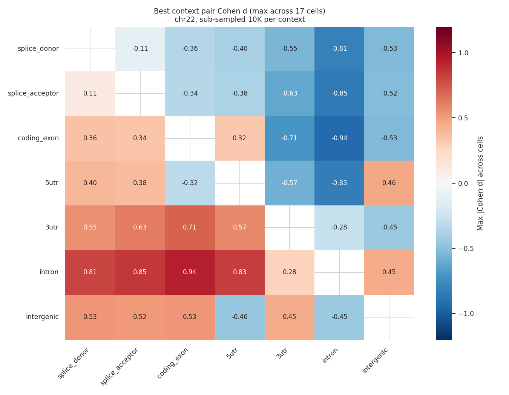
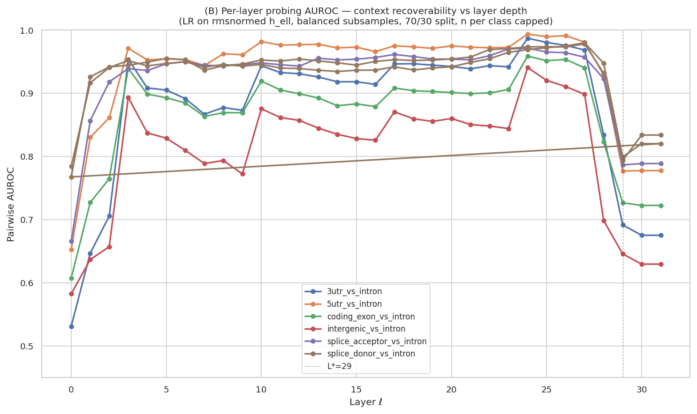

[🏠 Portfolio](https://github.com/heoneyzi) › [🩺 Medical](../../README.md) › [GDTR](../README.md) › **Line B · TDiG**

# 🔬 Line B · TDiG — from one settling metric to 17 settling cells

> **Question —** Does a single direction-based settling depth miss structure that other geometric views of the same residual trajectory would catch — and where along depth does Evo 2 change regime?

  

<b>🇰🇷 한국어 요약</b>

TDiG(Think Deep in Genome)는 GDTR의 "방향(코사인) 한 가지" 정착 지표를 다섯 가지 기하 지표 × 세 가지 기준 = 17개 "정착 셀"로 넓힌 팀 후속 프로젝트입니다(YAICON 8회, 팀 띵디지놈).
한 번의 순전파로 17개 값을 모두 계산하며, 22번 염색체에서 정한 기준을 17번 염색체에 적용해도 효과의 순위가 거의 그대로(ρ = 0.989) 유지되었습니다.
여러 측정이 공통적으로 28–29층에서 급격한 변화를 보였는데(선형 probe 성능 급락, 선형 근사 붕괴), 이 관찰이 Line C(handoff) 연구의 출발점이 되었습니다.
여러 각도에서 찍은 사진을 겹쳐 보면 한 장의 사진으로는 안 보이던 굴곡이 보이는 것과 같습니다.
저는 팀원으로 참여했고, 코사인 렌즈의 정당성을 따로 검증한 [`cos_lens`](cos_lens/README.md) 확장은 제 포크에만 있습니다.

| | |
|---|---|
| **Status** | ✅ done (May–Jul 2026) — YAICON 8th; the team repository reports **1st prize** ([`TEAM_README.md`](TEAM_README.md)) |
| **Team** | 띵디지놈 (Think Deep in Genome): Yoonjin Cho (lead), Minseok Kim, Minseon Koo, **Jiheon Kang**, Jaeyun Sim |
| **Model / data** | Evo 2 7B; chr22 (12,978 windows) + chr17 (27,586 windows); 10,910 ClinVar variants in 15 cancer genes; HyenaDNA-medium for cross-architecture |
| **Compute** | single H200, ~60–75 min for the three-phase pipeline ([`docs/reproduction.md`](docs/reproduction.md)); caches ~120 GB (not included) |
| **Headline** | chr22 → chr17 Spearman ρ = **0.989** over 13 cells, median retention **97.2 %**; donor-vs-intron probe AUROC **0.978 → 0.794** from L27 to L29 |

> [!NOTE]
> **Provenance.** Copy of the team repository [YAICON-8th-Think-Deep-in-Genome/TDiG](https://github.com/YAICON-8th-Think-Deep-in-Genome/TDiG) (MIT, © 2026 Yoonjin Cho and contributors — [`LICENSE`](LICENSE)) plus the `cos_lens` extension (`scripts/wcl/`, `results/wcl/`, [`cos_lens/`](cos_lens/README.md)) that exists only in Jiheon's fork. Server addresses, local paths and a personal e-mail were redacted; PDF duplicates and large per-variant tables were dropped.

## Setup

One forward pass per window stores the residual stream at all 32 blocks; each token then gets 17 settling values from five metric families × reference variants ([`docs/metric_definitions.md`](docs/metric_definitions.md), [`METRICS_GUIDE.md`](METRICS_GUIDE.md)):

| Family | Measures | Cells |
|---|---|---|
| M1 direction | cosine settling to the reference (GDTR's lens), persistence *W* = 3 | refs A, B, C |
| M2 magnitude | residual-norm ratio (diagnostic) | ref A (B, C degenerate) |
| M3 trajectory | standardised velocity + curvature, reference-free | 5 α/β cells |
| M4 whitened distance | Ledoit–Wolf-whitened distance to the reference | refs A, B, C |
| M5 tortuosity | remaining path length ÷ straight-line distance | refs A, B, C |

Reference variants A/B/C differ in how RMSNorm is applied to the state and the reference. Thresholds are calibrated once on chr22 ([`data_cache_minimal/population_stats/gamma_calibration_v2.json`](data_cache_minimal/population_stats/gamma_calibration_v2.json)) and frozen.

## Results

| Analysis | Result | File |
|---|---|---|
| chr17 replication | ρ(d₂₂, d₁₇) = 0.989 over 13 non-degenerate cells; median retention 97.2 %; every cell keeps its sign in the table | [`chr17_replication/retention_table.csv`](results/chr17_replication/retention_table.csv), [`retention_summary.json`](results/chr17_replication/retention_summary.json) |
| Context separation (7 × 7) | best cell per pair: coding exon vs intron *d* = −0.936, splice donor vs intron −0.810 (both M3 trajectory); M3 cells win 11 of 21 pairs, M5 tortuosity 6 | [`context_separation/best_cell_per_pair.csv`](results/context_separation/best_cell_per_pair.csv) |
| Linear probes per layer | donor vs intron AUROC 0.978 (L27) → 0.932 (L28) → 0.794 (L29); 7-class mean F1 0.709 (L24) → 0.461 (L28) → 0.289 (L29) | [`analysis_BD/per_layer_auroc.csv`](results/analysis_BD/per_layer_auroc.csv), [`multitask_per_position/per_layer_metrics.csv`](results/multitask_per_position/per_layer_metrics.csv) |
| Linear layer-to-layer maps | fit R² 0.916 (L27→28) → −6.18 (L28→29) → −237 (L29→30); 1.000 for L30→31 (idle block) | [`L29_svd/alignment_metrics.json`](results/L29_svd/alignment_metrics.json) |
| Variant readout | ‖Δh‖ AUROC peaks at L8 (0.855, 8,008 variants) and dips across L28–L30 (0.734 at L28); 64-d layer-resolved classifier 0.949 (logistic) / 0.950 (GBM), 5-fold CV | [`variant_analysis_scalars/`](results/variant_analysis_scalars/), [`vus_reclassification/classifier_metrics.csv`](results/vus_reclassification/classifier_metrics.csv) |
| Random-ALT control | at L8 pathogenic ΔH ≈ a random substitution at the same position (ratio 1.03, *p* = 0.58); benign variants perturb *less* than random (0.62) | [`random_alt_control/comparison_summary.csv`](results/random_alt_control/comparison_summary.csv) |
| Settling cells as scorers | \|Δc\| AUROC 0.50–0.64 for all cells — interpretability features, not scorers | [`variant_settling_cells/cell_auroc.csv`](results/variant_settling_cells/cell_auroc.csv) |
| Intron outliers | top 0.5 % M5_tau_refB intron positions: 21.0 % within ±200 bp of a splice site vs 7.8 % random (2.70×) | [`intron_outlier/summary.json`](results/intron_outlier/summary.json) |
| Robustness | 12 of 15 cells stable across γ = q50/q70/q90 (the two that flip have \|d\| < 0.1); HyenaDNA-medium donor-vs-intron *d* = −0.138, same sign as Evo 2 (−0.81) | [`gamma_ablation/summary.json`](results/gamma_ablation/summary.json), [`hyenadna_crossarch/`](results/hyenadna_crossarch/comparison_vs_evo2.json) |

<table><tr>
<td></td>
<td></td>
</tr><tr>
<td>Best cell per context pair, chr22 (10,000 positions per context) — <code>context_separation/</code>.</td>
<td>Linear-probe AUROC per layer; every task drops at L28–L29 — <code>analysis_BD/per_layer_auroc.png</code>.</td>
</tr></table>

## Takeaway

- The trajectory family (M3) separates contexts far better than the direction lens alone, and the whole 17-cell picture transfers to a second chromosome.
- Several independent readouts break at the same place: probes and linear maps fall at **L28–L29**, variant readouts dip across **L28–L30**, block 31 is idle — a late-stack regime change that Line C ([handoff](../handoff/README.md)) investigates causally.
- Variant ΔH at its best layer tracks *position sensitivity* more than allele-specific biology (random-ALT control), and settling cells are weak scorers — the value is in *where* effects appear, not in beating scorers.

## Files

| File | What it is |
|---|---|
| [`src/tdig/`](src/tdig/) | metric (M1–M6), reference, gate, analysis and plotting modules |
| [`scripts/10_*` … `36_*`](scripts/) | population statistics → forward passes → analyses (one script per `results/` folder); [`run_pipeline.sh`](scripts/run_pipeline.sh) |
| [`results/RESULTS_v3.md`](results/RESULTS_v3.md) | the team's analysis tracker (inputs, scripts, findings) |
| [`docs/`](docs/), [`PLAN.md`](PLAN.md), [`METRICS_GUIDE.md`](METRICS_GUIDE.md) | thesis, metric definitions, design decisions, reproduction guide |
| [`TEAM_README.md`](TEAM_README.md) | the team's original README (kept verbatim) |
| [`cos_lens/`](cos_lens/README.md) | Jiheon's "why a cosine lens?" study (scripts in `scripts/wcl/`, results in `results/wcl/`) |

> [!IMPORTANT]
> **Scope notes** — Two headline counts in the team README differ from the result files: "M3 wins 13/21" is **11/21** in `best_cell_per_pair.csv`, and "sign preserved 13/13" is 13/13 in `retention_table.csv` but 10 in `retention_summary.json`; probe values here are taken from the CSVs (0.978 → 0.794, the tracker quotes 0.980 → 0.799). The late-stack change spans L28–L30 rather than a single layer.

---
[← Line A · gDTR-PoC](../gdtr-poc/README.md) · [🏠 Portfolio](https://github.com/heoneyzi) · [cos_lens →](cos_lens/README.md)
