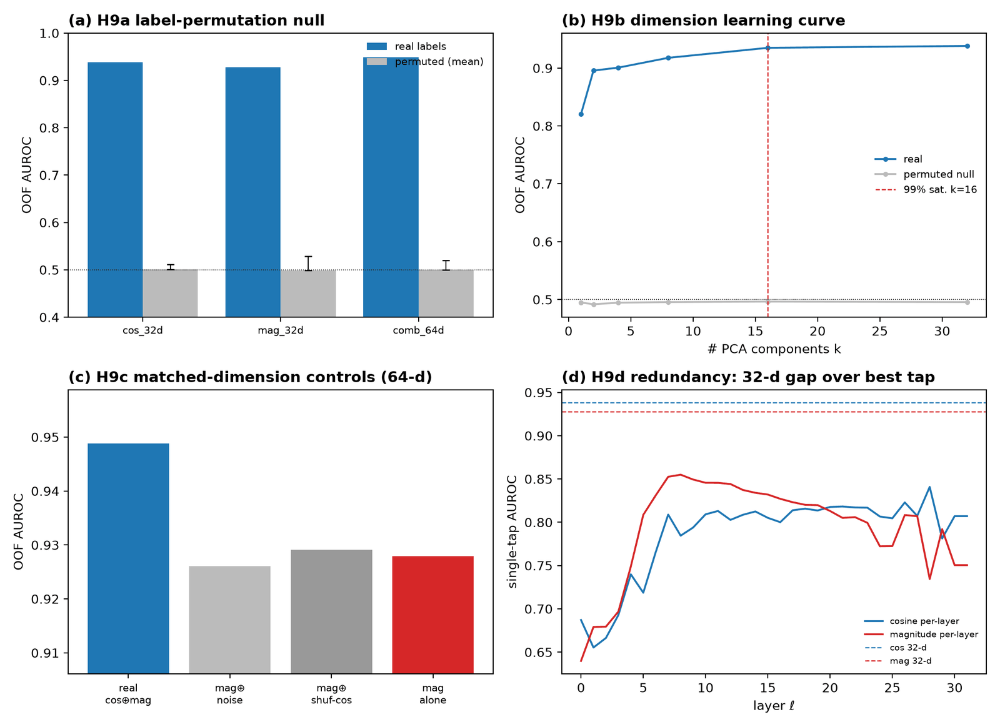
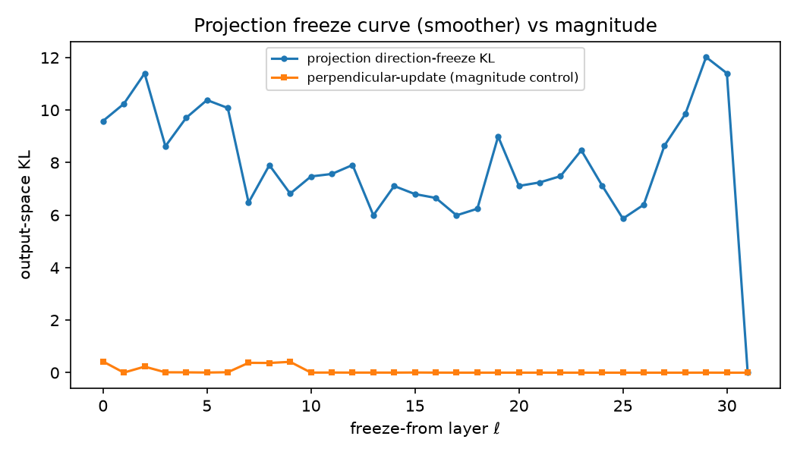

[🏠 Portfolio](https://github.com/heoneyzi) › [🩺 Medical](../../../README.md) › [GDTR](../../README.md) › [Line B · TDiG](../README.md) › **cos_lens**

# 🔬 cos_lens · Why a cosine lens, and why all 32 layers?

> **Question —** GDTR reads settling with the *cosine* between each layer and the final post-norm state. Is that a principled choice — does the model actually compute with direction rather than magnitude, is the reference special, and is the 32-layer profile real signal rather than extra dimensions?

 

| | |
|---|---|
| **Status** | ✅ done — exploratory follow-up in Jiheon's fork of the TDiG repository (not in the team repository) |
| **Model / data** | Evo 2 7B; TDiG chr22 settling tables and raw hidden states (100 windows); 8,008 labelled ClinVar SNVs; 60 variants for patching; 10,240 tokens for the freeze experiment |
| **Compute** | GPU forward passes with block hooks (experiments 4, 7, 10); others on cached tables |
| **Headline** | freezing a block update's **direction** changes the output **133×** more than freezing its magnitude; equal-budget direction patches move the output 40–145× more than magnitude patches |

## Setup

Ten experiments (`wcl01`–`wcl10` in [`../scripts/wcl/`](../scripts/wcl/)), each a pre-specified test of one link in the argument: (A) magnitude/distance lenses are ill-posed for settling, (B) direction localises while magnitude scores, (C) the model is causally direction-driven, (D) `h_norm` is a functional reference, (E) the 32-layer profile is real signal. Experiment 8 was not run (memory limits); experiment 10 replaces it with a causal version. The full Korean report is [`cos_lens_report_ko.md`](cos_lens_report_ko.md).

## Results

| # | Test | Result | File |
|---|---|---|---|
| 1 | Magnitude vs cosine settling | magnitude: CV 0.017, 100 % of tokens in the top two layers, exon vs intron *d* = +0.11 (*p* = 0.088); cosine: CV 0.246, *d* = −0.345 (*p* = 3.3 × 10⁻⁸) | [`exp1_pilot/pilot_summary.json`](../results/wcl/exp1_pilot/pilot_summary.json) |
| 2 | Rogue dimensions | top-8 coordinates hold 0.76 % of variance at L29 but 96 % at L15 and 90 % at L24; the standardisation re-test was **not** run | [`exp2/variance_concentration.json`](../results/wcl/exp2/variance_concentration.json) |
| 3b | Localisation vs scoring | 32-d AUROC cosine 0.938 ≈ magnitude 0.935, combined 0.945 (both increments' CIs exclude 0) | [`exp3b/decomposition_summary.json`](../results/wcl/exp3b/decomposition_summary.json) |
| 4 | Equal-budget patching, output KL | direction ÷ magnitude = 145× (L12), 144× (L20), 96× (L24), 39× (L27); direction above an on-manifold null at every layer | [`exp4_v2_FIXED/causal_effect_summary.json`](../results/wcl/exp4_v2_FIXED/causal_effect_summary.json) |
| 6 | Lens necessity matrix | only the cosine lens is bounded, reference-anchored *and* well-posed; trajectory is the strongest discriminator (*d* = −0.889) but has no reference | [`exp6/necessity_matrix.md`](../results/wcl/exp6/necessity_matrix.md) |
| 7 | Readout & proxy | readout is scale-invariant (max JS 2.8 × 10⁻⁵); cosine settling tracks JSD commitment (ρ = 0.869, 98.8 % within one layer) — partly by construction | [`exp7_v2/proxy_resolution_summary.json`](../results/wcl/exp7_v2/proxy_resolution_summary.json) |
| 9 | Dimensionality nulls | real 0.938 vs label-permuted 0.500; order-invariant summary 0.866; layer-shuffled 0.830 | [`exp9_quick/dimensionality_nulls_summary.json`](../results/wcl/exp9_quick/dimensionality_nulls_summary.json) |
| 10 | Causal settling coincidence | direction/magnitude freeze KL **133×**; causal commit layer correlates with `h_norm`-anchored cosine settling (ρ = 0.158 at τ = 0.05) but not random (−0.014) or mid-layer (−0.016) references; exact coincidence weak (≤ 0.27, τ-unstable) | [`exp10_fc/causal_settling_coincidence.json`](../results/wcl/exp10_fc/causal_settling_coincidence.json) |

<table><tr>
<td></td>
<td></td>
</tr><tr>
<td>32-layer cosine features vs permutation, dimension and shuffle nulls — <code>results/wcl/exp9_quick/</code>.</td>
<td>Output change when the direction (or magnitude) of block updates is frozen from layer ℓ on — <code>results/wcl/exp10_fc/</code>.</td>
</tr></table>

## Takeaway

- The case for the cosine lens rests on construct validity — the model reads direction, direction is causally dominant, and only the cosine lens gives a bounded, reference-anchored settling time — not on it being the best classifier.
- The layer profile is information, not capacity: permuting labels kills it and shuffling layer order costs 0.108 AUROC.
- Not established: that the cosine settling layer *is* the causal commit layer (weak, threshold-dependent correlation), and rogue-dimension robustness at mid-stack layers. Sample sizes for the patching test are small (60 variants).

## Files

| File | What it is |
|---|---|
| [`../scripts/wcl/wcl00_shared_lens_utils.py`](../scripts/wcl/wcl00_shared_lens_utils.py) | shared lens / hook utilities (with a mock Evo 2 for CPU checks) |
| [`../scripts/wcl/wcl01_*` … `wcl10_*`](../scripts/wcl/) | the ten experiments (v2 = corrected re-runs) |
| [`../results/wcl/`](../results/wcl/) | JSON summaries and figures per experiment (a 1.9 MB per-window CSV from exp 1 was left out) |
| [`cos_lens_report_ko.md`](cos_lens_report_ko.md) | full report with methods, results and limitations (Korean) |

---
[← Line B · TDiG](../README.md) · [🏠 Portfolio](https://github.com/heoneyzi) · [Line C · handoff →](../../handoff/README.md)
