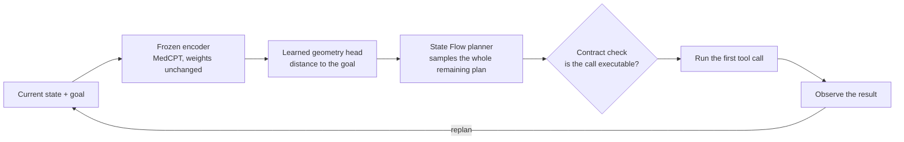
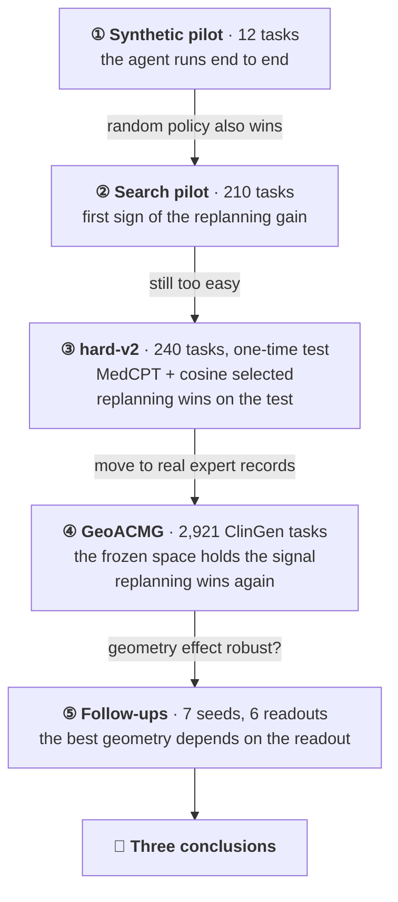

<sub>[🏠 Portfolio](https://github.com/heoneyzi) › [🩺 Medical](../README.md) › **GeoFlowAgent**</sub>

<div align="center">

# 🧭 GeoFlowAgent

### A genomics tool-use agent that plans in a frozen embedding space

**Can an agent plan multi-step genomics tool use on top of frozen biomedical encoders — and does observing each tool result and replanning beat planning the whole workflow at once?**

    

[🤖 The agent](#-what-the-agent-does) · [🪜 Five stages](#-five-stages-at-a-glance) · [🏁 Conclusion](#-conclusion) · [🔬 Stage pages](experiments/README.md) · [📚 연구 안내 (KR)](docs/README.md) · [✅ Verification](verification/README.md) · [💻 Code](src/README.md)

</div>

> [!TIP]
> **TL;DR** — GeoFlowAgent is a tool-using agent for genomic variant interpretation. Frozen biomedical encoders (MedCPT and others) turn each workflow state into vectors, a small learned geometry head scores how close a state is to the goal, and a flow-matching planner proposes the whole remaining plan; the agent runs the first tool, observes the result and replans. Five experimental stages — from a 12-task pilot to 2,921 tasks built from ClinGen expert records — lead to three conclusions: **observing and replanning is the dependable win** (goal completion 0.4028 vs 0.1233 one-shot on the held-out synthetic test; 0.5993 vs 0.1169 on 584 ClinGen development tasks), **frozen encoders carry execution information that a learned readout exposes**, and **the "best" distance geometry depends on how the space is read**.

| | |
|---|---|
| **Period** | Sep 2026 |
| **Team** | Solo — independent research project |
| **My role** | Posed the research questions, designed the staged evaluation, ran the GPU experiments and analysed the results |
| **Stack** | Python · PyTorch · Hugging Face Transformers · frozen encoders (MedCPT, Qwen2.5-1.5B/7B, SapBERT, DNABERT-2) · rectified flow · exact search · cluster-bootstrap statistics · pytest |
| **Status** | ✅ Completed — five stages, from a synthetic pilot to ClinGen expert records |

<p align="center"></p>
<p align="center"><sub>Left — goal completion by planning mode (hard-v2 held-out test, 48 tasks × 3 seeds; ClinGen tasks, 584 task roots). Right — cosine − Euclidean differences over 7 seeds with seed-clustered 95% CIs. Drawn by <code>assets/make_figures.py</code> from the saved result files.</sub></p>

## 🤖 What the agent does

A variant-interpretation workflow is a chain of tool calls: check how common the variant is in populations, run in-silico predictors, look up clinical assertions, check the gene's disease mechanism and the variant's molecular consequence — then decide. Every call costs something, and in expert records many calls return evidence that does not apply (ClinGen records it as **Not Met**). The agent's job is to pick, at each step, the call that brings it closer to a decision.



| Part | What it does | In plain words |
|---|---|---|
| **Frozen encoder** | MedCPT (plus Qwen2.5, SapBERT, DNABERT-2 in early stages) embeds each state field at a pinned revision; only small heads are trained | reuses what biomedical models already know |
| **Geometry head** | A goal-conditioned network scores the distance from a state to the goal; cosine, Euclidean, Poincaré, directed-quasimetric and pair-MLP energies are compared | a learned map of "how far is this from done" |
| **State Flow planner** | A rectified-flow model samples future state paths toward the goal (idea from [FlowAgent](https://arxiv.org/html/2605.07339v2)) | sketches the whole route |
| **Replanning loop + contracts** | Runs the first step, observes, replans; symbolic contracts (assembly, version, schema, preconditions) decide whether a call is executable | takes one step, looks, adjusts |

Training and grading use **exact search**: each environment is small enough to search completely, which gives the minimum remaining cost V\*, action values Q\* and regret for every state. The agent is therefore scored against *all* optimal actions, not one reference trajectory.

## 🪜 Five stages at a glance

Each stage was designed from what the previous one could not show.



| Stage | Why this stage | What was tested | Result | Led to |
|---|---|---|---|---|
| [**① Synthetic pilot**](experiments/01_synthetic_v1/README.md)<br><sub>12 tasks</sub> | Check that the whole agent — frozen encoder → geometry → flow planner → tools — runs end to end | Frozen Qwen2.5 / MedCPT / SapBERT / DNABERT-2 views, six distance families, closed-loop agent | Runs end to end; the learned metric ranks valid actions well (**0.8551**), yet a random policy with exact contracts and a correct STOP also solved every test task | A benchmark that can credit the model |
| [**② Search pilot**](experiments/02_search_pilot/README.md)<br><sub>210 tasks</sub> | Label every state by exact search and add costly or dead-end tools, so contracts stop giving the answer away | Value geometry, DAgger, State Flow: one-shot vs observe→replan vs compute-matched blind replanning | First sign of the replanning effect — **0.8630** vs 0.5731 one-shot vs 0.0859 blind — while a random policy still reached 41/41 | A harder benchmark |
| [**③ hard-v2**](experiments/03_hard_v2/README.md)<br><sub>240 tasks · 50 tools · 3,042 snapshots</sub> | Separate the ingredients on a benchmark hard enough, with every choice made on dev and a pre-registered one-time test | 9 geometries, 12 input views, capacity controls, DAgger, State Flow | One well-chosen frozen view (MedCPT) beats fusing all views, and plain cosine is enough: test policy accuracy **0.8010** vs 0.6875 for the reference; goal completion **0.4028** replan vs 0.1233 one-shot vs 0.0000 blind | Real expert records |
| [**④ GeoACMG**](experiments/04_geoacmg_dev/README.md)<br><sub>2,921 ClinGen tasks</sub> | Run the agent on real variant-interpretation evidence, where many tool calls return evidence that does not apply | Tool-need check, probes of the frozen space, raw vs learned distances, 5 geometries × seeds, State Flow on the 584-task development split | Tasks need several tool families (gap **0.6898**); MedCPT states hold execution information (probe R² **0.3355**) that raw distances order only at chance (≈0.50); goal completion **0.5993** replan vs 0.1169 one-shot vs 0.0274 blind | Robustness checks of the geometry effect |
| [**⑤ Follow-ups**](experiments/05_geoacmg_followups/README.md)<br><sub>7 seeds · 6 readouts</sub> | Test whether "cosine beats Euclidean" survives more seeds and other readouts, and whether the agent really uses MedCPT | 7 training seeds, readout ladder, information-source and MedCPT ablations | Cosine's ordering lead is **+0.1523** under its own energy, +0.0197 under standardized cosine and −0.0368 under whitening; removing MedCPT raises regret **+0.0441** | The three conclusions |

## 🏁 Conclusion

1. **Observe → replan is the dependable win.** Running one step, reading the result and replanning beat planning everything at once on hard-v2's held-out test (0.4028 vs 0.1233) and on the ClinGen tasks (0.5993 vs 0.1169). A blind replanner with the same planner calls but no observations collapses (0.0000 and 0.0274), so the gain comes from the observations themselves.
2. **Frozen encoders carry execution information, and a learned readout exposes it.** Linear probes find remaining-cost and next-action information in frozen MedCPT states (R² 0.3355; action accuracy 0.5523 vs 0.2896 for a permutation null). Raw cosine, L2 and dot-product distances order states at chance (0.5055 / 0.5078 / 0.4966), while small learned heads recover the ordering (up to 0.8266). Zeroing MedCPT worsens regret by +0.0441, so the agent does use it.
3. **The best geometry depends on the readout.** Cosine's lead over Euclidean is large under each model's own energy (+0.1523), shrinks to +0.0197 under standardized cosine and reverses under whitening (−0.0368); across six readouts, four of the five geometry families rank first at least once. Choosing the input view and the readout matters more than choosing an exotic distance.

**Why the study concludes here.** After stage ⑤ every open question had an answer. The replanning effect had passed hard-v2's pre-registered one-time test and appeared again on the ClinGen tasks. The geometry question settled the other way: the winner changed with the readout and the training seed. The ClinGen test split is reserved for a single confirmation of one stable, pre-registered claim, and the stage-⑤ results showed that no single geometry claim was stable enough to be that claim — so the study closes on the three findings above. The question they point to next, whether replanning also saves *real* tool cost, calls for live genomics tools with measured costs (the MARRVEL protocol prepared in [`configs/`](configs/README.md)) rather than the offline replay of expert records used here.

## 📊 Key results

**③ hard-v2 — pre-registered one-time test** (48 held-out synthetic tasks; [stage page](experiments/03_hard_v2/README.md))

| Measure | Selected agent (MedCPT-only + cosine, 3 seeds) | Pre-registered reference | Paired Δ [95% CI] |
|---|---:|---:|---|
| Optimal-set policy accuracy ↑ | **0.8010** | 0.6875 | +0.1198 [+0.0708, +0.1682] |
| Episode success, clean | 0.6667 | 0.6458 | random policy with contracts: 0.5000 |

| Goal completion | One-shot plan | **Observe → replan** | Blind replan (same compute, no observations) |
|---|---:|---:|---:|
| hard-v2 test | 0.1233 | **0.4028** | 0.0000 |
| ④ ClinGen tasks (584 roots) | 0.1169 | **0.5993** | 0.0274 |

On the ClinGen tasks, replan − one-shot is +0.4824 [0.4439, 0.5223]. Better state ranking moved whole-episode success less than it moved ranking: under perturbation the random policy with contracts also reached 0.6667.

**④–⑤ GeoACMG — what the frozen space holds and how it is read** ([stage ④](experiments/04_geoacmg_dev/README.md), [stage ⑤](experiments/05_geoacmg_followups/README.md))

| Question | Result |
|---|---|
| Do the tasks need several tools? | The best single tool family covers only part of the corpus: gap **0.6898** [0.6323, 0.7391] |
| Is execution information in frozen MedCPT states? | Remaining-cost probe R² **0.3355** (random projection −0.0173); next-action accuracy 0.5523 vs 0.2896 null |
| Do raw distances expose it? | cosine 0.5055 · L2 0.5078 · dot 0.4966 — chance level |
| Is "cosine beats Euclidean" robust? (7 seeds) | Ordering +0.1523 under own energy, +0.0197 [−0.0180, 0.0485] standardized, −0.0368 whitened; policy +0.0068 with seed CI [−0.0033, 0.0153] and gene CI [0.0016, 0.0148] |
| Where does the ordering signal come from? | A training-free structured-state hash alone orders states at 0.7054, about the same as with MedCPT added (0.7040) |
| Does the agent use MedCPT? | Zeroing it raises regret **+0.0441** (run CI [0.0260, 0.0631], gene CI [0.0011, 0.0683]) |

<table>
<tr>
<td></td>
<td></td>
</tr>
<tr>
<td><sub>hard-v2 held-out test. Source: <code>results/hard_v2/final_reports/</code>.</sub></td>
<td><sub>The "best" geometry changes with the readout. Source: <code>results/geoacmg_working_findings/</code>.</sub></td>
</tr>
</table>

**Scope.** hard-v2 is a synthetic benchmark with a pre-registered one-time test. GeoACMG replays ClinGen expert records (Met / Not Met evidence) as offline snapshots with fixed tool costs (probe 1.0, report 0.5), and its numbers come from the 584-task development split. Every number on this page is read from the result files named on the stage pages and recomputed by [`verification/verify_portfolio.py`](verification/README.md).

## 🧩 Design principles

- **Frozen representations** — encoders at pinned revisions with field-wise, checksummed embedding caches; only small heads are trained.
- **Exact-search supervision** — V\*, Q\*, regret and optimal-action sets for every reachable state.
- **Matched controls** — hash embeddings with matched parameters, capacity-matched heads with identical initial trunks, a random policy with contracts, and a compute-matched blind replanner.
- **Evidence rules in code** — pre-registration, a sealed test split with a hash-chained access ledger, paired cluster-bootstrap CIs; an interval that includes 0 is reported as `UNRESOLVED` ([`claims.py`](src/geoflowagent/geoacmg/claims.py), [`cited.py`](src/geoflowagent/geoacmg/cited.py)).

## 🙋 My contribution

- Framed the project as two linked questions — *can a frozen model's embedding space guide tool use, and how do we prove it?* and *does an agent planning in that space beat calling the tools one by one?* ([00_ORIENTATION.md](docs/original/geoacmg/00_ORIENTATION.md)).
- Built on latent flow-matching planning (FlowAgent) as a conceptual reference and re-implemented the agent on public frozen encoders ([THIRD_PARTY.md](THIRD_PARTY.md)).
- Designed the staged evaluation — synthetic pilot → search-distilled benchmark → pre-registered hard-v2 → ClinGen-based GeoACMG → seed, readout and ablation follow-ups — each stage built from the previous stage's audit.
- Set the evidence rules the code enforces: paired intervals, cited decision constants, `UNRESOLVED` when a CI includes 0, and a test split used only once.
- Ran the GPU experiments and analyses, and kept negative results and corrections in the record.

## 🗂️ Folder guide

| If you want to… | Open |
|---|---|
| understand the study in five minutes | this page |
| read it in Korean, stage by stage (why → what → result) | [`docs/README.md`](docs/README.md) — 연구 안내 |
| see one stage in detail, with its files | [`experiments/`](experiments/README.md) — one page per stage |
| check where a number comes from | [`results/`](results/README.md) and [`verification/`](verification/README.md) |
| read or run the code | [`src/`](src/README.md) · [`tests/`](tests/README.md) · [`configs/`](configs/README.md) |

```text
GeoFlowAgent/
├── README.md             ← overview (you are here)
├── experiments/          ← stage pages ①–⑤: why, setup, results, files
├── docs/                 ← 연구 안내 (Korean guide) · research notes · original design documents
├── results/              ← saved outputs of every stage (JSON and Markdown reports)
├── verification/         ← scripts that recompute the headline numbers, with saved outputs
├── assets/               ← figures and make_figures.py
├── src/geoflowagent/     ← the agent library (83 modules)
├── tests/                ← 34 test modules
├── configs/              ← one YAML per experiment family (pinned model revisions)
├── scripts/              ← runners for stages ①–③
├── scripts_run/          ← runners and analyses for stages ④–⑤
├── data/                 ← small synthetic fixtures and JSON schemas
├── provenance/           ← experiment catalogue and checkpoint catalogue
└── pyproject.toml · uv.lock · THIRD_PARTY.md
```

## ♻️ Reproduce

```bash
# Recompute the headline numbers from the saved results (NumPy only, a few seconds)
python verification/verify_hard_v2.py      # hard-v2 test means, paired task deltas, flow means
python verification/verify_portfolio.py    # GeoACMG 7-seed and ablation CIs from per-run files + number check of every page
python assets/make_figures.py              # redraw every figure from results/ (matplotlib)

# Library and tests (Python 3.10–3.12)
uv sync --frozen --extra dev --extra eval  # or: pip install -e ".[dev,eval]"
PYTHONPATH=src pytest                      # 295 passed, 1 skipped
geoflow run-all --config configs/smoke.yaml --evaluation-split test   # CPU smoke run on the bundled fixtures
```

The GPU experiments use the frozen encoders from Hugging Face at the revisions pinned in `configs/`, plus the large artifacts (ClinGen export, embedding caches, checkpoints, readout-margin arrays) kept in the local research archive; checkpoint hashes are listed in [`provenance/checkpoint_catalog.csv`](provenance/checkpoint_catalog.csv). Step-by-step instructions: [docs/research/05_REPRODUCIBILITY.md](docs/research/05_REPRODUCIBILITY.md).

## 🔗 Links

- Inspiration: *Tools as Continuous Flow for Evolving Agentic Reasoning* (FlowAgent) — [arXiv 2605.07339](https://arxiv.org/html/2605.07339v2); reference code: [ssy166/FlowPlan](https://github.com/ssy166/FlowPlan) ([how this implementation differs](docs/original/geoacmg/FLOWPLAN_REFERENCE_AUDIT.md))
- Data: [ClinGen Evidence Repository](https://erepo.clinicalgenome.org/evrepo/) · next benchmark: [MARRVEL-MCP benchmark data](https://huggingface.co/datasets/hjeong84/marrvel-mcp-benchmark-data)
- Related in this portfolio: [01_Medical/GDTR](../GDTR/README.md) (interpretability of genomic foundation models) · [03_Study/Genomics](https://github.com/heoneyzi/Study/blob/main/Genomics/README.md)

---
<sub>[← Prev: Bi-CoT](https://github.com/heoneyzi/Paper/blob/main/Bi-CoT/README.md) · [🏠 Portfolio](https://github.com/heoneyzi) · [Next: GDTR program →](../GDTR/README.md)</sub>
