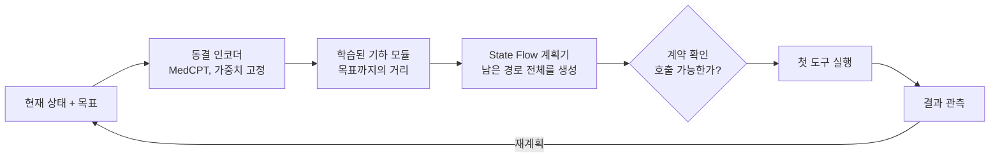
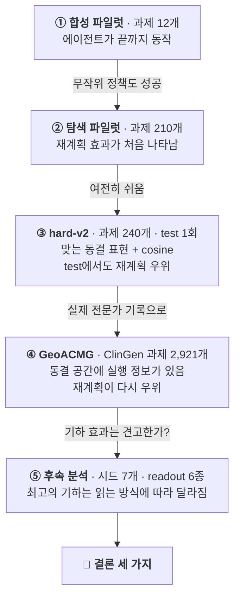

[🏠 Portfolio](https://github.com/heoneyzi) › [🩺 Medical](../../README.md) › [GeoFlowAgent](../README.md) › **연구 안내**

# 📚 GeoFlowAgent 연구 안내

> **한 줄 요약** — 동결된 생의학 언어모델의 임베딩 공간 위에서 유전체 분석 도구 사용을 계획하는 **AI 에이전트**를 만들고, 다섯 단계의 실험으로 "무엇이 실제로 도움이 되는가"를 확인한 개인 연구입니다.

**목차** · [1. 에이전트](#1-에이전트는-무엇을-하나) · [2. 실험 5단계](#2-실험-5단계--왜-무엇을-무엇을-얻었나) · [3. 결론](#3-결론-세-가지) · [4. 마무리한 이유](#4-왜-여기서-마무리했나) · [5. 용어](#5-용어) · [6. 더 읽을 문서](#6-더-읽을-문서)

## 1. 에이전트는 무엇을 하나

유전 변이 하나를 해석하려면 여러 도구를 차례로 불러야 합니다. 이 변이가 사람들 사이에서 얼마나 흔한지(집단 빈도), 단백질 기능을 망가뜨릴 것 같은지(in-silico 예측), 다른 기관은 어떻게 판정했는지(임상 기록), 이 유전자가 어떤 방식으로 병을 일으키는지(유전자 기전)를 확인한 뒤에야 판정을 내립니다. 도구를 부를 때마다 비용이 들고, 전문가 기록을 보면 불러 봤지만 쓸 수 있는 근거가 없었던 경우(**Not Met**)도 많습니다. 에이전트는 매 단계 "지금 어떤 도구를 불러야 판정에 가까워지는가"를 골라야 합니다.

| 구성 요소 | 하는 일 | 비유 |
|---|---|---|
| **동결 인코더** | MedCPT 같은 생의학 언어모델이 현재 상태를 벡터로 바꿉니다. 모델 가중치는 그대로 두고 작은 모듈만 학습합니다. | 이미 공부를 마친 전문가의 눈 |
| **기하(geometry) 모듈** | 현재 상태가 목표에서 얼마나 먼지 점수를 매기는 작은 신경망입니다. cosine, Euclidean, Poincaré 등 여러 "거리"를 비교했습니다. | 목적지까지 남은 거리를 알려 주는 지도 |
| **State Flow 계획기** | 목표까지 가는 미래 상태의 경로 전체를 한 번에 생성합니다. [FlowAgent](https://arxiv.org/html/2605.07339v2)의 아이디어를 가져왔습니다. | 전체 경로 스케치 |
| **재계획 루프 + 계약** | 첫 단계만 실행하고 결과를 본 뒤 다시 계획합니다. 계약(contract)이 그 호출이 실행 가능한지 규칙으로 확인합니다. | 한 걸음 가고, 확인하고, 경로를 고침 |

학습과 채점에는 **정확 탐색**을 썼습니다. 각 환경을 끝까지 탐색해 모든 상태의 최소 잔여 비용(V\*), 행동별 비용(Q\*), 최적 행동 대비 추가 비용(regret)을 계산하므로, 에이전트는 정답 경로 하나가 아니라 **모든 최적 행동**을 기준으로 평가받습니다.

## 2. 실험 5단계 — 왜, 무엇을, 무엇을 얻었나

각 단계는 앞 단계가 보여 주지 못한 것을 확인하도록 설계했습니다.

### ① 합성 파일럿 · 12개 과제 → [자세히](../experiments/01_synthetic_v1/README.md)

- **왜** — 무엇이든 측정하기 전에, 동결 인코더 → 학습된 거리 → flow 계획기 → 도구 실행까지 에이전트 전체가 끝까지 도는지부터 확인했습니다.
- **무엇을** — 유전체 분석을 본뜬 합성 과제 12개와 도구 8개. Qwen2.5-1.5B/7B, MedCPT, SapBERT, DNABERT-2를 동결해 쓰고 거리 6종을 비교했습니다.
- **결과** — 파이프라인은 끝까지 동작했고, 학습된 거리는 올바른 행동을 잘 골랐습니다(0.8551). 그런데 계약과 올바른 STOP만 주면 무작위 정책도 모든 test 과제를 풀었습니다.
- **그래서** — 계약이 정답을 거의 알려 주는 환경에서는 모델의 기여를 잴 수 없습니다. 모델의 기여를 가려낼 수 있는 벤치마크가 필요했습니다.

### ② 탐색 파일럿 · 210개 과제 → [자세히](../experiments/02_search_pilot/README.md)

- **왜** — 계약이 정답을 알려 주지 않도록 비싸거나 막다른 도구를 넣고, 모든 상태의 정답을 정확 탐색으로 계산했습니다.
- **무엇을** — 절차적으로 생성한 210개 과제에서 value geometry, DAgger, State Flow를 학습하고, 한 번에 계획하기 · 관측 후 재계획 · 같은 계산량의 blind 재계획을 비교했습니다.
- **결과** — 재계획 효과가 처음 나타났습니다: 관측 후 재계획 0.8630, 한 번에 계획 0.5731, blind 0.0859. 동시에 무작위 정책도 41/41을 성공했습니다.
- **그래서** — 여전히 쉬운 문제였기 때문에 더 어려운 벤치마크(hard-v2)를 만들었습니다.

### ③ hard-v2 · 240개 과제, 도구 50개 → [자세히](../experiments/03_hard_v2/README.md)

- **왜** — 표현·기하·DAgger·재계획 중 무엇이 실제로 도움이 되는지 가려낼 만큼 어렵게 만들고, 모든 선택을 dev에서 끝낸 뒤 사전등록한 test를 한 번만 평가했습니다.
- **무엇을** — 기하 9종, 파라미터 수를 맞춘 입력 조합 12개, 해시 임베딩 대조군, DAgger, State Flow를 비교했습니다.
- **결과** — 모든 표현을 합치는 것보다 MedCPT 하나를 고르는 편이 좋았고, 단순한 cosine이면 충분했습니다. test 정책 정확도 **0.8010**(사전등록 기준 모델 0.6875), 목표 완수율 재계획 **0.4028** vs 한 번에 0.1233 vs blind 0.0000.
- **그래서** — 합성 환경에서 답이 나왔으니, 다음은 실제 전문가 기록이었습니다.

### ④ GeoACMG · ClinGen 과제 2,921개 → [자세히](../experiments/04_geoacmg_dev/README.md)

- **왜** — ClinGen은 적용된 근거(Met)와 검토 후 기각된 근거(Not Met)를 모두 기록합니다. 불렀지만 쓸모없는 도구 호출이 실제로 있는 환경이라, 계획이 가장 중요해지는 곳입니다.
- **무엇을** — 전문가 기록으로 변이 해석 과제 2,921개를 만들고, 도구 필요성 진단 · 동결 공간 probe · 원시 거리와 학습된 거리 비교 · 기하 5종 × 시드 · State Flow를 584개 개발(dev) 과제에서 분석했습니다.
- **결과** — 한 종류의 도구로는 풀 수 없는 과제가 대부분이었습니다(격차 **0.6898**). MedCPT 벡터에는 실행 정보가 있었지만(probe R² **0.3355**) 원시 거리로는 우연 수준(약 0.50)으로만 읽혔습니다. 목표 완수율은 재계획 **0.5993** vs 한 번에 0.1169 vs blind 0.0274.
- **그래서** — 기하 사이의 정렬 차이는 컸지만 행동 차이는 작았고, 새 시드에서는 방향이 뒤집혔습니다. 기하 효과가 견고한지 따로 확인해야 했습니다.

### ⑤ 후속 분석 · 시드 7개, readout 6종 → [자세히](../experiments/05_geoacmg_followups/README.md)

- **왜** — "cosine이 Euclidean보다 낫다"가 학습 시드와 공간을 읽는 방식(readout)을 바꿔도 유지되는지, 에이전트가 MedCPT를 실제로 쓰는지 확인했습니다.
- **무엇을** — 학습 시드 7개(시드 기준과 유전자 기준의 신뢰구간), 동결 공간 readout 사다리, 정보원 분리, MedCPT 제거 재학습을 진행했습니다.
- **결과** — cosine의 정렬 우위는 자기 에너지로 읽을 때 **+0.1523**, 표준화 cosine으로 읽으면 +0.0197, whitening으로 읽으면 −0.0368이었습니다. 기하 5종 × readout 6종에서 1위 기하가 4번 바뀌었습니다. MedCPT를 지우면 regret이 **+0.0441** 나빠졌습니다.
- **그래서** — 아래의 결론 세 가지로 정리했습니다.

## 3. 결론 세 가지

1. **관측 후 재계획이 가장 확실한 개선입니다.** 한 단계를 실행하고 결과를 본 뒤 다시 계획하는 방식이, 처음에 계획 전체를 세우는 방식보다 hard-v2 test(0.4028 vs 0.1233)와 ClinGen 과제(0.5993 vs 0.1169) 모두에서 크게 앞섰습니다. 같은 계산량으로 다시 계획하되 결과를 보지 않는 blind 방식은 실패했으므로(0.0000, 0.0274), 효과는 계산량이 아니라 **관측** 자체에서 나옵니다.
2. **동결 모델의 공간에는 실행 정보가 있고, 학습된 readout이 그 정보를 읽어 냅니다.** 선형 probe는 동결 MedCPT 벡터에서 남은 비용과 다음 행동 정보를 찾았습니다(R² 0.3355, 행동 정확도 0.5523 vs 우연 0.2896). 원시 cosine·L2·내적 거리는 상태를 우연 수준으로만 정렬했고(0.5055 / 0.5078 / 0.4966), 작은 학습 모듈은 정렬을 되살렸습니다(최대 0.8266). MedCPT를 지우면 regret이 +0.0441 나빠지므로 에이전트는 이 정보를 실제로 씁니다.
3. **가장 좋은 기하는 읽는 방식에 따라 달라집니다.** cosine의 우위는 자기 에너지로 읽을 때 크지만(+0.1523), 표준화 cosine에서는 +0.0197로 줄고 whitening에서는 뒤집힙니다(−0.0368). 따라서 특이한 거리를 고르는 것보다 **어떤 입력을 쓰고 어떻게 읽을지** 정하는 것이 더 중요합니다.

탐정에 비유하면, 수사 계획을 처음에 한꺼번에 짜는 것보다 단서를 하나 확인할 때마다 다음 조사처를 다시 정하는 쪽이 사건을 훨씬 잘 풀었습니다.

## 4. 왜 여기서 마무리했나

각 단계는 앞 단계가 남긴 질문에 답하도록 설계했고, ⑤까지 마치자 질문마다 답이 나왔습니다.

- **재계획 효과**는 hard-v2의 사전등록 test를 통과했고, ClinGen 과제에서도 다시 나타났습니다.
- **기하 질문**은 반대 방향으로 정리되었습니다. 1위 기하가 readout과 학습 시드에 따라 바뀌었습니다.
- ClinGen의 test 분할은 **안정적인 사전등록 주장 하나를 단 한 번 확증**하기 위해 남겨 둔 것입니다. ⑤의 결과는 그렇게 확증할 만큼 안정적인 기하 주장이 없다는 것을 보여 주었고, 그래서 연구는 위의 세 결론으로 마무리했습니다.

이 결론이 가리키는 다음 질문은 "재계획이 실제 도구 비용까지 줄이는가"입니다. 이 질문은 전문가 기록을 오프라인으로 재생하는 지금의 환경이 아니라, 비용을 측정할 수 있는 실제 유전체 도구(`configs/`에 준비한 MARRVEL 프로토콜) 위에서 다룰 질문입니다.

## 5. 용어

| 용어 | 뜻 |
|---|---|
| 동결(frozen) 인코더 | 가중치를 바꾸지 않고 입력을 벡터로 바꾸는 사전학습 모델 |
| 기하(geometry) / 에너지 | 상태와 목표 사이의 "거리"를 재는 방식 — cosine, Euclidean, Poincaré, directed quasimetric, pair MLP |
| V\*, Q\*, regret | 정확 탐색으로 구한 최소 잔여 비용, 행동별 비용, 최적 행동 대비 추가 비용 |
| 계약(contract) | assembly·버전·schema·선행조건처럼 도구 호출이 가능한지 정확히 확인하는 규칙 |
| one-shot / 재계획 / blind | 계획 전체를 한 번에 실행 / 한 단계 실행 후 결과를 보고 다시 계획 / 같은 횟수로 다시 계획하되 결과는 보지 않음 |
| readout | 학습된 공간을 읽는 방식 — 자기 에너지, 표준화 cosine, L2, whitening 등 |
| 정렬(ordering) · 정책(policy) | 목표에 가까운 상태를 순서대로 매기는 능력 · 다음 행동이나 STOP을 고르는 능력 |
| dev · test | 모델 선택에 쓰는 개발 분할 · 선택이 끝난 뒤 한 번만 평가하는 분할 |
| 시드 CI · 유전자 CI | "다시 학습해도 같은가"를 묻는 구간 · "유전자가 바뀌어도 같은가"를 묻는 구간 |

## 6. 더 읽을 문서

| 순서 | 문서 | 여기서 알 수 있는 것 |
|---|---|---|
| 1 | [research/01_RESEARCH_STORY.md](research/01_RESEARCH_STORY.md) | 단계별 설계 · 대조군 · 결과 · 해석을 더 자세히 |
| 2 | [research/02_EXPERIMENT_MAP.md](research/02_EXPERIMENT_MAP.md) | 모든 실험(S01–R11)을 한 줄씩: 질문, 규모, 결과, 근거 파일 |
| 3 | [research/03_RESULTS_AND_VERIFICATION.md](research/03_RESULTS_AND_VERIFICATION.md) | 최종 수치 표와 각 수치를 다시 계산하는 방법 |
| 4 | [research/04_CLAIMS_AND_EVIDENCE.md](research/04_CLAIMS_AND_EVIDENCE.md) | 주장별 근거와 신뢰구간, 원본 기록과 달라진 수치 |
| 5 | [research/05_REPRODUCIBILITY.md](research/05_REPRODUCIBILITY.md) | 실행 환경, 명령어, 고정한 모델 버전, 코드 지도 |
| — | [../experiments/](../experiments/README.md) | 단계별 페이지(영문): 설정, 수치, 파일 지도 |

### `original/` — 실험 당시의 원본 문서

실험을 진행하며 쓴 계획서·감사·설계 문서와 실험 일지입니다. 작성 당시의 수치와 해석을 그대로 담고 있으며, 최종 수치는 [03](research/03_RESULTS_AND_VERIFICATION.md)·[04](research/04_CLAIMS_AND_EVIDENCE.md)를 기준으로 합니다.

| 문서 | 단계 | 내용 |
|---|---|---|
| [INITIAL_RESEARCH_PLAN.md](original/INITIAL_RESEARCH_PLAN.md) | ① | 출발점: FlowAgent의 공개 가중치와, 공개 동결 인코더 위에서 다시 구현하는 기하 모듈 연구 설계 |
| [FIRST_EXPERIMENT_AUDIT_AND_MARRVEL_TRANSITION_PLAN.md](original/geoacmg/FIRST_EXPERIMENT_AUDIT_AND_MARRVEL_TRANSITION_PLAN.md) | ① | 첫 합성 실험을 감사해 계약·STOP이 정답을 알려 주는 문제를 찾아낸 문서 |
| [REVISED_RESEARCH_DIRECTION_SEARCH_DISTILLED_STATE_FLOW.md](original/geoacmg/REVISED_RESEARCH_DIRECTION_SEARCH_DISTILLED_STATE_FLOW.md) | ②–③ | 정확 탐색 · Search-DAgger · State Flow로의 재설계 |
| [00_ORIENTATION.md](original/geoacmg/00_ORIENTATION.md) | ④ | 왜 임상 변이 해석인가, 두 연구 질문(원문), 주장 C1–C5와 반증 조건 |
| [EXPERIMENT_JOURNAL_20260919.md](original/geoacmg/EXPERIMENT_JOURNAL_20260919.md) | ④ | GeoACMG 기하 실험의 전체 일지(스스로 찾은 오류와 정정 포함) |
| [03_CODE_MAP.md](original/geoacmg/03_CODE_MAP.md) | ④ | `geoacmg` 패키지의 계층 구조 |
| [DATA.md](original/geoacmg/DATA.md) · [EMBEDDINGS.md](original/geoacmg/EMBEDDINGS.md) · [FLOW_AND_EVALUATION.md](original/geoacmg/FLOW_AND_EVALUATION.md) | 전체 | 데이터 계약, 동결 임베딩 파이프라인, 전체 계획 flow와 폐루프 평가(영문) |
| [REAL_DATA_WALKTHROUGH.md](original/geoacmg/REAL_DATA_WALKTHROUGH.md) | 다음 단계 | 실제 QA 한 행을 실행 가능한 궤적으로 바꾸는 방법(교육용 예시 데이터) |
| [FLOWPLAN_REFERENCE_AUDIT.md](original/geoacmg/FLOWPLAN_REFERENCE_AUDIT.md) | 전체 | 공개 FlowPlan 코드와 이 구현의 차이(영문) |

---
[← GeoFlowAgent](../README.md) · [🔬 Experiments](../experiments/README.md) · [🏠 Portfolio](https://github.com/heoneyzi)
