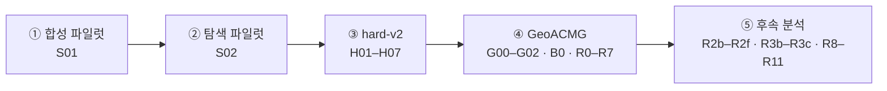

# 실험 목록

[← 단계별 연구 이야기](01_RESEARCH_STORY.md) · [수치와 검증 →](03_RESULTS_AND_VERIFICATION.md)

연구 질문과 대조 설계 단위로 정리한 전체 실험 목록입니다. 개별 run·설정·시드는 각 행의 근거 파일과 [실험 카탈로그 CSV](../../provenance/experiment_catalog.csv)로 따라갈 수 있습니다.

## ① 합성 파일럿 · ② 탐색 파일럿

| ID | 실험 | 규모 | 얻은 것 | 근거 |
|---|---|---|---|---|
| S01 | 동결 multi-view · 거리 학습 · flow · 에이전트 | 과제 12개 (7/2/3) | 파이프라인이 끝까지 동작, bilinear 거리 0.8551. 계약 + 올바른 STOP을 준 무작위 정책도 모든 test 과제 성공 → 모델 기여를 가려낼 벤치마크 필요 | [synthetic_v1](../../results/synthetic_v1) |
| S02 | 정확 탐색 · 해시 대조 · DAgger · State Flow | 과제 210개 (128/41/41) | 관측 후 재계획 0.8630 vs 한 번에 0.5731 vs blind 0.0859. 무작위 정책도 41/41 → 더 어려운 벤치마크 필요 | [개발 보고서 §4](../../results/hard_v2/GeoFlowAgent_A_EXPERIMENT_REPORT_CURRENT.md) |

## ③ hard-v2

| ID | 실험 | 규모 | 얻은 것 | 근거 |
|---|---|---|---|---|
| H01 | 데이터 난도 · 누수 점검 · 정확 탐색 | 과제 240개 (144/48/48), 도구 50개 | 계약만으로 정답이 드러나지 않는 환경과 분할 확정 | [data_quality.json](../../results/hard_v2/final_reports/data_quality.json) |
| H02 | 기하 9종 비교 | dev 과제 48개 | 단순 cosine 선택 — 복잡한 기하가 자동으로 유리하지 않음 | [dev_reports](../../results/hard_v2/dev_reports) |
| H03 | 입력 조합 · 용량 · 해시 대조 | dev 과제 48개 | MedCPT-only 선택. 모든 표현을 합치면 오히려 나빠짐 | [dev_reports](../../results/hard_v2/dev_reports) |
| H04 | DAgger · State Flow · STOP | dev 과제 48개 | DAgger는 뚜렷한 추가 이득이 없어 기본 설정에서 제외 | [dev_reports](../../results/hard_v2/dev_reports) |
| H05 | 동결 표현 test | test 과제 48개 | 정책 0.8010 / 결합 0.7364 / regret 0.1403 | [value_test](../../results/hard_v2/final_reports/value_test/summary.json) |
| H06 | 폐루프 · 교란 | test 과제 48개 | 에피소드 성공률 0.6667 (기준 모델 0.6458, 무작위 0.5000). 교란 상황에서는 무작위도 0.6667 | [search_agent](../../results/hard_v2/final_reports/search_agent) |
| H07 | 관측 · blind · 한 번에 계획 flow | test 과제 48개 × 3 시드 | 관측 후 재계획 0.4028 > 한 번에 0.1233 > blind 0.0000 | [final_reports](../../results/hard_v2/final_reports) |

## ④ GeoACMG

| ID | 실험 | 규모 | 얻은 것 | 근거 |
|---|---|---|---|---|
| G00 | ClinGen 코퍼스 · 유전자 상한 · 분할 봉인 | 과제 2,921개 (1,753/584/584) | 실제 전문가 기록 기반의 오프라인 snapshot 환경 | [실험 일지](../original/geoacmg/EXPERIMENT_JOURNAL_20260919.md) |
| B0 | 단일 도구군 격차 | 코퍼스 전체, 유전자 155개 | 격차 0.6898 — 여러 도구가 필요한 벤치마크 | [b0.jsonl](../../results/geoacmg_final/findings/b0.jsonl) |
| G01 | 기하 비교 | dev 과제 584개 | 정렬이 좋은 기하와 계획이 좋은 기하가 다름 | [metric_profile.json](../../results/geoacmg_final/findings/metric_profile.json) |
| G02 | 정렬 · 용량 · 메커니즘 · 층화 | dev 과제 584개, 유전자 47개 | 깊이 통제 · 누수 · 용량 · readout을 따로 점검 | [findings](../../results/geoacmg_final/findings) |
| R0 | 산출물 목록 · margin 보존 | dev | 모든 판정을 원시 margin에서 다시 계산할 수 있는 기반 | [R0_inventory.json](../../results/geoacmg_final/findings/R0_inventory.json) |
| R1 | 에너지 파라미터 0인 짝 시드 비교 | dev, 시드 17/29/43/59/71 | 정렬 차이 +0.1432 (시드 클러스터) | [R1_paired_zero_param.json](../../results/geoacmg_final/findings/R1_paired_zero_param.json) |
| R1b | 새 시드의 행동 축 | dev 과제 584개, 시드 59/71 | 정책 차이 −0.0099 — 기존 방향이 뒤집힘 | [R1b_new_seed_planning_axis.json](../../results/geoacmg_final/findings/R1b_new_seed_planning_axis.json) |
| R2 | readout · 동점 · 이방성 | 141,517쌍 | 표준화 cosine으로 대부분 복원, 기하별로 다름 | [R2_readout_decomposition.json](../../results/geoacmg_final/findings/R2_readout_decomposition.json) |
| R3 | 과제 길이별 층화 | 유전자 47개 | cosine − Euclidean 기울기 −0.0196 | [R3_horizon_strata.json](../../results/geoacmg_final/findings/R3_horizon_strata.json) |
| R4 | 교차 모델 순환 대조 | 19 run × 584 과제 | 정합 차이 +0.000424 — 매우 작은 연결 | [R4_crossmodel_control.json](../../results/geoacmg_final/findings/R4_crossmodel_control.json) |
| R5 | 과제 난도(winnability) 진단 | 유전자당 100개 설정 | 어떤 축에서 비교가 가능한지 진단 | [R5_p2_winnability.json](../../results/geoacmg_final/findings/R5_p2_winnability.json) |
| R6 | 사전등록 수정 | 주장 C1–C5 | C5 철회, C4 조건 제한 | [R6_amendment.json](../../results/geoacmg_final/findings/R6_amendment.json) |
| R7 | 배치 flow · 동등성 검증 | dev 루트 584개, 샘플 2,336개 | 관측 후 재계획 0.5993 vs 한 번에 0.1169 vs blind 0.0274 | [R7_arms_and_flow.json](../../results/geoacmg_final/findings/R7_arms_and_flow.json) |

## ⑤ 후속 분석

| ID | 실험 | 규모 | 얻은 것 | 근거 |
|---|---|---|---|---|
| R2b–f | 7 시드 readout 확장 · 분산원 · train 적합 표준화 | 시드 17/29/43/59/71/83/97 | 자기 에너지에서는 cosine 우위, 표준화에서는 불확실, whitening에서는 역전 | [R2f_readout_7seeds.json](../../results/geoacmg_working_findings/R2f_readout_7seeds.json) |
| R3b–c | 7 시드 행동 축 | dev 과제 584개, 유전자 47개 | 정책 · 결합 · regret의 시드 CI는 0 포함, 유전자 CI에서는 정책 · regret에 작은 차이 | [R3c_planning_axis_7seeds.json](../../results/geoacmg_working_findings/R3c_planning_axis_7seeds.json) |
| R8 | 동결 공간 readout 사다리 | dev, train 적합 전처리 | MedCPT만으로도 단순 선형 readout이 우연을 넘음 | [R8_frozen_space_ladder.json](../../results/geoacmg_working_findings/R8_frozen_space_ladder.json) |
| R9 | 정보원 분리: MedCPT · 구조화 해시 | 141,517쌍 | 구조화 해시 0.7054 vs 결합 0.7040 — 워크플로 구조가 강한 정보원 | [R9_information_source_ablation.json](../../results/geoacmg_working_findings/R9_information_source_ablation.json) |
| R10 | readout에 따른 기하 순위 | 공통 3 시드 | 순위 5가지, 1위 기하 4종 | [R10_readout_dependent_ranking.json](../../results/geoacmg_working_findings/R10_readout_dependent_ranking.json) |
| R11 | MedCPT 제거 재학습 | cosine/Euclidean × 시드 17/29 | regret +0.0441, run · 유전자 기준 모두 양수 | [R11_medcpt_ablation.json](../../results/geoacmg_working_findings/R11_medcpt_ablation.json) |
| R11+ | 같은 제거 실험의 8 run 집계 | 시드 17/29/43/59 | regret +0.0550 (run · 유전자 기준 모두 양수), 결합 정확도도 유전자 기준에서 감소 | [comparison.json](../../results/geoacmg_latest_checkpoints/geometry_ablate_medcpt2/comparison.json) |

## 실험을 읽을 때 필요한 구분

- **과제와 상태.** 과제 하나에서 여러 상태가 나오므로, 상태 수를 독립 표본 수로 쓰지 않습니다.
- **시드와 과제 bootstrap.** 시드 평균을 낸 뒤 과제를 재표집한 CI는 학습 시드의 변동까지 담지는 않습니다. ⑤에서 시드 기준 CI를 따로 계산한 이유입니다.
- **정렬과 계획.** 목표에 가까운 상태를 정렬하는 능력과 실제로 다음 행동·STOP을 고르는 능력은 다른 결과 변수입니다.
- **한 번에 계획과 재계획.** 전체 계획을 생성하는 것의 이점과 관측 feedback의 이점을 따로 비교합니다.
- **학습된 STOP과 verifier.** 외부 verifier가 STOP을 도와준 결과는 상한 대조군이며, 학습 정책의 성공률과 구분합니다.
- **dev와 test.** hard-v2는 사전등록한 test를 한 번 평가했고, GeoACMG 수치는 584개 개발 분할에서 나왔습니다.
