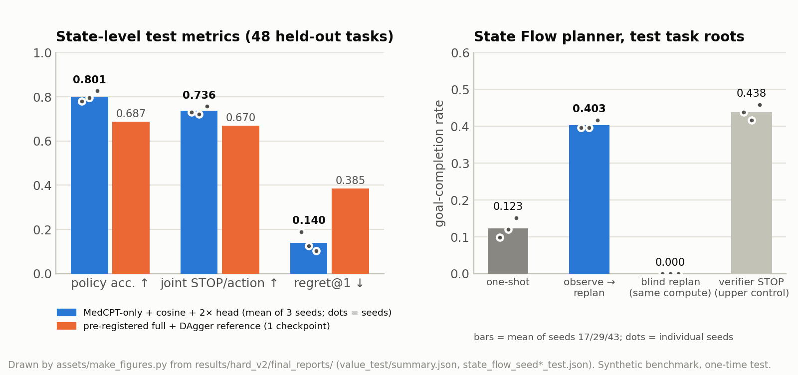

[🏠 Portfolio](https://github.com/heoneyzi) › [🩺 Medical](../../../README.md) › [GeoFlowAgent](../../README.md) › [Experiments](../README.md) › **③ hard-v2**

# 🧱 ③ hard-v2 — a harder synthetic benchmark with a pre-registered, one-time test

> **Question —** When the benchmark no longer gives the answer away, which ingredients actually help: the frozen representation, the choice of geometry, DAgger, or observing results and replanning?

| | |
|---|---|
| **Why this stage** | Stages ①–② ran into ceilings. hard-v2 is hard enough to separate the ingredients, and a pre-registered, one-time test keeps model selection honest |
| **Data** | 240 synthetic tasks (144 train / 48 dev / 48 test), 50 tools, 3,042 snapshots, 31 workflow families, 56 topologies; dev and test use held-out compositions |
| **Models** | Frozen Qwen2.5-1.5B, MedCPT, SapBERT, DNABERT-2; small value-geometry heads, Search-DAgger, State Flow |
| **Compute** | GPU container (two GPUs in the final runner) |
| **Headline** | Test policy accuracy **0.8010** for MedCPT-only + cosine + 2× head (3 seeds) vs 0.6875 for the pre-registered reference; goal completion **0.4028** observe→replan vs 0.1233 one-shot vs 0.0000 blind |

## Setup

- **Harder environment.** Executable-but-costly tools, alternative sources, decoys, irreversible degraded choices, release validation and report QC, so contracts alone no longer reveal the optimal action (the share of states where they do is in [`data_quality.json`](../../results/hard_v2/final_reports/data_quality.json)).
- **Development (dev only, 48 independent tasks, seeds 17/29/43).** 9 geometry families; 12 capacity-matched input conditions (791,750 trainable parameters each); parameter-matched hash controls; a capacity curve; 3 Search-DAgger rounds; State Flow with observe→replan and compute-matched blind controls.
- **Selection → freeze → test once.** The final candidate (MedCPT-only + cosine + 2× head) and the pre-registered reference (full multi-view + DAgger round 2) were frozen; then the 48 test tasks were materialised, encoded and evaluated once, and every test access was written to a hash-chained ledger.

## Results

**Development findings that drove the selection** (dev, paired over 48 tasks, 3 seeds; [`dev_reports/`](../../results/hard_v2/dev_reports/)):

| Comparison | Paired Δ policy accuracy [95% CI] | Reading |
|---|---|---|
| MedCPT-only − full multi-view + structured | +0.1356 [+0.0747, +0.1927] | naive fusion of all views hurts |
| MedCPT-only cosine − parameter-matched hash cosine | +0.1347 [+0.0784, +0.1876] | the MedCPT view carries action information |
| Full frozen cosine − parameter-matched hash cosine | −0.0009 [−0.0332, +0.0315] | the gain comes from the view chosen, not from "frozen" as such |
| MedCPT cosine − MedCPT Poincaré | +0.0639 [+0.0491, +0.0784] | hyperbolic geometry brought no gain |
| DAgger round 2 − initial cosine | −0.0316 [−0.0843, +0.0218] | DAgger added no clear gain |

**One-time test** (48 held-out tasks; [`final_reports/value_test/summary.json`](../../results/hard_v2/final_reports/value_test/summary.json), recomputed by [`verify_hard_v2.py`](../../verification/verify_hard_v2.py)):

| Metric | MedCPT-only + cosine + 2× (mean of 3 seeds) | Pre-registered full + DAgger (1 checkpoint) | Paired task-macro Δ [95% CI] |
|---|---:|---:|---|
| Optimal-set policy accuracy ↑ | **0.8010** | 0.6875 | +0.1198 [+0.0708, +0.1682] |
| Joint STOP/action accuracy ↑ | **0.7364** | 0.6702 | +0.0691 [+0.0153, +0.1231] |
| Regret@1 ↓ | **0.1403** | 0.3848 | −0.2489 [−0.3263, −0.1754] |

| State Flow on test task roots (mean of seeds 17/29/43) | Goal completion |
|---|---:|
| One-shot whole plan | 0.1233 |
| **Observe → replan** | **0.4028** |
| Compute-matched blind replan (same planner calls and ODE steps, no observations) | 0.0000 |
| External-verifier STOP guard (upper control) | 0.4375 |

| Closed-loop episode success (seed 17, 48 tasks) | Clean | Perturbed |
|---|---:|---:|
| MedCPT-only learned policy | 0.6667 | 0.6667 |
| Pre-registered full + DAgger | 0.6458 | 0.6875 |
| Random policy with contracts | 0.5000 | 0.6667 |

Figure: hard-v2 one-time test. Drawn by <code>assets/make_figures.py</code> from <code>results/hard_v2/final_reports/</code>.

The paired Δ point estimates are recomputed from the per-task values by `verify_hard_v2.py` ([`hard_v2_verified_metrics.json`](../../verification/hard_v2_verified_metrics.json)); their CIs are the task-bootstrap intervals of the [final conclusion report](../../results/hard_v2/GeoFlowAgent_A_FINAL_EXPERIMENT_CONCLUSION.md).

## What it showed

- **The right frozen view matters.** Frozen MedCPT coordinates carry actionable workflow information when that view is chosen; naive multi-view fusion caused negative transfer.
- **A small learned geometry helps, and plain cosine is enough.** Asymmetric and hyperbolic distances brought no extra gain, so cosine was selected.
- **Execute → observe → replan beats one-shot planning.** A blind replanner with identical compute reaches 0.0000, so the gain comes from the observations, not from calling the planner more often.
- **Ranking gains are larger than episode gains.** Episode success was 0.6667 for the selected agent vs 0.6458 for the reference, and under perturbation the random policy with contracts also reached 0.6667.

## What it led to

With the synthetic answer settled, the next step was real expert evidence: **GeoACMG** (stage ④) builds tasks from ClinGen records, where many tool calls return evidence that does not apply — the situation in which planning should matter most.

## Files

| File | What it is |
|---|---|
| [`results/hard_v2/GeoFlowAgent_A_FINAL_EXPERIMENT_CONCLUSION.md`](../../results/hard_v2/GeoFlowAgent_A_FINAL_EXPERIMENT_CONCLUSION.md) | Final verdicts after the one-time test (Korean) |
| [`results/hard_v2/GeoFlowAgent_A_FINAL_EVAL_PREREGISTRATION_V1.json`](../../results/hard_v2/GeoFlowAgent_A_FINAL_EVAL_PREREGISTRATION_V1.json), [`…_AMENDMENT_V2.json`](../../results/hard_v2/GeoFlowAgent_A_FINAL_EVAL_AMENDMENT_V2.json) | Pre-registration and sealed amendment for the final evaluation |
| [`results/hard_v2/final_reports/`](../../results/hard_v2/final_reports/) | Test outputs: `value_test/` (per seed + summary), `state_flow_seed*_test.json`, `search_agent/*/test_summary.json`, `data_quality.json`, embedding audit, `test_access_ledger.jsonl` |
| [`results/hard_v2/dev_reports/`](../../results/hard_v2/dev_reports/) | Decisive dev comparisons (paired task-macro effects), DAgger dev summaries, embedding audit |
| [`results/hard_v2/GeoFlowAgent_A_EXPERIMENT_REPORT_CURRENT.md`](../../results/hard_v2/GeoFlowAgent_A_EXPERIMENT_REPORT_CURRENT.md) | Development report written before the test (geometry table, input ablation, capacity, DAgger, State Flow) |
| [`configs/search_hard_v2_*.yaml`](../../configs/README.md) | Hash, frozen, parameter-matched, cosine-attribution, MedCPT-only and final-frozen configs |
| [`scripts/run_hard_v2_development.sh`](../../scripts/run_hard_v2_development.sh), [`hard_v2_medcpt_followup.sh`](../../scripts/hard_v2_medcpt_followup.sh), [`run_hard_v2_final_once.sh`](../../scripts/run_hard_v2_final_once.sh), [`evaluate_final_value_checkpoints.py`](../../scripts/evaluate_final_value_checkpoints.py) | Development, follow-up and one-time final runners |
| [`src/geoflowagent/data/procedural_search_hard.py`](../../src/geoflowagent/data/procedural_search_hard.py), [`data/quality.py`](../../src/geoflowagent/data/quality.py) | hard-v2 generator and data-quality gates |
| [`src/geoflowagent/models/value_geometry.py`](../../src/geoflowagent/models/value_geometry.py), [`models/search_state_flow.py`](../../src/geoflowagent/models/search_state_flow.py) | Goal-conditioned value geometry (energies) and the State Flow model |

---
[← ② Search pilot](../02_search_pilot/README.md) · [🏠 Portfolio](https://github.com/heoneyzi) · [④ GeoACMG →](../04_geoacmg_dev/README.md)
