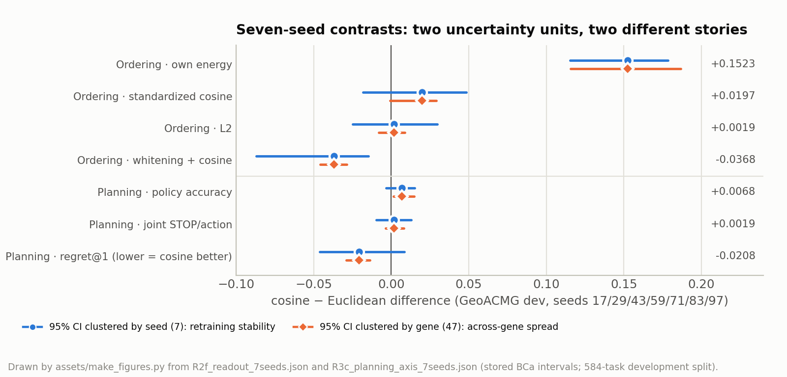
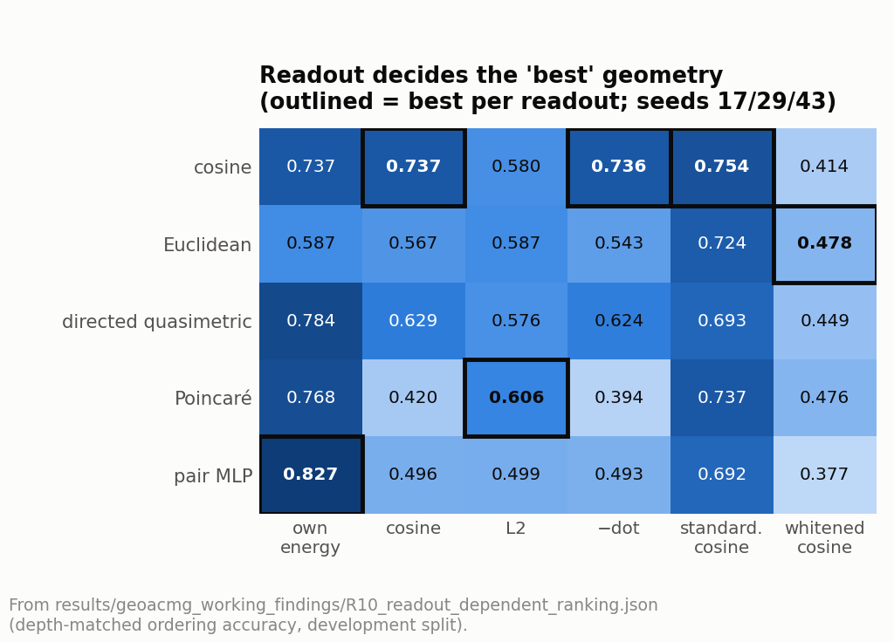
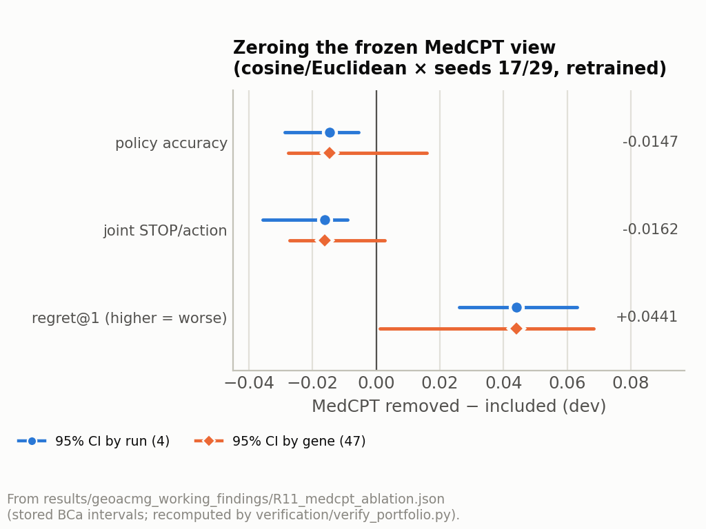

[🏠 Portfolio](https://github.com/heoneyzi) › [🩺 Medical](../../../README.md) › [GeoFlowAgent](../../README.md) › [Experiments](../README.md) › **⑤ Follow-ups**

# 🔁 ⑤ Follow-ups — seeds, readouts and ablations

> **Question —** Are the geometry and frozen-representation effects from stage ④ robust to more training seeds, to *how* the learned space is read out, and to removing the frozen view altogether?

<b>🇰🇷 한국어 요약</b>

시드를 7개로 늘리고, 같은 학습 공간을 여러 방식(readout)으로 읽어 보고, MedCPT 입력을 지운 채 다시 학습했습니다. cosine이 Euclidean보다 크게 앞선 정렬 차이(+0.1523)는 각 모델 고유의 에너지로 읽을 때 나타났고, 표준화 cosine으로 읽으면 +0.0197로 줄며(구간이 0 포함) whitening으로 읽으면 반대(−0.0368)가 되었습니다. 행동 지표는 시드 기준 구간에서는 0을 포함했고 유전자 기준 구간에서는 작은 차이가 남아, '재학습 안정성'과 '유전자 간 일반화'가 서로 다른 질문임을 보여 줍니다. 같은 사진도 보정 필터마다 순위가 바뀌는 사진 대회처럼, 기하의 '1등'은 읽는 방식에 따라 달라졌습니다. MedCPT를 지우면 regret이 +0.0441 나빠져, 에이전트가 동결 표현을 실제로 활용한다는 근거를 얻었습니다.

| | |
|---|---|
| **Why this stage** | Stage ④ showed large ordering gaps between geometries but small planning gaps, and two new seeds flipped a planning sign — so the geometry claim needed stress tests before any conclusion |
| **Data** | GeoACMG development split (584 tasks, 47 genes) |
| **Models** | Cosine vs Euclidean heads at seeds 17/29/43/59/71/83/97; MedCPT-zeroed retraining (cosine/Euclidean × seeds 17/29, then 43/59) |
| **Compute** | GPU container; the readout analyses reuse the saved embeddings and margins |
| **Headline** | Cosine − Euclidean ordering **+0.1523** under each model's own energy, +0.0197 (CI includes 0) under standardized cosine and −0.0368 under whitening; policy +0.0068 (seed CI includes 0); zeroing MedCPT raises regret **+0.0441** |

## Setup

- **R2b–R2f, R3b–R3c.** The readout decomposition and planning metrics were extended from 5 to **7 seeds**, with two uncertainty units: clustered by **seed** (would retraining give the same answer?) and by **gene** (does it hold across genes?).
- **R8 frozen-space readout ladder.** Standardization, whitening, PCA and random projections of the *frozen* MedCPT space, all fitted on train.
- **R9 information source.** MedCPT vs a training-free 64-d **structured-state hash** (key=value features hashed with blake2b) vs both.
- **R10 readout-dependent ranking.** All five energy families × six readouts on the common seeds 17/29/43.
- **R11 MedCPT ablation.** Retrain with the MedCPT view set to zero (structured hash only) and compare with the matched runs that include it.

## Results

**Seven-seed contrasts** ([`R2f_readout_7seeds.json`](../../results/geoacmg_working_findings/R2f_readout_7seeds.json), [`R3c_planning_axis_7seeds.json`](../../results/geoacmg_working_findings/R3c_planning_axis_7seeds.json)):

| Cosine − Euclidean, 7 seeds | Estimate | 95% CI by seed (7) | 95% CI by gene (47) |
|---|---:|---|---|
| Ordering · own energy | **+0.1523** | [0.1152, 0.1783] | [0.1157, 0.1868] |
| Ordering · standardized cosine | +0.0197 | [−0.0180, 0.0485] | [−0.0007, 0.0291] |
| Ordering · L2 | +0.0019 | [−0.0248, 0.0298] | [−0.0081, 0.0087] |
| Ordering · whitening + cosine | −0.0368 | [−0.0870, −0.0146] | [−0.0457, −0.0286] |
| Policy accuracy ↑ | +0.0068 | [−0.0033, 0.0153] | [0.0016, 0.0148] |
| Joint STOP/action ↑ | +0.0019 | [−0.0097, 0.0129] | [−0.0037, 0.0083] |
| Regret@1 ↓ | −0.0208 | [−0.0462, 0.0083] | [−0.0288, −0.0137] |

Figure: the same contrasts with both uncertainty units. Drawn by <code>assets/make_figures.py</code> from the two JSON files above.

**What is being read, and by what** ([`R8`](../../results/geoacmg_working_findings/R8_frozen_space_ladder.json), [`R9`](../../results/geoacmg_working_findings/R9_information_source_ablation.json), [`R10`](../../results/geoacmg_working_findings/R10_readout_dependent_ranking.json), [`R2d`](../../results/geoacmg_working_findings/R2d_holdout_standardiser.json)):

| Analysis | Result | Reading |
|---|---|---|
| R8 · frozen MedCPT only, train-fitted readouts | Standardized L2 0.5663 · whitening + cosine 0.5508 · random-64 + cosine 0.5981 (each above chance) vs raw cosine 0.5055 | Simple linear readouts already beat chance; the raw space is extremely anisotropic (mean cosine similarity 0.969, effective rank ≈ 10 of 768) |
| R9 · PCA-64 + cosine ordering | Structured hash alone 0.7054 vs MedCPT + hash 0.7040 | Much of the ordering signal comes from the workflow structure itself; the MedCPT contribution is measured directly by the ablation below |
| R10 · 5 families × 6 readouts | 5 distinct rankings; 4 different families rank first under some readout | The "best geometry" changes with the readout |
| R2d · standardizer fitted on train (5 seeds) | Cosine − Euclidean +0.0170 [0.0118, 0.0222] | A separate protocol (train-fitted standardizer), reported on its own |

**MedCPT ablation** (R11, [`R11_medcpt_ablation.json`](../../results/geoacmg_working_findings/R11_medcpt_ablation.json); removed − included):

| Metric | Estimate (4 runs) | 95% CI by run | 95% CI by gene | 8-run aggregate† |
|---|---:|---|---|---|
| Policy accuracy ↑ | −0.0147 | [−0.0287, −0.0056] | [−0.0276, 0.0159] | −0.0196, gene CI [−0.0323, 0.0071] |
| Joint STOP/action ↑ | −0.0162 | [−0.0356, −0.0091] | [−0.0273, 0.0027] | −0.0227, gene CI [−0.0335, −0.0033] |
| Regret@1 ↓ | **+0.0441** | [0.0260, 0.0631] | [0.0011, 0.0683] | +0.0550, run CI [0.0405, 0.0654], gene CI [0.0310, 0.0810] |

† All eight saved ablation runs (cosine/Euclidean × seeds 17/29/43/59), aggregated from the per-run files ([`geoacmg_latest_verified_metrics.json`](../../verification/geoacmg_latest_verified_metrics.json)).

<table>
<tr>
<td></td>
<td></td>
</tr>
<tr>
<td>R10: the outlined "best" family changes with the readout.</td>
<td>R11: zeroing the frozen view worsens regret in both uncertainty units.</td>
</tr>
</table>

Every R3c and R11 number above (estimates *and* BCa intervals) is recomputed from the per-run files in this repository by [`verification/verify_portfolio.py`](../../verification/README.md); the readout numbers (R2f) match the margin-array verification (233/233 checks).

## What it showed

- **The ordering gap is readout-bound.** Cosine's large advantage appears when each model is read with its own energy; with standardized cosine it shrinks to +0.0197 and whitening reverses it. The two geometries differ mainly in *how their spaces are read*, so no single "best geometry" holds across readouts.
- **Two uncertainty units, two stories.** For policy and regret the gene-clustered CIs exclude 0 while the seed-clustered CIs include it: the small cosine advantage generalises across genes for these trained models, but shifts under retraining.
- **The agent uses the frozen view.** Removing MedCPT worsens regret under both units (4 runs; 8 runs in the aggregate), while a training-free structured hash carries much of the ordering signal — the agent draws on both the workflow structure and MedCPT.

## What it led to

The three conclusions of the study and the reason it closes here — see the [main README](../../README.md#-conclusion).

## Files

| File | What it is |
|---|---|
| [`results/geoacmg_working_findings/`](../../results/geoacmg_working_findings/) | Findings of this stage: `R2b`–`R2f`, `R3b`–`R3c`, `R8`–`R11` JSON (use R3/R4 from `geoacmg_final/`; the R3/R4 files here are an earlier 15-run subset) |
| [`results/geoacmg_latest_checkpoints/geometry_r1_pairs2/`](../../results/geoacmg_latest_checkpoints/geometry_r1_pairs2/) | Per-run development metrics for seeds 83/97 |
| [`results/geoacmg_latest_checkpoints/geometry_ablate_medcpt/`](../../results/geoacmg_latest_checkpoints/geometry_ablate_medcpt/), [`…_medcpt2/`](../../results/geoacmg_latest_checkpoints/geometry_ablate_medcpt2/) | MedCPT-zeroed runs (seeds 17/29 and 43/59) and their `comparison.json` aggregates |
| [`configs/geoacmg_ablate_medcpt.yaml`](../../configs/geoacmg_ablate_medcpt.yaml) | Ablation config (`zero_views: [medcpt]`) |
| [`scripts_run/ablate_medcpt.sh`](../../scripts_run/ablate_medcpt.sh), [`ablate_medcpt2.sh`](../../scripts_run/ablate_medcpt2.sh), [`r1_paired_seeds2.sh`](../../scripts_run/r1_paired_seeds2.sh) | Runners for the ablation and the extra seeds |
| [`scripts_run/late_analyses/`](../../scripts_run/late_analyses/README.md) | R8 ladder, R9 information-source arms, R2d train-fitted standardizer, margin extension to new seeds (with run logs) |
| [`src/geoflowagent/geoacmg/readout.py`](../../src/geoflowagent/geoacmg/readout.py), [`paired.py`](../../src/geoflowagent/geoacmg/paired.py), [`data/structured.py`](../../src/geoflowagent/data/structured.py) | Readout decomposition, paired-seed design, the structured-state hasher |
| [`verification/verify_geoacmg_latest.py`](../../verification/verify_geoacmg_latest.py), [`verify_portfolio.py`](../../verification/verify_portfolio.py) | Margin-array verification of this stage and the per-run recomputation that runs in this repository |

---
[← ④ GeoACMG](../04_geoacmg_dev/README.md) · [🏠 Portfolio](https://github.com/heoneyzi) · [GeoFlowAgent ↑](../../README.md)
