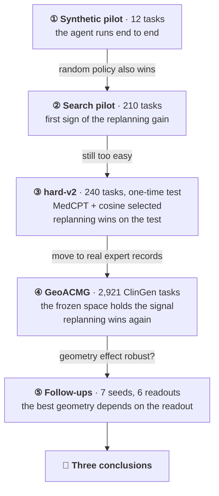
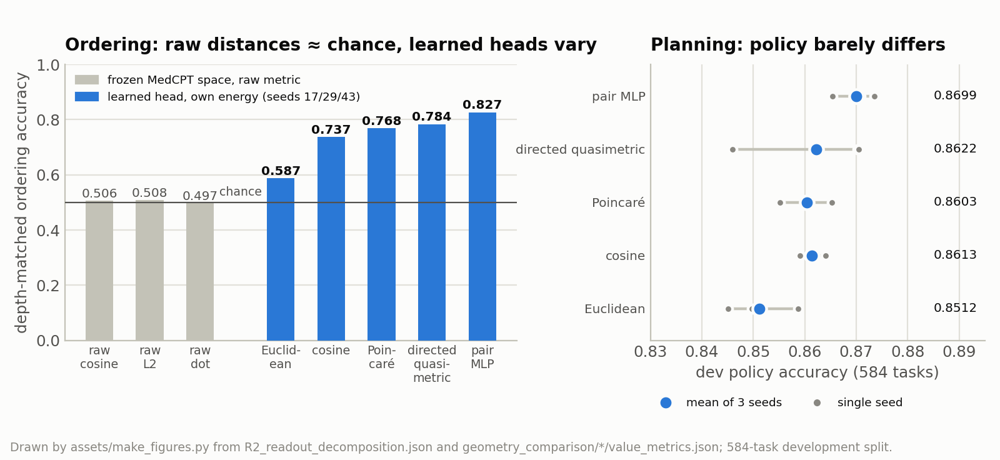

[🏠 Portfolio](https://github.com/heoneyzi) › [🩺 Medical](../../README.md) › [GeoFlowAgent](../README.md) › **Experiments**

# 🔬 GeoFlowAgent experiments — five stages, each built on what the last one could not show

### 🧪 [① Synthetic pilot](01_synthetic_v1/README.md) — does the whole agent run?

| | |
|---|---|
| **Why** | Before measuring anything, check that frozen encoder → learned metric → flow planner → contract-checked tools runs end to end on GPUs |
| **What** | 12 synthetic `variant_to_report` tasks, 8 tools; frozen Qwen2.5-1.5B/7B, MedCPT, SapBERT, DNABERT-2 views; six distance families; closed-loop agent with random and blind controls |
| **Result** | The pipeline works and the learned bilinear metric ranks valid actions well (0.8551), but a random policy with exact contracts and a correct STOP also solved every test task |
| **Next** | A benchmark in which the model's contribution can be measured → exact-search labels |

### 🔎 [② Search pilot](02_search_pilot/README.md) — can the contributions be separated?

| | |
|---|---|
| **Why** | Contracts in stage ① almost gave the answer away; labelling every state by exact search (V\*, Q\*, regret) and adding costly or dead-end tools makes the choice real |
| **What** | 210 procedural tasks; value geometry, Search-DAgger and State Flow; one-shot vs observe→replan vs compute-matched blind replanning; hash-embedding control |
| **Result** | The replanning effect appears for the first time: 0.8630 vs 0.5731 one-shot vs 0.0859 blind — while a random policy still reached 41/41 |
| **Next** | A harder benchmark with a pre-registered test → hard-v2 |

###  [③ hard-v2](03_hard_v2/README.md) — what actually helps?

| | |
|---|---|
| **Why** | Separate the ingredients (frozen view, geometry, DAgger, replanning) on a benchmark hard enough, with every choice made on dev and one pre-registered test |
| **What** | 240 tasks, 50 tools, decoys and irreversible degraded choices; 9 geometries, 12 capacity-matched input views, parameter-matched hash controls, DAgger, State Flow |
| **Result** | One chosen frozen view (MedCPT) beats fusing all views, and plain cosine is enough: test policy accuracy 0.8010 vs 0.6875 for the reference; goal completion 0.4028 replan vs 0.1233 one-shot vs 0.0000 blind |
| **Next** | Move from synthetic tools to real expert evidence → GeoACMG |

###  [④ GeoACMG](04_geoacmg_dev/README.md) — does it hold on real expert records?

| | |
|---|---|
| **Why** | ClinGen records both applied (Met) and rejected (Not Met) evidence, so an environment built from them contains tool calls that cost something and return nothing useful — exactly where planning should matter |
| **What** | 2,921 variant-interpretation tasks from ClinGen; tool-need check, probes of frozen MedCPT states, raw vs learned distances, 5 geometries × seeds, State Flow on the 584-task development split |
| **Result** | Tasks need several tool families (gap 0.6898); frozen states hold execution information that raw distances read only at chance; goal completion 0.5993 replan vs 0.1169 one-shot vs 0.0274 blind |
| **Next** | Check whether the geometry differences survive more seeds and other readouts |

###  [⑤ Follow-ups](05_geoacmg_followups/README.md) — is the geometry effect robust?

| | |
|---|---|
| **Why** | Stage ④ showed large ordering gaps between geometries but small planning gaps, and two new seeds flipped a planning sign |
| **What** | 7 training seeds with seed- and gene-clustered CIs; readout ladder on the frozen space; information-source ablation; retraining with MedCPT removed |
| **Result** | Cosine's ordering lead depends on the readout (+0.1523 own energy, +0.0197 standardized, −0.0368 whitened); removing MedCPT raises regret +0.0441 |
| **Next** | The three conclusions in the [main README](../README.md#-conclusion) |

## How to read the numbers

- **Task vs state.** One task yields many prefix states, so states are not independent samples. State-level metrics are seed means; confidence intervals resample **tasks** (or **genes** on the ClinGen tasks).
- **Seed vs gene uncertainty.** A seed-clustered CI asks "would retraining give the same answer?"; a gene-clustered CI asks "does it hold across genes?". They can disagree (stage ⑤).
- **Ordering vs planning.** Ranking states by closeness to the goal (ordering accuracy) and choosing the next action or STOP (policy, joint, regret@1) are different outcomes.
- **One-shot vs observe→replan vs blind.** One-shot executes a whole sampled plan; observe→replan executes one step and replans on the observed result; blind replanning makes the same planner calls without observations.
- **Dev vs test.** Choices are made on dev. hard-v2's test was used once after all choices were frozen; the ClinGen numbers come from the 584-task development split.

---
[← GeoFlowAgent](../README.md) · [🏠 Portfolio](https://github.com/heoneyzi) · [① Synthetic pilot →](01_synthetic_v1/README.md)
