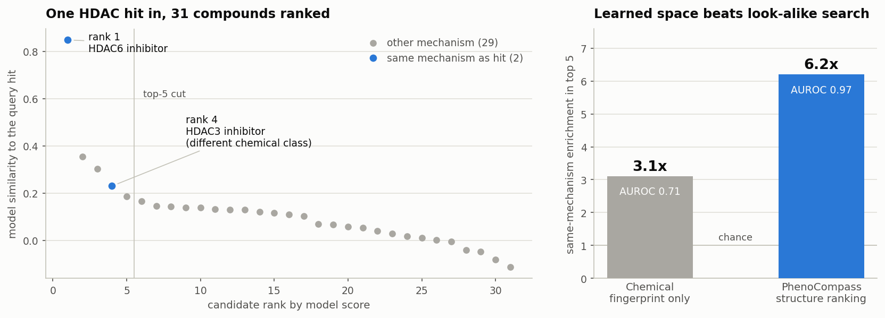
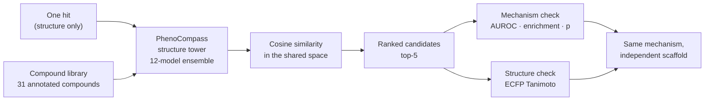
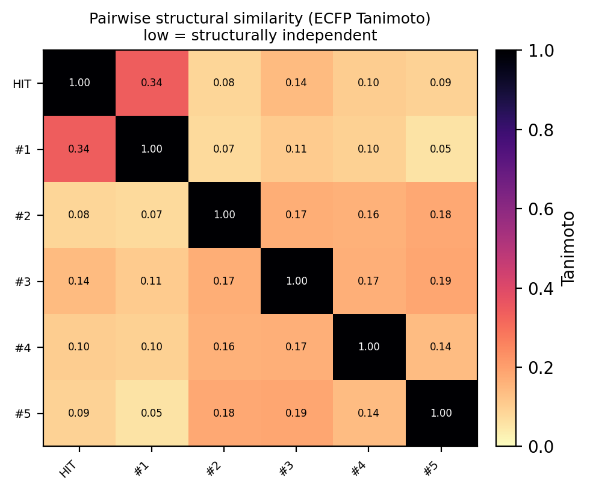
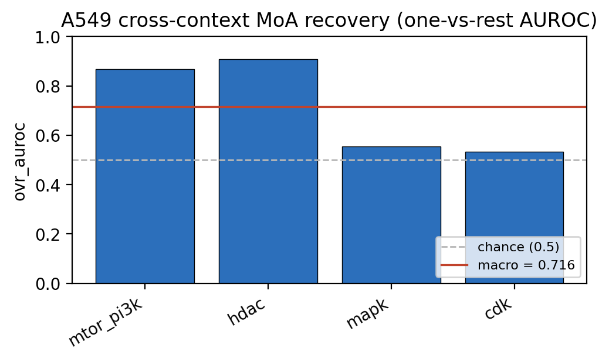

<sub>[🏠 Portfolio](https://github.com/heoneyzi) › [🩺 Medical](../README.md) › **PhenoFocus**</sub>

<div align="center">

# 🔬 PhenoFocus — AI-driven drug discovery from cell images

**Given one compound that works in cells, can a model find others that do the same biology with a completely different chemical skeleton?**

[](#-why-it-matters)


[💻 Public brief](https://github.com/heoneyzi/PhenoFocus) · [📄 PhenoCompass preprint](https://www.biorxiv.org/content/10.64898/2026.06.10.731476v1) · [🔗 Upstream model](https://github.com/genentech/phenocompass)

</div>

> [!TIP]
> **TL;DR** — Drug programs stall when every promising compound shares one molecular skeleton. PhenoFocus asks whether a model that has learned to align chemical structure with *cell-image appearance* can retrieve compounds with the **same biological mechanism but an independent skeleton**. In an exploratory MVP on a **31-compound library**, feeding in a single HDAC-inhibitor hit put both of the library's other HDAC inhibitors inside the top 5 (ranks 1 and 4) — **AUROC 0.97, 6.2× top-5 enrichment, p = 0.02 (hypergeometric)** — and the rank-4 compound belongs to a *different chemical class* of HDAC inhibitor (Tanimoto 0.10 to the query). Small, single-query, structure-side only; see the scope notes.

| | |
|---|---|
| **Period** | 2026 – ongoing |
| **Team** | 4 people — **Jiheon Kang (Team Lead)**, Jaeyoung Ha, Jungyoon Han, Hyunjun Hwang |
| **My role** | Team Lead — designed and implemented the structure-first MVP layer on top of the released PhenoCompass checkpoints (`src/a549_mvp/`), ran the single-hit expansion and the six-mechanism benchmark on the team server, and wrote the experiment write-up including its limitations |
| **Stack** | PyTorch · PyTorch Geometric · RDKit · scikit-learn · pandas · matplotlib |
| **Status** | 🔄 Ongoing — advanced to the main round, 2026 Research-Idea Commercialization Challenge |

<p align="center"></p>
<p align="center"><sub>Figure: E1 single-hit expansion, redrawn for this portfolio by <code>assets/hero_figure.py</code>. Left — the top-5 scores are exact (<code>results/hit_…_candidates.csv</code>); ranks 6–31 are read off the run's own significance panel. Right — the fingerprint-only baseline from <code>sanity_check/ecfp_baseline.json</code>.</sub></p>

## 🧭 Why it matters

**The vocabulary first.** A *hit* is the first compound found to do something useful in a biological experiment. A *scaffold* is a molecule's core skeleton — compounds built on different scaffolds count as independent chemical series. A compound's *mechanism of action* (MoA) is *how* it works, i.e. which protein or process it acts on; **HDAC inhibitors**, the family used throughout this project, block histone-deacetylase enzymes, which influence how genes are switched on and off. **Cell Painting** is a standard lab assay in which cells are stained with fluorescent dyes and photographed, so each compound leaves a characteristic "fingerprint" of how it changed the cells. *Scaffold hopping* is the goal: keep the biology, change the skeleton.

Programs that carry only one scaffold are fragile — a single problem on that skeleton (toxicity, an existing patent, a synthesis dead end) stops everything, because every hit inherits it. Physically screening more compounds is slow and expensive, and phenotypic assays like Cell Painting are the *least* scalable kind of screen. The opening that PhenoFocus builds on: compounds sharing a mechanism often share only the small part that grips the target while differing in skeleton, and a model that has learned "which compounds make cells look alike" can therefore be asked for same-biology, different-structure candidates — searching in software instead of at the bench.

## 🛠️ Approach

PhenoFocus builds on **PhenoCompass** (Genentech, [bioRxiv 2026](https://www.biorxiv.org/content/10.64898/2026.06.10.731476v1); MIT-licensed [code](https://github.com/genentech/phenocompass) + released checkpoints), a multimodal model that aligns a compound's chemical graph with a 1,536-dimensional DINO embedding of its Cell Painting image, so that both land in one shared space. Training needs structure *and* images; **querying needs structure only**, which is what makes large-scale search possible. PhenoFocus is the team's application layer on top of it: take the frozen 12-model ensemble and its six mechanism anchor sets, and test whether they can drive an *expansion* loop — one customer hit in, structurally independent same-mechanism candidates out — on a compound set the model was not built around.



- **Direction A — structure-side (what was run).** Chemical structure does not depend on the cell line, so the search engine and the mechanism anchors can be exercised today with only the released checkpoints. Both experiments below are Direction A.
- **Direction B — morphology-side (roadmap, not run).** Feed real A549 lung-cancer Cell Painting *images* through the same DINO encoder into the morphology tower. This is the direct test of whether the model's image side transfers across cell lines; it needs hundreds of GB of imaging data. Scoped in [`src/a549_mvp/ROADMAP_B_morphology.md`](src/a549_mvp/ROADMAP_B_morphology.md).
- **Two scores per candidate.** A *model* score (cosine similarity in the learned space) says "related biology"; an independent *chemical* score (ECFP4 Tanimoto, 0–1, where below ~0.4 already means a different scaffold) says "different structure". The interesting quadrant is high model score at low Tanimoto.

## 🔬 Experiments & results

| # | Question | Setup | Key result | Folder |
|---|---|---|---|---|
| **E1** | Give the model one hit — does it return the *right* compounds, and are they structurally different? | 1 HDAC-inhibitor query vs a 31-compound library annotated with mechanism; top-5 kept; scored by hypergeometric enrichment, ranking AUROC and ECFP4 Tanimoto | Both other HDAC inhibitors retrieved at **ranks 1 and 4 of 31**; **AUROC 0.97**, **6.2× top-5 enrichment**, **p = 0.02**; retrieved Tanimoto **0.34** and **0.10** — the rank-4 compound is a different HDAC chemical class | [E1](experiments/E1_hdac_hit_expansion/) |
| **E2** | Across *all six* mechanism anchor sets, how far does structure-only scoring actually get? | Same 32 compounds scored against the six frozen anchor sets; one-vs-rest AUROC per mechanism, rank-1 accuracy, and a 3-shot retrieval sweep | Honest mixed picture: **macro AUROC 0.716**, rank-1 accuracy **0.281**, top-1 mechanism enrichment **1.69×**; strong for hdac (**0.908**) and mtor_pi3k (**0.867**), near chance for mapk (0.555) and cdk (0.533); 3-shot expansion **macro AUROC 0.502** | [E2](experiments/E2_six_moa_benchmark/) |

Every number above is copied from a committed result file (`summary.json`, `a549_crosscontext_auroc.csv`, `hit_..._candidates.csv`) — each experiment README cites its own source line. The two mechanism classes the library actually covers well (hdac, mtor_pi3k) are the ones that work; E2 is included precisely because it shows where the MVP does *not* hold up.

<table>
<tr>
<td width="50%"></td>
<td width="50%"></td>
</tr>
<tr>
<td><sub>E1 — every retrieved candidate is structurally distinct from the query (all off-diagonal ≤ 0.34).</sub></td>
<td><sub>E2 — structure-only mechanism recovery is strong for two of the four populated classes, near chance for the others.</sub></td>
</tr>
</table>

## 🙋 My contribution

- **Team Lead** of the four-person PhenoFocus team; the project advanced to the main round of the 2026 Research-Idea Commercialization Challenge.
- Designed and wrote the MVP layer in [`src/`](src/README.md) — the expansion CLI, the metric core (enrichment, AUROC, precision@k, Tanimoto), the mechanism-string mapping onto the six anchor clusters, the figures, and a checkpoint-free mock mode so the pipeline can be smoke-tested without the model.
- Ran both experiments on the team server with the released 12-model ensemble and wrote up the results, including an independent re-computation of the Tanimoto values from the raw structures to confirm the pipeline's own numbers.
- Diagnosed the model's actual morphology input (a 1,536-dim DINO image embedding, not the simpler CellProfiler features that the shipped config suggests), which is what determined that the image-side cross-cell-line test has to be a separate, heavier effort — and scoped that as Direction B.
- Wrote the plain-language experiment write-up and its limitations section; the caveats in this README are his, not added afterwards.
- Also presented the underlying PhenoCompass paper to the Functional Genomics team, where this line of work was discussed and critiqued ([background notes](docs/background/)).

Team work: the wider PhenoFocus concept, positioning and competition materials were developed by the four-person team together. This folder deliberately carries only the research side.

## 🗂️ Repository map

```text
PhenoFocus/
├── README.md                          ← you are here
├── assets/                            ← hero figure + the script that builds it
├── src/
│   ├── README.md                      ← what the code is and how to run it
│   ├── a549_mvp/                      ← the team's MVP layer on top of PhenoCompass
│   └── notebooks/                     ← narrative notebook for the same pipeline
├── experiments/
│   ├── E1_hdac_hit_expansion/         ← single-hit expansion: inputs, results, sanity check
│   └── E2_six_moa_benchmark/          ← six-mechanism structure-only benchmark
└── docs/background/                   ← study notes on PhenoCompass & the drug-AI talk (KR/EN)
```

## ♻️ Reproduce

The PhenoCompass checkpoints, anchor embeddings and Cell Painting data are **not** included here — they are a multi-GB public deposit ([Zenodo 10.5281/zenodo.20367744](https://doi.org/10.5281/zenodo.20367744)), and the upstream package must be installed from [genentech/phenocompass](https://github.com/genentech/phenocompass).

```bash
# wiring smoke test — no checkpoints, no model, synthetic watermarked output
python src/a549_mvp/run_mvp.py --mock --synthetic-compounds --out-dir ./out_mock

# the real E1 run (needs the deposit + `pip install -e` the upstream package)
python src/a549_mvp/expand_hit.py \
    --final-model-dir ./final_model \
    --a549-compounds experiments/E1_hdac_hit_expansion/inputs/a549_compounds.csv \
    --hit "auto:hdac" --top-k 5 --out-dir ./expansions

# re-check E1's numbers without any model: pip install rdkit scikit-learn scipy
python experiments/E1_hdac_hit_expansion/sanity_check/ecfp_baseline.py
```

The sanity check runs entirely off the committed files and reproduces the Tanimoto values, AUROC, enrichment and p-value, plus the fingerprint-only baseline.

> [!IMPORTANT]
> **Scope notes**
> - These are **exploratory MVP results on 31 compounds**, not a validated discovery platform. E1 rests on a single query hit and only two same-mechanism compounds in the library; the p-value is 0.02 with those counts.
> - The library is the **deposit's own mechanism-annotated compound set**, used as a fallback because the A549-native LINCS library had not been downloaded at run time. Structure embeddings are cell-line independent, so the retrieval logic is identical — but these are *not* literally A549 results. Folder and file names retain the original `a549` naming from that run.
> - **Direction A only.** Nothing here shows that the morphology tower reads A549 *images* correctly; that is Direction B and has not been run.
> - **No biological validation.** Every result is computational: no assay, no synthesis, no confirmation that any retrieved compound is active.
> - **The model is not ours.** PhenoCompass, its checkpoints and its anchors are Genentech's published work (MIT-licensed, preprint not peer reviewed at the time of use). PhenoFocus contributes the application layer, the experiments and the analysis.
> - E2's headline macro AUROC of 0.716 sits well below E1's 0.97 because E1 is one favourable mechanism and E2 averages over all of them — both are reported here on purpose.

## 🔗 Links

- Public research brief: [github.com/heoneyzi/PhenoFocus](https://github.com/heoneyzi/PhenoFocus)
- Upstream model: [genentech/phenocompass](https://github.com/genentech/phenocompass) · [preprint](https://www.biorxiv.org/content/10.64898/2026.06.10.731476v1) · [deposit](https://doi.org/10.5281/zenodo.20367744)
- Data source referenced by the pipeline: LINCS Cell Painting (`cpg0004`), [broadinstitute/lincs-cell-painting](https://github.com/broadinstitute/lincs-cell-painting)
- Background notes: [PhenoCompass study notes (EN)](docs/background/phenocompass_study_notes.md) · [paper-presentation outline (KR)](docs/background/phenocompass_review_outline.ko.md) · [Lab-in-the-Loop talk notes (KR)](docs/background/lab_in_the_loop_talk_notes.ko.md)
- Related in this portfolio: [01_Medical/VCC_2026](../VCC_2026/README.md) · [01_Medical/GeoFlowAgent](../GeoFlowAgent/README.md)

---
<sub>[← Prev: GDTR program](../GDTR/README.md) · [🏠 Portfolio](https://github.com/heoneyzi) · [Next: CAFA 6 →](../CAFA6/README.md)</sub>
