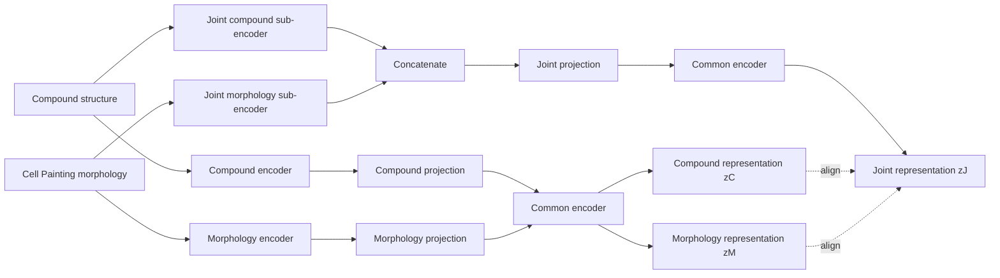
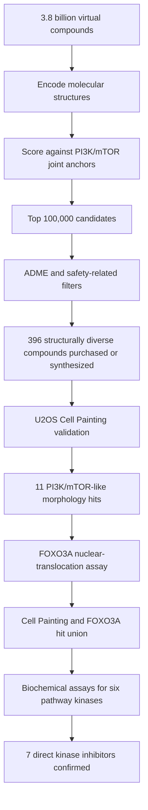

# PhenoCompass: Virtual Phenotypic Screening with Geometric Multimodal Contrastive Learning

> **Source note:** This document summarizes the bioRxiv preprint *Virtual phenotypic screening discovers novel scaffolds inhibiting the PI3K/mTOR pathway* by Wu et al. The version used here was posted on June 14, 2026 and had not yet been peer reviewed.

## 1. Executive Summary

Virtual screening is the computational process of searching a very large chemical library and ranking compounds according to their predicted ability to produce a desired biological effect. It is similar to using a search engine to find a small number of relevant books within a library containing billions of volumes.

Traditional virtual screening is most successful in **target-based drug discovery (TDD)**, where a specific disease-associated protein is already known. However, many diseases—especially cancer, neurodegenerative disorders, and other complex diseases—cannot be explained by a single protein target. In these cases, it may be more useful to ask a functional question:

> **Which compounds can move a diseased cell toward a desired cellular state?**

This is the central idea of **phenotypic drug discovery (PDD)**. PDD provides biologically rich and physiologically relevant information, but physical phenotypic screening is expensive and difficult to scale.

**PhenoCompass** is designed to bridge this gap. It learns a shared representation space between:

1. the **chemical structure of a compound**, and
2. the **cellular morphology caused by that compound**, measured using Cell Painting images.

After training, a new candidate compound can be evaluated using only its chemical structure. The model estimates whether its structure is likely to produce a cellular phenotype similar to that of known pathway-modulating compounds. This enables **virtual phenotypic screening at the scale of billions of compounds**.

The most distinctive technical feature is its use of **Geometric Multimodal Contrastive learning (GMC)**. Unlike a standard CLIP-like method that directly aligns molecular and image embeddings, GMC creates a third, fused **joint representation** and aligns each individual modality to this joint representation. This design is intended to preserve both chemical and biological information while creating a common search space.

---

## 2. What Is Virtual Screening?

Virtual screening searches an in silico chemical library and prioritizes a small set of compounds for real experiments.

Suppose a library contains 3.8 billion compounds. Synthesizing and testing every compound in cells would be practically impossible. A virtual screening model can first rank all candidates computationally and reduce the library to a few hundred compounds that are worth purchasing, synthesizing, and validating experimentally.

### 2.1 Structure-Based Virtual Screening

Structure-based virtual screening is used when the three-dimensional structure of a target protein is known.

A docking algorithm estimates whether a candidate molecule can fit into a binding pocket of the protein, similar to testing whether a key fits into a lock. The score is based on predicted geometric and energetic compatibility between the protein and ligand.

**Strengths**

- Can screen extremely large computational libraries.
- Provides an interpretable protein–ligand binding hypothesis.
- Works well when the relevant target and binding site are known accurately.

**Limitations**

- Requires a predefined molecular target.
- Often depends on the quality and conformational state of the protein structure.
- Predicted binding does not guarantee cellular activity, permeability, pathway modulation, or therapeutic benefit.
- Is less suitable when multiple proteins and pathways jointly generate the disease phenotype.

### 2.2 Ligand-Based Virtual Screening

Ligand-based screening starts from compounds already known to be active. It searches for candidates with similar chemical structures, fingerprints, physicochemical properties, or learned molecular representations.

This approach does not always require a protein structure, but conventional similarity search often favors molecules that resemble known compounds. It may therefore struggle to discover compounds with genuinely new chemical scaffolds.

### 2.3 Virtual Phenotypic Screening

Virtual phenotypic screening asks a different question:

> **Can the chemical structure of a new compound predict a desired cellular phenotype?**

Rather than requiring a known protein-binding pocket, it uses a cellular state as the search objective. In PhenoCompass, that cellular state is represented by a high-dimensional Cell Painting morphology profile.

This creates a structure-to-phenotype search engine:

- **Query:** a phenotype associated with a desired pathway effect.
- **Search space:** billions of molecular structures.
- **Output:** compounds predicted to generate a similar cellular phenotype.

---

## 3. Why Virtual Phenotypic Screening Was Previously Difficult

Virtual phenotypic screening was not conceptually impossible, but several technological barriers made it difficult to implement at useful scale.

### 3.1 Lack of Large Paired Datasets

A model must observe many paired examples of the form:

\[
(\text{compound structure},\; \text{cellular response})
\]

Historically, large and standardized datasets linking chemical structures to high-content cellular images were limited. Technologies and consortia such as Cell Painting and JUMP made it possible to generate much larger perturbation atlases.

### 3.2 High Dimensionality of Cellular Images

A Cell Painting experiment does not produce one simple measurement. It captures multiple cellular compartments, including the nucleus, mitochondria, RNA-associated regions, endoplasmic reticulum, Golgi apparatus, plasma membrane, and cytoskeleton.

The resulting images contain complex information about cell shape, organelle organization, texture, intensity, and population-level heterogeneity. Earlier handcrafted image features could not always represent this information robustly. Modern self-supervised vision models can convert these images into informative numerical embeddings.

### 3.3 Batch Effects and Experimental Variation

Cell images may differ because of laboratory site, plate, microscope, illumination, well position, or experimental batch rather than because of true biology. A virtual screening model trained on uncontrolled technical artifacts may learn the wrong signal.

PhenoCompass therefore begins by constructing a batch-corrected phenotypic map rather than directly training on raw images.

### 3.4 Missing Target Hypotheses

Structure-based docking requires a predefined protein target. PDD is often deliberately target-agnostic: researchers may know the desired disease phenotype without knowing which protein or combination of proteins should be modulated.

Therefore, a successful PDD virtual-screening system must learn pathway- or state-level biology without relying on a known protein structure.

---

## 4. Physical Screening Methods and Their Trade-Offs

### 4.1 Arrayed Screens

In an arrayed screen, each compound is placed in a separate well and tested individually.

This category includes cell-based phenotypic screens and target-based ultra-high-throughput screens.

**Advantages**

- Directly measures real biological or biochemical responses.
- Can generate rich cellular information when combined with imaging.
- The identity of the compound in each well is known.

**Disadvantages**

- Requires physical access to every compound.
- Requires large amounts of cells, reagents, plates, imaging time, and laboratory automation.
- Practical library size is generally around \(10^5\) to \(10^6\) compounds, far below the size of modern make-on-demand chemical spaces.

### 4.2 DNA-Encoded Libraries

A DNA-encoded library attaches a DNA barcode to each compound. Many compounds can be pooled together and exposed to a target protein. DNA sequencing identifies compounds enriched by target binding.

**Advantages**

- Can handle libraries as large as approximately \(10^{12}\) members.
- Provides extraordinary scale for target-binding selection.

**Disadvantages**

- Primarily measures whether a compound binds to an isolated target.
- Does not directly show whether the compound enters a cell or produces the desired functional response.
- May not capture pathway-level effects, polypharmacology, or cellular toxicity adequately.

### 4.3 The Fundamental Trade-Off

| Screening strategy | Typical scale | Biological richness | Main limitation |
|---|---:|---|---|
| Arrayed Cell Painting or phenotypic screen | \(10^5\)–\(10^6\) | Very high | Expensive and difficult to scale |
| Target-based biochemical screen | \(10^5\)–\(10^6\) | Moderate | May not translate into cellular activity |
| DNA-encoded library | Up to \(10^{12}\) | Primarily binding information | Limited direct functional readout |
| Structure-based virtual screening | Millions to billions | Target-specific prediction | Requires a known target and protein structure |
| Virtual phenotypic screening | Potentially billions | Predicted cellular-state information | Depends on training data and model generalization |

PhenoCompass attempts to combine the **scale of computational screening** with the **biological richness of cellular phenotypes**.

---

## 5. PDD and TDD: Why the Gap Matters

### 5.1 Phenotypic Drug Discovery

PDD searches for compounds that produce a desired functional or cellular change without necessarily specifying the molecular target in advance.

Examples include:

- suppressing abnormal cell proliferation,
- restoring a disease-associated cell morphology,
- inducing differentiation,
- changing organelle organization,
- or inhibiting a signaling pathway at the cellular level.

**Advantages**

- Can discover previously unknown mechanisms of action.
- Can capture polypharmacology and interactions among multiple pathways.
- Measures activity in a cellular context.
- Has historically contributed to first-in-class drug discovery.

**Limitations**

- High-content experiments are expensive and operationally complex.
- The readout is high-dimensional and difficult to interpret.
- Physical screening cannot easily cover billions of compounds.
- After finding a hit, the responsible molecular target may still need to be identified through post-hoc target deconvolution.

### 5.2 Target-Based Drug Discovery

TDD begins with a predefined disease-related protein and searches for compounds that bind to or modulate it.

**Advantages**

- Assays are relatively simple and standardized.
- Protein–ligand modeling and docking can be applied.
- Large virtual libraries can be screened efficiently.
- Mechanistic interpretation is clearer at the beginning of the campaign.

**Limitations**

- The selected target may not be sufficient to modify the actual disease state.
- Binding in a purified biochemical assay may not translate to activity in a cell.
- Single-target assumptions may miss pathway interactions and polypharmacology.
- Unexpected but therapeutically useful mechanisms can be excluded too early.

### 5.3 The Role of PhenoCompass

PhenoCompass does not replace TDD. It complements it by enabling a target-agnostic, phenotype-first search over an ultra-large chemical space.

The model can first identify compounds predicted to generate a desired pathway phenotype. Researchers can then use biochemical assays, reporter assays, genetic screens, proteomics, and medicinal chemistry to determine and optimize their mechanisms.

---

## 6. PhenoCompass Training Data and Phenotypic Map

PhenoCompass was trained using the JUMP Cell Painting dataset, which contains more than 100,000 compound–phenotype pairs measured in U2OS osteosarcoma cells.

### 6.1 Cell Painting as a Morphological Fingerprint

Cell Painting uses multiple fluorescent channels to capture several cellular compartments. A compound-induced image profile can be interpreted as a high-content morphological fingerprint of the compound's biological effect.

Compounds that act through related mechanisms may produce similar morphological signatures even when their chemical structures are different.

### 6.2 DINO-Based Image Representation

PhenoCompass does not feed raw Cell Painting pixels directly into the final multimodal model. The authors first train a self-supervised DINO vision transformer to convert image crops into morphology embeddings.

Cross-source sampling is used so that images produced by the same compound at different experimental sites are treated as related views. This encourages the image representation to preserve biological perturbation signals while becoming less sensitive to source-level batch effects.

After quality control, normalization, dimensionality reduction, and batch correction, the final phenotypic map contained:

- **613,676 Cell Painting wells**,
- **108,836 distinct compounds**, and
- data retained from **eight experimental sources**.

DINO representation learning and GMC perform different roles:

- **DINO:** learns a robust representation of cellular images.
- **GMC:** aligns the resulting morphology representation with the compound's molecular representation.

---

## 7. The Central Innovation: GMC Contrastive Learning

## 7.1 Why Standard Direct Alignment Is Not Enough

A conventional multimodal contrastive model such as CLIP directly pulls a matching pair of modality embeddings together:

\[
\text{molecule embedding} \leftrightarrow \text{image embedding}
\]

This can be useful, but chemical structure and cellular morphology do not contain identical information.

- The molecular structure contains topology, functional groups, stereochemistry, and physicochemical information.
- The image contains the integrated cellular consequence of exposure, including target engagement, permeability, metabolism, off-target activity, pathway crosstalk, and cellular context.

Forcing these two modalities to match each other too directly may discard information that exists in only one modality.

PhenoCompass instead uses a **joint-modality representation as an anchor**.

## 7.2 Three Representations

For each paired training example \(i\), PhenoCompass learns:

- \(z_i^{(C)}\): a **compound representation**, generated from molecular structure;
- \(z_i^{(M)}\): a **morphology representation**, generated from the DINO Cell Painting embedding;
- \(z_i^{(J)}\): a **joint representation**, generated from both the compound and morphology inputs.

The joint encoder uses compound and morphology sub-encoders with weights independent from the modality-specific encoders. Their outputs are concatenated, projected, and passed through a common encoder so that all three representation types occupy a comparable latent space.

## 7.3 Positive and Negative Pairs

For the same compound–image pair \(i\), GMC defines the following as positive relationships:

\[
\left(z_i^{(C)}, z_i^{(J)}\right)
\]

and

\[
\left(z_i^{(M)}, z_i^{(J)}\right).
\]

The loss is bidirectional: the compound representation must retrieve its joint representation, and the joint representation must retrieve its compound representation. The same applies to morphology and joint representations.

Nonmatching examples within the mini-batch act as negative pairs. Cosine similarity and a temperature parameter are used to increase similarity for correct pairs and decrease it for incorrect pairs.

A simplified interpretation is:

\[
\mathcal{L}_{GMC}
=
\mathcal{L}_{C\leftrightarrow J}
+
\mathcal{L}_{M\leftrightarrow J}.
\]

The key distinction is that **compound and morphology are not required to be the direct positive pair**. Each is aligned to the fused joint representation.

## 7.4 Why the Joint Representation Matters

The joint representation functions as a phenotype-informed molecular reference point.

It can preserve information shared between the modalities while also representing their complementary information. This is particularly useful in drug discovery because the relationship between structure and phenotype is many-to-many:

- structurally different compounds can converge on the same pathway phenotype;
- structurally similar compounds can produce different phenotypes because of small chemical changes;
- one compound can affect multiple proteins;
- and multiple target profiles can converge on a shared cellular state.

The joint embedding therefore provides a more flexible anchor than direct structural similarity alone.

## 7.5 Consistency Regularization

The GNEprop version of PhenoCompass adds a multimodal **consistency regularization** term.

Ordinary contrastive learning asks a positive pair to be more similar than negative pairs. Consistency regularization adds a stronger geometric requirement: the two representations of a positive pair should also have similar relationships to the remaining examples in the batch.

For example, if a compound representation considers several negative compounds to be relatively near or far, its paired joint representation should produce a similar distribution of similarities to those negatives.

The model measures the mismatch between the two similarity distributions using a symmetrized Kullback–Leibler divergence, also called the **Jeffreys divergence**.

The total objective is:

\[
\mathcal{L}_{total}
=
\mathcal{L}_{GMC}
+
\alpha\mathcal{L}_{CR},
\]

where \(\alpha\) controls the contribution of consistency regularization.

Conceptually:

- **GMC loss:** makes paired representations close.
- **Consistency regularization:** makes their surrounding neighborhood geometry consistent.

This helps the model learn a structured latent space rather than only memorizing isolated matching pairs.

## 7.6 Label-Free Pathway Representation Learning

PhenoCompass is not initially trained with labels such as “PI3K inhibitor” or “mTOR inhibitor.” It learns from abundant paired compound–phenotype observations.

Pathway labels are introduced later through a small number of known modulators used as anchors. This is why the framework can be described as self-supervised multimodal representation learning followed by few-shot pathway-specific retrieval.

---

## 8. How Few-Shot Virtual Screening Works

For a desired pathway, researchers select a small set of known pathway modulators whose Cell Painting responses are phenotypically consistent. These are called **anchor compounds**.

The paper constructed anchor sets for six pathway or target classes:

- PI3K/mTOR,
- JAK/ROCK,
- CDK,
- HDAC,
- MAPK,
- HSP90.

Each anchor set contained approximately 7 to 17 structurally diverse compounds.

### 8.1 Anchor Construction

An anchor can be represented using:

- its compound embedding,
- its morphology embedding,
- or its joint embedding.

Joint representations generally provided stronger retrieval performance because they contain both structural and phenotypic information.

### 8.2 Candidate Scoring

A candidate from an ultra-large virtual library has no Cell Painting image. Only its molecular structure is available.

PhenoCompass therefore:

1. encodes the candidate structure as \(z_{candidate}^{(C)}\);
2. computes cosine similarity between the candidate and every pathway anchor;
3. averages these similarities;
4. ranks candidates by the resulting pathway score.

A simplified score is:

\[
S(c)
=
\frac{1}{K}
\sum_{k=1}^{K}
\cos\left(z_c^{(C)}, z_k^{(J)}\right),
\]

where \(K\) is the number of anchors.

This is the critical operational benefit of the multimodal alignment: **the model is trained using both structures and images, but can screen new compounds using structure alone**.

### 8.3 Scaffold Hopping

The goal is not merely to retrieve molecules that look chemically similar to the anchors. PhenoCompass is designed to identify **scaffold-hopping candidates**—molecules with different core structures that are predicted to produce a similar pathway phenotype.

The authors evaluated this using scaffold-cluster splits, in which structurally related scaffold groups were separated across training and test sets. This is stricter than randomly splitting individual compounds and better reflects real drug-discovery conditions.

---

## 9. Prospective PI3K/mTOR Screening Pipeline

PhenoCompass was used prospectively to search a 3.8-billion-compound subset of the Enamine REAL library for PI3K/mTOR pathway inhibitors.

### 9.1 Computational Prioritization

The model scored the full 3.8-billion-compound library. The top 100,000 candidates were retained, followed by absorption, distribution, metabolism, and excretion-related filters and structural-diversity selection.

This reduced the initial search space to **396 compounds** for physical testing—approximately **0.0000104%** of the original library, or roughly one compound per 9.6 million virtual candidates.

### 9.2 Cell Painting Validation

The 396 selected compounds were tested in U2OS cells using Cell Painting.

- 134 of 396 compounds showed measurable bioactivity.
- 11 compounds produced PI3K/mTOR-like morphological signatures.
- This corresponded to a **54-fold enrichment** over the PI3K/mTOR-like hit rate in the JUMP training collection.

A simple structural-similarity baseline was not sufficient: highly Tanimoto-similar Enamine compounds that were not highly ranked by PhenoCompass failed to show bioactivity in the comparison described by the authors.

### 9.3 FOXO3A Reporter Validation

FOXO3A translocates to the nucleus when the PI3K/mTOR pathway is inhibited. The authors therefore used a FOXO3A nuclear-translocation assay as an orthogonal, pathway-focused validation.

Eight compounds passed the stringent FOXO3A hit criteria, and five overlapped with the Cell Painting hits. This showed that the broad morphological signature was predictive of a more targeted pathway readout.

### 9.4 Direct Kinase Assays

The union of Cell Painting and FOXO3A hits was tested against six kinases:

- PI3Kα,
- PI3Kβ,
- PI3Kγ,
- PI3Kδ,
- AKT1,
- mTOR.

Seven compounds were confirmed as direct kinase inhibitors with diverse mechanisms of action. Several behaved as pan-PI3K inhibitors, while one compound showed strong mTOR selectivity.

Importantly, many confirmed hits were structurally dissimilar to both the JUMP training compounds and known clinical-stage PI3K/mTOR inhibitors. This supports the claim that PhenoCompass can enable genuine scaffold hopping rather than simple nearest-neighbor retrieval.

---

## 10. Why This Approach Is Valuable

### 10.1 Dramatic Reduction in Experimental Burden

Physical testing is reserved for a very small, highly ranked subset of the virtual library. This reduces expenditure on synthesis, purchasing, reagents, plates, imaging, and analysis.

Virtual screening does not eliminate experiments. Instead, it reallocates experiments toward candidates with higher expected value.

### 10.2 Expansion of Searchable Chemical Space

A physical Cell Painting campaign might test hundreds of thousands of compounds. PhenoCompass can rank billions of make-on-demand structures, greatly increasing the probability of finding novel scaffolds.

### 10.3 Phenotype-First Discovery Without a Protein Structure

Because the query is based on a desired cellular state, the method does not require a known protein-binding pocket. This is useful when:

- the disease mechanism is incomplete,
- several pathway nodes are relevant,
- polypharmacology is beneficial,
- or different molecular mechanisms can converge on the same therapeutic phenotype.

### 10.4 Early De-Risking at the Cellular Level

Candidates are prioritized using a representation learned from real cellular responses. This may help remove compounds whose structures appear interesting but are unlikely to generate the required cellular state.

However, this is still prediction rather than proof. Toxicity, selectivity, pharmacokinetics, and in vivo efficacy require separate validation.

### 10.5 Discovery of Diverse Mechanisms

A morphology-defined pathway signature can be produced by different molecular activity profiles. This allows the search to recover compounds that act at different nodes of the same pathway instead of restricting the campaign to one predefined binding site.

---

## 11. Key Differences from Conventional Methods

| Question | Conventional docking | Structural similarity search | PhenoCompass |
|---|---|---|---|
| What is the query? | A protein-binding pocket | A known active molecule | A desired cellular phenotype represented by anchor compounds |
| What is required for new candidates? | Molecular structure and protein structure | Molecular structure | Molecular structure only |
| What is learned from training data? | Usually a binding or energy function | Chemical similarity or activity relationship | Joint geometry between chemistry and cellular morphology |
| Can it work without a known target structure? | Usually no | Yes | Yes |
| Can it support pathway-level effects? | Indirectly | Limited | Explicitly targeted through phenotype-consistent anchors |
| Main novelty-search mechanism | Docking into a pocket | Similarity to known compounds | Phenotypic similarity across structurally distinct scaffolds |

---

## 12. Limitations

### 12.1 Cell-Type Dependence

PhenoCompass was trained on JUMP data generated in U2OS osteosarcoma cells. Fundamental pathways may generalize across cell types, but tissue-specific diseases may require training data from primary cells, induced pluripotent stem cells, organoids, or other disease-relevant systems.

### 12.2 Morphology Does Not Capture Every Biological Process

Some biological changes may not produce a detectable Cell Painting signature. Transcriptomic, proteomic, electrophysiological, or functional readouts could provide complementary information.

### 12.3 Dependence on High-Quality Anchors

Few-shot screening requires known modulators with consistent phenotypes. For a completely novel pathway with no reliable chemical anchors, the query may be difficult to define.

Genetic perturbations such as CRISPR knockouts could theoretically provide anchors, but the paper reports technical confounding that prevented reliable alignment of genetic and compound perturbations in the current JUMP analysis.

### 12.4 Target Identification Remains Necessary

Phenotypic hits do not automatically reveal the exact molecular target. Post-hoc deconvolution may still require biochemical profiling, genetic dependency screens, proteomics, resistance studies, or other experiments.

### 12.5 Hits Are Starting Points, Not Drugs

The confirmed compounds were unoptimized hits. Medicinal chemistry is still needed to improve potency, selectivity, solubility, metabolic stability, safety, and pharmacokinetic properties.

### 12.6 Prospective Validation Is Essential

A high virtual score does not prove activity. The value of the framework comes from combining computational prioritization with a staged experimental cascade:

\[
\text{virtual score}
\rightarrow
\text{Cell Painting}
\rightarrow
\text{pathway reporter}
\rightarrow
\text{biochemical validation}.
\]

---

## 13. Final Takeaway

PhenoCompass transforms virtual screening from a search for molecules that merely fit a protein or resemble a known ligand into a search for molecules predicted to produce a desired **cellular state**.

Its core contribution is not only the use of Cell Painting data, but the way the two modalities are connected:

> **GMC learns compound, morphology, and fused joint representations, then uses the joint representation as the geometric anchor that connects chemical structure to cellular phenotype.**

This enables a model trained on real compound–cell pairs to screen unseen compounds using structure alone. Known pathway modulators define a phenotype-informed query, and billions of compounds can be ranked by their predicted similarity to that biological state.

In this sense, PhenoCompass acts as a search engine for chemical space in which the search term is not simply a molecular substructure or protein pocket, but a **high-content biological phenotype**.

---

## Reference

Wu, A. P., Yao, H., Hoeckendorf, B., Gaskins, G., Kosaisawe, N., Liu, Z., Hanslovsky, P., Mayba, O., Skelton, N., Scalia, G., Moffat, J. G., Biancalani, T., Hütter, J.-C., and Richmond, D. *Virtual phenotypic screening discovers novel scaffolds inhibiting the PI3K/mTOR pathway*. bioRxiv preprint, 2026. DOI: 10.64898/2026.06.10.731476.
