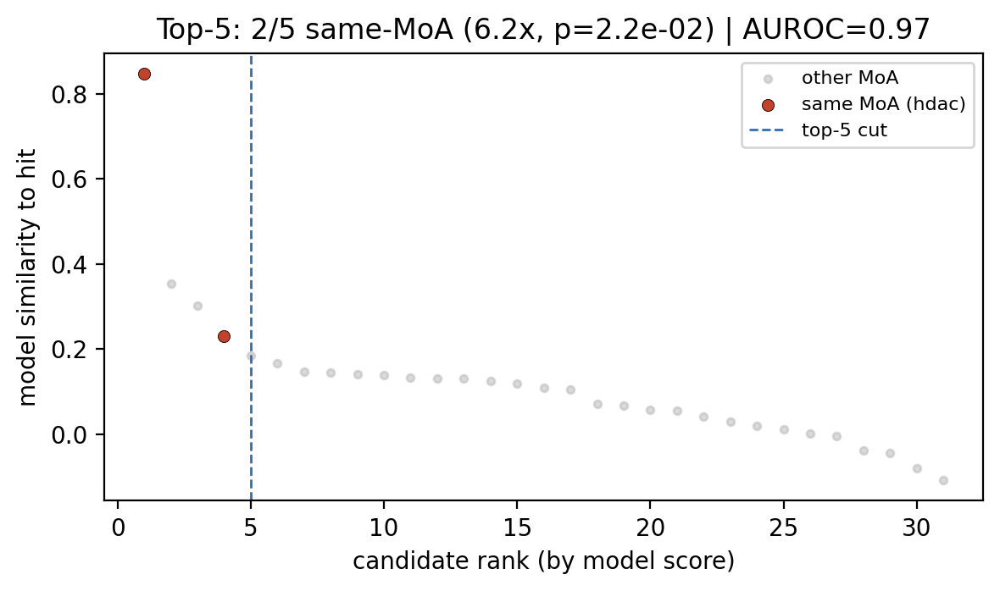
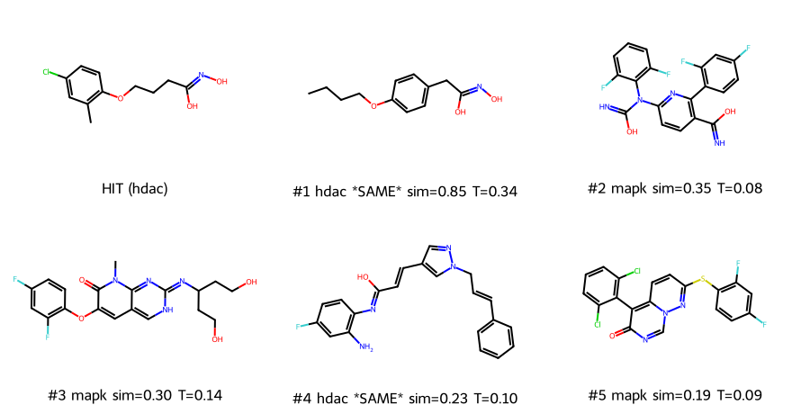

[🏠 Portfolio](https://github.com/heoneyzi) › [🩺 Medical](../../../README.md) › [PhenoFocus](../../README.md) › **E1 · Single-hit expansion**

# 🔬 E1 · One HDAC hit in, structurally independent candidates out

> **Question —** Given a single compound known to work through one mechanism, does PhenoCompass rank the library's *other* compounds of that mechanism to the top — and are those retrieved compounds structurally *different* from the query?

| | |
|---|---|
| **Status** | ✅ Run July 2026 (exploratory MVP) |
| **Model / data** | Released PhenoCompass 12-model ensemble, structure tower, `joint` anchor modality · 31-compound mechanism-annotated library from the model deposit |
| **Compute** | CPU inference on the team server; minutes |
| **Headline** | 2 of 2 same-mechanism compounds inside the top 5 (ranks **1** and **4** of 31) — **AUROC 0.97**, **6.2× enrichment**, **p = 0.02** — at ECFP4 Tanimoto **0.34** and **0.10** to the query |

## Setup

- **Query.** One HDAC-inhibitor hit (a hydroxamic-acid compound; `JHSXDAWGLCZYSM-UHFFFAOYSA-N`), taken from the library itself and excluded from its own ranking.
- **Library.** 31 further compounds carrying a mechanism annotation, from the PhenoCompass deposit's annotated compound table — 22 MAPK, 5 CDK, 2 HDAC, 2 mTOR/PI3K (`inputs/a549_compounds.csv`, which holds all 32 rows including the query).
- **Procedure.** Embed the query and every library compound with the 12-model structure ensemble, L2-normalise and average across models, rank by cosine similarity to the query, keep the top 5. Two independent scores per candidate: the model's cosine similarity, and an ECFP4 Tanimoto (Morgan radius 2, 2048 bits) that the model never sees.
- **Statistics.** Hypergeometric test for same-mechanism compounds landing in the top 5 (2 positives among 31), plus ranking AUROC over the full list.
- **Command.** `python src/a549_mvp/expand_hit.py --final-model-dir ./final_model --a549-compounds .../a549_compounds.csv --hit "auto:hdac" --top-k 5 --out-dir ./expansions`

## Results

Source: `results/hit_JHSXDAWGLCZYSM_UHFFFAOYSA_N_candidates.csv`.

| Rank | Mechanism | Same as query? | Model score (cosine) | Tanimoto to query |
|---:|---|---|---:|---:|
| **1** | HDAC6 inhibitor | ✅ yes | 0.848 | **0.34** |
| 2 | p38 MAPK inhibitor | ✗ no | 0.354 | 0.08 |
| 3 | p38 MAPK inhibitor | ✗ no | 0.302 | 0.14 |
| **4** | HDAC3 inhibitor | ✅ yes | 0.230 | **0.10** |
| 5 | p38 MAPK inhibitor | ✗ no | 0.185 | 0.09 |

The library contained exactly two other HDAC compounds, and both landed in the top 5. Aggregate figures for the full 31-compound ranking:

| Metric | Value | Meaning |
|---|---:|---|
| Ranking AUROC | **0.97** | probability a same-mechanism compound outranks a different-mechanism one (0.5 = chance) |
| Top-5 enrichment | **6.2×** | 2 observed vs 0.32 expected by chance |
| Hypergeometric p | **0.02** | chance of ≥ 2 same-mechanism compounds in a random top-5 |
| Tanimoto of the two hits | **0.34**, **0.10** | below ~0.4 is conventionally a different scaffold |

<table>
<tr>
<td width="50%"></td>
<td width="50%"></td>
</tr>
<tr>
<td>Same-mechanism compounds cluster at the very top of the ranking, not scattered through it.</td>
<td>Every pair in the returned set is structurally distinct (all off-diagonal ≤ 0.34, most below 0.2).</td>
</tr>
</table>

The query and its five candidates as drawn structures, labelled with rank, mechanism, model score and Tanimoto (<code>results/…_molgrid.png</code>).

### Independent check

`sanity_check/ecfp_baseline.py` re-derives the headline numbers from the committed files without the model, and adds the baseline the result has to beat — ranking the same library by plain chemical-fingerprint similarity to the query, i.e. classic look-alike search. Output in `sanity_check/ecfp_baseline.json`:

| Ranking | AUROC | Same-mechanism in top 5 | Enrichment | p | Ranks of the two HDAC compounds |
|---|---:|---:|---:|---:|---|
| PhenoCompass structure ranking | **0.97** | 2 / 5 | **6.2×** | **0.02** | 1, 4 |
| Chemical fingerprint only | 0.71 | 1 / 5 | 3.1× | 0.30 | 1, **19** |

The fingerprint baseline finds the close analogue at rank 1 and then loses the other HDAC compound to rank 19 — exactly the failure mode scaffold hopping is meant to fix. All five reported Tanimoto values re-computed to 4 decimal places.

## Takeaway

- The retrieval works on this library: same-mechanism compounds are ranked at the top, and the clustering is unlikely to be chance (p = 0.02).
- The candidates are genuinely different molecules, not analogues of the query — and the rank-4 compound belongs to a different HDAC chemical class, the textbook "same mechanism, independent scaffold" case.
- The learned space adds something a chemical fingerprint alone does not: the same library ranked by structural similarity puts the second HDAC compound at rank 19.
- It does **not** show that the model reads cell images from a new cell line correctly: this is the structure side only (Direction A). Nor is any retrieved compound biologically validated.
- It is a **small-scale proof**: one query, 31 compounds, 2 positives. The statistics are honest but thin, and the mechanism labels in this deposit set are sparse and skewed.

## Files

| File | What it is |
|---|---|
| `inputs/a549_compounds.csv` | the 32-row compound table (query + 31 library compounds) with mechanism annotations and cluster labels |
| `results/hit_…_candidates.csv` | the ranked top-5 with model score, mechanism and Tanimoto — source of every number above |
| `results/hit_…_significance.png` | rank vs model score for all 31, same-mechanism highlighted |
| `results/hit_…_tanimoto_heatmap.png` | pairwise structural similarity of query + top-5 |
| `results/hit_…_molgrid.png` | the query and its candidates drawn as molecules |
| `sanity_check/ecfp_baseline.py` · `.json` | portfolio-added re-check of the metrics plus the fingerprint-only baseline |

The run also produced a self-contained HTML one-pager (`hit_…_report.html`); it is left out of the repository because it duplicates these files with the images inlined as base64.

---
[🏠 Portfolio](https://github.com/heoneyzi) · [PhenoFocus](../../README.md) · [Next → E2](../E2_six_moa_benchmark/README.md)
