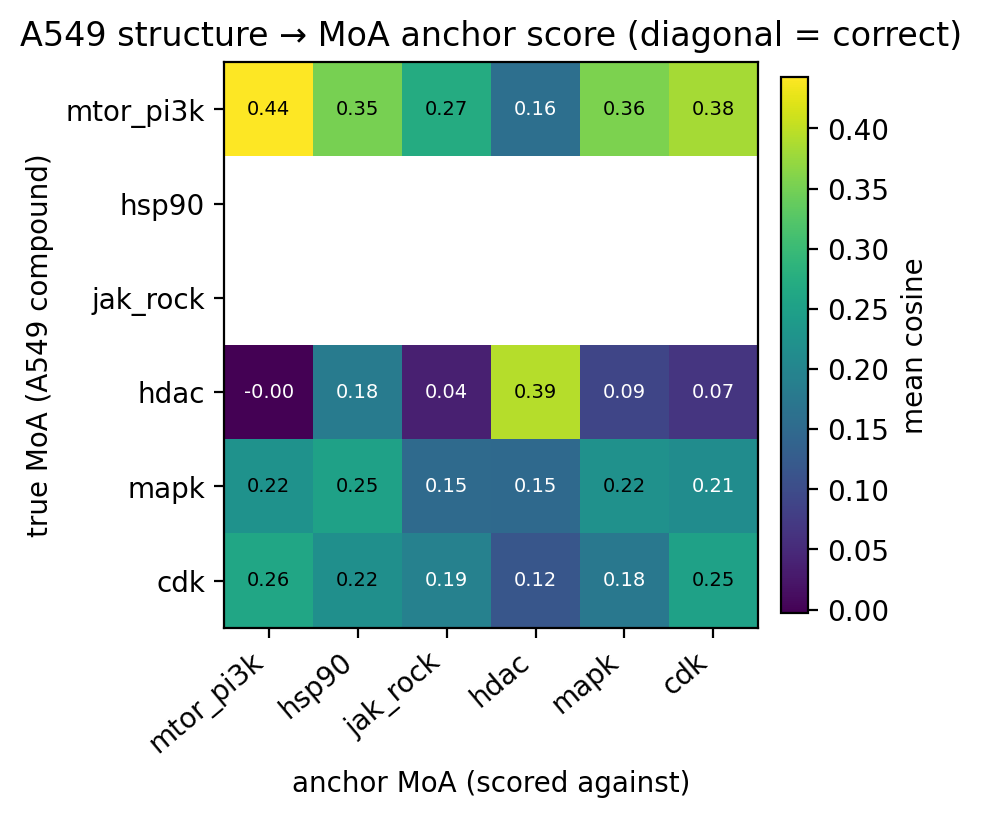
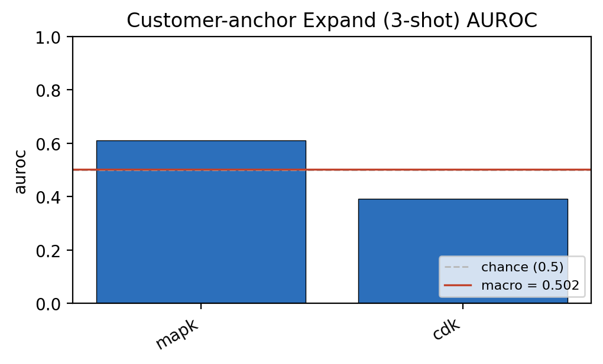
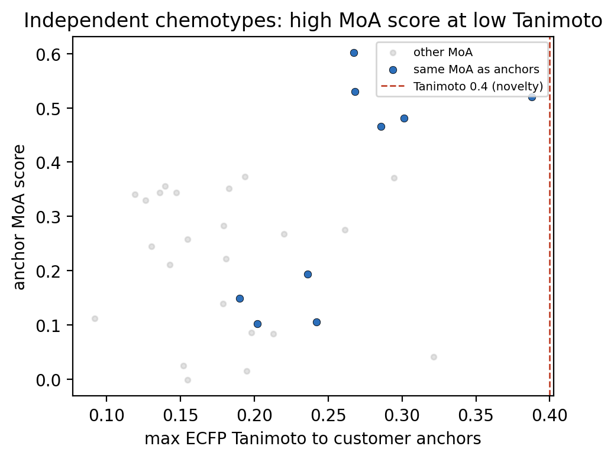

[🏠 Portfolio](https://github.com/heoneyzi) › [🩺 Medical](../../../README.md) › [PhenoFocus](../../README.md) › **E2 · Six-mechanism benchmark**

# 🔬 E2 · How far does structure-only mechanism scoring actually get?

> **Question —** Beyond the one favourable query in [E1](../E1_hdac_hit_expansion/README.md), how well does scoring chemical structures against the six frozen mechanism anchor sets recover each compound's *own* mechanism — and does few-shot expansion hold up across mechanisms?

| | |
|---|---|
| **Status** | ✅ Run July 2026 (exploratory MVP) |
| **Model / data** | Released PhenoCompass 12-model ensemble, structure tower, `joint` anchors · the same 32-compound annotated set as E1 |
| **Compute** | CPU inference on the team server; minutes |
| **Headline** | **Macro one-vs-rest AUROC 0.716**, rank-1 accuracy **0.281**, top-1 mechanism enrichment **1.69×** — strong for two mechanisms, near chance for the others |

## Setup

Two demonstrations, both structure-side (Direction A), run by `src/a549_mvp/run_mvp.py`:

1. **Cross-context mechanism recovery.** Score every compound's structure against all six anchor sets (mtor_pi3k, hsp90, jak_rock, hdac, mapk, cdk). If the anchors capture the mechanism, a compound's own mechanism should score highest. Measured by one-vs-rest AUROC per mechanism, rank-1 accuracy, and enrichment of the true mechanism at rank 1.
2. **Few-shot expansion.** For each mechanism, sample 3 compounds as "query anchors", rank all remaining compounds by mean cosine similarity to them, and measure one-vs-rest AUROC and precision@10, averaged over 20 repeats.

**Class coverage is the story here.** Of the six anchor mechanisms, this library populates only four, and very unevenly (`summary.json` → `moa_mapped_counts`): mapk 22, cdk 5, hdac 3, mtor_pi3k 2, hsp90 0, jak_rock 0. Two mechanisms are empty and cannot be scored at all.

## Results

Per-mechanism recovery (`results/a549_crosscontext_auroc.csv`):

| Mechanism | n | One-vs-rest AUROC | Rank-1 hit rate | Fold enrichment |
|---|---:|---:|---:|---:|
| hdac | 3 | **0.908** | 1.000 | 4.57× |
| mtor_pi3k | 2 | **0.867** | 0.500 | 2.67× |
| mapk | 22 | 0.555 | 0.136 | 1.45× |
| cdk | 5 | 0.533 | 0.400 | 1.60× |
| hsp90 | 0 | — | — | — |
| jak_rock | 0 | — | — | — |
| **macro** | 32 | **0.716** | **0.281** (accuracy) | **1.69×** (top-1) |

Few-shot expansion (`results/a549_expand_retrieval.csv`) — only two mechanisms have more than 3 compounds, so only two can be evaluated:

| Mechanism | n | AUROC | Precision@10 |
|---|---:|---:|---:|
| mapk | 22 | 0.611 | 0.695 |
| cdk | 5 | 0.393 | 0.060 |
| **macro** | | **0.502** | **0.377** |

Structural independence (`summary.json` → `structural_independence`): of the correctly recovered compounds, **9** sit below 0.4 Tanimoto to their mechanism's anchors, and the median maximum Tanimoto to any anchor is **0.19** — the compounds being scored are, as a set, structurally far from the anchors that define each mechanism.

<table>
<tr>
<td width="50%"></td>
<td width="50%"></td>
</tr>
<tr>
<td>Two mechanisms clear chance comfortably; two barely clear it. Empty classes are absent.</td>
<td>The diagonal (correct mechanism) is only the brightest cell for hdac and mtor_pi3k.</td>
</tr>
<tr>
<td></td>
<td></td>
</tr>
<tr>
<td>Few-shot expansion averages to chance once both evaluable mechanisms are counted.</td>
<td>Every compound in this set is structurally far from the anchors (all below the 0.4 novelty line).</td>
</tr>
</table>

## Takeaway

- Structure-only mechanism recovery is **real but uneven**: it works for hdac and mtor/PI3K, and is close to chance for mapk and cdk in this library.
- The 3-shot expansion sweep averages to **0.502 AUROC** — i.e. chance — which is the honest counterweight to E1's 0.97. E1 asked one favourable question; E2 asks all of them.
- The library, not just the model, is the bottleneck: 22 of 32 compounds are one mechanism, two anchor mechanisms are empty, and the two best-performing classes have only 3 and 2 members. These metrics are computed on very small groups and should be read as directional, not as a benchmark result.
- The right fix is the one the write-up already names: rebuild the compound table from the A549-native LINCS set so each mechanism has dozens of members, then re-run. That is unfinished work, not a claim.

## Files

| File | What it is |
|---|---|
| `results/summary.json` | headline numbers, class counts and the structural-independence summary for the whole run |
| `results/a549_crosscontext_auroc.csv` | per-mechanism AUROC, rank-1 hit rate and enrichment |
| `results/a549_confusion.csv` | true vs predicted mechanism counts |
| `results/a549_expand_retrieval.csv` | few-shot expansion AUROC and precision@10 per mechanism |
| `results/a549_anchor_scores.csv` | per-compound score against each of the six anchor sets, with the predicted mechanism |
| `results/figures/fig1…fig4.png` | the four figures above, as written by `src/a549_mvp/plots.py` |

---
[← Prev E1](../E1_hdac_hit_expansion/README.md) · [🏠 Portfolio](https://github.com/heoneyzi) · [PhenoFocus](../../README.md)
