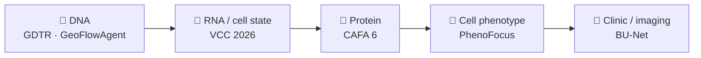
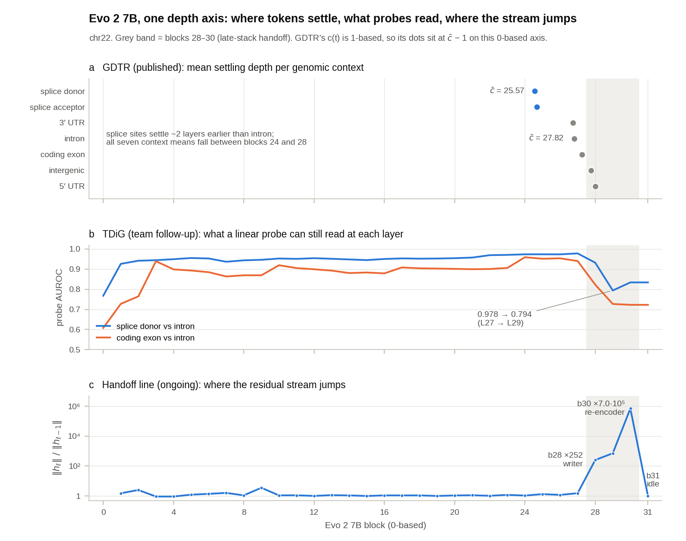
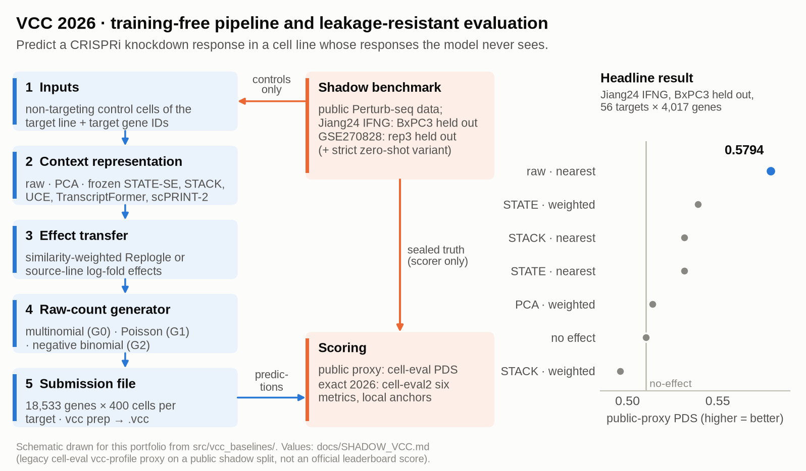
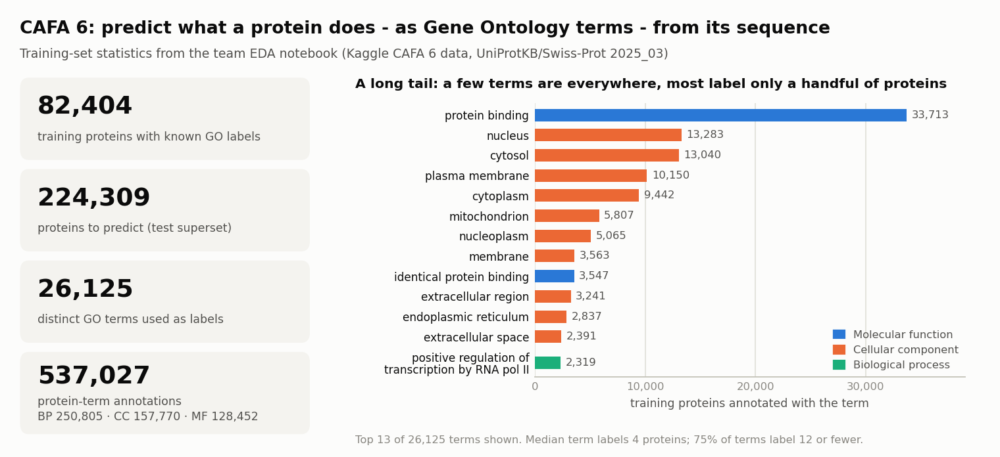
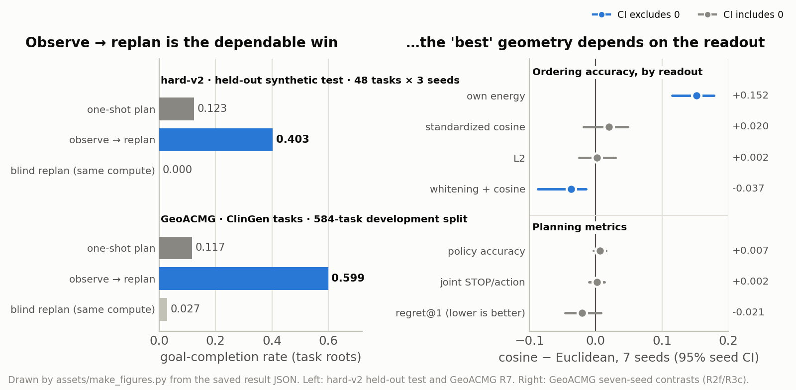
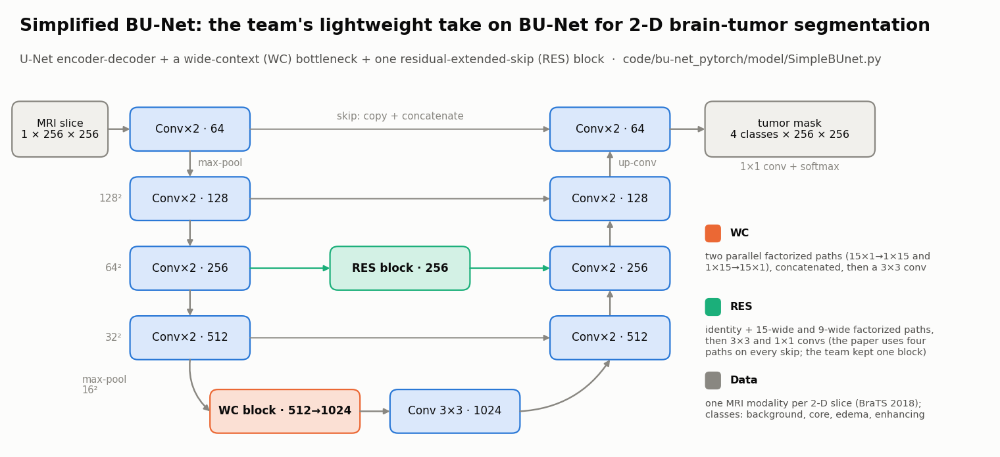

<sub>[🏠 Jiheon Kang](https://github.com/heoneyzi) › **🩺 Medical**</sub>

<div align="center">

# 🩺 Medical & Genomics AI

**From DNA to drugs: what do foundation models learn about biology — and can we trust it?**

  

</div>

Six projects that follow the flow of biological information — DNA → RNA and cell state → protein → cellular phenotype → clinic. Each folder holds a project README, curated code, results and one README per experiment.

## 🧬 Where each project sits



## 📂 Projects

<table>
<tr>
<td width="50%" valign="top">
<a href="GDTR/README.md"></a>
<br><b><a href="GDTR/README.md">🧬 GDTR research program</a></b>
<br><sub>How deep does a DNA language model think? A settling-depth lens on Evo 2 7B (→ ICML GenBio Oral), the TDiG 17-cell follow-up and an ongoing late-stack “handoff” analysis.</sub>
<br><sub><b>Author · follow-up research ongoing</b></sub>
</td>
<td width="50%" valign="top">
<a href="VCC_2026/README.md"></a>
<br><b><a href="VCC_2026/README.md">🧫 Virtual Cell Challenge 2026</a></b>
<br><sub>Zero-shot perturbation prediction: a training-free, submission-ready pipeline (18,533 genes × 400 cells) with a leakage-resistant shadow benchmark — 0.5794 public-proxy PDS.</sub>
<br><sub><b>Team Lead (6) · ongoing</b></sub>
</td>
</tr>
<tr>
<td width="50%" valign="top">
<a href="CAFA6/README.md"></a>
<br><b><a href="CAFA6/README.md">🧪 CAFA 6 — Bronze Medal</a></b>
<br><sub>Protein function from sequence alone: ProtT5 / ESM-C / JEPA pipelines over 82,404 training proteins and a 224,309-protein test superset.</sub>
<br><sub><b>Team member (ProtT5 branch) · 2026</b></sub>
</td>
<td width="50%" valign="top">
<a href="PhenoFocus/README.md"></a>
<br><b><a href="PhenoFocus/README.md">🔬 PhenoFocus</a></b>
<br><sub>Same biology, different skeleton: one hit in, mechanism-matched candidates out. Exploratory MVP on 31 compounds — AUROC 0.97, 6.2× top-5 enrichment.</sub>
<br><sub><b>Team Lead (4) · main round · ongoing</b></sub>
</td>
</tr>
<tr>
<td width="50%" valign="top">
<a href="GeoFlowAgent/README.md"></a>
<br><b><a href="GeoFlowAgent/README.md">🧭 GeoFlowAgent — genomics tool-use agent</a></b>
<br><sub>An AI agent that plans genomics tool use in a frozen embedding space; observing each result and replanning beats one-shot planning — 0.4028 vs 0.1233 on the held-out synthetic test, 0.5993 vs 0.1169 on ClinGen expert-record tasks.</sub>
<br><sub><b>Independent research · completed 2026</b></sub>
</td>
<td width="50%" valign="top">
<a href="Bu-net/README.md"></a>
<br><b><a href="Bu-net/README.md">🧠 Lightweight BU-Net</a></b>
<br><sub>Brain-tumor MRI segmentation: U-Net, U-Net + WC and a Simplified BU-Net on BraTS (deep daiv. Medical AI).</sub>
<br><sub><b>Team Lead (3) · 2024</b></sub>
</td>
</tr>
</table>

## 🧪 How to read a project folder

```text
<Project>/
├── README.md        ← the story: question → approach → results → my role → scope notes
├── assets/          ← figures (most regenerated from saved results by a script in the same folder)
├── experiments/     ← one folder per experiment (GDTR: per research line · CAFA6: pipelines/),
│                       each with its own README (question · setup · result · takeaway)
├── code/ or src/    ← curated code snapshot (data, weights and caches are not included)
└── docs/ · notes/   ← write-ups and study notes
```

> [!NOTE]
> Numbers are quoted exactly as they appear in the saved result files and are scoped in each README (proxy vs official, dev vs test, exploratory vs final). Team projects credit every member; "My contribution" sections list only what the sources support.

---
<sub>[🏠 Jiheon Kang](https://github.com/heoneyzi) · [Next: GeoFlowAgent →](GeoFlowAgent/README.md)</sub>

---

[Medical](https://github.com/heoneyzi/Medical) · [Paper](https://github.com/heoneyzi/Paper) · [Study](https://github.com/heoneyzi/Study) · [Deep_Daiv](https://github.com/heoneyzi/Deep_Daiv)

[Research website](https://heoneyzi.github.io/) · [CV (PDF)](https://heoneyzi.github.io/Jiheon_Kang_CV.pdf) · [Original repository archive](https://github.com/heoneyzi/Portfolio-Archive)
