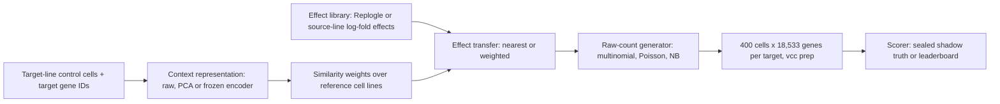

<sub>[🏠 Portfolio](https://github.com/heoneyzi) › [🩺 Medical](../README.md) › **VCC_2026**</sub>

<div align="center">

# 🧫 Virtual Cell Challenge 2026 — zero-shot perturbation prediction

**Can we predict how an unseen cell line responds to a gene knockdown, given only its unperturbed cells?**

[](https://virtualcellchallenge.org/)


[💻 Code](src/vcc_baselines/README.md) · [🔬 Experiments](#-experiments--results) · [📄 Challenge paper (Cell, 2026)](https://doi.org/10.1016/j.cell.2026.08.004) · [🔗 Public brief](https://github.com/heoneyzi/Virtual-Cell-Challenge-2026) · [🧬 Genomics study notes](https://github.com/heoneyzi/Study/blob/main/Genomics/README.md)

</div>

> [!TIP]
> **TL;DR** — Arc Institute's Virtual Cell Challenge 2026 asks for *zero-shot* predictions of single-cell responses to CRISPRi gene knockdowns in cell lines whose responses are never shown. As team lead, Jiheon built a training-free, submission-ready pipeline (frozen context representation → transfer of effects measured in similar reference cell lines → raw-count generator; 18,533 genes × 400 cells per perturbation) and a leakage-resistant shadow benchmark around it. On a public Jiang24 IFNG split with BxPC3 held out, raw nearest-context transfer reached **0.5794 public-proxy PDS** (no-effect 0.5102), and frozen STATE/STACK encoders did not beat it. This is a proxy result, **not an official leaderboard score**.

<details>
<summary><b>🇰🇷 한국어 요약</b></summary>

Arc Institute의 Virtual Cell Challenge 2026은 한 번도 반응을 본 적 없는 새로운 세포주에서, 특정 유전자를 CRISPRi로 억제하는 Perturbation을 가했을 때 세포 속 유전자 발현이 어떻게 바뀌는지를 제로샷으로 예측하는 대회입니다. 비유하자면, 처음 만난 사람의 평소 모습(대조군 세포)만 보고, 다른 사람들이 같은 약을 먹었을 때 남긴 기록(Replogle 공개 데이터)을 참고해 이 사람의 반응을 맞히는 문제입니다. 강지헌은 6인 팀(YAI Functional Genomics 2)의 팀장으로서, 학습 없이 동작하는 제출용 파이프라인(세포 상태 표현 → 닮은 세포주의 Perturbation 효과 이식 → 원시 카운트 세포 생성, 유전자 18,533개 × Perturbation당 세포 400개)과 정답 누출을 막는 섀도 평가 체계를 만들었습니다. 공개 데이터 Jiang24(IFNG)에서 BxPC3 세포주를 통째로 숨긴 분할에서, 가장 닮은 세포주의 효과를 그대로 옮기는 방법이 공개 프록시 PDS 0.5794(효과 없음 기준 0.5102)를 기록했으며, 이는 공식 리더보드 점수가 아닙니다. STATE·STACK 같은 대형 파운데이션 모델을 고정 표현기로 써도 이 단순한 통계적 이식을 넘지 못했고, 2026 공식 6개 지표에서는 한 지표(Jaccard 또는 PDS)가 전체 순위를 사실상 좌우한다는 점도 확인했습니다. 팀원들의 리더보드 실험(정유민의 공개 스크린 조회 방식은 validation 리더보드 181팀 중 30위)과 함께 챌린지는 진행 중입니다.

</details>

| | |
|---|---|
| **Period** | Aug 2026 – present (challenge launched 20 Aug 2026; team kickoff 22 Aug 2026) |
| **Team** | 6 people — **Jiheon Kang (lead)**, Minseok Kim, Yumin Jung, Seojin Kim, Seoyeon Kim, Donghyun Lee · YAI Functional Genomics 2 |
| **My role** | **Team Lead** (CV: "Jiheon Kang (Team Lead)") — built the frozen-baseline pipeline, shadow benchmarks and metric analysis in this folder, surveyed the datasets and presented the baseline analysis to the team |
| **Stack** | Python 3.11 · AnnData / Scanpy · NumPy / SciPy · Arc `vcc-cli`, `cell-eval`, `cell-eval2 0.16.0` (GPU `gpudge`) · frozen STATE SE-100M, STACK-Large, UCE-4L, TranscriptFormer, scPRINT-2 · R · pytest |
| **Status** | 🔄 Ongoing — validation phase; the final test uses three different unseen cell lines (October 2026) |

<p align="center"></p>
<p align="center"><sub>Figure: pipeline and evaluation design, drawn for this portfolio from <code>src/vcc_baselines/</code>; values from <code>docs/SHADOW_VCC.md</code> (public proxy, not a leaderboard score). Script: <code>assets/make_figures.py</code>.</sub></p>

## 🧭 Why it matters

A **perturbation** experiment switches off one gene and measures what happens. With **CRISPRi** (a disabled Cas9 that parks on a gene and silences it) combined with single-cell RNA-seq ("Perturb-seq"), each knockdown is read out as a transcriptome-wide expression profile in hundreds of individual cells. Large screens exist for relatively few cell lines (e.g. Replogle 2022: K562 genome-wide, RPE1 essential genes), so a model that *transfers* them to new cellular contexts could prioritise or even replace experiments. VCC 2026 makes this measurable: for each of three unseen cancer cell lines, teams receive only **non-targeting control cells** (cells that went through CRISPRi without silencing anything) and **300 target-gene IDs**, and must return **400 simulated cells per target as raw integer counts over 18,533 genes**. There is no challenge-specific training set.

Submissions are scored with six complementary metrics from Arc's `cell-eval2` (`vcc2026` preset), each rescaled per cell line so that **0 = a generic mean-response baseline** and **1 = an independent replicate experiment**, then averaged with equal weight (negative means worse than the generic baseline). In 2025 a do-nothing mean prediction was hard to beat on MAE (the "MAE trap"), so 2026 splits "did you get the right genes?" into four diagnostics:

| Metric (`cell-eval2` member) | Plain-language question it rewards |
|---|---|
| PDS (`pds_cosine`) | Is the prediction for gene *A* closer to the true response to *A* than to any other knockdown? |
| Expression MSE (`expr_mse_unbiased_capped_norm`) | Is the whole expression profile close to the truth, after correcting for sampling noise? |
| LFC NMAE (`de_wilcoxon_lfc_nmae`) | Are the fold-change *magnitudes* of responding genes right? |
| Direction fidelity (`de_wilcoxon_direction_fidelity_yield_raw`) | Do predicted responders move in the right direction, with enough calls? |
| Direction reach (`de_wilcoxon_direction_reach_raw`) | How far down the confidence ranking do the directions stay reliable? |
| DE Jaccard (`de_wilcoxon_sig_jaccard`) | Does the predicted set of significant genes overlap the true set? |

<sub>Metric members: <code>docs/TWO_DATASET_SIX_METRIC.md</code>; explanations condensed from <a href="docs/starting_plan.md"><code>docs/starting_plan.md</code></a> and <a href="docs/challenge_overview.md"><code>docs/challenge_overview.md</code></a>.</sub>

## 🛠️ Approach



- **Separate "what changes" from "how cells look".** Effect prediction (a per-gene relative fold) and raw-count generation are independent modules, so each can be ablated. Methods form a ladder: no-effect → global mean → direct (source-averaged) transfer → nearest / similarity-weighted transfer → ESM-2 nearest-gene fallback for unmeasured targets ([`methods.py`](src/vcc_baselines/methods.py), [`generators.py`](src/vcc_baselines/generators.py)).
- **Frozen foundation models as context encoders, not generators.** STATE-SE, STACK, UCE, TranscriptFormer and scPRINT-2 only embed control cells to decide *which reference line the new line resembles*. Every row shares the same effect library, generator, seed and scorer, so row differences isolate the representation ([`docs/STATE_STACK.md`](docs/STATE_STACK.md), [`docs/EXTERNAL_FROZEN_MODELS.md`](docs/EXTERNAL_FROZEN_MODELS.md)).
- **Leakage-resistant shadow benchmarks.** `prepare-shadow` hides a whole cell line: the model sees only its control cells, its perturbed cells go to a sealed `truth.h5ad` read only by the scorer, target and gene selection never look at held-out responses, challenge-data paths are rejected, and a `manifest.json` records the split assertions ([`docs/SHADOW_VCC.md`](docs/SHADOW_VCC.md)). A stricter mode seals *every* response of the evaluation dataset and audits frozen checkpoints for eligibility ([`docs/STRICT_ZERO_SHOT.md`](docs/STRICT_ZERO_SHOT.md)).
- **Two scorers, clearly labelled.** Legacy `cell-eval --profile vcc` gives the public-proxy PDS; the exact public 2026 implementation (`cell-eval2==0.16.0`, `vcc2026`) gives the six components with dataset-local anchors, and every output is stamped `official_challenge_score: false`.
- **Leaderboard-ready output.** The official `vcc prep` packer enforces 18,533 genes, 400 cells per target, integer counts, no controls and per-context target lists ([`submit.py`](src/vcc_baselines/submit.py)).

## 🔬 Experiments & results

| # | Question | Setup | Key result | Folder |
|---|---|---|---|---|
| E0 | Does the pipeline run end-to-end and emit a valid submission? | Synthetic raw counts, 3 contexts × 40 targets, local metrics, `vcc prep` | Discrimination rank (lower = better) **0.496 → 0.114** from no-effect to direct effect transfer on synthetic data; reproduced in a fresh environment | [E0](experiments/E0_synthetic_smoke/README.md) |
| E1 | In an unseen cell line, does effect transfer beat doing nothing, and do frozen STATE/STACK encoders help? | Jiang24 IFNG, BxPC3 held out, 5 source lines, 56 targets × 4,017 genes | **0.5794** public-proxy PDS for raw nearest transfer vs 0.5102 no-effect; best frozen row 0.5389 | [E1](experiments/E1_jiang24_bxpc3_proxy/README.md) |
| E2 | How do 7 representations rank under the exact 2026 scorer, and is the ranking robust? | `cell-eval2` `vcc2026`; Jiang24 (new line) and GSE270828 (new batch); 144 extra GPU runs over τ, seed, cells | Jiang24 Overall all negative (best −0.760 vs no-effect −1.343); no representation wins across all five τ values or all four seeds | [E2](experiments/E2_six_metric_robustness/README.md) |
| E3 | With a strict Replogle-only response policy, do external frozen encoders help? | Replogle K562/RPE1 responses only; internal-CV effect scale; 5 frozen encoders | Internal CV picks scale 0.25; on 8 dual-source targets raw similarity is best (−0.145 vs −0.182 … −0.253 frozen) | [E3](experiments/E3_replogle_only_strict/README.md) |

<p align="center"></p>
<p align="center"><sub>Figure: E1, all rows of the BxPC3 shadow split (source: <code>docs/SHADOW_VCC.md</code>). STATE and STACK "nearest" tie because both pick the same source line.</sub></p>

**What the experiments say**

1. **The effect library carries the score; the neural representation adds little.** Moving already-measured CRISPRi effects is the reliable gain; frozen encoders never beat raw/PCA similarity consistently (E1, E2, E3).
2. **A new cell line is much harder than a new batch.** Under the exact 2026 scorer, every Jiang24/BxPC3 row in the reference setting scores below the generic baseline (−0.760 … −1.703), while a held-out replicate batch of GSE270828 scores 0.556 … 0.753 (different anchors, so not directly comparable).
3. **"Overall" is effectively one axis.** Removing Jaccard changes the Jiang24 winner in 11 of 12 settings; in GSE270828 the ranking follows PDS (E2).
4. **Cells per perturbation is a knob, not a constant.** Going from 25 to 100 cells moves scPRINT-2's NMAE from −6.000 to +0.029 but its Jaccard from +0.048 to −15.052 (E2).

### 👥 Team results on the live validation leaderboard

Each member explored a different route; the table credits their work as recorded in the team's Notion (summarised in [03_Study/Genomics](https://github.com/heoneyzi/Study/blob/main/Genomics/README.md)).

| Member | Route | Documented outcome |
|---|---|---|
| **Jiheon Kang** (lead) | Frozen baselines + shadow evaluation (this folder) | Findings 1–4 above |
| **Yumin Jung** | Retrieval from public screens | Found that 272 of the 300 validation targets were already measured in the Replogle K562 genome-wide screen; retrieval plus four count-emission fixes reached **30th of 181 teams (Overall +0.0876)**, up from 73rd (+0.0113). A trained STATE transition model scored below a copy-the-controls baseline |
| **Minseok Kim** | Delta transfer + CCLE context routing + DepMap Chronos magnitude calibration | Gains on an internal held-out line did not carry over to the leaderboard, so single-line validation is not enough |
| **Seojin Kim** | STACK in-context generation + submission check | A control-only baseline submission scored Overall −0.312 (pipeline check); on STACK's official example it tended to call too many DE genes |
| Seoyeon Kim, Donghyun Lee | Team members | — |

<sub>Leaderboard figures are from Yumin Jung's team log dated 6 Sep 2026 (validation phase; ranks change and the final ranking uses unseen test lines). No other member results are claimed here.</sub>

## 🙋 My contribution

- **Team lead (CV).** Coordinated the six-person team through the kickoff (22 Aug 2026: datasets, metric changes, baseline plan, compute) and the mid-point review (6 Sep 2026), and handled compute access for the team.
- **Dataset survey.** Compiled the team's list of required perturbation datasets and their roles: Jiang24/GSE281048 (same knockdowns across cell lines), Replogle 2022, Marson primary T cells, scBaseCount/CELLxGENE, VCC 2025 H1, X-Atlas/Orion, GSE264667.
- **Pipeline.** Built the `vcc_baselines` package: effect library, method ladder, raw-count generators, frozen-encoder adapters, `vcc prep` packaging and 22 unit tests.
- **Evaluation design.** Built the leakage-resistant LOCO and strict zero-shot benchmarks, the Replogle-only audit track, and wrappers around the exact `cell-eval2` scorer; ran E0–E3.
- **Analysis and write-ups.** Presented the baseline analysis to the team and documented the challenge, a metric-first starting plan and the experiment results ([`docs/`](docs/README.md)).

## 🗂️ Repository map

```text
VCC_2026/
├── README.md              ← you are here
├── assets/                ← figures + make_figures.py (regenerates them from the CSVs)
├── experiments/           ← E0–E3: one README each + small result tables
├── src/vcc_baselines/     ← the package (CLI: python -m vcc_baselines …)
├── scripts/               ← data download, shadow/zero-shot runners, frozen-model setup, comparisons
├── configs/               ← synthetic, real-challenge, frozen-model registry, data policy
├── tests/                 ← 22 pytest checks (generators, leakage barriers, metric wiring)
├── docs/                  ← English write-ups, technical protocols, Korean originals (docs/ko/)
└── pyproject.toml · requirements*.txt · LICENSE (MIT)
```

## ♻️ Reproduce

```bash
cd 01_Medical/VCC_2026
python -m venv .venv && source .venv/bin/activate     # Python >= 3.11
pip install -e ".[dev]"                               # also installs vcc-cli, cell-eval, cell-eval2
pytest                                                # 22 unit tests, no data needed
bash scripts/quickstart.sh                            # E0: synthetic data -> ladder -> vcc prep (needs zstd)
```

**Data and weights are not included.** Challenge controls: `vcc login` then `vcc datasets download controls`. Replogle 2022 pseudobulk: Figshare files listed with MD5 in [`replogle_data_audit.json`](experiments/E3_replogle_only_strict/results/replogle_data_audit.json). Jiang24 (GSE281048) via PerturBench: `bash scripts/download_shadow_data.sh data_public jiang24` (SHA-256 checked; ~15 GB compressed, ~88 GB expanded). GSE270828: NCBI GEO via the same script. Checkpoints come from the official STATE, STACK, UCE, TranscriptFormer and scPRINT-2 releases under their own licences ([`docs/licenses.md`](docs/licenses.md)). Full commands: [`docs/USAGE.md`](docs/USAGE.md) and each experiment README.

> [!IMPORTANT]
> **Scope notes**
> - **0.5794 is a public proxy**: the legacy `cell-eval` `vcc`-profile discrimination score on one public shadow split (Jiang24 IFNG, BxPC3 held out; 56 targets, 4,017 genes; one seed). It is not a VCC 2026 validation or leaderboard score, and not the 2026 six-metric score.
> - The BxPC3 split transfers responses from five other lines *of the same dataset*: out-of-cell-line, but not fully response-sealed zero-shot (see the strict protocol in `docs/STRICT_ZERO_SHOT.md`).
> - Six-metric values use the exact public `cell-eval2` implementation with dataset-local anchors, not the server's panel and anchors. Jiang24 and GSE270828 scores must not be compared or averaged; four GSE270828 axes are structurally zero because its targets are regulatory elements, not genes.
> - Robustness sweeps were run after seeing the truth; they measure sensitivity and are not presented as tuned settings.
> - Frozen checkpoints may have seen related data during pretraining (overlap unknown), so frozen rows are labelled "foundation-model augmented", not pretraining-clean.
> - The E1 / E2 tables and the E3 dual-source table were transcribed from the documented results; the raw run directories were too large to include.

## 🔗 Links

- Public research brief: [heoneyzi/Virtual-Cell-Challenge-2026](https://github.com/heoneyzi/Virtual-Cell-Challenge-2026)
- Challenge: [virtualcellchallenge.org](https://virtualcellchallenge.org/) · Arc Virtual Cell Initiative Team & Goodarzi, *Cell* 2026, [doi:10.1016/j.cell.2026.08.004](https://doi.org/10.1016/j.cell.2026.08.004)
- Arc tools: [cell-eval](https://github.com/ArcInstitute/cell-eval) · [STATE](https://github.com/ArcInstitute/state) · [STACK](https://github.com/ArcInstitute/stack)
- Data: [GSE281048 (Jiang24)](https://www.ncbi.nlm.nih.gov/geo/query/acc.cgi?acc=GSE281048) · [PerturBench release](https://huggingface.co/datasets/altoslabs/perturbench) · [Replogle GWPS portal](https://gwps.wi.mit.edu/) · [GSE270828](https://www.ncbi.nlm.nih.gov/geo/query/acc.cgi?acc=GSE270828)
- In this portfolio: [03_Study/Genomics](https://github.com/heoneyzi/Study/blob/main/Genomics/README.md) (team notes) · [01_Medical/CAFA6](../CAFA6/README.md) · [01_Medical/GDTR](../GDTR/README.md)

---
<sub>[← Prev: CAFA 6](../CAFA6/README.md) · [🏠 Portfolio](https://github.com/heoneyzi) · [Next: BU-Net →](../Bu-net/README.md)</sub>
