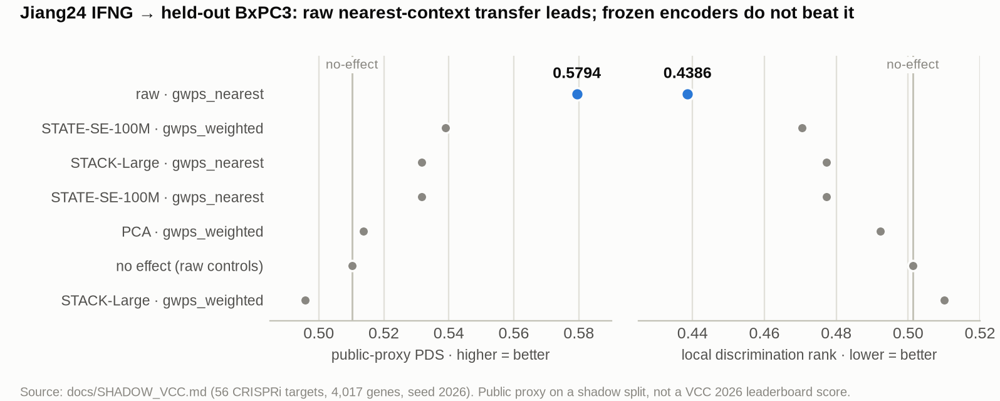

<sub>[🏠 Portfolio](https://github.com/heoneyzi) › [🩺 Medical](../../../README.md) › [VCC_2026](../../README.md) › **E1 · Jiang24 BxPC3 public proxy**</sub>

# 🔬 E1 · Leave-one-cell-line-out on Jiang24 IFNG (BxPC3 held out)

> **Question —** When a whole cell line is hidden, does transferring measured knockdown effects from the most similar lines beat doing nothing, and do frozen STATE / STACK embeddings pick better source lines than raw expression?

| | |
|---|---|
| **Status** | ✅ done (Aug 2026) |
| **Model / data** | Jiang24 / GSE281048 via PerturBench, IFNG-treated cells; sources A549, HAP1, HT29, K562, MCF7 → held-out **BxPC3**; frozen STATE SE-100M and STACK-Large as context encoders |
| **Compute** | CUDA GPU for the STATE / STACK embeddings (`scripts/run_frozen_contexts.sh`); transfer, generation and scoring run on CPU |
| **Headline** | Raw nearest-context transfer: public-proxy PDS **0.5794** vs no-effect 0.5102 (legacy `cell-eval --profile vcc`; not a leaderboard score) |

## Setup

- **Split** (`prepare-shadow`, seed 2026): 245,240 IFNG cells and 15,473 encoder-input genes from the raw `counts` layer; **56 CRISPRi targets** with at least 30 cells in every source line *and* the holdout; **4,017 evaluation genes** chosen from held-out *controls* only; at most 500 control cells per context. No challenge validation data is used.
- **Leakage barriers**: the model receives BxPC3 non-targeting controls only; BxPC3 perturbed cells sit in `truth.h5ad`, read only by the scorer; target selection uses labels and cell counts, never responses; challenge-like paths are rejected; `manifest.json` records filters, matrix origin, QC and split assertions.
- **Methods**: `no_effect`; `gwps_nearest` (copy the effect of the single most similar source line); `gwps_weighted` (softmax-weighted blend, τ = 0.1). The effect library is built from the five source lines, and only the similarity space changes between rows: raw control pseudobulk, PCA, or pooled frozen embeddings of the same 500 controls per context.
- **Frozen encoders**: STATE-SE mapped 9,996 / 15,473 input genes → 1,034-d embeddings; STACK matched 8,255 / 15,012 model genes → 1,600-d embeddings; checkpoint SHA-256s are pinned in `docs/SHADOW_VCC.md`. A small wrapper (`scripts/state_safetensors_embed.py`) loads the official `model.safetensors` strictly because the PyPI CLI only looks for Lightning checkpoints; nothing ever falls back to random or PCA vectors.

## Results

<p align="center"></p>
<p align="center"><sub>Figure: both scorers on the BxPC3 split; values from <code>docs/SHADOW_VCC.md</code>.</sub></p>

Public `cell-eval --profile vcc` proxy, higher PDS is better (`results/bxpc3_cell_eval_proxy.csv`):

| Representation · method | PDS ↑ | MAE ↓ | OverlapN ↑ |
|---|---:|---:|---:|
| raw · no effect | 0.5102 | 0.1806 | 0.00003 |
| **raw · nearest** | **0.5794** | 0.1807 | 0.00136 |
| PCA · weighted | 0.5137 | 0.1844 | 0.00072 |
| STATE · nearest | 0.5316 | 0.1888 | **0.00633** |
| STATE · weighted | 0.5389 | 0.1872 | 0.00295 |
| STACK · nearest | 0.5316 | 0.1888 | **0.00633** |
| STACK · weighted | 0.4959 | 0.1851 | 0.00364 |

Fast local metrics, lower rank / MAE and higher Pearson Δ are better (`results/bxpc3_local_metrics.csv`):

| Representation · method | pdisc rank ↓ | MAE ↓ | Pearson Δ ↑ |
|---|---:|---:|---:|
| raw · no effect | 0.5013 | 0.1806 | 0.0791 |
| **raw · nearest** | **0.4386** | 0.1807 | **0.1514** |
| PCA · weighted | 0.4922 | 0.1844 | 0.0326 |
| STATE · nearest | 0.4773 | 0.1888 | 0.0800 |
| STATE · weighted | 0.4705 | 0.1872 | −0.0295 |
| STACK · nearest | 0.4773 | 0.1888 | 0.0800 |
| STACK · weighted | 0.5101 | 0.1851 | −0.1228 |

Frozen benchmark runs were repeated and are byte-identical (sorted context names, fixed seeds).

## Takeaway

- Copying the effect of the most similar source line is the strongest row under **both** scorers, raising proxy PDS from 0.5102 to 0.5794.
- STATE-weighted improves on PCA-weighted, but neither frozen encoder beats raw nearest. A larger frozen representation is not automatically a better similarity measure, which is a useful negative result.
- STATE-nearest and STACK-nearest tie exactly because both choose the same source line; equal scores reflect the same `argmax`, not equivalent embeddings.
- **Limits:** one treatment × one held-out line, one seed. The sources are other lines of the *same* dataset, so this is out-of-cell-line transfer, not fully response-sealed zero-shot (the stricter protocol is in [`docs/STRICT_ZERO_SHOT.md`](../../docs/STRICT_ZERO_SHOT.md) and [E3](../E3_replogle_only_strict/README.md)). The legacy proxy is not the 2026 six-metric score; see [E2](../E2_six_metric_robustness/README.md) for that.

## Reproduce

```bash
JIANG_H5AD_OUT=/large/tmp/jiang24_processed.h5ad \
  bash scripts/download_shadow_data.sh data_public jiang24        # ~15 GB, SHA-256 verified
bash scripts/run_jiang24_loco.sh /large/tmp/jiang24_processed.h5ad  # compact -> prepare-shadow -> local benchmark
bash scripts/run_frozen_contexts.sh data_shadow/jiang24_ifng_bxpc3_loco   # needs STATE + STACK checkpoints
```

## Files

| File | What it is |
|---|---|
| `results/bxpc3_cell_eval_proxy.csv` | Public-proxy table above, transcribed from [`docs/SHADOW_VCC.md`](../../docs/SHADOW_VCC.md) § Observed BxPC3 results (the original `benchmark_cell_eval.csv` lives in the untracked `data_shadow/` run directory) |
| `results/bxpc3_local_metrics.csv` | Local-metric table above, same source (`benchmark_local.csv`, `benchmark_frozen_local.csv`) |
| [`../../docs/SHADOW_VCC.md`](../../docs/SHADOW_VCC.md) | Full protocol: hashes, commands, split contract, leakage barriers |
| [`../../src/vcc_baselines/shadow.py`](../../src/vcc_baselines/shadow.py) | `compact-shadow`, `prepare-shadow`, `shadow-benchmark`, `pool-embeddings` |
