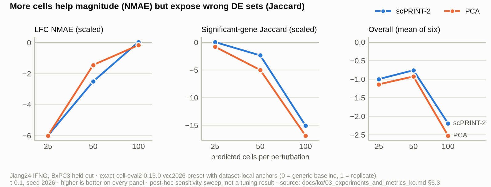

[🏠 Portfolio](https://github.com/heoneyzi) › [🩺 Medical](../../../README.md) › [VCC_2026](../../README.md) › **E2 · Six-metric scoring & robustness**

# 🔬 E2 · Exact 2026 six-metric scoring on two shadow datasets, plus robustness sweeps

> **Question —** Under the exact public 2026 scorer, which context representation transfers best to an *unseen cell line* versus an *unseen batch*, and does that ranking survive changes in softmax temperature, random seed and the number of predicted cells?

| | |
|---|---|
| **Status** | ✅ done (Aug 2026) |
| **Model / data** | Jiang24 IFNG (BxPC3 held out; 56 gene targets) and GSE270828 iPSC-derived neural stem cells (replicate batch rep3 held out; 184 regulatory-element targets). Representations: raw, PCA, frozen STATE-SE-100M, STACK-Large, UCE-4L, TranscriptFormer-Sapiens, scPRINT-2 |
| **Compute** | GPU: `cell-eval2` requires its `gpudge` DE backend. The robustness extension alone was 144 scoring runs over 912,000 predicted cells |
| **Headline** | Jiang24 reference Overall: best **−0.760** (scPRINT-2) vs no-effect −1.343, every row below 0. GSE270828: best **0.753** (PCA) vs no-effect 0.606 |

## Setup

- **Scorer.** `cell-eval2==0.16.0`, preset `vcc2026`: PDS, MSE, NMAE, direction fidelity, direction reach, Jaccard, and their unweighted mean (Overall). Each dataset gets its own anchors: **0 = generic mean-response baseline**, **1 = mean of five seeded split-half replicate runs**. Negative values and values above 1 are legal. These are exact metric computations with *local* anchors, not challenge-server scores.
- **One pipeline, one variable.** Every row uses the same log-fold effect library built from the dataset's own source contexts (the non-strict `shadow-existing` protocol; the strict Replogle-only variant is [E3](../E3_replogle_only_strict/README.md)), the same multinomial generator, seed 2026, 50 cells per target, scale 1.0 and the same scorer scale. Only the space used to measure "which source context does the held-out context resemble" changes.
- **Experiment 1: method axis.** raw × {`no_effect`, `global_mean`, `gwps_direct`, `gwps_nearest`, `gwps_weighted`}; PCA, STATE and STACK × {`nearest`, `weighted`}.
- **Experiment 2: representation axis.** Five frozen encoders plus raw and PCA, all with `gwps_weighted` (τ = 0.1). scGPT and scFoundation were excluded fail-closed because their manually downloaded checkpoints were not available (no random or substitute weights); target-specific priors (Geneformer deletion, scPRINT-2 GRN, TranscriptFormer-CGE) were excluded on purpose because they would break the context-encoder comparison.
- **Robustness extension.** Starting from the reference setting (τ 0.1, seed 2026, 50 cells), one variable changes at a time: τ ∈ {0.01, 0.03, 0.3, 1.0}; seed ∈ {2024, 2025, 2027}; cells ∈ {25, 100}. That is 9 conditions × 2 datasets × 8 rows = 144 new runs, all `status=ok`. Overall recomputed from the six axes matched to ≤ 2.22e-16, with no non-finite metrics.

| | Jiang24 (IFNG) | GSE270828 |
|---|---|---|
| Split | leave-one-**cell-line**-out | leave-one-**batch**-out |
| Sources → holdout | A549, HAP1, HT29, K562, MCF7 → **BxPC3** | rep1, rep2 → **rep3** |
| Targets | 56 genes | 184 human-accelerated regions (regulatory elements) |
| Encoder input / evaluation genes | 15,473 / 4,017 | 19,698 / 4,095 |
| Source control / perturbed cells | 2,500 / 27,686 | 1,000 / 35,998 |
| Held-out truth cells | 5,979 | 17,974 |

> [!NOTE]
> GSE270828 targets are regulatory elements, so **0 of 184** targets have gene-level DE support and the public evaluator fills MSE, NMAE, reach and Jaccard with an explicit 0. Its Overall is effectively (PDS + fidelity) / 6. On Jiang24 the normalised MSE is also 0 for every row, while the other five axes are defined.

## Results

**Reference setting, Jiang24 (new cell line)** (`results/jiang24_six_metric_base.csv`), higher is better:

| Representation | PDS | MSE | NMAE | Fidelity | Reach | Jaccard | **Overall** |
|---|---:|---:|---:|---:|---:|---:|---:|
| scPRINT-2 | 0.221 | 0 | −2.508 | 0.310 | −0.218 | **−2.363** | **−0.760** |
| PCA | 0.224 | 0 | −1.447 | 0.626 | 0.032 | −4.999 | −0.927 |
| raw | **0.390** | 0 | −1.881 | 0.567 | 0.029 | −4.981 | −0.979 |
| *raw · no effect* | −0.098 | 0 | −1.287 | 0.590 | −0.336 | −6.929 | *−1.343* |
| UCE-4L | 0.257 | 0 | −1.589 | 0.542 | 0.027 | −7.522 | −1.381 |
| TranscriptFormer | 0.188 | 0 | −0.751 | 0.674 | −0.175 | −8.498 | −1.427 |
| STATE-SE | 0.112 | 0 | −1.128 | 0.599 | −0.027 | −8.404 | −1.475 |
| STACK | 0.149 | 0 | **−0.723** | **0.735** | −0.271 | −10.110 | −1.703 |

**Reference setting, GSE270828 (new batch)** (`results/gse270828_six_metric_base.csv`): PCA **0.753** · UCE-4L 0.737 · TranscriptFormer 0.671 · raw 0.664 · STATE-SE 0.664 · scPRINT-2 0.631 · *no effect 0.606* · STACK 0.556 (Overall). Fidelity sits at ~4 for every row (3.944–4.229), so the ranking follows PDS (PCA 0.423 … STACK −0.819).

**Which transfer method? (Experiment 1, Jiang24 Overall,** `results/jiang24_method_matrix_overall.csv`**)**: no effect −1.343 · global mean −0.846 · direct −1.540 · raw nearest −1.062 · raw weighted −0.979 · PCA weighted −0.927 · STATE nearest −0.989 / weighted −1.475 · STACK nearest −0.989 / weighted −1.703. For the frozen encoders, `nearest` was safer than `weighted`. The target-agnostic `global_mean` row also beats no-effect in this split. On GSE270828, `nearest` lifts no-effect 0.606 to 0.753 for PCA, STATE and STACK alike, because with two sources they all pick the same one.

**Why rows differ.** With the same library and generator, the representations disagree on *which* source line BxPC3 resembles (`results/jiang24_source_weights.csv`): raw, PCA, UCE and TranscriptFormer pick **A549**, while scPRINT-2, STATE and STACK pick **HT29**. τ controls how hard that choice is: at τ = 0.01 the top weight is 0.668–1.000 (1.0–1.8 effective sources); at τ = 1.0 it is 0.215–0.328 (4.4–5.0 effective sources).

**Robustness** (`results/sweep_winners.csv`, `results/axis_dominance.csv`):

| Dataset | τ 0.01 | τ 0.03 | **τ 0.1 (ref)** | τ 0.3 | τ 1.0 |
|---|---|---|---|---|---|
| Jiang24 | STACK −0.494 | STATE −0.792 | **scPRINT-2 −0.760** | PCA −0.984 | UCE −0.648 |
| GSE270828 | TranscriptFormer 0.779 | UCE 0.770 | **PCA 0.753** | scPRINT-2 0.775 | STATE 0.738 |

- **Winners are fragile.** Each of the five τ values produces a different winner on both datasets, and no representation wins all four seeds (Jiang24: TranscriptFormer, STACK, scPRINT-2, scPRINT-2; GSE270828: STATE, raw, PCA, raw).
- **One axis runs Overall.** Jaccard is the dominant axis in 85/96 Jiang24 results and explains 98.2 % (τ), 93.4 % (seed) and 163.1 % (cells) of Overall's variance. Shares can exceed 100 % because the other axes co-vary negatively. Removing Jaccard changes the Jiang24 winner in **11 of 12** conditions; in GSE270828 fidelity sets the level (96/96) but PDS sets the order (81–87 % of variance; removing PDS changes the winner in 7 of 12).
- **Cells per perturbation is a trade-off**, not a free parameter:

Figure: Jiang24, reference τ and seed (<code>results/jiang24_cells_per_pert.csv</code>). More cells stabilise the mean, which helps NMAE, but give the Wilcoxon DE test more power to expose a wrong gene set, which hurts Jaccard.

## Takeaway

- **The statistics carry the score.** The jump from no-effect to transferring measured source-line effects is the largest, most reliable gain; swapping raw/PCA similarity for a frozen neural embedding adds little and flips with settings. In the reference setting no frozen encoder beats PCA on GSE270828.
- **An unseen cell line is the real difficulty.** The same pipeline stays below the generic baseline on BxPC3 but clears it on a held-out replicate batch. The challenge's final test is the former kind. The two datasets have different anchors and different numbers of defined axes, so their scores must never be compared or averaged.
- **Report the six axes, several seeds and mean rank**, not one Overall number. The single-condition "winner" is usually one axis's shadow. The most stable upper ranks were PCA on GSE270828 (mean rank 2.0 over the τ group) and raw on Jiang24.
- **Limits:** the sweeps are post-hoc (run after seeing truth), so the best τ or cell count is a sensitivity finding, not a tuned setting. Frozen checkpoints may overlap related pretraining data, so these rows are "foundation-model augmented", not pretraining-clean.

## Files

| File | What it is |
|---|---|
| `results/jiang24_six_metric_base.csv`, `results/gse270828_six_metric_base.csv` | Reference-setting six components + Overall per representation |
| `results/jiang24_method_matrix_overall.csv` | Experiment 1 method × representation Overall (Jiang24) |
| `results/jiang24_source_weights.csv` | Top source line and weight concentration at τ 0.01 and 1.0 |
| `results/sweep_winners.csv` | Winner and Overall for every τ and seed condition, both datasets |
| `results/jiang24_cells_per_pert.csv` | NMAE, fidelity, Jaccard and Overall at 25 / 50 / 100 cells (scPRINT-2, PCA) |
| `results/axis_dominance.csv` | Dominant-axis counts, variance shares, leave-one-axis-out winner changes |
| [`../../docs/experiments_and_metrics.md`](../../docs/experiments_and_metrics.md) | English condensation of the full experiment report; Korean original in [`../../docs/ko/`](../../docs/ko/03_experiments_and_metrics_ko.md) |
| [`../../docs/TWO_DATASET_SIX_METRIC.md`](../../docs/TWO_DATASET_SIX_METRIC.md) | Runner, metric members and output layout (`scripts/run_two_dataset_full_matrix.sh`) |

All CSVs are transcribed from the tables in the Korean experiment report (`docs/ko/03_experiments_and_metrics_ko.md`, §§3–6 and appendix A). The underlying run directories (`data_shadow/`, `data_experiments/external_frozen_matrix/shadow-existing/`) were too large to include, and the sweep runner (`new/metric_robustness_20260825/`) was not part of the source snapshot; the core matrices are reproducible with `scripts/run_two_dataset_full_matrix.sh` and `scripts/run_two_dataset_external_frozen_matrix.sh --protocol=shadow-existing --acknowledge-non-strict`. Recomputing Overall from the transcribed axes matches the reported Overall to within rounding (≤ 0.0005).
