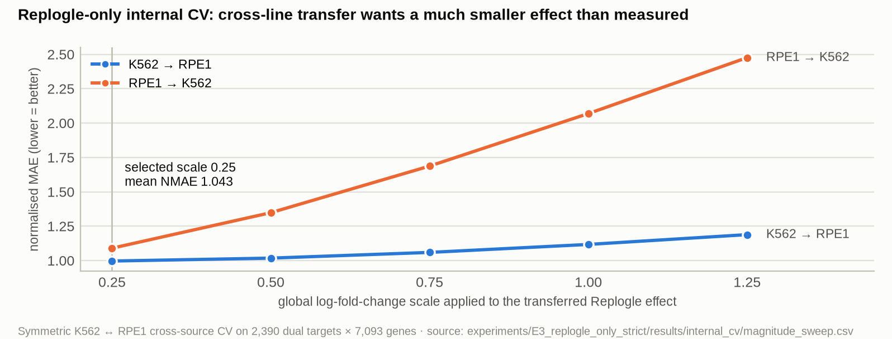

<sub>[🏠 Portfolio](https://github.com/heoneyzi) › [🩺 Medical](../../../README.md) › [VCC_2026](../../README.md) › **E3 · Strict Replogle-only track**</sub>

# 🔬 E3 · Strict Replogle-only track with external frozen encoders

> **Question —** If the only perturbation responses a model may use are the public Replogle 2022 K562 / RPE1 screens, with nothing taken from the evaluation datasets, how far does context-weighted transfer go, and do frozen encoders pick better sources than raw expression?

| | |
|---|---|
| **Status** | ✅ done (Aug 2026): protocol data, audits and encoder preflight stored from the 25 Aug 2026 run; stratified scores reported in the experiment write-up |
| **Model / data** | Replogle 2022 raw pseudobulk (K562 genome-wide, RPE1 essential; official Figshare files, MD5-verified) → Jiang24 BxPC3 and GSE270828 rep3. Frozen encoders: UCE-4L, TranscriptFormer-Sapiens, scPRINT-2, STATE-SE, STACK |
| **Compute** | GPU for encoder inference and the `cell-eval2` scorer |
| **Headline** | Internal CV selects a global effect scale of **0.25** (mean NMAE 1.043). On the 8 Jiang24 targets measured in both Replogle lines, raw similarity scores best: Overall **−0.145** vs −0.182 … −0.253 for frozen encoders |

## Setup

- **Response-source policy** ([`results/configs/`](results/configs/), [`../../configs/data_policy_replogle_only.yaml`](../../configs/data_policy_replogle_only.yaml)). Allowed explicit perturbation sources are only `replogle_k562` and `replogle_rpe1`. X-Atlas, GSE281048, GSE264667, Marson, KOLF2.1J and VCC 2025 responses are forbidden. Frozen encoders may contribute representations only, and external ground truth is never used for tuning. `scripts/audit_external_experiment.py` enforces this and wrote `results/audits/data_policy_audit.json` (`"passed": true`).
- **Data audit** (`results/replogle_data_audit.json`). K562: 11,258 pseudobulk rows, 9,866 target labels, 514 core-control rows, 8,246 canonical genes. RPE1: 2,679 rows, 2,393 labels, 113 core controls, 8,748 genes. Both files match the official Figshare size and MD5. Duplicate loci (TBCE, HSPA14) are resolved by the HGNC-approved Ensembl ID, and the dropped IDs are kept on record.
- **Effect library** (`results/effect_library/`). Native effect = ln((perturbed CPM + 1) / (core-control CPM + 1)), clipped at 3, then projected onto each benchmark's gene panel. For Jiang24 (4,017 genes), K562 covers 2,443 panel genes and RPE1 covers 2,842.
- **Internal cross-validation** (`results/internal_cv/`). Predict RPE1 from K562 and K562 from RPE1 on 2,390 shared targets × 7,093 common genes, sweeping a global effect scale. The scale is chosen by mean and worst-direction NMAE, baked into the library once, and never tuned on evaluation truth.
- **Target coverage** (`results/coverage/`). Jiang24's 56 targets = **8 DUAL_SOURCE + 41 K562_ONLY + 7 MISSING**. All 184 GSE270828 targets are MISSING, because regulatory elements are not gene knockdowns. GSE270828 is therefore a negative control for the exact-gene contract, where strict predictions stay at no-effect.
- **Gene mapping** (`results/audits/gene_mapping_summary.json`). A union HGNC map of 24,209 symbols: 17,856 exact, 892 alias, 5,449 missing and 12 ambiguous. Ambiguous symbols fail closed instead of being chosen by row order. Coverage: 12,361 / 15,473 genes for Jiang24 and 16,149 / 19,698 for GSE270828.
- **Encoders** (`results/encoders/`). Each model runs through an isolated command adapter with a pinned repository commit and checkpoint hash. Anything unavailable is marked `AUDIT_REQUIRED`, never replaced by random weights. Real-input smoke tests on 128 Replogle K562 controls: **UCE-4L** 128/128 cells, 1,280-d, 18.66 s; **TranscriptFormer** 128/128 cells, 2,048-d, 96.07 % symbol→Ensembl mapping, 32.93 s. The stored 25 Aug preflight enrols these two; the write-up's stratified table also covers scPRINT-2, STATE and STACK.

## Results

<p align="center"></p>
<p align="center"><sub>Figure: internal CV, <code>results/internal_cv/magnitude_sweep.csv</code>.</sub></p>

| Effect scale | 0.25 | 0.5 | 0.75 | 1.0 | 1.25 |
|---|---:|---:|---:|---:|---:|
| Mean NMAE ↓ | **1.043** | 1.183 | 1.373 | 1.593 | 1.832 |
| Worst-direction NMAE ↓ | **1.090** | 1.348 | 1.687 | 2.069 | 2.476 |

Across lines, the same knockdown's effect agrees only weakly: cosine **0.110**, sign agreement **0.537** (identical at every scale, since scaling does not change direction).

Jiang24, `DUAL_SOURCE` stratum (8 targets measured in both lines), `gwps_weighted`, exact `cell-eval2` `vcc2026` Overall (`results/jiang24_dual_source_overall.csv`):

| raw | scPRINT-2 | STACK | UCE-4L | STATE-SE | TranscriptFormer | PCA |
|---:|---:|---:|---:|---:|---:|---:|
| **−0.145** | −0.182 | −0.210 | −0.220 | −0.246 | −0.253 | −0.579 |

Encoder QC shows the representations do separate the lines. For UCE, pooled-context cosine similarity is 0.799 for K562–RPE1, 0.529 for K562–BxPC3 and 0.687 for RPE1–BxPC3 (`results/encoders/jiang24_uce_contexts.qc.json`).

## Takeaway

- Even under the strictest response policy, raw expression similarity beats every frozen encoder on the targets where the choice of source actually matters (both lines measured). There is no evidence that frozen encoders improve source weighting here.
- Effects transfer only weakly between cell lines (cosine 0.11), and the best global scale is 0.25, so transferred effects must be heavily shrunk. This is consistent with the negative Overall scores for an unseen line in [E2](../E2_six_metric_robustness/README.md).
- Scores for different coverage strata and datasets use different anchors and are never averaged. GSE270828 results here are an audit of the contract, not a model ranking.
- Checkpoint pretraining overlap with Replogle or VCC data cannot be ruled out, so the track is labelled "foundation-model augmented" (`B_FM_AUGMENTED`) even though explicit response use is strict.

## Reproduce

```bash
bash scripts/setup_external_frozen_models.sh gene-map
bash scripts/setup_external_frozen_models.sh replogle-data
bash scripts/setup_external_frozen_models.sh uce              # repeat per model
bash scripts/run_two_dataset_external_frozen_matrix.sh --models=uce --preflight-only
bash scripts/run_two_dataset_external_frozen_matrix.sh --models=uce
```

## Files

| File | What it is |
|---|---|
| `results/replogle_data_audit.json` | Row, label, control and gene counts; official Figshare URLs, sizes, MD5; SHA-256 of the downloaded files |
| `results/internal_cv/magnitude_sweep.csv`, `selected_hyperparameters.json` | Cross-line scale sweep and the selected scale (0.25) |
| `results/effect_library/*.manifest.json` | Native ln-CPM effect definitions and the projected per-benchmark libraries |
| `results/coverage/*_target_coverage.csv` | Per-target coverage class (`DUAL_SOURCE` / `K562_ONLY` / `MISSING`) |
| `results/configs/*_replogle_only.yaml` | Generated prediction configs (`track: STRICT_REPLOGLE_ONLY`, `external_ground_truth_used_for_selection: false`) |
| `results/audits/` | Data-policy audit, gene-mapping summary, stage log of the 25 Aug run |
| `results/encoders/` | Preflight record, per-context QC (library size, sparsity, embedding norms, pairwise distances), smoke-test metadata |
| `results/jiang24_dual_source_overall.csv` | Dual-source stratum Overall per representation, transcribed from appendix B of [`docs/ko/03_experiments_and_metrics_ko.md`](../../docs/ko/03_experiments_and_metrics_ko.md) |
| [`../../docs/EXTERNAL_FROZEN_MODELS.md`](../../docs/EXTERNAL_FROZEN_MODELS.md), [`IMPLEMENTATION_REPORT.md`](../../docs/IMPLEMENTATION_REPORT.md), [`leakage_audit.md`](../../docs/leakage_audit.md), [`licenses.md`](../../docs/licenses.md), [`model_provenance.csv`](../../docs/model_provenance.csv) | Protocol, implementation report, leakage and licence audits |

<sub>Absolute server paths in the stored JSON/YAML artifacts were replaced with `<repo>/`; nothing else was edited.</sub>
